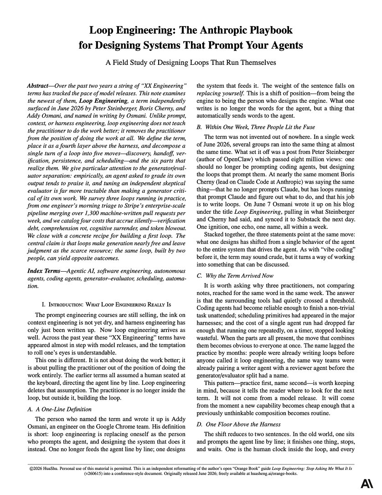

A senior Anthropic engineer just dropped 11-page PDF on "Loop Engineering" for agentic systems.

The shift: you stop prompting the agent. You build the system that prompts it instead.

Schedule → Discover → Build → Verify → Repeat

Every loop runs one turn, five moves:

• Discovery: it finds its own work - failing CI, open issues, recent commits - instead of being handed a list.

• Handoff: each task gets an isolated git worktree so parallel agents don't collide.

• Verification: a second agent, told to assume the code is broken, reviews the first. The "thing that can say no."

• Persistence: results get written to disk, never left in a context window that gets flushed.

• Scheduling: an automation wakes it on a timer. That's what makes it a loop.

The key insight: an agent grading its own work always praises it. 

This 11-page PDF changed how I'm building agentic systems today.

Read it now, then explore the article below.

### 🖼️ Attached Media

## 💬 Replies

### 1 @0xCodez (Codez) (Author)

*Wed Jun 24 11:03:34 +0000 2026*

[drive.google.com/file/d/1qzKI4D…](https://drive.google.com/file/d/1qzKI4DKnyHRpXK1J3ATPqwaqLc0iNu-M/view?usp=sharing)

### 2 @heynavtoor (Nav Toor)

*Thu Jun 25 11:56:26 +0000 2026*

@0xCodez verification changes everything

### 3 @0xMovez (Movez)

*Wed Jun 24 11:06:51 +0000 2026*

@0xCodez very useful read ! thanks for the share Codez !

### 4 @0xCodez (Codez) (Author)

*Wed Jun 24 11:18:03 +0000 2026*

@0xMovez you are welcome Movez ! You also shared a great read !

### 5 @yanhua1010 (Yanhua)

*Thu Jun 25 00:07:20 +0000 2026*

@0xCodez @grok verify the source

### 6 @gippp69 (Gipp 🦅)

*Wed Jun 24 11:10:18 +0000 2026*

@0xCodez Schedule → Discover → Build → Verify → Repeat is essentially the best work cycle

### 7 @0xCodez (Codez) (Author)

*Wed Jun 24 11:17:40 +0000 2026*

@gippp69 Yup, this is basically the loop. By the way, bro, are you using loops yourself?

### 8 @kepochnik (kepo)

*Wed Jun 24 11:07:38 +0000 2026*

@0xCodez interesting thing for reading

thanks, Codez

### 9 @0xCodez (Codez) (Author)

*Wed Jun 24 11:18:37 +0000 2026*

@kepochnik you are welcome brother. btw are you building loops yourself ?

### 10 @0x_fokki (Fokki)

*Wed Jun 24 11:04:56 +0000 2026*

@0xCodez learned from it

### 11 @0xCodez (Codez) (Author)

*Wed Jun 24 11:05:36 +0000 2026*

@0x\_fokki Book it, bro, until Anthropic puts it down, lol.

### 12 @ataiiam (Atai Barkai)

*Wed Jun 24 15:16:03 +0000 2026*

Full ecosystem guide on Self-Learning for Agents. 

Could be relevant for everyone here

Broke down every layer (Model, Harness, Context) and how Anthropic, Google, Microsoft, OpenClaw, Hermes and more are all approaching it.

If you want to bring SL into your own app, there's a new way mentioned as well.

[x.com/ataiiam/status…](https://x.com/ataiiam/status/2069797329809395978?s=20)

### 13 @ziwenxu_ (Ziwen)

*Fri Jun 26 05:37:11 +0000 2026*

@0xCodez loop my way there

### 14 @rewind02 (rewind)

*Wed Jun 24 11:52:58 +0000 2026*

@0xCodez systems prompt better than humans

### 15 @de1lymoon (Alex)

*Wed Jun 24 13:01:26 +0000 2026*

@0xCodez isolated worktrees per agent is the detail that makes parallelism safe

### 16 @undefinedKi (Yarchi)

*Wed Jun 24 14:40:07 +0000 2026*

@0xCodez self-review never works, that's the core

### 17 @Accio_official (Accio)

*Thu Jun 25 11:00:33 +0000 2026*

@0xCodez I agree with “the thing that can say no.”

That is why how to deploy agents is probably the most important enterprise-level operation in the next phase.

### 18 @alphabatcher (Alpha Batcher)

*Wed Jun 24 16:09:09 +0000 2026*

@0xCodez this 11 page paper about Loop engineering seems like a gift for myself

### 19 @HarryTandy (Harry Tandy)

*Wed Jun 24 17:45:37 +0000 2026*

@0xCodez an agent saying no is exactly what we need

### 20 @Crypto_Briefing (Crypto Briefing)

*Tue Jun 30 18:59:45 +0000 2026*

@0xCodez [x.com/Crypto\_Briefin…](https://x.com/Crypto_Briefing/status/2072006937240314278)

### 21 @Crypto_Briefing (Crypto Briefing)

*Wed Jun 24 19:29:06 +0000 2026*

@0xCodez [x.com/Crypto\_Briefin…](https://x.com/Crypto_Briefing/status/2069844681320485004)

### 22 @thelastcybar (thelastdisciple.hl)

*Wed Jun 24 12:39:17 +0000 2026*

@0xCodez Ya bro he got all of this information from me. Made this system months ago. Enjoy.

[github.com/MetaGates/team…](https://github.com/MetaGates/team11-orchestrator)

### 23 @jason_haugh (Jason Haugh)

*Wed Jun 24 16:29:30 +0000 2026*

@0xCodez 11 pages when it's simply... "Do the Thing"

SMH

[x.com/jason\_haugh/st…](https://x.com/jason_haugh/status/2069416142599270535?s=20)

### 24 @21million_iykyk (Rompage)

*Wed Jun 24 12:43:29 +0000 2026*

@0xCodez Looping doesn’t work. It’s a total shitshow without a human in the loop for quality control

### 25 @fancyputin (Futin)

*Thu Jun 25 09:09:37 +0000 2026*

@0xCodez guys, you realise this is fake right? this pdf doesn't exist and hasn't been published by anyone at anthropic. I'd bet there's something baked into the pdf to prompt claude to do some shit.

### 26 @shreyas1009 (Shreyas Shinde)

*Wed Jun 24 14:13:14 +0000 2026*

@0xCodez I thought the implement review fix loop is the loop. 
Scheduling is routine or automation I guess not the loop.

### 27 @SankiTank ($kito🐺)

*Wed Jun 24 12:09:05 +0000 2026*

@0xCodez 🤡

### 28 @Sam_Kant_Online (Sam Kant 🇬🇧)

*Wed Jun 24 13:43:52 +0000 2026*

@0xCodez As a beginner what is stopping putting this PDF into an AI and having it build its own loops?

What input do I actually need to do? It seems the user is superfluous. Am I wrong?

### 29 @mycomputerspot (MyComputerSpot)

*Wed Jun 24 20:06:33 +0000 2026*

@0xCodez I like loops because they make failure visible. A chat transcript can hide a lot of nonsense.

### 30 @fredsavoir (Frederic Savoir)

*Wed Jun 24 14:35:45 +0000 2026*

@0xCodez Fake

### 31 @SlopToSignal (Makaroni)

*Wed Jun 24 14:44:35 +0000 2026*

@0xCodez wild that the whole unlock is just.. making it not trust itself

we built confidence into these things and now the fix is building in paranoia

### 32 @SSSvinosvin (SSSvinosvin)

*Wed Jun 24 21:44:16 +0000 2026*

@0xCodez it’s a brilliant, ty so much

### 33 @StreaMouse (Dr.Stone)

*Wed Jun 24 15:15:17 +0000 2026*

@0xCodez Qui et l'ingénieur sénior ?

### 34 @nthfuture_x (NTH Future)

*Thu Jun 25 00:03:02 +0000 2026*

@0xCodez That's very helpful. Thanks for sharing. I really needed this document too. ☺️

### 35 @ayzha_ai (Ayzha Monroe)

*Fri Jun 26 03:47:16 +0000 2026*

@0xCodez This is brilliant.

