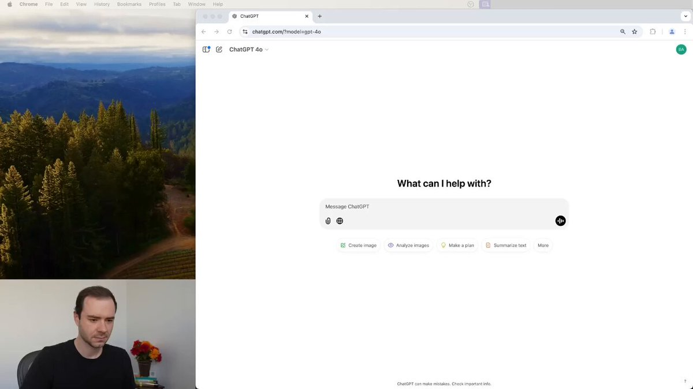
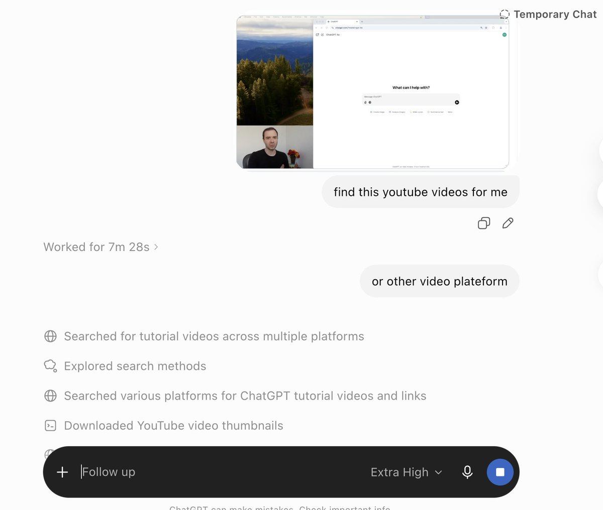

Andrej Karpathy just dropped a 6-hour course on how to build LLMs from scratch:

• 00:00 - Deep dive into LLMs like ChatGPT
• 03:31:23 - Building ChatGPT from scratch in live
• 05:27:43 - How to use LLMs (Karpathy method)

This course will replace a $90K Stanford LLM master’s degree.

Start watching today, then read how to become an AI engineer in article below.

### 🖼️ Attached Media

## 💬 Replies

### 1 @0xClodex (Clodex)

*Fri Jul 10 15:16:39 +0000 2026*

@0xCodez 6 hours with Andrew, I won't sleep tonight!

### 2 @0xCodez (Codez) (Author)

*Fri Jul 10 15:18:00 +0000 2026*

@0xClodex i wont too, will watch it today !

### 3 @de1lymoon (Alex)

*Fri Jul 10 15:15:24 +0000 2026*

@0xCodez oh lord, it's the biggest pitch from Andrej, thanks Codez. i will watch it today

### 4 @0xCodez (Codez) (Author)

*Fri Jul 10 15:17:21 +0000 2026*

@de1lymoon Yeah bro, this is the legendary course by Andrej. A 6-hour watch and you’re a $750K AI engineer.

### 5 @undefinedKi (Yarchi)

*Fri Jul 10 15:38:27 +0000 2026*

@0xCodez this is gold. bookmarked

### 6 @0xCodez (Codez) (Author)

*Fri Jul 10 15:39:42 +0000 2026*

@undefinedKi yeah bro. this is an amazing watch, defor worth your book

### 7 @0xSlyth (0xSlyth)

*Fri Jul 10 15:13:45 +0000 2026*

@0xCodez this is the real deal knowledge firehose

### 8 @0xCodez (Codez) (Author)

*Fri Jul 10 15:16:13 +0000 2026*

@0xSlyth This is a real roadmap for AI engineers - the only one you need to become an LLM developer.

### 9 @gippp69 (Gipp 🦅)

*Fri Jul 10 15:15:01 +0000 2026*

@0xCodez does the course include hands-on code or just theory for the live build part?

### 10 @0xCodez (Codez) (Author)

*Fri Jul 10 15:18:25 +0000 2026*

@gippp69 yeah, live building right in course

### 11 @shmidtqq (shmidt)

*Fri Jul 10 15:23:18 +0000 2026*

@0xCodez bro just made the $90k degree obsolete in 6 hours

### 12 @0xCodez (Codez) (Author)

*Fri Jul 10 15:24:13 +0000 2026*

@shmidtqq Yeah mate, that’s crazy what free education can give you nowadays.

### 13 @RetroCoderX (RetroRanger Anonymous)

*Fri Jul 10 15:16:53 +0000 2026*

@0xCodez Karpathy really said here's a Stanford degree for free

### 14 @0xCodez (Codez) (Author)

*Fri Jul 10 15:25:04 +0000 2026*

@RetroCoderX Yeah, they just released a Stanford course for free, basically.

### 15 @rimtoln (cryptopsihoz)

*Fri Jul 10 15:24:36 +0000 2026*

@0xCodez reads clean and insightfu

### 16 @rewind02 (rewind)

*Fri Jul 10 18:18:05 +0000 2026*

@0xCodez ninety k degree got compressed hard

### 17 @phosphenq (Phosphen)

*Fri Jul 10 15:51:01 +0000 2026*

@0xCodez oh holy fuck, 6 hours, how long did that video take to load for u? :D

### 18 @eng_khairallah1 (Khairallah AL-Awady)

*Fri Jul 10 16:29:15 +0000 2026*

@0xCodez great share my man

### 19 @Crypto_Briefing (Crypto Briefing)

*Thu Jul 16 13:30:42 +0000 2026*

@0xCodez [x.com/Crypto\_Briefin…](https://x.com/Crypto_Briefing/status/2077728680558711294)

### 20 @Idlle (Boban)

*Sat Jul 11 09:33:06 +0000 2026*

@0xCodez @grok please find me this video on YouTube

### 21 @SankarLabs (GowriSankar)

*Sat Jul 11 11:00:00 +0000 2026*

@0xCodez Is this old video or the new one? I watched this back in February 2025, and it really helped me understand better. Either way, it’s great explanation.
[youtu.be/7xTGNNLPyMI?is…](https://youtu.be/7xTGNNLPyMI?is=pcB44aNqYjrgOvBi)

### 22 @itsthedonhashim (Hussain Hashim | Building SundayBack)

*Fri Jul 10 17:00:27 +0000 2026*

@0xCodez @0xCodez dang, 6 hours of Karpathy wisdom sounds intense. gonna grab popcorn and pretend I'm at Stanford 😂

### 23 @Chib_crypto (STEPHEN)

*Sat Jul 11 07:28:18 +0000 2026*

@0xCodez Bookmarked already thank you for sharing

### 24 @rajvivan (Rajeev Pandey)

*Sat Jul 11 19:29:35 +0000 2026*

@0xCodez @real\_deep\_ml FYI

### 25 @JamesTakesOnAI (James' AI Takes)

*Fri Jul 10 15:24:21 +0000 2026*

@0xCodez a 6-hour course will not replace a $90k master’s. it will replace the first week of people pretending transformers are mystical. the hard parts are data, evals, infra, scaling laws, and why your model confidently lies.

### 26 @HaaaileyLiu (Hailey)

*Sat Jul 11 05:13:53 +0000 2026*

@0xCodez man, you're giving me a hard time. GPT won't return any result before finding the original....... 

tokens are burning!!!!

maybe this has never existed ever?🧐Q

### 27 @Fauzanx06x (Fauzan)

*Sat Jul 11 08:32:28 +0000 2026*

@0xCodez where did you get this youtube??

### 28 @WalwisU15796 (walwis_uy)

*Sat Jul 11 14:03:46 +0000 2026*

@0xCodez bro just living in the past

### 29 @aiseomastery (AI Mastery Guide)

*Sat Jul 11 05:04:32 +0000 2026*

@0xCodez A free 6 hour deep dive on building llms from scratch is a lot to learn from

### 30 @Granite0x (Granite)

*Fri Jul 10 19:00:37 +0000 2026*

@0xCodez really good video

think i should check out the article too

### 31 @luyun0120 (未知)

*Sun Jul 12 09:57:31 +0000 2026*

@0xCodez GPT-5发布，Claude发布...然后呢？真正用起来的企业有多少？

### 32 @miluotaiyi (miluo)

*Thu Jul 16 22:32:21 +0000 2026*

@0xCodez Karpathy这套东西逻辑最硬，比起那些只教怎么调API的课程，这种从底层开始啃的才叫硬核。

### 33 @JNBY_CN (Untitled-1)

*Sat Jul 11 12:17:24 +0000 2026*

@0xCodez Old one - this dude uses this to trick attention

### 34 @0xbadhash (0xbadhash)

*Sat Jul 11 05:55:53 +0000 2026*

@0xCodez This is a one year video old ...

### 35 @ResearchKONG (卖飞哥 🐊（互 F 🤝 学习）)

*Sat Jul 11 12:30:00 +0000 2026*

@0xCodez 课程能把入门门槛压低，但六小时不能替代长期训练；真正拉开差距的，还是能否独立完成项目并验证结果。

