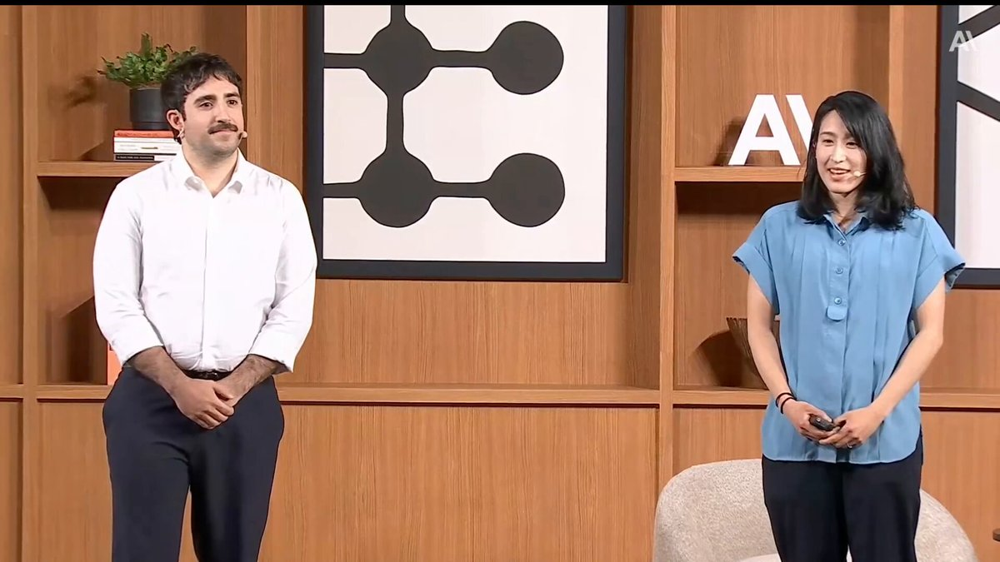
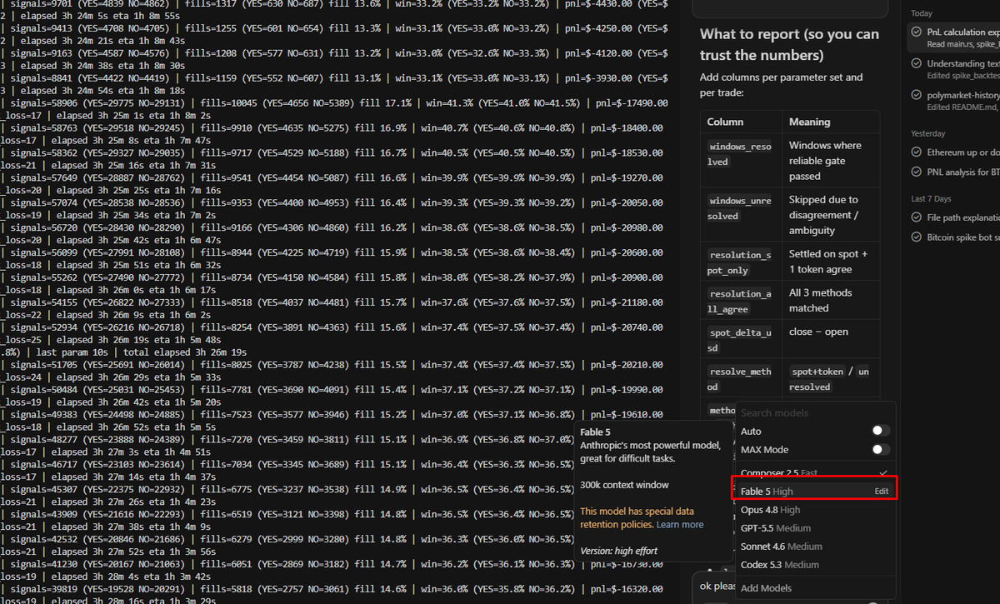
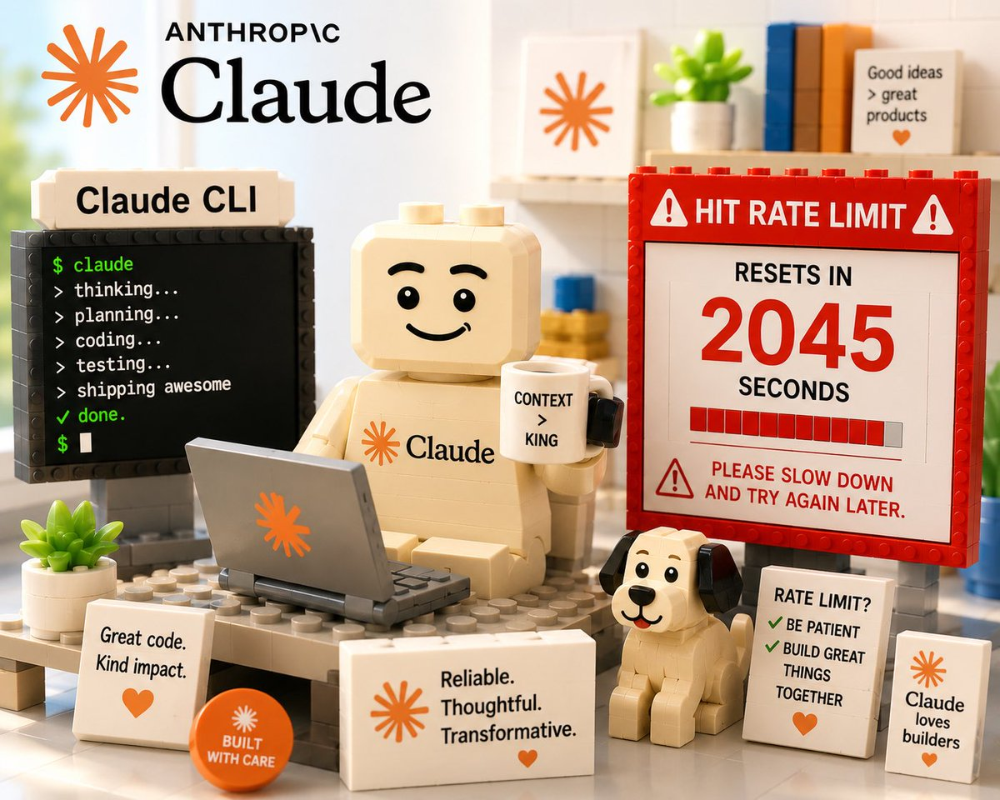

Anthropic Managed Agents team:

"Fable 5 is our best model for running self-improving agent systems.

Add /loops, dynamic workflows, dreaming and you are unstoppable"

in 13-minutes, Anthropic team shows how to build self-improving agent systems with Fable 5 from scratch.

Worth more than a $500 agent building course.

Live from the last Anthropic stage in Japan. Unpublished.

### 🖼️ Attached Media

## 💬 Replies

### 1 @rewind02 (rewind)

*Thu Jun 11 17:00:46 +0000 2026*

@0xCodez loops are where fable wakes up

### 2 @0xCodez (Codez) (Author)

*Thu Jun 11 17:15:47 +0000 2026*

@rewind02 Yeah. Was watching land recording live 😅

### 3 @Nikitont (Nikiton)

*Thu Jun 11 17:16:15 +0000 2026*

@0xCodez Bro, I advise you to watch the latest broadcast @NVIDIAAI

### 4 @0xCodez (Codez) (Author)

*Thu Jun 11 17:17:01 +0000 2026*

@Nikitont @NVIDIAAI What’s the most interesting thing you got here bro ?😅 Tease me

### 5 @HarryTandy (Harry Tandy)

*Thu Jun 11 15:46:40 +0000 2026*

@0xCodez saving $500 on a course is beautiful

### 6 @0xCodez (Codez) (Author)

*Thu Jun 11 15:47:40 +0000 2026*

@HarryTandy Building self-improving agent systems, even better bro 😆 Btw, have you tested Fable 5 already?

### 7 @Dexoryn (Dexoryn)

*Thu Jun 11 15:50:35 +0000 2026*

@0xCodez Yes, I just experienced the new AI agent model : the Fable 5 to find the new Polymarket Trading strategy, and  backtest.
It works well, and Its analytics and recommendation was excellet.
Thanks @0xCodez.
Keep me your post. 

### 8 @0xCodez (Codez) (Author)

*Thu Jun 11 15:55:13 +0000 2026*

@Dexoryn you are a real legend Dexoryn ! Delivering best Polymarket agentic trading alpha. Love to follow you

### 9 @itsthedonhashim (Hussain Hashim | Building SundayBack)

*Thu Jun 11 16:42:13 +0000 2026*

@0xCodez @0xCodez whoa, this sounds intense. curious if they talk about real-world apps during the demo?

### 10 @0xCodez (Codez) (Author)

*Thu Jun 11 17:14:36 +0000 2026*

@itsthedonhashim Yes. They are talking about their clients cases too

### 11 @ArchiveExplorer (Archive)

*Thu Jun 11 19:46:53 +0000 2026*

@0xCodez yo first time seeing this video
gonna watch it now

### 12 @alphabatcher (Alpha Batcher)

*Sat Jun 13 08:38:11 +0000 2026*

@0xCodez totally agreed with you Codez

Fable 5 the best AI model ever

### 13 @SlotWinX (SLOT.WIN)

*Thu Jun 11 21:26:58 +0000 2026*

@0xCodez i’ve seen fable 5 dream through a hundred markets, it dances like it knows the future every loop feels like watching a dealer shuffle fate

### 14 @gerardsans (Gerard Sans | Axiom 🇬🇧)

*Thu Jun 11 19:40:39 +0000 2026*

@0xCodez [x.com/gerardsans/sta…](https://x.com/gerardsans/status/2065156676706025957)

### 15 @SimplestBTCBook (Keysa)

*Sat Jun 13 05:06:21 +0000 2026*

@0xCodez You seen this? [x.com/anthropicai/st…](https://x.com/anthropicai/status/2065597531644743999)

### 16 @aleGpereira (Alejandro Pereira)

*Thu Jun 11 19:39:22 +0000 2026*

@0xCodez Just one catch. You need millions of dollars

### 17 @enhansai (Enhans)

*Fri Jun 12 13:23:39 +0000 2026*

@0xCodez Totally. Seeing Fable 5 paired with /loops and dynamic workflows in a 13-minute build makes the concept much less hand-wavy.

### 18 @chimpansky (Chimpansky)

*Thu Jun 11 18:47:10 +0000 2026*

@0xCodez what does 'dreaming' mean as a fable 5 feature specifically? is it the model running hypothetical rollouts internally, or a separate loop you configure?

### 19 @aiseomastery (AI Mastery Guide)

*Fri Jun 12 00:07:26 +0000 2026*

@0xCodez 13 minutes from the Anthropic team showing exactly how to build self-improving agent systems. This is worth more than most paid courses out there.

### 20 @Granite0x (Granite)

*Fri Jun 12 00:33:00 +0000 2026*

@0xCodez time to try fable 5, bookmarking this codez

### 21 @calhim7 (dazzafact)

*Fri Jun 12 10:40:32 +0000 2026*

@0xCodez Anthropic is the new OpenAI. The setting is very reminiscent of it.

### 22 @forniso (SF)

*Fri Jun 12 04:09:46 +0000 2026*

@0xCodez Unstoppable will be your bill 🤦‍♂️🤦‍♂️🤦‍♂️

### 23 @Thewarstar0909 (HashRaX)

*Sat Jun 13 17:13:32 +0000 2026*

@0xCodez 13 mins is wild, gonna test this out later bro

### 24 @PadresEducador (Padres Educadores)

*Fri Jun 12 14:44:10 +0000 2026*

@0xCodez @grok dame el resumen de como implementar lo que dice este curso. Dame contenido de valor

### 25 @AbdouAziz666 (@ziz)

*Fri Jun 12 12:26:21 +0000 2026*

@0xCodez Parlez nous du coûts des Dynamic Workflow 

### 26 @AdrianTamplaru (Adrian Tamplaru)

*Fri Jun 12 09:29:54 +0000 2026*

@0xCodez I bet you’re unstoppable after the 5k a day you would pay in api costs. Cool that they have all this good advice for us mortals

### 27 @TheDailyViber (The Daily Viber)

*Sat Jun 13 18:56:04 +0000 2026*

@0xCodez self-improving agents sound great until the loop has no brakes. evals and stop rules are the unsexy part that makes this usable

### 28 @Djibrils2233 (Djibril s)

*Thu Jun 11 19:45:10 +0000 2026*

@0xCodez Absolutely beautiful 🤣

### 29 @travisbiegun (Travis Biegun)

*Fri Jun 12 04:54:53 +0000 2026*

@0xCodez Sure, providing it likes and approves of your project and finds no conflict of interest 

### 30 @TheDevilsDev (Sir FAFO)

*Sat Jun 13 06:49:37 +0000 2026*

@0xCodez How's that working out?

### 31 @Cappucc61055974 (Cappuccino1)

*Sat Jun 13 08:50:36 +0000 2026*

@0xCodez BingX tiếp tục lên cho ae minigame mùa WC, CHÂN SÚT GHI BÀN, SĂN NGÀN QUÀ ĐỈNH, event này siêu dễ chơi với lại có nhiều phần thưởng hiện vật ngon đét luôn ae ơi 

