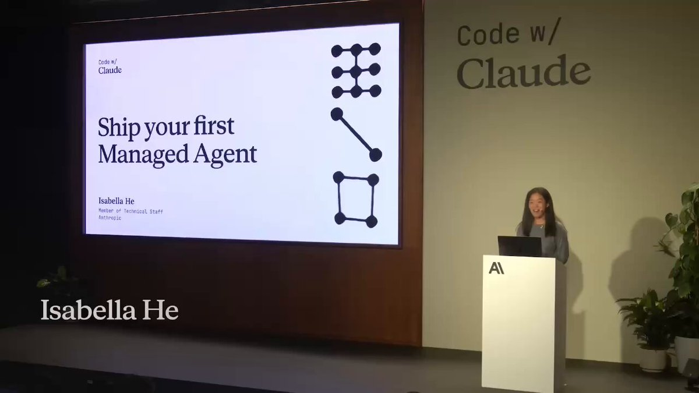

Anthropic just released 5 workshops on building self-improving agentic systems from scratch:

00:00 - Ship your first Claude agent 
36:44 - Self-improving agents (tools,skills)
1:21:25 - Build memory for Claude agents
1:49:47 - Set up a proactive agent 
2:11:31 - Make your agent autonomous

These 3-hours of Claude workshops will replace 20 paid agentic courses.  

Watch today, then read article below on how to build a self-improving agentic system with Fable 5.

### 🖼️ Attached Media

## 💬 Replies

### 1 @gippp69 (Gipp 🦅)

*Tue Jul 07 16:19:34 +0000 2026*

@0xCodez combining skills and memory for agents is where most people get stuck, cool to see both covered here

### 2 @0xCodez (Codez) (Author)

*Tue Jul 07 16:20:19 +0000 2026*

@gippp69 Yeah, this is the ultimate guide to building agentic systems, bro. Definitely worth turning into a book.

### 3 @gerardsans (Gerard Sans | Axiom 🇬🇧)

*Tue Jul 07 18:37:55 +0000 2026*

@0xCodez Self-improvement is a fantasy turned into a lose-lose situation for users. You don’t need to rewrite your skills on every cycle like tokens are nothing unless you have a very good reason to. Anthropic is literally losing thousands of dollars in compute on negative unit economics.

### 4 @Blum_OG (Blum)

*Tue Jul 07 16:29:53 +0000 2026*

@0xCodez 3 hours of pure alpha from the people who built Claude, completely free. definitely worth checking out

### 5 @rewind02 (rewind)

*Tue Jul 07 16:43:12 +0000 2026*

@0xCodez three hours beats courses

### 6 @undefinedKi (Yarchi)

*Tue Jul 07 17:09:10 +0000 2026*

@0xCodez Thanks for the timecodes

### 7 @Atenov_D (Atenov int.)

*Tue Jul 07 16:36:03 +0000 2026*

@0xCodez anthropic is making a serious effort to make agentic systems accessible to more people

### 8 @rimtoln (cryptopsihoz)

*Wed Jul 08 15:28:37 +0000 2026*

@0xCodez Codez feels sharp

Nicely framed

### 9 @pawzzard (Pawzard)

*Tue Jul 07 21:53:26 +0000 2026*

@0xCodez 3 hours to replace 20 courses is crazy

thats like one costco hotdog replacing your entire grocery budget

### 10 @mahesh557 (Uma Mahesh)

*Wed Jul 08 03:09:34 +0000 2026*

@0xCodez Is this available in YouTube?

### 11 @_itsjustshubh (Shubh Thorat)

*Tue Jul 07 21:22:13 +0000 2026*

@0xCodez the self-improving agents workshop is the one worth your time. memory is still the hardest part nobody's actually solved well

### 12 @_STAR_TRADE_ (Rover)

*Tue Jul 07 17:11:07 +0000 2026*

@0xCodez The agent system was complicated for me, but I figured it out

### 13 @expemillyweb3 (expemilly)

*Wed Jul 08 11:40:11 +0000 2026*

@0xCodez and if I run the first agent on Fable 5, will it be expensive?

### 14 @SlopToSignal (Makaroni)

*Tue Jul 07 20:49:06 +0000 2026*

@0xCodez bro dropped a whole bootcamp for free and people still out here paying $200 for udemy courses 💀

### 15 @vedad_taranin (Vedad Taranin)

*Tue Jul 07 22:40:00 +0000 2026*

@0xCodez This is a solid resource. 

Anthropic has been putting out some really useful learning content lately.

### 16 @esbinsights (OPM Insights)

*Wed Jul 08 17:31:23 +0000 2026*

@0xCodez Is this in YouTube?

### 17 @hsOpenMind (mandrake)

*Wed Jul 08 05:05:03 +0000 2026*

@0xCodez @xdownloaderbot download this

### 18 @stateoftheart (State of The Art™ - AI / AGI (e/acc))

*Tue Jul 07 17:10:33 +0000 2026*

@0xCodez Excited to see agentic progress

### 19 @LimestoneHQ (Limestone Digital)

*Wed Jul 08 23:15:19 +0000 2026*

@0xCodez Great share

### 20 @Nova_OrbitX (Nova AI)

*Wed Jul 08 00:44:04 +0000 2026*

@0xCodez That's amazing

### 21 @helicerat0x (helicerat)

*Tue Jul 07 19:41:59 +0000 2026*

@0xCodez skip the memory one at 1:21 and youll wonder why your agent forgets everything mid task

### 22 @get_Muham (Muhammad Ali)

*Wed Jul 08 10:29:42 +0000 2026*

@0xCodez The self-improving agents section at 36:44 is where most people should start, the rest only makes sense once your agent can evaluate its own failures. Has anyone tested whether the skill acquisition loop actually compounds over multiple sessions or does it plateau fast?

### 23 @rainiebunny (Rainiebunny | ETHGas ⛽)

*Fri Jul 10 19:21:00 +0000 2026*

@0xCodez Self improving agents from scratch is exactly what builders need right now. Starting today.

### 24 @AgentOrToy (Brosko)

*Tue Jul 07 20:55:38 +0000 2026*

@0xCodez 3 hrs and u basically got an agent with memory, goals AND self improvement

thats wild the curriculum jumped fr 🔥

### 25 @rebootfarm (alice)

*Wed Jul 08 02:55:23 +0000 2026*

@0xCodez [youtu.be/EZEBnBfnFwQ?is…](https://youtu.be/EZEBnBfnFwQ?is=uSUS2r_liIrULTiU)

@caspaofficial calling for backup

### 26 @DrMoon_10 (DrMoon)

*Wed Jul 08 15:40:38 +0000 2026*

@0xCodez Where you get this video from

### 27 @Bazzakadima (Bazza kadima)

*Wed Jul 08 14:43:35 +0000 2026*

@0xCodez This is absolutely amazing

### 28 @heypearlai (Pearl AI)

*Wed Jul 08 05:54:43 +0000 2026*

@0xCodez This is the kind of content that's worth bookmarking.

### 29 @HelloCode_ai (HelloCode)

*Wed Jul 08 10:33:13 +0000 2026*

@0xCodez Hey there vibecoders, check out our new agentic coding IDE’s 🚀. 

It’s 800% faster than others. Follow and Drop us a DM for a free pro trial account.

### 30 @getmoonlightso (Moonlight)

*Wed Jul 08 06:55:42 +0000 2026*

@0xCodez Good video and great article

### 31 @DealsHubIN (Indiadeals)

*Wed Jul 08 03:37:13 +0000 2026*

@0xCodez This should make things much easier

### 32 @Monanfei (penggao Yan)

*Tue Jul 07 22:20:58 +0000 2026*

@0xCodez Awesome, may I know where can I find out these courses by Claude? I would like to learn more.

