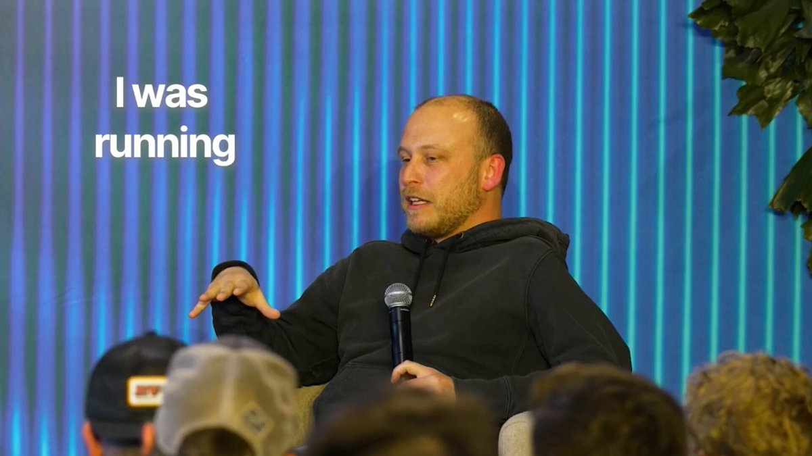

Claude Code creator:

"I don't prompt Claude anymore. I write loops - and the loops do the work. My job is to write loops."

in 30 minutes Boris reveals his actual daily Claude Code setup.

Claude Code + loops + dynamic workflow  

Worth more than a $500 vibe-coding course 

## 💬 Replies

### 1 @0xCodez (Codez) (Author)

*Thu Jun 04 11:25:06 +0000 2026*

Watch full episode at WorkOS YouTube channel:

[youtu.be/RkQQ7WEor7w?si…](https://youtu.be/RkQQ7WEor7w?si=s0nH7NDw69qZ5Jf4)

### 2 @ridark_eth (Ridark)

*Thu Jun 04 10:34:32 +0000 2026*

@0xCodez 30 minutes of interesting listening

### 3 @0xCodez (Codez) (Author)

*Thu Jun 04 10:36:12 +0000 2026*

@ridark\_eth thank bro, btw are you using /loops yourself ?

### 4 @Nikitont (Nikiton)

*Thu Jun 04 09:36:24 +0000 2026*

@0xCodez I'll listen, thanks.

### 5 @0xCodez (Codez) (Author)

*Thu Jun 04 09:40:49 +0000 2026*

@Nikitont are you using /loops in your daily routine bro ?

### 6 @YotamBlu (Yotam Blumenkranz)

*Thu Jun 04 09:55:46 +0000 2026*

@0xCodez loops are the interval training of coding.

once you hit that threshold where the ai starts doing the heavy lifting and you're just directing the effort, everything changes.

gonna watch boris's breakdown because that's exactly where i'm trying to get with goosenet.

### 7 @0xCodez (Codez) (Author)

*Thu Jun 04 10:02:16 +0000 2026*

@YotamBlu Yeah. This is an amazing pod, worth watch brother !

### 8 @0xMoysei (Moysei)

*Thu Jun 04 10:27:53 +0000 2026*

@0xCodez so cool guide

### 9 @0xCodez (Codez) (Author)

*Thu Jun 04 11:10:17 +0000 2026*

@0xMoysei thanks Moysei, love your guides too. Keep pushing them

### 10 @asukahaox (NMhao)

*Thu Jun 04 09:48:19 +0000 2026*

@0xCodez すごい！クロードコードとループを駆使したダイナミックワークフロー、その効果はおそらく＄500のバイブコーディングコースより高いんですね！

### 11 @0xCodez (Codez) (Author)

*Thu Jun 04 10:01:52 +0000 2026*

@asukahaox Are you using dynamic workflow in your daily coding now ?

### 12 @Flandermaxx (Flandermaxx)

*Thu Jun 04 10:31:00 +0000 2026*

@0xCodez this approach to agents is honestly such a developer move

### 13 @0xCodez (Codez) (Author)

*Thu Jun 04 10:37:01 +0000 2026*

@Flandermaxx yeah, true, but you can use /loops for any type of your routine

### 14 @Blum_OG (Blum)

*Thu Jun 04 12:31:29 +0000 2026*

@0xCodez real wisdom from someone who literally shaped AI into what it is now

### 15 @ajs6888 (安叫兽|Bird🕊️ 🔶 BNB)

*Thu Jun 04 15:50:54 +0000 2026*

@0xCodez 感觉已经从聊天变成养流水线了

### 16 @alphabatcher (Alpha Batcher)

*Thu Jun 04 13:51:45 +0000 2026*

@0xCodez &gt; be Claude Code creator the best job

### 17 @gerardsans (Gerard Sans | Axiom 🇬🇧)

*Fri Jun 05 16:09:13 +0000 2026*

@0xCodez FYI:

### 18 @supremebeme (Supreme)

*Fri Jun 05 06:13:16 +0000 2026*

@0xCodez goals and loops baby

### 19 @ShaneTrammel (Trusting In Him!)

*Thu Jun 04 22:15:25 +0000 2026*

@0xCodez Sorry … but that ending is so bogus … whose values are you going to give the model. Just teach it truth that can known and leave values up to the humans

### 20 @ShaneTrammel (Trusting In Him!)

*Thu Jun 04 21:36:42 +0000 2026*

@0xCodez It’s funny that none of these post share the original YouTube link to the video. This is engagement farming at its finest. I can almost guarantee there’s a funnel at some point down the line.

### 21 @HarrisDecodes (HarriStack)

*Fri Jun 05 19:55:48 +0000 2026*

@0xCodez Boris dropped the actual daily setup in 30 mins – better than any $500 course. Saving the full video right now.

### 22 @mustafaergisi (Mustafa Ergisi)

*Thu Jun 04 15:30:00 +0000 2026*

@0xCodez Lost an hour last weekend hand-prompting Claude through a migration before I gave up and wrote the loop. Cleaner output, half the tokens, worth its weight.

### 23 @jackcoder0 (Jack)

*Fri Jun 05 21:09:00 +0000 2026*

@0xCodez Sounds like you’ve unlocked the next level! Loops taking over is the way to go. Can’t wait to see Boris’s setup!

### 24 @v_lugovsky (Vlad 🍩)

*Thu Jun 04 21:49:24 +0000 2026*

@0xCodez I use Codex, but the flow is very similar, cause why wait for one step to finish before starting the next task?

### 25 @mrluiscalderon (Luis Calderon)

*Thu Jun 04 14:22:59 +0000 2026*

@0xCodez Literally the most expensive way to code and get you capped as a developer using Claude. Use loops like this with open-source only.

### 26 @EdTheOSINTer (Eduardo Moreno)

*Thu Jun 04 21:42:43 +0000 2026*

@0xCodez This X article is literally the same as Anthropic’s own blog post on Dynamic Workflows, just slightly rewritten. Much of it is taken verbatim. Gross. 

[claude.com/blog/a-harness…](https://claude.com/blog/a-harness-for-every-task-dynamic-workflows-in-claude-code)

### 27 @dasPoppers (jpop 🦞)

*Fri Jun 05 03:51:02 +0000 2026*

@0xCodez “quad code” how about you audit your work

### 28 @chu_sc (日本語学習中)

*Sat Jun 06 08:43:22 +0000 2026*

@0xCodez @grok N4レベル日本語訳お願い

### 29 @Rachit6783531 (Rachit)

*Thu Jun 04 22:28:55 +0000 2026*

@0xCodez I feel like this is slightly overrated. A normal claude user cant afford to use dynamic workflows.

### 30 @jamesmurray (James Murray)

*Fri Jun 05 02:04:29 +0000 2026*

@0xCodez im simple. i see the @AcquiredFM guys and i watch

### 31 @itsthedonhashim (Hussain Hashim | Building SundayBack)

*Thu Jun 04 11:10:11 +0000 2026*

@0xCodez @0xCodez dude, loops are a game-changer. I've been using them too, makes everything so much smoother. Curious to see your exact setup!

### 32 @princenocode (Prince NZANZU)

*Thu Jun 04 20:19:50 +0000 2026*

@0xCodez You forgot unlimited tokens 😁

### 33 @bygregorr (Gregor)

*Thu Jun 04 12:48:22 +0000 2026*

@0xCodez imo writing loops is still prompting, the abstraction just hides where it breaks

