# 📰 Grok Bot Agents: how to automate your life in 10 Steps (Full-tutorial)

Every AI tool you have used so far waits for you. You open it, you ask, it answers, you close it. The work still happens in your hands - the model just talks you through it.

> Follow my Substack to get fresh AI alpha: [movez.substack.com](https://movez.substack.com/)

Grok Bot inverts that. Each bot gets its own computer in the cloud. It signs into the tools you already use, clicks through them the way you would, and keeps going after you shut the lid.

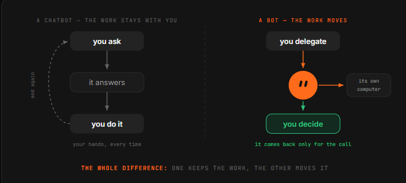

Which means you stop prompting and start delegating. You stop building workflows and start describing a job in a sentence.

This is the 10-step tutorial from installing it to running a crew of specialists that hand work to each other -  and pull you in only for the calls that need a human.

---

## 01\. Install it, then meet the Chief

Grok Bot is a desktop app, not a browser tab - that is the first signal about what it is. 

You download it for macOS, sign in with your Grok or Cursor account, and land in something that looks much more like a messaging client than a chatbot: a sidebar of named bots on the left, a conversation on the right.

Your starting point is usually a general-purpose bot - call it the Chief. 

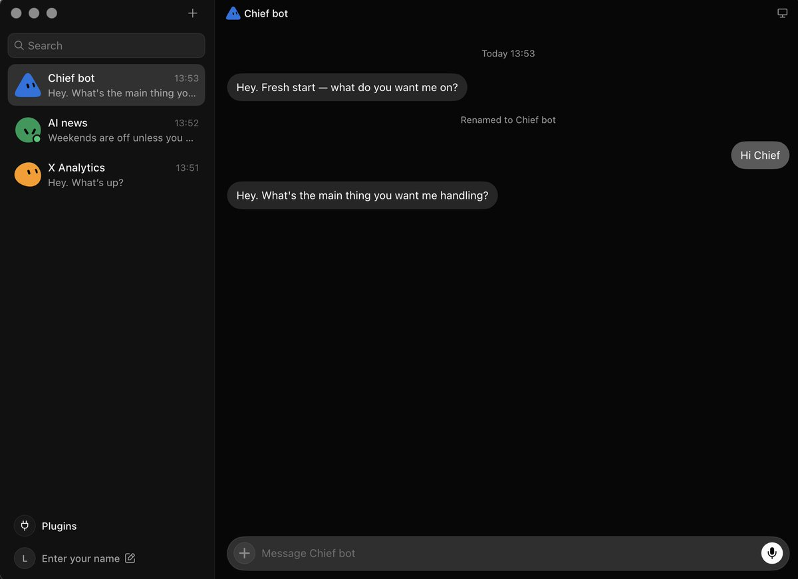

Its job is not to do everything. Its job is to be the one you talk to when you do not yet know which specialist should own a task, and later, to coordinate the others. Think of it as the person you message when you are not sure who to message.

Say hello and give it something small and real. Not a test question - an actual errand with a checkable result. 

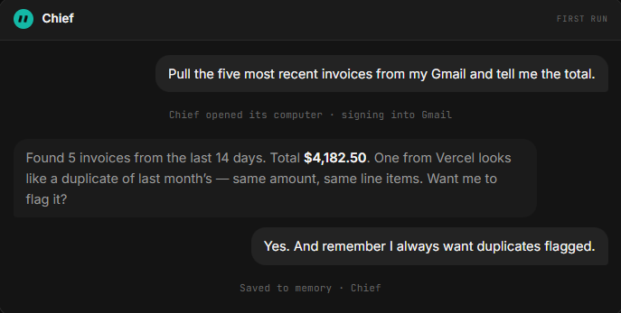

The first task should be something you can verify in thirty seconds, because the whole point of the next nine steps is learning to trust the thing with progressively bigger jobs.

---

## 02\. Give it a job title, not a prompt

This is the step that separates people who get value from Grok Bot from people who bounce off it. A prompt is a request. 

A bot is a role - it persists, accumulates memory, owns a domain, and gets better at that domain specifically because you keep coming back to the same thread.

So name it after a job someone could actually hold.

-  Inbox Manager. Expense Manager. Talent Scout.  Sales Outbound. 

Then write its charter the way you would brief a new hire on day one: what it owns, what good looks like, and - the part everyone skips = what it must never do without asking you.

That last boundary is not paperwork. It is the thing that lets you leave the bot running unattended, because you have defined in advance where its authority stops.

\`\`\`python
The charter prompt — adapt and reuse
You are my Inbox Manager.

// what you own
Triage my email every morning. Archive newsletters and receipts.
Draft replies to anything a client sends. Surface anything
that mentions a deadline, an invoice, or a legal question.

// what good looks like
Inbox at zero by 9am. Drafts sound like me: short, direct,
no "I hope this finds you well". Never more than 4 sentences.

// where you stop
Never send anything. Draft only.
Never archive anything from my accountant or my landlord.
If a message asks for money or credentials, stop and ask me.
\`\`\`

A bot with its own computer and your logins is a bot that can act while you are asleep. 

Defining where it stops is not caution for its own sake - it is what makes the always-on part usable. Bots that have to ask about everything are useless; bots that never ask are dangerous. The charter is where you draw that line once instead of worrying about it daily.

---

## 03\. Connect the tools once

Grok Bot ships a plugin panel for the integrations it expects you to lean on: 

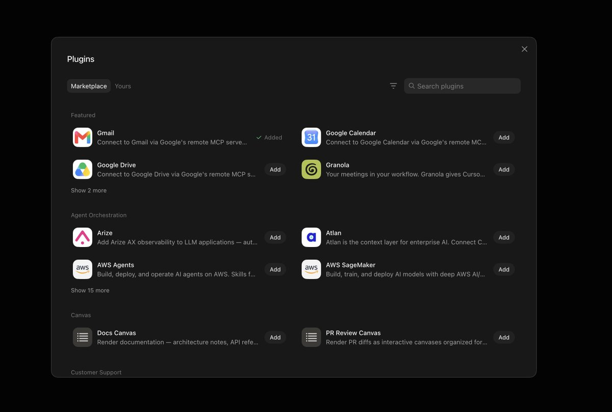

Notion, Slack, Google Drive, AWS Agents, AWS SageMaker, Browserbase, Composio, and Context7, plus an option to build a custom one. These are one-click connections.

The detail worth knowing is that connections are shared across your account. Connect Gmail or GitHub once for one bot, and every other bot you create can use that same connection. 

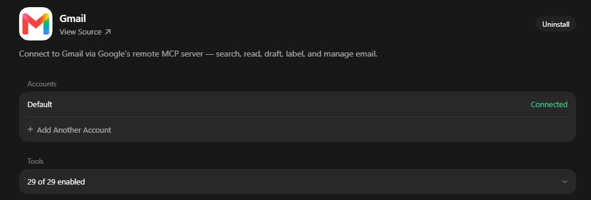

So do this deliberately and early - it is account-level plumbing, not per-bot setup, and it means the fifth bot you hire is productive in seconds rather than minutes.

It also means the blast radius of a connection is every bot you will ever create, which is a good reason to connect the accounts you actually need and leave the rest alone during a beta.

## 04\. Hand off the login, don’t paste the password

Here is the mechanic that makes the whole product work on tools with no API and no MCP server - which is most of the software inside a real company.

The bot navigates on its own cloud browser until it hits a login wall. Then it hands you the screen. 

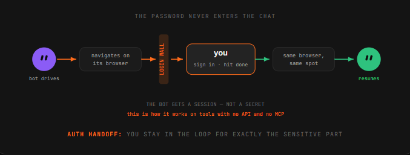

You authenticate, click done, and the bot resumes on that same browser instance from where it left off. 

The same handoff pattern applies whether you are connecting Notion, Gmail, or some internal tool nobody has ever integrated with anything.

Watch what this does to the trust model. You never type a credential into a chat message. The bot gets a session, not a secret - and you stayed in the loop for exactly the sensitive part. 

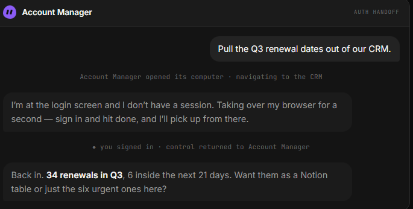

This is the pattern to insist on: if a tool ever asks you to paste a password into a conversation, that is the wrong path.

---

## 05\. Show it once, don’t explain it twice

This is the feature that changes how you think about the product. 

You can teach a bot a workflow by doing it once while it watches. It saves the routine and can then run the same steps on its own next time.

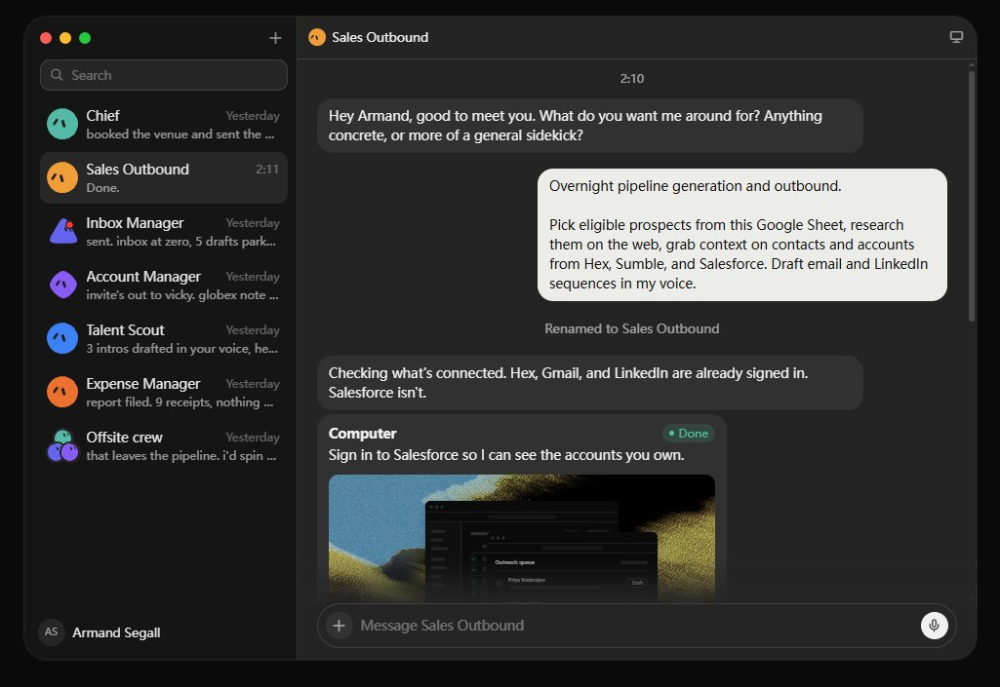

Why this matters more than it sounds: the tasks that eat your week are usually the ones that are tedious to describe and trivial to demonstrate. 

“Take the numbers from this dashboard, cross-reference the ones that dropped, paste them in this doc under the right heading, and Slack the team lead if anything fell more than 15%” is a paragraph to write and forty seconds to show.

Pick your first recording carefully. The best candidate is something you do at least weekly, that involves two or more tools, and where the steps rarely change. 

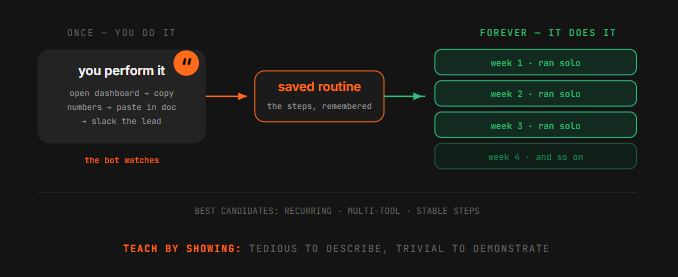

Recurring, multi-tool, stable. Anything that fits all three is a routine waiting to be lifted off your plate.

And the bots reportedly get sharper the more you work with them - they remember conversations and learn how you like things handled. 

SpaceXAI’s own claim is that bots eventually start working before you ask. Treat that as a direction of travel rather than a promise you should plan around during a beta.

---

## 06\. Turn it into a routine that runs without you

A saved routine still needs a reason to fire. Grok Bot gives you two, and you set them conversationally - no workflow builder, no canvas of nodes. In hands-on walkthroughs, setting up a trigger-based routine took roughly two minutes and a single prompt.

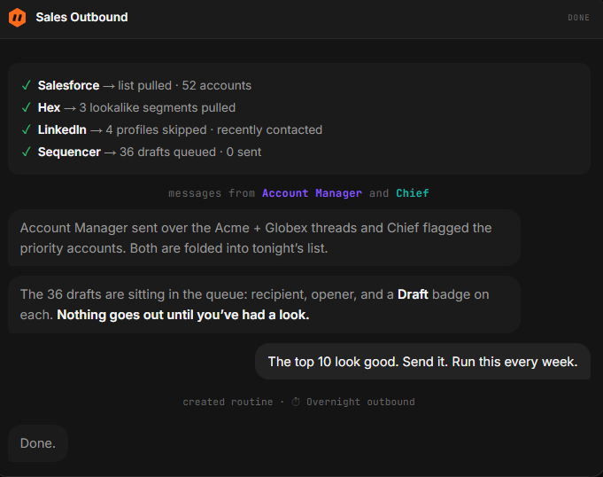

Schedule is the obvious one: a 7am daily briefing, a Friday pipeline summary, month-end expense filing. 

Trigger is the more interesting one: a new Slack message, an inbound email matching a pattern, a change in a document. Triggers are what make a bot feel present rather than punctual.

The instruction is just a sentence at the end of a task you already like. That is the whole design philosophy of this product in one gesture - you do not build the automation, you approve the one that just happened and ask for it again.

\`\`\`python
// schedule — the morning brief
Every weekday at 7am, check my calendar, my inbox, and the
#launches Slack channel. Give me one short brief: what's on
today, what needs a reply, what changed overnight.

// trigger — the inbound catcher
Whenever an email arrives from a domain not in my contacts and
it mentions pricing, draft a reply from the template and park it.

// schedule — the weekly close
Every Friday at 4pm, pull the week's receipts from my inbox,
file them, and tell me anything that has no matching invoice.

// the shortcut that creates most routines
Run this every week.
   ^ said right after a task you liked. That's the whole flow.
\`\`\`

---

## 07\. Hire specialists, not one generalist

You can run multiple bots in parallel, each handling a different area - and this is where the product stops resembling anything you have used before. 

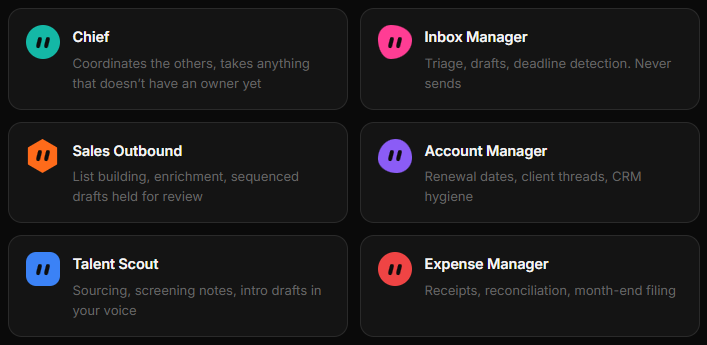

Separate bots mean separate memory, separate context, and separate accountability. 

- An Expense Manager that only ever thinks about receipts gets genuinely good at your receipts. 

- A generalist juggling expenses, recruiting, and outbound is worse at all three and gives you no clean thread to look at when something goes wrong.

SpaceXAI says its own teams run bots for sales outreach, marketing, office operations, and bug fixes. A workable starting roster for one person looks like this = and note that the right split is by domain, not by task size.

---

## 08\. Put them in a group chat

Bots can message each other and share context in threads. Put several in a group chat and they coordinate on their own - passing work, assigning ownership, and pulling you in only for judgment calls. 

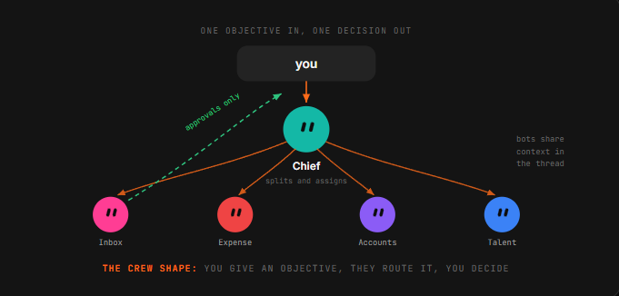

When projects overlap, they stay aligned on the same account without you copy-pasting notes between conversations.

SpaceXAI’s own example is an engineering bot that reproduces a bug, files a ticket, and hands the issue to a second bot to debug.

That handoff - one bot deciding another is better suited and passing ownership - is the thing that does not exist in any tool you have used before.

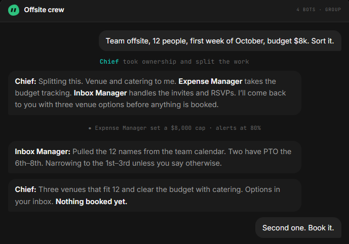

The way to make it work is to give the group an objective, not a task list. 

A task list means you already did the decomposition, and the bots are just executing your plan. An objective lets them split it, which is the entire point of having more than one.

---

## 09\. Draw the approval line

Grok Bot’s whole premise is that a bot finishes jobs end to end and comes back only when something needs your approval. 

Which puts the burden on you to define what “needs approval” means - because the default answer the bot picks may not match yours.

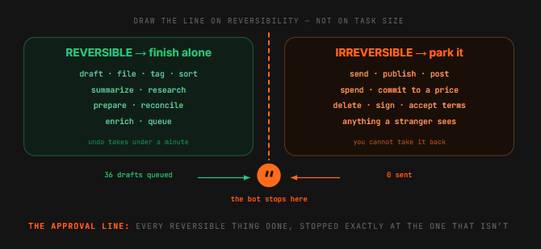

The line that works is not about task size. It is about reversibility. Anything the bot can undo - drafting, filing, tagging, summarizing, researching, preparing - it should finish alone. 

Anything the outside world sees, or that moves money, or that cannot be taken back, gets parked for you.

\`\`\`python
// finish these alone, always
draft · file · tag · summarize · research · prepare · reconcile
   everything reversible. don't ask, just do it and log it.

// park these for me, always
send anything to a person outside the company
spend or move money, or commit to a price
publish anything public
delete anything that isn't obvious junk
sign up for, agree to, or accept any terms

// when unsure
If you can't undo it in under a minute, park it and ask.
\`\`\`

Notice how that maps onto the Sales Outbound example: 36 drafts queued, 0 sent. The bot did every reversible thing and stopped precisely at the irreversible one. That is the shape to aim for on every bot you run.

---

## 

## 10\. Review weekly, prune ruthlessly

Automation rots quietly. A site changes its layout, a routine starts silently producing garbage, and because the bot runs while you sleep, nobody notices for three weeks. 

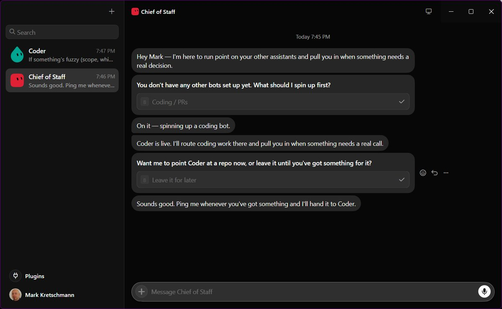

This is the failure mode of every always-on system ever built, and it will find you here too.

So put fifteen minutes on the calendar. For each routine, ask three questions: did it run, was the output actually right, and would I miss it if I killed it? 

That third one matters more than it looks - the natural drift of a tool like this is toward a pile of half-useful automations nobody has the nerve to delete.

\`\`\`python
List every routine you ran this week. For each one:

  \- how many times it fired
  \- what it produced
  \- anything it skipped, failed, or had to guess at
  \- anything you parked for me that I never answered

Then tell me which one you think is least useful, and why.
\`\`\`

The best way to run the review is to ask the bots for it. They keep the threads; they can report on themselves. Then spot-check one output per routine by hand, because a bot reporting on its own work has the same blind spot you do.

---

## Conclusion: 

You stop being the one, who does the clicking.

Every AI product until now put the model in a window and left the work in your hands. Grok Bot moves the work. The bot has the computer, the logins, the memory, and the time - and you have the decisions.

That is a smaller change in technology than it sounds and a much bigger change in habit.

 The skill stops being how do I phrase this and becomes what exactly am I delegating, and where does its authority end. Which is a management question, not a prompting

### 🖼️ Attached Media

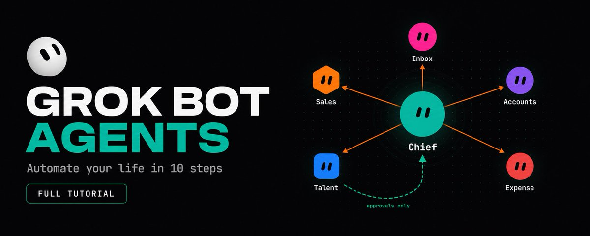

## 💬 Replies

### 1 @elonmusk (Elon Musk)

*Tue Aug 18 17:54:53 +0000 2026*

@0xCodez Interesting

### 2 @0xCodez (Codez) (Author)

*Tue Aug 18 18:04:37 +0000 2026*

@elonmusk Thank Elon for delivering such a useful tooling. Grok bot is my daily tool right now

### 3 @phosphenq (Phosphen)

*Tue Aug 18 11:42:06 +0000 2026*

@0xCodez 

### 4 @0xCodez (Codez) (Author)

*Tue Aug 18 11:42:56 +0000 2026*

@phosphenq Lool. Great meme bro. Btw have you tested GrokBot alredy ?

### 5 @rewind02 (rewind)

*Tue Aug 18 11:36:08 +0000 2026*

@0xCodez specialist bots sharing context
gets interesting fast

### 6 @0xCodez (Codez) (Author)

*Tue Aug 18 11:36:57 +0000 2026*

@rewind02 yeah, connecting those bots in one chat, thats the real magic

### 7 @gippp69 (Gipp 🦅)

*Tue Aug 18 11:43:56 +0000 2026*

@0xCodez WW share Codez

### 8 @0xCodez (Codez) (Author)

*Tue Aug 18 11:44:29 +0000 2026*

@gippp69 Thx Gipp. Have you tested Grok bot alredy ?

### 9 @0x_fokki (Fokki)

*Tue Aug 18 11:56:11 +0000 2026*

@0xCodez Hot topic bro

### 10 @0xCodez (Codez) (Author)

*Tue Aug 18 13:32:09 +0000 2026*

@0x\_fokki Yeah bro. And really useful tooling

### 11 @0xChaseTM (Chase)

*Tue Aug 18 12:15:35 +0000 2026*

@0xCodez have to test, booked

### 12 @0xCodez (Codez) (Author)

*Tue Aug 18 12:25:42 +0000 2026*

@0xChaseTM yeah, just run it for few days, im sure you will like it

### 13 @vartekxx (vartekx)

*Tue Aug 18 11:51:33 +0000 2026*

@0xCodez new top tier article from Codez, great job mate!

### 14 @0xCodez (Codez) (Author)

*Tue Aug 18 11:53:27 +0000 2026*

@vartekxx you are welcome buddy, long live Grok bot agents !

### 15 @MildlyMagical (Mildly Magical)

*Tue Aug 18 13:44:42 +0000 2026*

@0xCodez Please take grok bot off of cursor token burn.  Cusor is know for the shady token burn.

### 16 @0xCodez (Codez) (Author)

*Tue Aug 18 13:50:34 +0000 2026*

@MildlyMagical yeah true for Cursor, but i think they will fix it at Grok bot

### 17 @morganlinton (Morgan)

*Wed Aug 26 03:00:03 +0000 2026*

@0xCodez Great primer, and glad you covered the no MCP part, that’s so important imo!

### 18 @gerardsans (Gerard Sans | Axiom 🇬🇧)

*Sun Aug 30 15:38:22 +0000 2026*

@0xCodez [x.com/gerardsans/sta…](https://x.com/gerardsans/status/2094086290266357811)

### 19 @mrcooler6868 (Mr. Cool)

*Wed Aug 26 05:17:18 +0000 2026*

@0xCodez @grok agent Hermes can already do all these? What is the difference between the 2?

### 20 @MrBubbles1969 (Mr. Bubbles)

*Tue Sep 01 12:26:31 +0000 2026*

@0xCodez How do I set up a team of Bots to set all this up for me?

### 21 @Eldenofthering (T3OU 736 🇬🇧🏴󠁧󠁢󠁥󠁮󠁧󠁿🇯🇵🚀)

*Thu Aug 27 14:31:00 +0000 2026*

@0xCodez to get the most out of the chief, should he be in every instance of a group chat with appropriate specialists?

### 22 @1under4 (dont_ask)

*Mon Aug 31 22:25:36 +0000 2026*

@0xCodez Regarding 4, I just tell my bots to create a secret and it prompts me with a secure box to paste passwords or api keys.

### 23 @Art_Intelligo (Art Intelligence)

*Tue Sep 01 07:34:46 +0000 2026*

@0xCodez do you have a web version of the article, not embedded in X?

### 24 @NSawnson (Nelson)

*Sun Aug 30 19:03:29 +0000 2026*

@0xCodez Can GrokBot do my 2026 taxes? If it does it would totally make since for me to get a subscription bc my accounts charge me way too much! When it does please let us know how to set it up and what info it needs.

### 25 @spr_kcakes (MalwareMuffin)

*Tue Aug 25 19:43:28 +0000 2026*

@0xCodez Beautiful! Thanks a ton for moving the needle for us normies

### 26 @bricioz (Fabricio Medeiros)

*Sun Aug 30 13:28:58 +0000 2026*

@0xCodez Codez you give so many ideas, Tks for that. Most of no tech people get a “Blue Screen” in front of so much capability of that , and you get at simple, congrats 🎈

### 27 @Josefusan111 (Joseph ai)

*Wed Aug 26 17:50:53 +0000 2026*

@0xCodez seems as though it is an iteration of openclaw or nanoclaw but with graph engineering as a core tenet of it. Going to try it out on this mobile app that I started to build

### 28 @davoomac (davoomac)

*Tue Sep 01 01:01:45 +0000 2026*

@0xCodez I ran out of tokens so fast doing basic email sorting.. :/

### 29 @DreadedT (Dreadfully Despized)

*Wed Sep 02 04:51:55 +0000 2026*

@0xCodez My favorite thing about this lately is educating the CoS.  Using links like this to have digest/review/implement best practices within the team.

### 30 @crifan (Christian Fantoli)

*Tue Sep 01 14:52:09 +0000 2026*

@0xCodez Traduction pour nos amis francophones de cet excellent article

### 31 @phosphenq (Phosphen)

*Wed Aug 19 14:58:40 +0000 2026*

@0xCodez if Elon liked your article, who am i to pass it by :)

### 32 @shmidtqq (shmidt)

*Tue Aug 18 19:55:48 +0000 2026*

@0xCodez alpha from Codez

Elon like it

### 33 @BTC_Chopsticks (BTC_Chopsticks)

*Sat Sep 05 19:27:38 +0000 2026*

@0xCodez @Lucidisme Hi! Great to connect with you. I'd love to hear your thoughts on my latest post. If you enjoy my content, I hope we can stay connected. Thanks! 👇[x.com/BTC\_Chopsticks…](https://x.com/BTC_Chopsticks/status/2096282212102775230?s=20)

