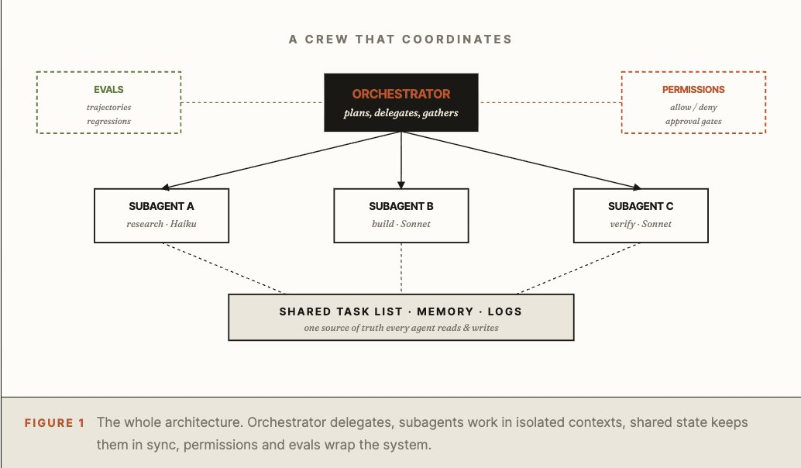
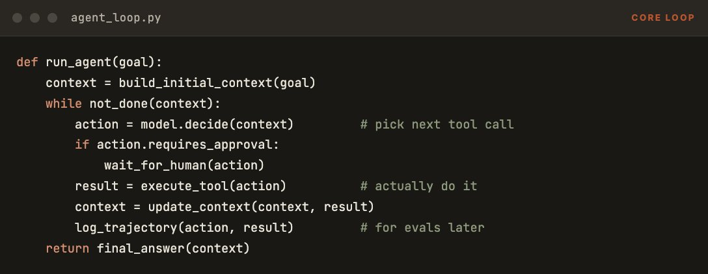
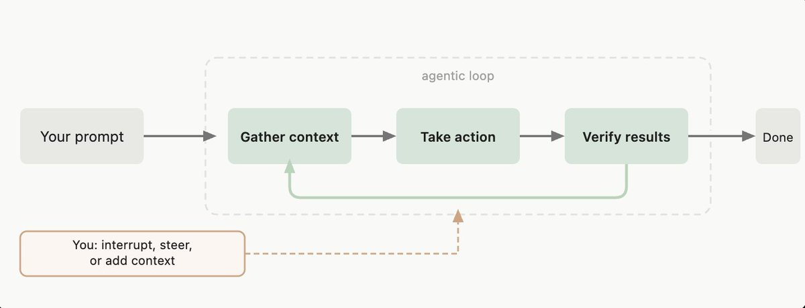
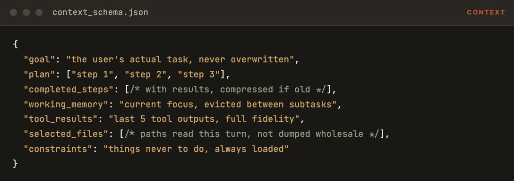
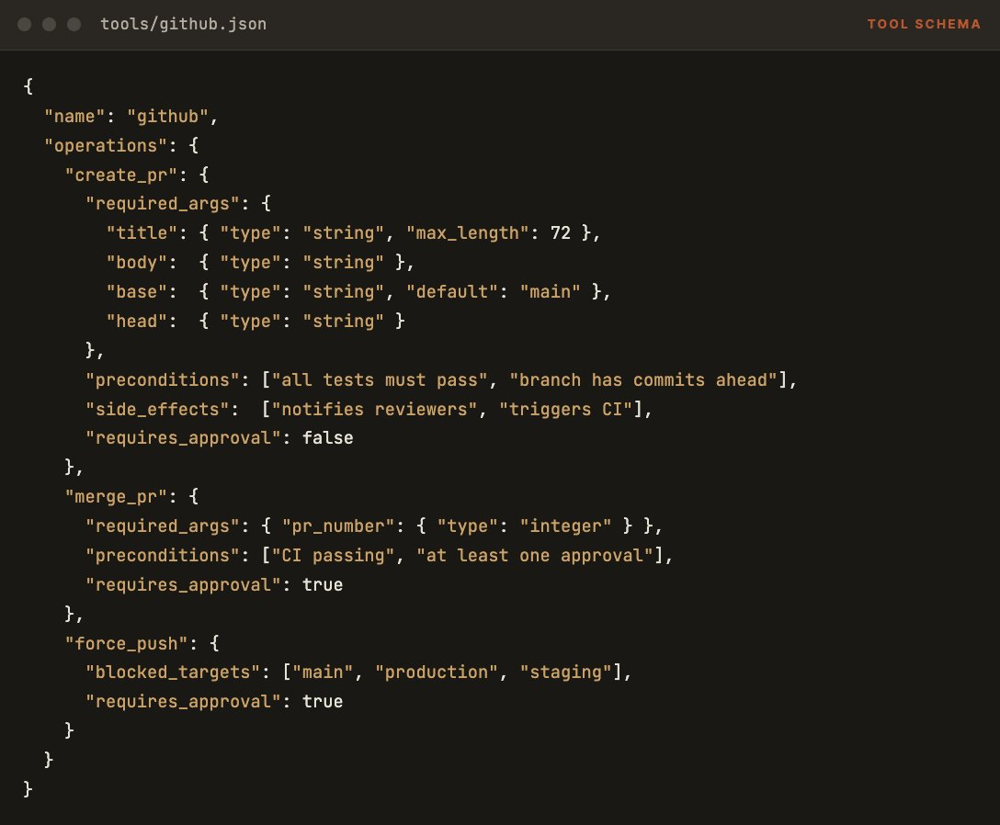
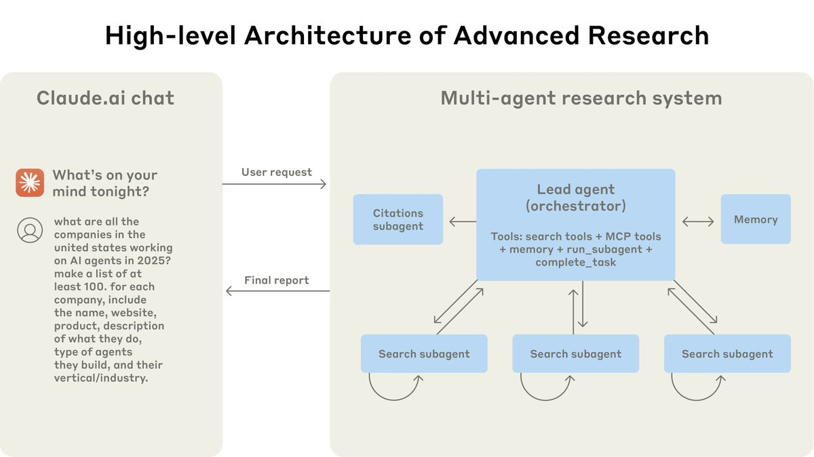
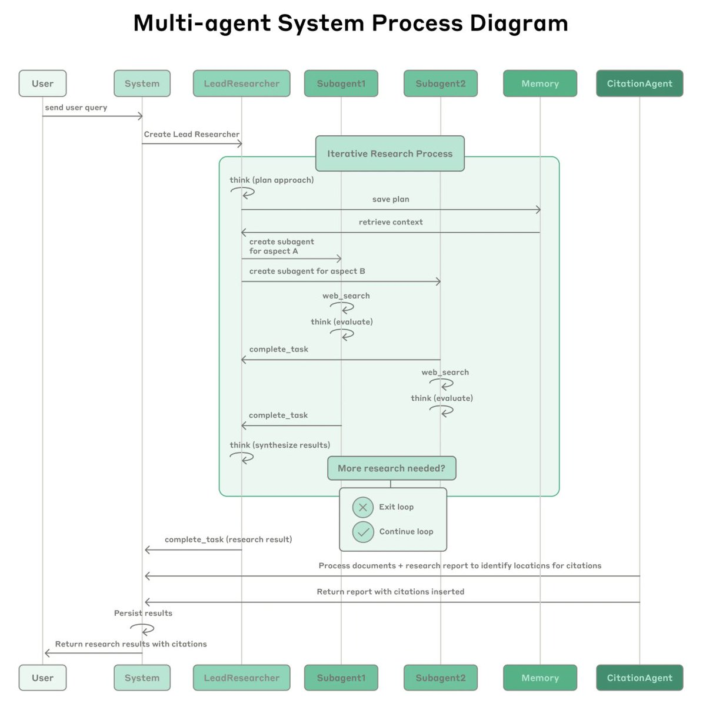
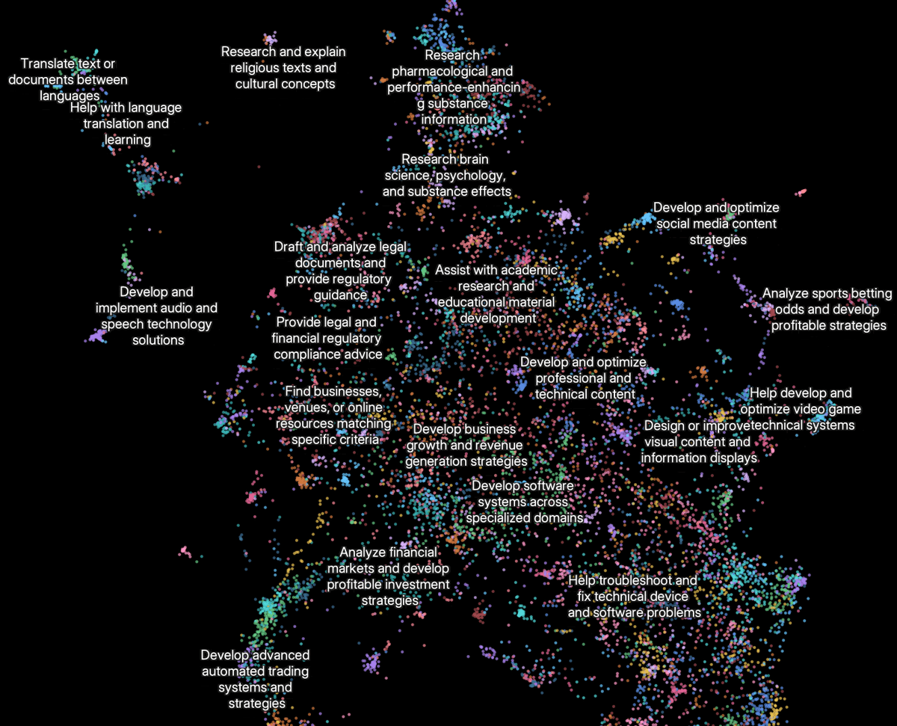
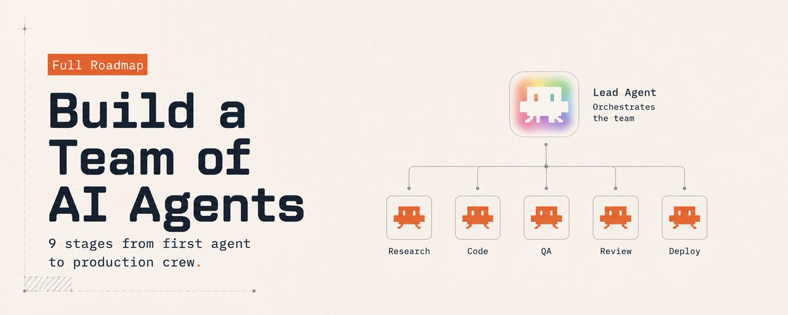

# 📰 How to build a team of AI agents: 9 stages from first agent to production crew. 

Most people who try to build a “team of AI agents” end up with one agent talking to itself in five tabs. 9out of 10 multi-agent projects never make it out of demo mode.

The agents don’t share context, don’t divide work, don’t know what the others are doing. This is the 9-stage roadmap that turns that mess into a crew that actually coordinates.

> Follow my Substack to get fresh AI alpha: [movez.substack.com](https://movez.substack.com/)

An AI agent team sounds simple: a few agents, each with a job, working together on something one agent could not finish alone. In practice, the moment you try it, you discover the problems no demo ever shows.

What works is structure. The 9 stages below are the structure - built from Anthropic’s own engineering writing on the Claude Agent SDK, the patterns in their multi-agent research blueprint, and what teams shipping real agent systems in 2026 do differently from the ones still stuck in demo mode. 

Three tiers: get one agent right, get them coordinating, get the whole crew production-ready.

9 stages. 3 tiers. One crew that finishes work while you sleep.

---

Part 1 · The Single Agent

## 01\. Define the agent loop

The most common mistake before stage one even begins: confusing a smart chatbot with an agent. A chat is a turn. 

An agent is a loop - the model receives a goal, picks an action, runs it, observes the result, and decides what to do next. It keeps going until the goal is done or the loop hits a stop condition.

Everything else in this article assumes you have a real loop in code. Pseudo-code makes the shape obvious:

Notice what is in there: an approval gate, a logging hook, and a clear stop condition. If your “agent” is one big prompt that asks the model to do everything in one shot, you do not have an agent - you have a long completion. Everything later in this article needs a real loop to build on.

Pro tip: The stop condition matters more than people think. A loop with no clear end will burn money. Common stop conditions: goal achieved, max iterations reached (typically 30–50), explicit user halt, error threshold exceeded. Always set max\_iterations. A runaway agent is worse than a slow one.

---

## 02\. Engineer the context. Write, Select, Compress, Isolate.

Context is the most expensive and most fragile part of an agent. Most agent failures - the ones that look like “the model is dumb” - are actually context failures: the model never had what it needed, or it had too much and got distracted, or what it had was stale.

The four operations that matter, from Anthropic’s own engineering writing:

- Write - what gets added to context at each step. Be deliberate. Every line costs tokens and attention.

- Select - what to pull from memory or files. Retrieval, not dumping.

- Compress - when context fills up, summarize older parts while keeping decisions intact.

- Isolate -subagents work in their own context window so the main thread stays clean.

In practice this means a structured context object, not free-form string concatenation. Here is the shape a working agent context takes:

The biggest single win here is isolating subagent context. When the main agent delegates research to a subagent, the subagent gets a fresh window with only the task and relevant files. It returns a summary, not its raw transcript. The main agent never sees the noise. This single pattern is why subagents work at all.

---

## 03\. Write tools the model picks correctly

Without typed tool schemas the model improvises message formats, argument structures, and permissions for every call. 

That improvisation is where most production failures come from. Not because the model cannot call the tool, but because it guesses the wrong format, sends the wrong arguments, or does something it should not have permission to do.

A typed schema converts the task from “guess how to call this” into “fill in these fields.” And it lets the harness enforce rules the model cannot bypass:

The fields beyond basic types are what make it production-grade: preconditions are what must be true before the call runs. side\_effects tell downstream readers what will happen. requires\_approval routes the call to a human checkpoint. blocked\_targets are hard constraints the harness enforces no matter what the model decides.

---

Part 2  · The Coordination Layer

## 04\. Spawn subagents with isolated context.

A subagent is not a copy of the main agent. It is a specialist with its own context, its own toolset, and often its own model. When the orchestrator decides “this part is research,” it spawns a research subagent - gives it only the relevant goal, lets it use only the relevant tools, runs it on a cheaper model like Haiku, and waits for a summary back. The main thread never sees the raw research.

In the Claude Agent SDK this is the Task tool. In code, the call looks like this:

\`\`\`json
&gt; spawn\_subagent(
    role="research",
    model="claude-haiku-4-5",
    goal="find every API endpoint in src/ that lacks auth",
    tools=\["grep", "read\_file"\],
    return\_format="summary + file list"
  )

▲ subagent\_a  starting in isolated context…
  \- scanning 142 files
  \- 11 endpoints flagged
✓ done · returned 1.2K-token summary, full transcript not loaded into parent
\`\`\`

The subagent’s return\_format field matters more than any prompt. If you let subagents return free-form text, the orchestrator drowns. 

Force structured returns - a summary string plus a list of facts, a list of files, a list of findings. The orchestrator then composes those structured returns into the next decision without reading the noise.

---

## 05\. Design the orchestrator. Plans, delegates, never executes.

The orchestrator is the agent at the top of the tree. Its only job is to plan, delegate, and gather. It does not write code, run queries, or talk to APIs directly — if it does, it pollutes its own context with details that belong inside subagents. The orchestrator stays light so it can keep the whole task in view.

A working orchestrator has three loops nested inside the main agent loop:

\`\`\`json
def orchestrator\_loop(goal):
    plan = make\_plan(goal)                  # step 1: PLAN
    results = \[\]

    for step in plan:
        subagent = pick\_specialist(step)    # step 2: DELEGATE
        result   = run\_subagent(subagent, step)
        results.append(result)

        if plan\_needs\_revision(result):
            plan = revise\_plan(plan, result) # adapt mid-run

    return synthesize(results)             # step 3: GATHER
\`\`\`

The orchestrator is usually the most capable model (Opus, in 2026). The subagents under it are often Sonnet or Haiku. 

This is where the cost math works: the expensive model runs the plan, the cheap models run the work. A crew on this pattern can run 5–10x the tasks of a single-Opus setup at lower total cost.

---

## 06\. Build a shared task list.

Without shared state, your “team” is parallel solo work. Two subagents start on the same step. One finishes a step nobody knows about. The orchestrator forgets what was assigned to whom. The fix is a single shared task list that every agent reads from and writes to - not as a creative document, but as a structured file.

\`\`\`json
{
  "goal": "Add auth to all unprotected endpoints",
  "tasks": \[
    {
      "id": "t1",
      "description": "Find unprotected endpoints",
      "status": "done",
      "assignee": "subagent\_a",
      "result": "11 endpoints in src/routes/\*.ts"
    },
    {
      "id": "t2",
      "description": "Add JWT middleware to each",
      "status": "in\_progress",
      "assignee": "subagent\_b",
      "depends\_on": \["t1"\]
    },
    {
      "id": "t3",
      "description": "Write integration tests",
      "status": "pending",
      "assignee": null,
      "depends\_on": \["t2"\]
    }
  \]
}
\`\`\`

Three things make this work that pure memory does not: explicit assignees mean two agents never pick the same task. 

Explicit dependencies stop subagents from running steps whose inputs are not ready. Explicit status lets the orchestrator check progress without reasoning over transcripts.

---

## 

Part 3 · The Production Crew

## 07\. Add memory, durability, and sandboxing.

A demo agent forgets the moment the session ends. A production crew remembers what it should and forgets what it should. The three things to wire in, in order:

- Memory - a structured store the agent writes to deliberately. Not the conversation log; that is too noisy. A separate file or DB row per fact, decision, or convention worth keeping. memory/decisions.md, memory/conventions.md, memory/known\_failures.md. The next session loads these explicitly.

- Durability - every step writes its action and result to disk before moving on. If the process crashes mid-loop, the next start reads the trajectory and resumes. Without this, a 50-step task that fails at step 47 starts from zero. This is the single most ignored detail in agent engineering.

- Sandboxing - agents run in a container or restricted subprocess with no access to anything not explicitly granted. No reading your home directory because someone’s prompt drifted. No writing outside the project folder. The sandbox is the wall between “agent that helps you” and “agent that costs you something.”

\`\`\`plaintext
\# Decisions log

\## 2026-05-22
\- chose JWT over session cookies (mobile clients drive this)
\- auth lives in src/auth/, never duplicated per route
\- all endpoints under /api/admin require role check, not just login

\## 2026-05-29
\- adopted shared task list pattern (state/tasks.json)
\- orchestrator on Opus, subagents on Sonnet/Haiku
\- max\_iterations = 30 per loop, hard cap enforced by harness
\`\`\`

---

## 08\. Wire evals and trajectory checks.

Most teams change their agent system and have no idea whether the change helped or hurt. They run it twice on a familiar task, it “feels better,” and they ship. Six weeks later they have a system that performs worse than the original on cases they forgot to check. Evals fix this.

Three layers of measurement that a production crew needs:

- Eval set - 20–100 frozen tasks with known good outputs. Run them after every meaningful change. Track pass rate over time.

- Trajectory checks - not just “did it finish,” but “did it call the right tools in roughly the right order.” A correct answer through a wrong path is a future regression.

- CI regression gates - the eval set runs automatically on PRs. If pass rate drops below a threshold, the PR is blocked. Same discipline as code tests.

\`\`\`json
{
  "id": "auth\_refactor\_001",
  "input": "Add JWT auth to all unprotected /api/\* endpoints",
  "expected": {
    "endpoints\_protected": 11,
    "files\_touched": \["src/auth/jwt.ts", "src/routes/\*.ts"\],
    "tests\_added": "at least one per endpoint",
    "no\_changes\_to": \["src/db/", "src/email/"\]
  },
  "trajectory\_must\_include": \[
    "grep\_for\_unprotected\_endpoints",
    "read\_existing\_auth\_module",
    "apply\_middleware\_to\_each\_endpoint",
    "run\_tests"
  \],
  "max\_iterations": 30
}
\`\`\`

The trajectory\_must\_include list is the secret weapon. Two agents can produce the same answer through wildly different paths - one safe, one one bad approval away from disaster. 

Trajectory checks catch the unsafe path before it ships. Pair this with anonymous logging of real production runs and you build the eval set automatically from cases that already happened.

---

## 09\. Ship with permissions and human checkpoints.

The last stage is the one that lets you sleep at night. A permissions file declares what the crew can do without asking, what needs human approval, and what is never allowed at all. The harness reads this file before every tool call. 

The model cannot bypass it because the rule lives outside the model.

\`\`\`python
\## Always allowed (no approval needed)
\- read any file in the project directory
\- run tests
\- create branches
\- write to memory/ and skills/ directories
\- create draft pull requests

\## Requires approval
\- merge pull requests
\- deploy to any environment
\- delete files outside of memory/working/
\- install new dependencies
\- modify CI/CD configuration

\## Never allowed
\- force push to main, production, or staging
\- access secrets or credentials directly
\- send HTTP requests not in the approved domains list
\- modify permissions.md (only humans edit this file)
\- disable or bypass pre\_tool\_call hooks

\## Approved external domains
\- api.github.com
\- registry.npmjs.org
\- pypi.org
\`\`\`

This file is the single most important artifact in the whole production stack. It is the difference between an agent crew you can leave running overnight and one you have to babysit. Write it before you spawn your first subagent, not after the first incident.

---

## § The mistakes that keep crews stuck in demo mode

- No real loop. A long prompt with “think step by step” is not an agent. No iteration, no observation, no recovery.

- Free-form context. Stuffing the window with everything you have. The model gets distracted and misses what mattered.

- Untyped tools. Free-text arguments and no preconditions. The model guesses, sometimes wrong, sometimes destructively.

- Subagents without isolation. When subagents share context with the orchestrator, you get five chatty agents instead of one focused team.

- Orchestrator that executes. The lead agent writing code itself, drowning in details its specialists should be handling.

- No shared task list. “Team” collapses into parallel solo work with duplicated effort.

- No durability. A 50-step task crashes at step 47 and starts over from scratch. Money burned, time wasted.

- No evals. “Better” is a vibe. Six weeks later you cannot explain why anything works or fails.

- No permissions file. Speed without a safety net. One bad approval away from a real incident.

---

## Conclusion:

A team of AI agents is not more model. It is more structure.

Everything in this roadmap is plumbing. None of it is exotic. None of it requires a frontier model the rest of the world does not have. The teams shipping real multi-agent systems in 2026 are using the same models everyone else can use. What they have that demo-stuck teams do not is nine stages of structure between the agents.

If you have read this far and tried multi-agent setups before, the answer to “why did it not work” is probably in here. Pick the one stage you skipped - usually shared state or permissions - and add it tomorrow. Then the next. A crew that ships is built in stages, not in one weekend of vibes.

### 🖼️ Attached Media

## 💬 Replies

### 1 @doublenickk (Shadow Nick)

*Sun May 31 21:33:58 +0000 2026*

@0xCodez thanks for this alpha article bro🫂

### 2 @Blum_OG (Blum)

*Mon Jun 01 05:37:47 +0000 2026*

@0xCodez solid breakdown of each stage, thanks Codez

### 3 @Levi_Researcher (Levi)

*Mon Jun 01 03:41:46 +0000 2026*

@0xCodez bruh that context trick wild

### 4 @aceop_xyz (Ace op)

*Sun May 31 16:30:54 +0000 2026*

@0xCodez Bro 

### 5 @0xMoysei (Moysei)

*Sun May 31 22:49:24 +0000 2026*

@0xCodez The biggest lesson here multi-agent systems scale through coordination, not through adding more agents.

### 6 @Granite0x (Granite)

*Sun May 31 17:28:37 +0000 2026*

@0xCodez "Spawn subagents with isolated context"

that's actually insane we can do that

### 7 @itsthedonhashim (Hussain Hashim | Building SundayBack)

*Sun May 31 16:28:44 +0000 2026*

@0xCodez @0xCodez haha this is so true. spent days on it and ended up with agents just having infinite loops 😂

### 8 @SaberinSamarat (Saberin Samarat)

*Sun May 31 16:20:20 +0000 2026*

@0xCodez Amazing stuff

### 9 @Nicoqp (Nico)

*Mon Jun 01 10:33:31 +0000 2026*

@0xCodez i think rubbing multi agents team is the hardest part rn and this article just made that easier ggs

### 10 @hiranpei (Ranpei)

*Fri Jul 31 14:58:00 +0000 2026*

@0xCodez How should we implement it? Through plugins in Claude Code/Codex? Or should we build it ourselves using LangGraph?

