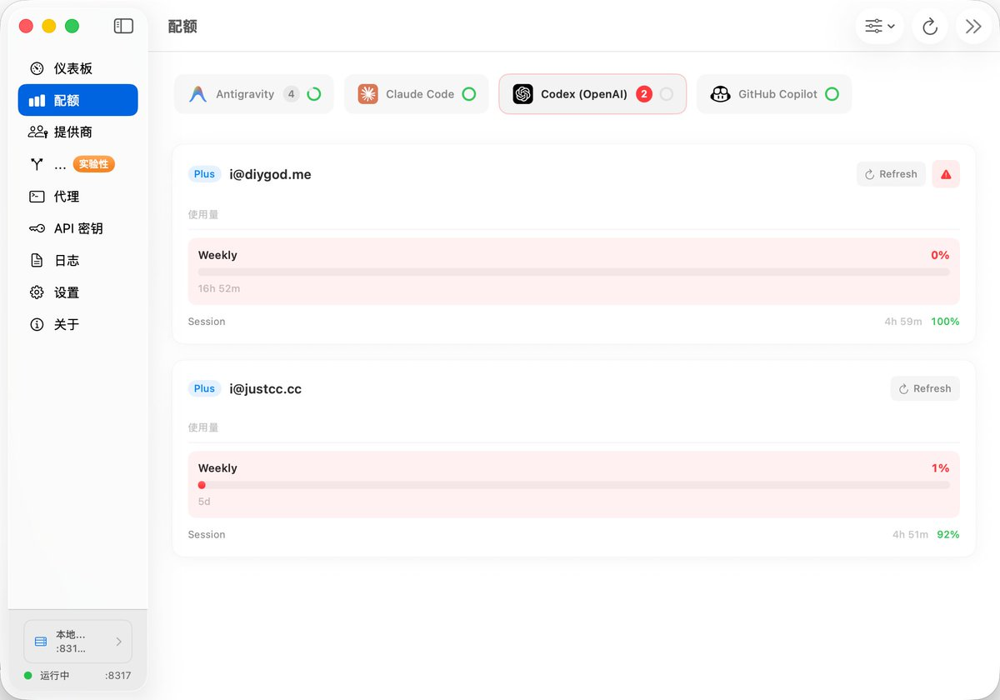
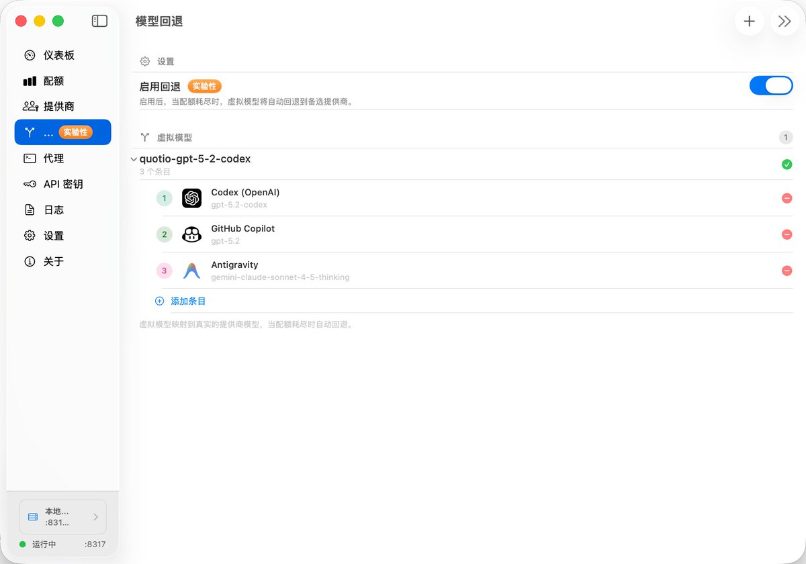
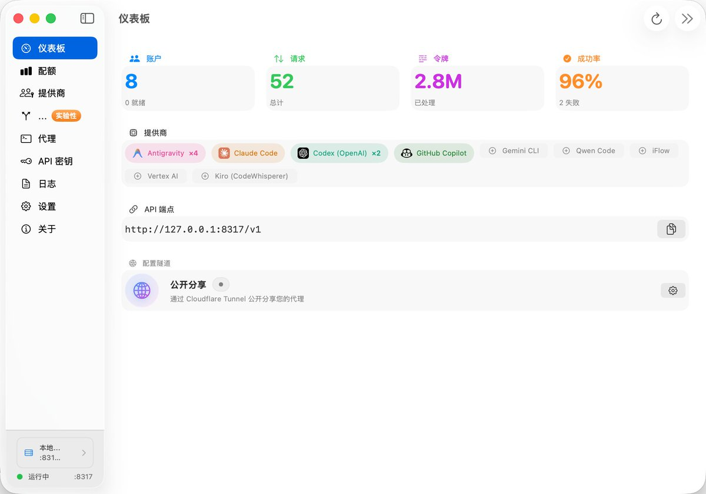
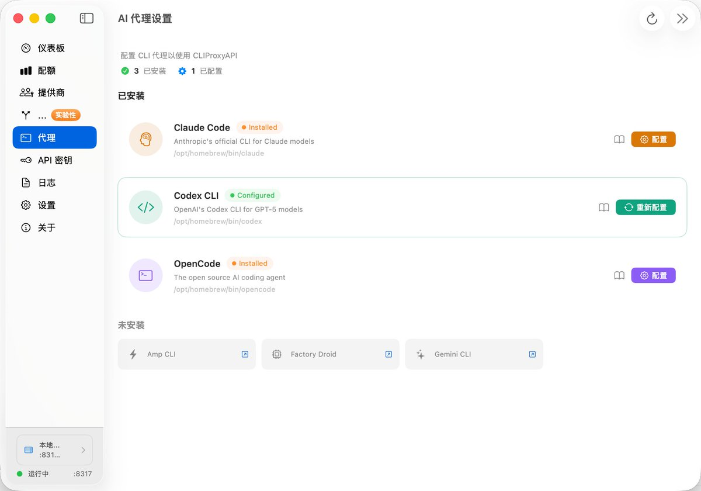
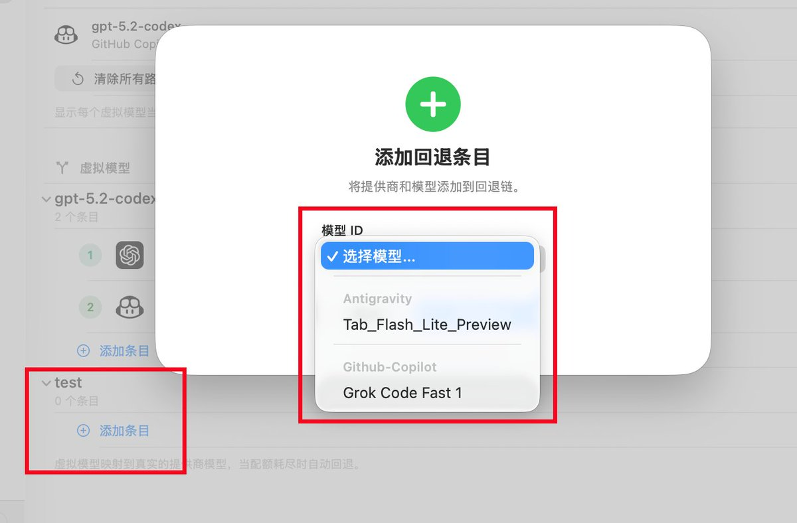
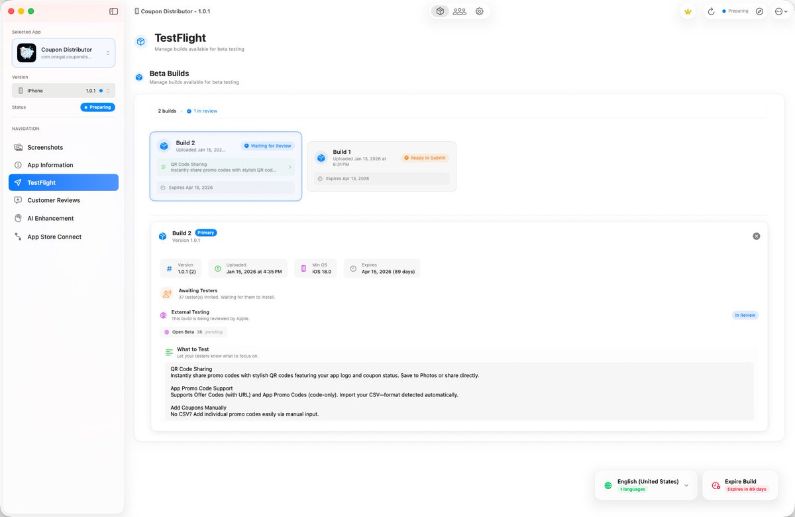

Quotio 一个 App 就代替并超越了之前用 Antigravity Tools + CC Switch + CodexBar 三个 App 才能实现的需求
\- 视奸多个账号剩余配额
\- 多账号负载均衡和 fallback
\- 代理 Antigravity 的模型给外部用

token 焦虑又缓解了 

## 💬 Replies

### 1 @love1sbug (loveisbug)

*Thu Jan 15 12:43:04 +0000 2026*

@DIYgod 哇大佬竟然推荐了！

作者是越南友人@phutrong00 
我主要贡献开发了 Fallback 功能，切身需求！

不过，跨模型类型fallback 有一丢丢问题，我打算限制同类Claude/GPT/Gemini 内 fallback 了😭 跨模型要再多做一次协议转换，我以为搞定了，用着总有奇怪的问题。

### 2 @DIYgod (DIŸgöd ☀️) (Author)

*Thu Jan 15 13:10:14 +0000 2026*

@bestiseth @phutrong00 在线报个 bug，这个限制把添加第一个条目的选择弄坏了 

### 3 @Lessnoise365 (被减数)

*Thu Jan 15 12:50:53 +0000 2026*

@DIYgod 好奇8个账户都是啥？🤔

### 4 @DIYgod (DIŸgöd ☀️) (Author)

*Thu Jan 15 12:52:17 +0000 2026*

@Lessnoise365 4 个 Antigravity，1 个 Claude，2 个 Codex，1 个 GitHub Copilot

### 5 @jason0407 (𝙅𝙖𝙨𝙤𝙣𝘼𝙞𝙧)

*Fri Jan 16 06:03:58 +0000 2026*

@DIYgod 这个还代替不了吧，里面有一些 \`Skill\` 和 \`MCP\` 的工具，现在这个里面好像没办法可以进行处理。之前是在 \`cc-Switch\` 里面是可以的。

### 6 @DIYgod (DIŸgöd ☀️) (Author)

*Fri Jan 16 07:07:54 +0000 2026*

@jason0407 这个不是手动加到 config 就行了么

### 7 @riceplate167 (碟头饭🍛)

*Thu Jan 15 21:03:10 +0000 2026*

@DIYgod 这个东西用copilot用的特别快，因为每次都是新开message，不能像copilot自身一样连续对话。
除此之外都很好，更新很快的，赞助了杯咖啡给作者

### 8 @DIYgod (DIŸgöd ☀️) (Author)

*Fri Jan 16 07:28:59 +0000 2026*

@riceplate167 我用 codex 看到连续对话都是同一个 conversation\_id，copilot 不会这样么

### 9 @Jason_Young1231 (Jason Young)

*Thu Jan 15 12:42:03 +0000 2026*

@DIYgod 太卷了太卷了😭

### 10 @brucexu_eth (brucexu.eth)

*Fri Jan 16 06:04:45 +0000 2026*

@DIYgod 上次折腾了半天有一些 bug 后来又折腾了半天恢复了

### 11 @Louis_Chenxf (Louis)

*Thu Jan 15 13:16:24 +0000 2026*

@DIYgod 这个确实很好用，值得推荐，今天又加了预热功能，应对早上出现的 反重力 429 报错

### 12 @itshanrw (itshan)

*Thu Jan 15 13:47:12 +0000 2026*

@DIYgod 咋眼一看一毛一样哈哈哈 

### 13 @hongming731 (ginobefun)

*Thu Jan 15 13:25:37 +0000 2026*

@DIYgod 看着不错，下载来玩玩

### 14 @nivekxft (Lanrenwen)

*Thu Jan 15 14:35:21 +0000 2026*

@DIYgod 我用的时候有时候会卡住，且无法反代🥲，还是用回了 Antigravity Tools

### 15 @iBigQiang (强子手记)

*Thu Jan 15 16:21:58 +0000 2026*

@DIYgod win用户还是不配😂

### 16 @byCanen (阿诚｜AI实战)

*Wed Jan 21 08:41:52 +0000 2026*

@DIYgod 真是好产品啊！要是支持Window就更好了

### 17 @Gollumgulu (Ward的AI产品实战)

*Fri Jan 16 01:47:32 +0000 2026*

@DIYgod 收藏了，后面试试。目前 token 消耗还没那么大

### 18 @mintisan (Ortiz)

*Thu Jan 15 13:24:18 +0000 2026*

@DIYgod 试试，，，

### 19 @KaiwenR1 (KaiWen Rui)

*Sat Jan 17 01:37:32 +0000 2026*

@DIYgod 有没有缓存哇最近有点爱上了缓存命中率🤩

### 20 @marovole (marovole)

*Thu Jan 15 13:53:30 +0000 2026*

@DIYgod 我也用这个

### 21 @Daiiors (Doiiars Fortune)

*Thu Jan 15 12:56:51 +0000 2026*

@DIYgod 没有GLM code plan吗

### 22 @rayz_1984 (Ray)

*Thu Jan 15 14:52:12 +0000 2026*

@DIYgod 界面不错, 不过为什么都要做成 app 这种形式呢, 觉得就很重, 为什么不选择 server呢.

### 23 @neohob (Neo@Matrix)

*Fri Jan 16 04:30:18 +0000 2026*

@DIYgod 使用gemini 3 pro preview始终429 cool down，用了warm-up也没有用，flash和其他模型都是好的，有点奇怪

### 24 @KeithMaxwell99 (Difan (Bobby) Jia)

*Thu Jan 15 19:56:35 +0000 2026*

@DIYgod 非常好用，强烈推荐

### 25 @boleeing (Boo)

*Thu Jan 22 13:31:40 +0000 2026*

@DIYgod 是不是现在已经不能反向代理给claudecode和opencode用了

### 26 @happiness_1024 (Happy)

*Thu Jan 15 13:36:59 +0000 2026*

@DIYgod 安装了，只不过Antigravity用会消失超限，直接用就没有问题，😅

### 27 @DelugeLekima (ふらっどれきま 🌊🇦🇶)

*Thu Jan 15 15:28:53 +0000 2026*

@DIYgod 主要是服务器端没法用

