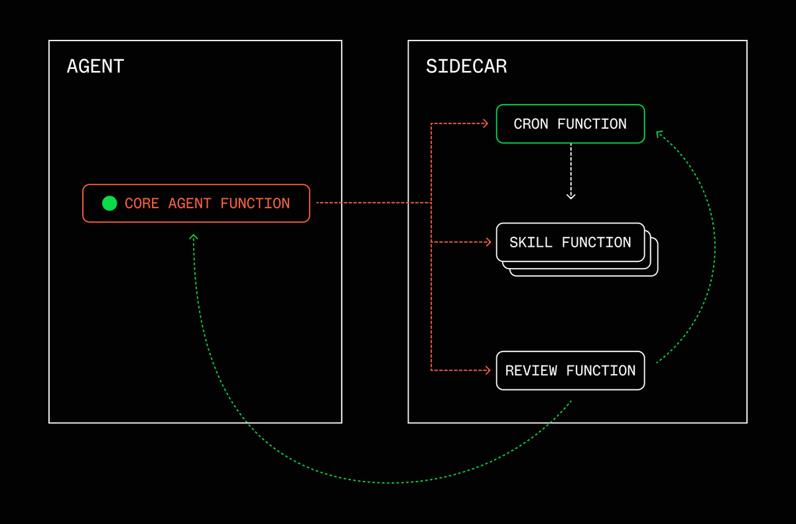
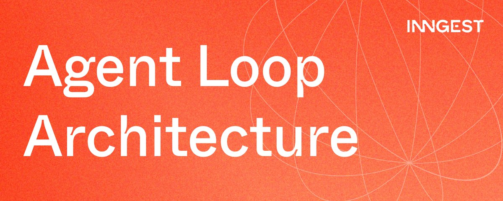

# 📰 The Agent Loop Architecture

Everyone's asking "WTF is a loop?" Here's the question nobody's asking: what runs the loop?

The AI discourse has converged on loops as a core primitive of agentic systems. Matt Van Horn (@mvanhorn) traced the [lineage of agent loops](https://x.com/mvanhorn/status/2063865685558903149) from ReAct to tool-use to orchestration loops to loops supervising loops. Addy Osmani (@addyosmani) broke down the [building blocks inside loops](https://addyosmani.com/blog/loop-engineering/): automations, worktrees, skills, connectors, sub-agents. Van Horn landed on durability, arguing that loops which can't survive a restart aren't loops. Osmani's key thread was orchestration: design the system that prompts the agent instead of you.

I want to take their points further. Durability isn't just a property of the loop. It's the entire execution layer underneath it. The important fact is that durable orchestration is fundamental to building your agent loop architecture. Let's break down that architecture.

# Where loops break

The /loop and /goal patterns handle single-agent, single-session work well. An agent loops until a task is done. That covers a lot of ground. But the next stage (Stage 5 in Van Horn's framing) is where it falls apart:

- Loops supervising other loops

- Loops running on schedules, not just triggered by a human

- Loops that survive process restarts, deploys, and crashes

- Loops that spawn sub-agents and wait for results (sometimes hours later)

- Loops that need to be observable after the fact

That's not a prompting problem. That's an infrastructure problem.

Van Horn cites [@runes\_leo](https://x.com/runes_leo): "The costliest thing in AI coding is no longer writing code, it's managing the agent loop." A while True in a terminal doesn't give you any of this. Neither does a long-running process on a VM or sandbox.

Think about what happens when you run an agent loop on a server. The process will die or restarts. A deploy, an OOM, a spot instance reclamation. The loop restarts. But what was it doing? Which step was it on? Did it already send that Slack message? Did it already invoke the sub-agent?

You don't know. It starts over. Re-fetches data it already had. Re-calls the LLM for decisions it already made. Sends a duplicate notification. Spawns a duplicate sub-agent. You wake up to three identical Slack messages and a confused team.

The fix isn't "better error handling" — it's an execution model where each step is [checkpointed](https://www.inngest.com/docs/setup/checkpointing), each decision is persisted, and recovery means resuming from the last successful step.

# The agent loop architecture in three layers

Three layers. Each one maps to a concrete primitive.

## Layer 1: The Loop

A loop is a cron plus a decision-maker. It runs on a schedule (or a trigger), evaluates state, and decides what to do next.

This is Van Horn's definition made concrete: what cron never had is the decision in the middle. The agent decides, not you. The cron is the heartbeat. The LLM is the decision-maker. Steps are the durable execution that checkpoint progress.

\`\`\`typescript
export const infraHealthCheck = inngest.createFunction(
  { id: "infra-health-check" },
  { cron: "\*/30 \* \* \* \*" }, // Every 30 minutes
  async ({ step }) =&gt; {
    const metrics = await step.run("fetch-service-metrics", async () =&gt; {
      return await fetchServiceMetrics(); // error rates, latency, memory, CPU
    });

    const assessment = await step.run("assess-health", async () =&gt; {
      return await callLLM({
        prompt: \`Given these service metrics, classify overall system health
                 as "normal", "degraded", or "critical". Explain your reasoning.
                 Metrics: ${JSON.stringify(metrics)}\`,
      });
    });

    if (assessment.status === "degraded" \|\| assessment.status === "critical") {
      await step.invoke("triage-incident", {
        function: incidentTriage,
        data: { metrics, assessment, services: assessment.affectedServices },
      });
    }
  }
);
\`\`\`

Every Monday at 9am, the loop fires. It fetches data, asks the LLM whether a report is warranted, and invokes a skill if yes. If the process restarts between steps, the already-completed steps don't re-execute. That's the loop. Not the LLM, the loop around the LLM.

## Layer 2: The Skill

In this context, a skill is not a prompt. It's a durable workflow. Multi-step, retryable, composable, independently deployable.

Van Horn: "The loop is plumbing. The asset is the skill it calls." This is the part that compounds. Each new skill the system learns makes every loop more capable.

\`\`\`typescript
export const incidentTriage = inngest.createFunction(
  { id: "incident-triage", retries: 3 },
  { event: "infra.incident.triage" },
  async ({ event, step }) =&gt; {
    const details = await step.run("fetch-detailed-metrics", async () =&gt; {
      return await fetchDetailedMetrics({ services: event.data.services });
    });

    const deploys = await step.run("fetch-deploy-history", async () =&gt; {
      return await fetchRecentDeploys({ since: hoursAgo(2) });
    });

    const analysis = await step.run("correlate-incident", async () =&gt; {
      return await callLLM({
        prompt: \`Correlate these service metrics with recent deploys.
                 Identify the likely root cause and severity.
                 Metrics: ${JSON.stringify(details)}
                 Recent deploys: ${JSON.stringify(deploys)}\`,
      });
    });

    await step.run("post-triage-summary", async () =&gt; {
      await slack.postMessage({
        channel: "#incidents",
        text: formatTriageSummary({
          analysis,
          affectedServices: event.data.services,
          recommendedActions: analysis.recommendations,
        }),
      });
    });

    return analysis;
  }
);
\`\`\`

This skill fetches, classifies, and routes. It's a unit of work with built-in fault tolerance. The skill can be an AI workflow with an LLM in the middle or deterministic code.

## Layer 3: The Orchestrator

The orchestrator is the engine that runs everything: schedules crons, executes steps, manages retries, enforces concurrency limits, stores run history, and hot-deploys new functions/workflows without disrupting running ones.

This is the layer nobody talks about because it's supposed to be invisible. But it's foundational.

Most people think about agents as "LLM + tools." The agent loop architecture re-frames this as agents are "loops + skills + orchestration." The LLM + tools are inside the loops. LLMs and tools can be swapped or tweaked while the architecture remains. The orchestration enables the architecture.

# What happens when things break

The happy path is easy. But this is software running in production, do things every really go according to plan?

Your incident triage skill fires and the metrics API times out. The read had to go to disk and the in-memory cache didn't have the data. The step calling this API now retries and hits the API again. The data is now partially cached and the API completes. The skill continues with the next step like nothing ever happened.

Sometimes, it may not be as simple as that. What if an API key expires, or your hosting provider is down for 30 minutes. All of your retries are exhausted. Now what happens? You have to also handle failures.

\`\`\`typescript
export const incidentTriage = inngest.createFunction(
  {
    id: "incident-triage",
    retries: 3,
    onFailure: async ({ error, event, step }) =&gt; {
      // The function failed after exhausting retries.
      // We still have the original event data. Nothing is lost.
      await step.run("notify-failure", async () =&gt; {
        await slack.postMessage({
          channel: "#agent-ops",
          text: \`⚠️ Incident triage failed: ${error.message}. \` +
                \`Will retry on next health check cycle. \` +
                \`Affected services: ${event.data.services.join(", ")}\`,
        });
      });
    },
  },
  { event: "infra.incident.triage" },
  async ({ event, step }) =&gt; {
	/\* the same logic as the skill above \*/
  }
);
\`\`\`

The \`[onFailure](https://www.inngest.com/docs/reference/typescript/v4/functions/handling-failures)\` handler fires after all retries are exhausted. It posts to an ops channel so someone knows. The event is preserved, nothing is lost. The next scheduled run picks up where the failed one couldn't.

Durable orchestration must give you step-level retries for transient errors and failure handling hooks for non-recoverable errors. Without this, things break (as they do), and you find out hours or days later.

Transient errors are also expensive. If your skill or agent retries from the beginning, you're calling LLMs multiple times and burning tokens unnecessarily. The LLM call can be checkpointed. Now multiply this by 10, or 30, agents across your system. That's expensive.

Step-level checkpointing isn't just a correctness feature. It's a money saver.

## The agent that builds its own skills

This is where it gets more interesting. The system is not static, it is designed to evolve and extend itself.

The agent doesn't just run inside loops — it authors new loops and registers them with the orchestration engine. Each deployed function is a durable skill that runs independently, triggerable from a loop or agent or running on a schedule, with its own retry logic. Skills compound.

It's an orchestration-aware agent.

Here's how it works. An AI agent has access to the orchestration SDK as a tool. It can write new functions, register them with the engine, and they start running immediately. The agent process hot-reloads new functions without restarting or disrupting in-flight runs.

Walk through a concrete example:

1\. A human expresses a need. Engineer says: "Our services keep having latency spikes overnight and nobody notices until morning." This is the trigger. The agent doesn't need to infer a vague pattern from ambient data. It has clear instructions.

2\. Agent writes a skill. Two multi-step functions: a health check loop that runs every 30 minutes, pulling error rates, latency, and resource usage, with the LLM classifying system health as normal, degraded, or critical. And an incident triage skill that fetches detailed metrics and recent deploy history, correlates root causes with an LLM, and posts a triage summary to Slack with recommended actions. Error handling: if the metrics API is down, back off and retry. If the LLM fails, fall back to rule-based severity classification.

3\. Agent deploys the skill. The agent writes the function code that's picked up by a sidecar process. The new functions are registered automatically. They're live immediately, with no deploy pipeline, no PR.

4\. Skill runs autonomously. Every 30 minutes, the engine triggers the health check. If something's wrong, it invokes the triage skill. No human in the loop. Fully durable.

5\. Agent iterates on signal. This is the part people gloss over, so let me be specific about what "iterates" means. The agent doesn't magically notice patterns. It has a separate review loop: a cron-triggered function that runs weekly, reads the run history from the orchestrator, and evaluates performance:

\`\`\`typescript
export const reviewSkillPerformance = inngest.createFunction(
  { id: "review-skill-performance" },
  { cron: "0 10 \* \* 5" }, // Every Friday at 10am
  async ({ step }) =&gt; {
    const runs = await step.run("fetch-run-history", async () =&gt; {
      return await getInngestRuns({
        functionId: "incident-triage",
        since: daysAgo(7),
      });
    });

    const analysis = await step.run("analyze-performance", async () =&gt; {
      const successRate = runs.filter(r =&gt; r.status === "completed").length / runs.length;
      const avgDuration = average(runs.map(r =&gt; r.duration));
      const incidents = await fetchIncidentOutcomes(); // Did incidents correlate with actual outages?

      return await callLLM({
        prompt: \`Review this skill's performance over the past week.
                 Success rate: ${successRate}
                 Avg duration: ${avgDuration}ms
                 Incidents correlated with real outages: ${incidents.confirmed}/${incidents.total}
                 False positives: ${incidents.falsePositives}
                 Team acted on alerts: ${incidents.actedOn}/${incidents.total}
                 
                 Should we adjust thresholds or classification? What specific changes?\`,
      });
    });

    if (analysis.shouldModify) {
      await step.invoke("update-skill", {
        function: coreAgent,
        data: { prompt: \`Update the incident-triage skills based on the following proposed changes: ${analysis.proposedChanges}\` },
      });
    }
  }
);
\`\`\`

The "review" is a function. It reads run history, checks whether incidents correlated with actual outages, and feeds that signal to the LLM. If the health check keeps flagging a service as degraded but the team ignores it because the thresholds are too sensitive, the review loop catches it, and the skill gets updated to adjust the classification. Not magic. A cron job with an LLM in the decision seat.

What about validation? The agent writing code is only as good as the guardrails around it. The code can be type checked. The agent can invoke the function itself to test it as it's able to interact with the orchestration engine itself. While it's not bulletproof, you are giving the core agent the ability to debug the skills it writes natively within the system it operates. The review loop catches issues that aren't caught with the initial debugging.

Taking this a degree further, the agent can use onFailure hooks to trigger itself to evaluate a given failure itself. It's a feedback loop that keeps improving.

What about conflicts? Flow controls, specifically, concurrency controls or singletons handle the simple case (concurrency: \[{ limit: 1, key: "event.data.service" }\]) meaning only one incident triage runs at a time per service. But the deeper question is: what if two health checks both detect issues in the same service simultaneously? The orchestrator queues them. Second triage waits until the first completes. No duplicate alerts, no race conditions. This isn't theoretical. It's the same concurrency primitive you'd use in any job queue.

The agent isn't just executing tasks. It's building infrastructure for itself. Each skill persists beyond the conversation that created it. Kill the agent process and restart it. The skills keep running. Swap the underlying model. The skills keep running. The agent is ephemeral — its output is durable.

## The developer's view

This matters because if the developer can't see what the agent deployed, debug what broke, and audit what ran at 3am, the whole architecture is a major liability.

The orchestration engine stores every run, every step, every input, every output, every retry. A skill the agent deployed last Tuesday that failed at 4am? You can see exactly which step failed, what the input was, what error it threw, and how many times it retried before giving up. [Full traces down to the step](https://www.inngest.com/docs/platform/monitor/traces) level are the output of the orchestration engine itself.

This isn't a dashboard bolted on after the fact. It's inherent to durable execution. Every step.run() is a checkpoint. Every checkpoint is observable. When the thing that wrote the code isn't a human, observability isn't a nice-to-have — it's the trust layer.

Day-to-day, the developer's workflow looks like this: check the runs dashboard in the morning. See which skills ran overnight, which succeeded, which failed. If a skill the agent wrote is misbehaving, you can read the code directly, edit it, delete it, or tell the agent to fix it. The agent authored it, but you own it. The agent and its skills are still a garden that you should tend to.

## Why durability is foundational

Van Horn: "These things have to survive a restart."

Here's what durability means in practice:

\| Requirement                     \| What it means                                                                    \| Why basic while loop fails                       \|
\| ------------------------------- \| -------------------------------------------------------------------------------- \| ------------------------------------------------ \|
\| \*\*Independent step retry\*\*      \| If step 3 of 5 fails, retry step 3, not steps 1 and 2                            \| A loop restart re-runs everything from scratch   \|
\| \*\*Sub-agent lifecycle\*\*         \| Spawn a child task, wait for it (maybe hours), cancel if the parent is cancelled \| No built-in parent-child lifecycle management    \|
\| \*\*Guaranteed event delivery\*\*   \| If an event fires while the agent is down, it should still be processed          \| Events are lost if the process isn't running     \|
\| \*\*Post-hoc observability\*\*      \| See what happened after the fact: every step, every decision, every retry        \| Logs are your only option, and they're ephemeral \|
\| \*\*Hot-deploy without downtime\*\* \| Deploy a new function version without killing in-flight runs                     \| Process restart kills everything                 \|
\| \*\*Concurrency control\*\*         \| Only run N instances of a skill at a time                                        \| No built-in concurrency primitives               \|

"Just run it in a container" gets you uptime. It doesn't get you correctness. A container that restarts after a crash brings the process back, but every in-flight loop starts over. Every step re-executes. Every LLM call is re-made. The loop looks like it's running, but it's running blind.

How this compares to existing tools

Some tools may offer you a "pretty" turnkey solution to this type of system or you might choose to cobble together some lower level tools and create your own system. Neither choice is wrong, but the right architecture layer should allow you, and your agent, to evolve over time. Flexible, dynamic, durable.

Durable execution primitives that fit nicely for an agent, that and agent can easily write, and the observability and APIs to observe and enable the agent itself to be orchestration aware.

## A working example

We're testing these patterns internally at Inngest and you can see a concept of this in the "utah" project repo here: [https://github.com/inngest/utah](https://github.com/inngest/utah): It's an [agent harness](https://www.inngest.com/blog/your-agent-needs-a-harness-not-a-framework) built on top of Inngest's durable orchestration that also is orchestration-aware.

The system has a sidecar process that enables the main agent to write and edit Inngest functions in it's own workspace, extending itself with "skills" (in the context of this article). Soon, we're planning to provide an entire system with starter loops as examples, but the ideas there can demonstrate the ideas in this article a bit more clearly.

## The compounding loop

Satya Nadella's [recent post](https://x.com/satyanadella/status/2066182223213293753) named something the industry has been feeling: the moat isn't the model — it's the loop.

His framing: there are two types of capital. Human capital, the knowledge and judgment your team built over years. And what he calls token capital, the AI workflows, decision patterns, and learned skills a company builds on top of foundation models.

The thesis: these compound together. Every improved workflow generates better signal. Better signal produces sharper AI behavior. Sharper behavior frees up human attention for higher-judgment work. A hill climbing machine.

This is what the agent loop architecture enables concretely:

- Every durable skill the agent deploys is institutional knowledge encoded as executable infrastructure. It persists. It runs whether or not a human is watching.

- A cron-triggered review loop that evaluates skill performance and iterates. That's the hill climbing machine made real. Not a flywheel diagram in a deck. A function with a cron trigger.

- If your skills die on process restart, the compounding resets to zero. Durability is what makes the investment persist.

Nadella's key point: "A company should be able to switch out a 'generalist' model without losing the 'company veteran' expertise built into their learning system." That's the skill library pattern. Durable functions don't care which LLM calls them.

## Build accordingly

The conversation has been about what agents do: loops, tools, reasoning, context engineering. The next conversation is about what runs the agents.

Three layers: loop, skill, orchestrator. The loop is the unit of work. The skill is the asset. The orchestration engine is what makes both durable. The sidecar pattern is the model: an agent writes its own durable skills, deploys them, reviews how they perform, and iterates. Not a thought experiment. It's a working model.

We built [Inngest](https://www.inngest.com/) to be the orchestration engine for this: step.run(), step.invoke(), cron triggers, event-driven control flow, concurrency controls, and full step-level observability. But the architecture pattern is bigger than any single tool. If you're building agent loops in production, define the three layers.

The primitives exist today. Build accordingly.

### 🖼️ Attached Media

## 💬 Replies

### 1 @charlesjavelona (Charles Javelona)

*Thu Jun 18 22:36:13 +0000 2026*

@djfarrelly Great read! I use your tool for heavy orchestration for tracing what happened.

### 2 @djfarrelly (Dan Farrelly) (Author)

*Fri Jun 19 13:15:50 +0000 2026*

@charlesjavelona Great to hear - are you building agents or another use case?

### 3 @corelumen (Nicholas Blanchard)

*Fri Jun 19 09:43:16 +0000 2026*

llmff was built for the first two layers:

\- op: loop with first-class break\_on conditions, validation, and repair stages so loops have real, enforceable constraints instead of just retrying until the model feels done.

\- Typed stages that compose into reusable Skills (infer + retrieve + tool + validate + route, etc.).

\- Full per-iteration tracing and llmff inspect so you can actually audit and verify what the loop is doing before and during execution.

\- Multi-agent loop support so you can have loops supervising other loops with shared state and validation.

Hand the workflow definitions to an orchestrator (Inngest, Temporal, etc) for production durability.

Repo: [github.com/syndicalt/llmff](https://github.com/syndicalt/llmff)

### 4 @djfarrelly (Dan Farrelly) (Author)

*Fri Jun 19 13:15:16 +0000 2026*

@corelumen Interesting - will check it out!

### 5 @itsmeraz (రాజ్)

*Fri Jun 19 04:56:59 +0000 2026*

@djfarrelly Good one @djfarrelly.
Maybe a naive question, isn’t going to be a costly affair to have these loops running continuously?

### 6 @djfarrelly (Dan Farrelly) (Author)

*Fri Jun 19 10:55:35 +0000 2026*

Yeah, naturally it can be expensive, so observability becomes very important - especially token usage. The nice part about the agents-writing-workflows approach is that they can also write deterministic code that doesn’t require an LLM call or use a cheaper model for those “skills” to save on costs.

### 7 @shawkatkabbara (shawkatkabbara)

*Fri Jun 19 18:12:32 +0000 2026*

@djfarrelly Did you guys try to use @temporalio for task execution and loop execution durability? How does your platform compare to that?

### 8 @djfarrelly (Dan Farrelly) (Author)

*Fri Jun 19 20:40:40 +0000 2026*

@shawkatkabbara @temporalio No temporal. @inngest provides flexible durable execution with an easy to use SDK and flow control (concurrency, throttle, singleton, rate limit, etc) as well as full observability built in. It’s a superset of temporal’s functionality

### 9 @KSimback (Kevin Simback 🍷)

*Fri Jun 19 05:56:35 +0000 2026*

@djfarrelly Great stuff, used some of this as inspiration for a tool I’m building

### 10 @rep_hq (REP)

*Fri Jun 19 09:08:02 +0000 2026*

@djfarrelly great read!

### 11 @gerardsans (Gerard Sans | Axiom 🇬🇧)

*Sat Jun 20 01:32:08 +0000 2026*

@djfarrelly [x.com/gerardsans/sta…](https://x.com/gerardsans/status/2068058164801532001)

### 12 @gerardsans (Gerard Sans | Axiom 🇬🇧)

*Fri Jun 19 15:43:24 +0000 2026*

@djfarrelly Mythos AI OS &gt; Loops

### 13 @mycomputerspot (MyComputerSpot)

*Thu Jun 18 23:57:01 +0000 2026*

@djfarrelly The autonomous deploy step is where I start looking for brakes. If a skill can go live immediately, rollback and owner visibility need to be first-class.

### 14 @thecryptiquebro (Parth)

*Fri Jun 19 13:10:42 +0000 2026*

@djfarrelly [x.com/thecryptiquebr…](https://x.com/thecryptiquebro/status/2067365353051848765?s=46&t=AO-Xnxx8AIXt_0q7ooFHVg)

### 15 @d__el (Killswitch Engineer)

*Fri Jun 19 13:59:08 +0000 2026*

@djfarrelly Question 1: "WTF is a loop?"

\[ builds loops \]

\[ tells friends code built while he sleeps \]

Question 2: "𝗪𝗲 𝘀𝗽𝗲𝗻𝘁 𝗵𝗼𝘄 𝗺𝘂𝗰𝗵 𝗼𝗻 𝘁𝗼𝗸𝗲𝗻𝘀?!"

### 16 @noodle_saint_7 (William Stoner)

*Fri Jun 19 14:33:57 +0000 2026*

@djfarrelly Thanks for this - I have been playing with the loop and it often gets stuck in hung process which until I asked for an update, do not get discovered.

### 17 @markldevine (Mark L Devine)

*Fri Jun 19 12:51:15 +0000 2026*

@djfarrelly Providing operating-system-level features, broader than singular 'Tools', could be designated as 'Facilities'.  Or 'OperatingSystem' eventually.

### 18 @getpochi (Pochi)

*Sun Jun 21 07:39:03 +0000 2026*

@djfarrelly the runtime answer flips by agent class. SaaS-action agents can replay because the World rolls back through idempotent API calls. coding agents cant

### 19 @ztacts (猫老哥·AI)

*Sun Jun 21 13:25:14 +0000 2026*

架构图很清楚，但缺一个关键模块，就是「loop 怎么知道该停」。

我跑 twitter pipeline 一个月，最大的坑就是 termination condition 写错。要么没完没了烧 token，要么刚跑出结果就被 kill。

后来加了一层独立 validator agent，不参与 loop，只判断输出是否合格。token 涨了 40%，但返工率从 35% 降到 8%。

### 20 @itsme_seenu (Srinivas Reddy)

*Fri Jun 19 16:51:19 +0000 2026*

@djfarrelly ❤️

### 21 @LacerdaAnil (Anil Lacerda)

*Fri Jun 19 07:36:56 +0000 2026*

@djfarrelly loop is good...

