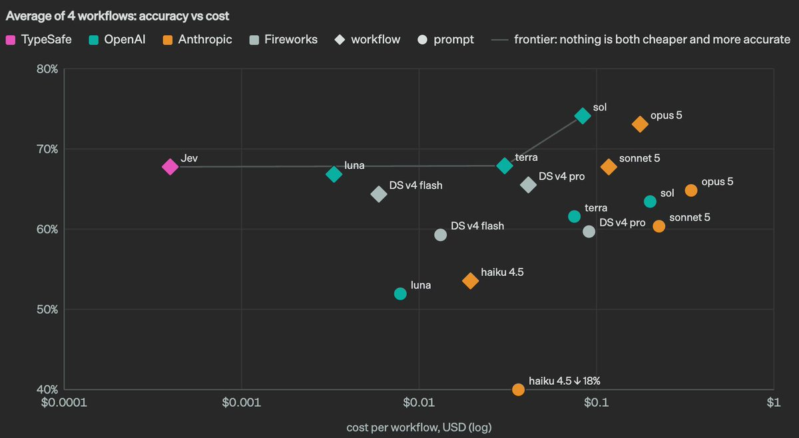
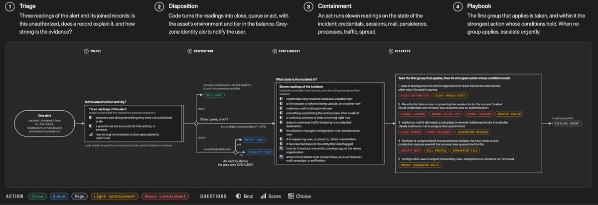
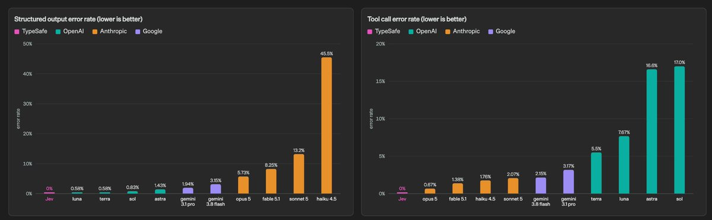

# How to master Jev (Full Guide) 

TypeSafe just released the strongest model, and it introduced a completely different way to put intelligence inside software...

Jev is in a category of its own right now, not because it writes better than Fable or codes better than Astra, but because it does not try to do either

out of the box it's an insanely fast decision engine, exceptional at classification, routing, scoring and verification... it turns messy information into typed answers your software can act on immediately

and if you understand the methods, the primitives and the architecture behind it, you can put intelligence inside parts of your product that were previously too slow, expensive or unreliable to automate

people are calling it the first real model built for machines for a reason...

so this is the full course

what Jev is actually exceptional at, how to use it beside your existing LLMs, the question patterns that pull the best results out of it, the confidence gates that stop bad decisions, and the five workflows where it can make or save real money

one note: Jev is still in early access, English is currently its strongest language, and the current stable model is jev-1.13.0

this is early software, so test it on your own data before you let it touch anything expensive

but if you want to understand the model everyone is suddenly talking about, start here

# what this model is exceptional at

before the methods, meet the machine... five things Jev does differently from the LLMs you're used to:

## it makes decisions instead of writing answers

give it a piece of state and a set of possible outcomes, and it returns the decision in a type your software already understands

no essay, no markdown, no hoping the JSON parser survives... you get a choice, a score or a probability

that sounds smaller than an LLM until you realize how much software is really just thousands of decisions connected together

## it tells you when it isn't sure

every Choice and Score comes back with confidence, while Noul returns the probability that a condition is true

that means uncertainty can become part of the architecture instead of something the model hides behind confident language

high confidence can act, medium confidence can ask a stronger model, and low confidence can go to a person

## it evaluates in parallel

ask thirteen independent questions about the same support ticket and Jev evaluates them against the state in one call

the questions do not need to wait for one another, and adding more barely changes the response time

you can check urgency, refund intent, frustration, product area, churn risk and abuse at once... then let code decide what happens next

## it fits inside normal software

Jev does not ask to become your entire application

it behaves more like a frontier-intelligence function call: unstructured state goes in, typed probabilistic decisions come out

your code keeps control of the workflow, which means the model cannot invent a new branch, tool or output type halfway through the run

## it's cheap enough to use everywhere

TypeSafe prices Jev 1.13 at $0.042 per million input tokens, with output tokens free

its own published tests report response times around 70–500ms and gains of up to 193.6x in speed and 444.6x in cost on the workflows it tested

those are TypeSafe's numbers, and the company itself says they are probably near the high end of real-world gains... but the important part survives the disclaimer

decisions that were previously too expensive to run on every event can now sit inside the product loop

# the cockpit: every control you need

sixty seconds of setup, then the controls

open the TypeSafe Playground and paste any text into state

then add one of three questions:

> Choice picks one option from a fixed list

> Score places the state on an ordered rubric

> Noul returns the probability that one statement is true

when you're ready to put it inside a product, call POST /v1/systemone, install the Python or JavaScript SDK, or add TypeSafe's skill to your coding agent

use jev-latest if you want the SDK to follow the newest stable release

use jev-1.13.0 if you have tuned thresholds and need the same model behavior to stay pinned

that's the whole cockpit

the rest of this course is knowing which decision to hand it, and which decisions should stay in code

# the main event: run Jev as the judge, not the writer

the single biggest upgrade is a role change

stop prompting Jev like it's another chatbot... make it the decision layer underneath your system, because this model is worth more choosing what should happen than trying to produce the final artifact

the setup:

> your LLM creates: Astra, Fable, Sol or whatever comes next still writes the code, email, report or answer

> Jev decides: it classifies the request, scores the risk, chooses the correct route and checks the output against explicit criteria

> code controls: thresholds and business rules decide whether the system acts, retries, escalates or stops

> a human catches the edge cases: low-confidence and high-risk decisions go to review instead of being forced through automation

why this works: LLMs are flexible because they can generate anything, but that freedom is exactly what makes them difficult to bury inside a dependable workflow

Jev gives up string generation and gains a much narrower contract... the available answers are defined before the request starts, every result fits the schema, and uncertainty is visible

and the economics work in your favor

the expensive model only handles the moments that genuinely require generation or long reasoning, while Jev handles the repeated judgments around it at a fraction of the latency and cost

# build your decision layer

the judge setup needs questions, and a good question takes two minutes to write

every call contains one shared state and a set of independent questions: the instruction, the answer type and the criteria that define each possible result

that's the entire mechanic... Jev reads the same state once and answers every question against it in parallel

a complete support-triage call looks like this:

{
  "state": "I've tried connecting Stripe for three days. I'm losing sales and need this fixed today.",
  "model": "jev-1.13.0",
  "questions": {
    "department": {
      "type": "choice",
      "instructions": "Which team should own this ticket?",
      "criteria": {
        "billing": "Payments, charges or subscription issues",
        "technical": "Bugs, broken behavior or integration failures",
        "sales": "Pricing, plans or pre-purchase questions"
      }
    },
    "frustration": {
      "type": "score",
      "instructions": "How frustrated does the customer appear?",
      "criteria": [
        "Calm",
        "Frustrated but civil",
        "Extremely frustrated"
      ]
    },
    "urgent": {
      "type": "noul",
      "instructions": "The customer needs a time-sensitive resolution"
    }
  }
}

the confidence gate matters more than any individual question

a wrong decision is still possible, even when the output type is always valid... confidence is what lets the surrounding system decide how much autonomy that answer deserves

three rules that keep the layer reliable:

> one question, one judgment... split broad decisions into independent pieces

> keep arithmetic and hard rules in code... Jev judges meaning, your program calculates numbers

> every uncertain answer gets a route... never treat low confidence as if it were a normal result

and if you already use coding agents, TypeSafe ships a skill for Claude Code, Codex and other agent environments, so the agent can build this architecture without pretending Jev is a normal LLM

# secret 1: don't prompt it like a chatbot

everything you learned about getting beautiful prose from an LLM is irrelevant here

personas, step-by-step scripts, long motivational preambles... those techniques are meant to steer a text generator, and Jev is not generating text

Jev is naturally good at fast, common-sense judgments when the possible answers and their boundaries are clear

so give it three things and get out of the way:

> the state it needs to judge

> one atomic question

> exact criteria for what each answer means

that last part matters more than people expect... descriptive criteria reliably beat vague labels

and two things to avoid, because both fight the model:

> don't ask it to explain itself... it returns a decision, probabilities and confidence, not a paragraph of reasoning

> don't hide multiple judgments inside one question... "is this lead valuable, urgent and likely to buy?" should be three questions whose outputs are combined in code

# secret 2: keep the state clean

state is the information Jev evaluates, and it is the closest thing this model has to a working world

the instinct is to dump everything into it... resist that, because relevant state beats maximum state on this model

three sections are usually enough:

> the object being judged: the ticket, lead, document, prompt or output

> the context needed to interpret it: product, customer, policy or goal

> the facts that materially change the decision

remove duplicated logs, irrelevant history and conclusions you want the model to reach

Jev 1.13 has a 64k request limit, but its own documentation says accuracy can shift as state grows

the smaller useful state is the upgrade

# secret 3: abuse parallel questions and confidence gates

this is where Jev stops being a classifier and becomes an intelligence layer that can run across an entire product

parallel questions: send every independent judgment that might be useful, even if the code will only use some of them later

one call can label intent, risk, urgency, sentiment, relevance and required action against the same input

the craft is making each question impossible to blur:

> define visible boundaries: "technical = broken behavior or integration failure" is better than "choose the right team"

> use rubrics for gradients: severity, quality and fit belong in Score, not a forced yes/no

> keep one meaning per question: if the answer depends on two unrelated facts, decompose it

confidence gates decide what happens after the answer

for example: act automatically above 0.85 confidence, send 0.55–0.85 to a stronger model, and put anything below 0.55 into a human queue

the exact thresholds need to come from tests on your own data, not from an article

between parallel questions and confidence routing you can put Jev on every event without pretending every event deserves the same treatment

millions of tiny decisions, with the uncertain ones automatically pulled out before they become expensive mistakes

# how to one-shot a real workflow

everything above, assembled once, on a real product

the example is a support router that detects urgency and churn risk, but swap in leads, listings, claims or documents and the sequence holds

## step 1, the state

your system sends one object:

customer plan: Pro
account age: 14 months
message: "the app deleted my work again. cancel me if this isn't fixed today"
previous tickets: 3 technical issues in 30 days

keep facts in, guesses out

## step 2, the questions

ask for department with Choice, frustration with Score, and urgency, cancellation intent and refund intent with separate Nouls

read the results once, cut any question that never changes an action, then pin the version

## step 3, the gate goes to work

high-confidence technical issues route to support, high cancellation probability adds the retention queue, and uncertain routing goes to review

the model does not send the reply

it decides which system should

## step 4, the worker

now the correct worker receives the ticket: a deterministic action, a specialist LLM, an internal agent or a person

if an LLM writes the response, Jev can evaluate that draft for policy compliance, whether it answers the request, and whether it contains a prohibited promise

## step 5, the review

log the versioned model ID, probabilities, confidence, chosen route and final outcome

review false positives and false negatives, adjust criteria and thresholds, then run it again

first time through takes an evening

the second time you'll realize the architecture is the same for every fuzzy decision your team still handles with brittle rules... which is exactly what the next chapter is about

# the five workflows where it makes real money

now point the whole setup at something worth automating

these five are where Jev can make a difference you can actually measure:

the universal verifier: place Jev around every expensive LLM call

check the prompt for injection, the chosen tool for obvious errors, the output for missing requirements and the final answer for unsupported claims... cheap checks around an expensive brain

the support control tower: classify tickets, detect urgency, frustration, refunds and churn, then route each conversation to the correct queue

the win is not a prettier reply... it's fewer tickets in the wrong place and fewer valuable customers missed

the lead qualification engine: evaluate company fit, maturity, pain, intent and urgency as separate signals

combine the probabilities with your own weights, send the best leads to sales, nurture the middle and leave the rest alone

the model router: decide whether each request needs deterministic code, a cheap model, a frontier model or a human

Jev becomes the traffic controller, so the expensive model is used where it earns its cost instead of receiving every request by default

the giant dataset job: run the same semantic judgments across support logs, reviews, listings, transcripts, research papers or agent traces

extract structured features, detect patterns and rank the records worth inspecting... the kind of analysis that becomes possible only when each decision is fast and almost too cheap to count

each of these used to require either brittle keyword rules or an LLM call you could not afford to run a million times

each one is a Jev workflow now

# the whole setup in one block

> run Jev as the judge: LLMs generate, Jev decides, code controls, humans catch uncertainty

> don't chat with it: state + atomic question + explicit criteria

> keep state clean: only the object, the context and the facts that change the judgment

> abuse parallel questions: evaluate every useful dimension in one call, then combine results in code

> gate every action by confidence: automate the obvious, escalate the uncertain, review the dangerous

> point it at the five workflows: verification, support, leads, model routing and giant datasets

Jev is not the model that replaces every other model

it's the model that can decide when, where and whether the others should run... and that might end up being far more valuable
