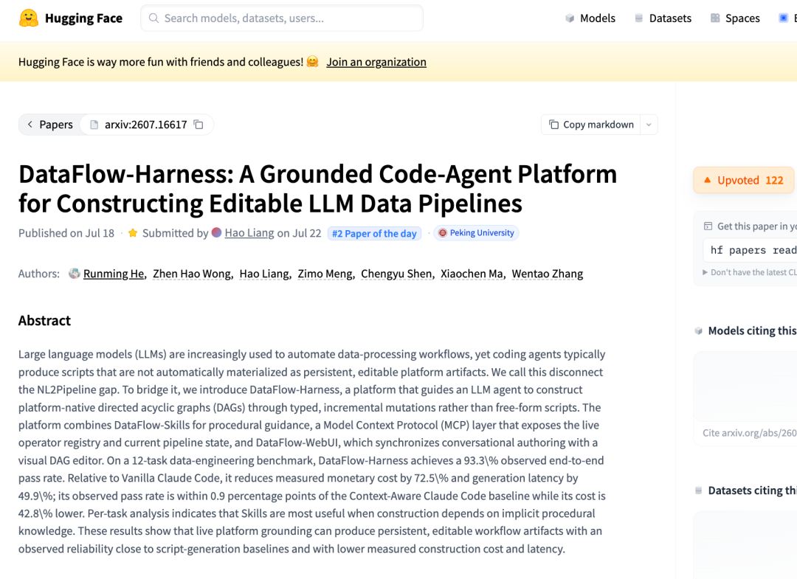
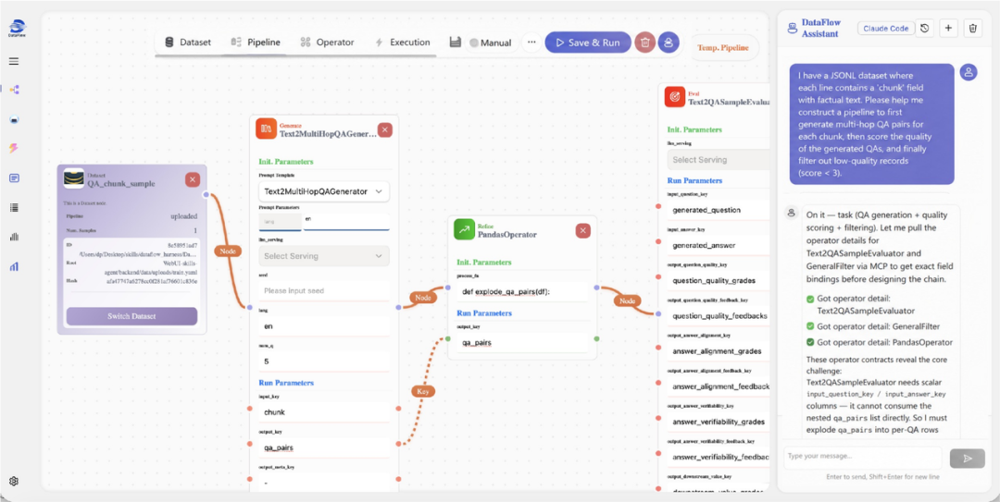
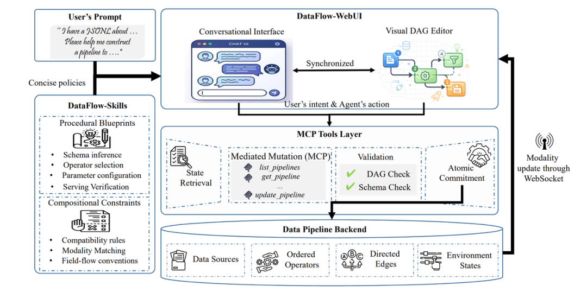
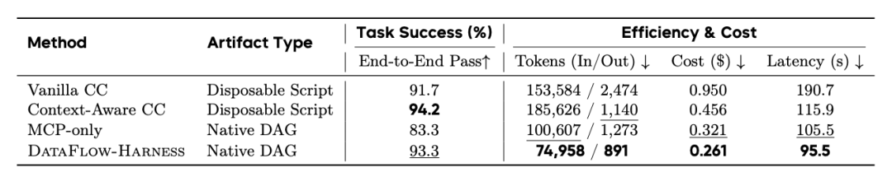
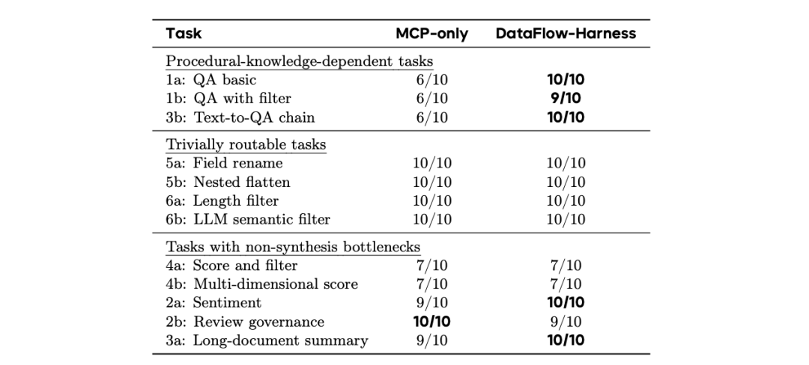
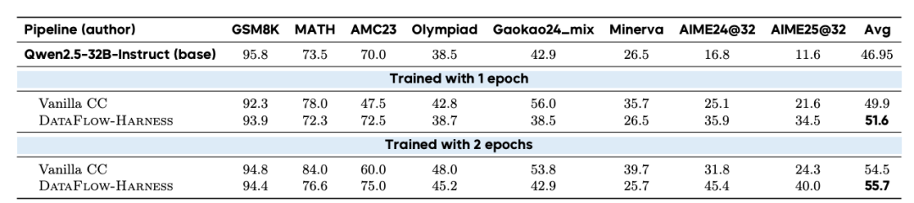
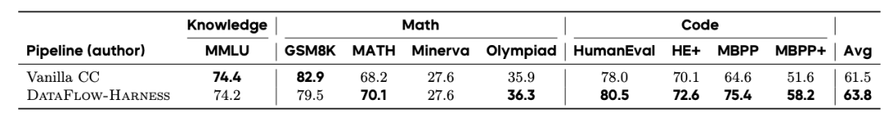

# 📰 AI 数据最难搞的 Harness 工程，被北大开源了

 Datawhale干货

### 作者： 北大 OpenDCAI 团队

大模型训练、微调和 RAG 知识库建设，不论怎么选技术路线，都绕不开数据准备。而准备一份高质量的 AI-ready 数据集，恰恰是 LLM 落地最难啃的骨头。

一个看似简单的需求，比如“从一批 PDF 教材中抽取高质量 VQA 数据集”，往往并不是一次模型调用能解决的任务。它需要解析文档、恢复版面、识别图片和表格、对齐问题与答案、过滤低质量样本、统一字段格式，最后还要产出 AI-ready 的数据集。每一步都可能依赖不同算子、schema、质量标准和执行环境。

目前常见的解决方式还是由工程师手搓脚本，或者交给 Code Agent 生成一次性脚本后再拼接，但这两种方式在流程复用、平台审计、可视化编辑和长期治理上都存在明显短板，难以输出高质量数据集，最终影响应用效果。

这正是 DataFlow-Harness 试图解决的问题。

北京大学 DCAI 团队联合上海算法创新研究院、北京中关村学院，发布最新工作成果《DataFlow-Harness: A Grounded Code-Agent Platform for Constructing Editable LLM Data Pipelines》，上线后登上 HuggingFace Papers 榜单 [#2]() Paper of the day。



论文提出了一个核心概念：NL2Pipeline gap——用户表达的是自然语言工作流意图，而生产环境需要的是可检查、可编辑、可复用的平台原生流水线，二者之间存在鸿沟。因此，团队基于 DataFlow 开源生态，叠加了 Harness 工程约束，让 Agent 在真实平台的边界内做数据处理，输出可检查、可编辑、可复用的平台原生 Pipeline。

DataFlow-Harness 的平台交互入口是 DataFlow-WebUI，它同时提供了两种操作方式——用户既可以在对话窗口里用口语描述需求，让 Agent 自动搭建工作流；也可以直接在 DAG 画布上拖拽、调参、改连线，两种模式共享同一个 Pipeline 状态。



```

论文地址：
https://huggingface.co/papers/2607.16617
开源仓库（DataFlow-Harness 工程交互入口）：
https://github.com/OpenDCAI/DataFlow-WebUI
开源仓库（DataFlow 主库）：
https://github.com/OpenDCAI/DataFlow

```

## 一、为什么需要 Harness，而不是直接让模型处理数据

在真实的落地场景中，靠临时脚本或通用 Agent 处理数据，反复会卡在三个大问题上。

第一，脚本通常是一次性的。它可以完成当前任务，却很难进入平台的长期生命周期。数据团队很难在图形化界面里审计它、修改它、复用它，也很难把它变成一条标准的数据资产。

第二，模型容易产生幻觉。它可能调用不存在的算子，假设某个参数存在，或者基于过时的框架知识写出看似合理但无法接入平台的流程。基础模型能力越强，越容易让人误以为它可以解决数据工程问题，但实际上生产系统需要的是可验证的 operator、schema、依赖关系和执行状态。

第三，复杂数据处理是多阶段流水线构造。一个高质量数据集往往要经过生成、清洗、评估、过滤、去重、格式化等多个环节。难点在于需要知道如何组合工具，字段如何流转，哪些步骤必须前置，哪些质量检查不能省等问题。

## 二、DataFlow-Harness 架构设计：让数据引擎成为 Agent 底座

DataFlow-Harness 的系统架构围绕四个核心组件展开：Data Pipeline Backend、DataFlow-WebUI、MCP Tools Layer 和 DataFlow-Skills。



DataFlow-Harness 架构图

Data Pipeline Backend 是整个系统的状态中心。DataFlow-Harness 将一条 pipeline 表示为 P = (D, O, E, S, R)：D 表示数据源，O 表示配置好的算子实例，E 表示算子之间的有向依赖边，S 记录输入输出字段 Schema，R 保存运行状态，例如模型服务端点。所有对流水线的修改都会进入这个后端状态中。

MCP Tools Layer 负责把 Code Agent 的意图变成结构化操作。Agent 不直接写自由脚本，而是通过 typed mutations 修改 pipeline，例如添加算子、删除算子、更新参数、连接节点。每次修改都会经过 Request-Validate-Commit 流程：先获取当前状态，再提交结构化变更，然后检查 DAG 是否无环、相邻算子的 Schema 是否兼容，最后写入后端。

DataFlow-Skills 提供流程知识。它编码算子选择模式、Schema 依赖关系、参数配置经验和流水线装配步骤，帮助 Agent 处理需要程序性经验的复杂任务。对于 QA 生成、VQA 抽取、长文档处理这类任务，Agent 需要的不只是工具列表，还需要知道工具组合顺序。

DataFlow-WebUI 提供交互和可视化承载。用户可以通过对话迭代需求，也可以在 DAG 画布上检查、编辑和运行流水线。WebUI 与后端共享同一份 pipeline 状态，手动修改和 Agent 修改会同步到同一个工作流中。后端提交变更后，系统通过 WebSocket 更新前端画布，保证对话界面和可视化 DAG 保持一致。

这套架构让自然语言数据需求进入 DataFlow 平台生命周期。用户表达目标，Agent 结合 Skills 规划流程，通过 MCP 操作真实环境，后端完成校验和提交，WebUI 将结果呈现为持久化、可编辑、可复用的 DAG 流水线。

## 三、封装成 Harness 之后，性能没有下降

在 12 个数据工程任务中，DataFlow-Harness 覆盖数据转换、问答生成、质量过滤、长文档处理、Schema 规范化等典型场景。每种方法运行 120 次，用端到端通过率、Token 使用量、成本和生成延迟衡量整体表现。

* 端到端构建：DataFlow-Harness 达到 93.3% observed end-to-end pass rate，接近 Context-Aware Claude Code 的 94.2%。

* 成本控制：相比 Vanilla Claude Code，成本从 $0.950 降至 $0.261，下降 72.5%。

* 生成延迟：相比 Vanilla Claude Code，延迟从 190.7s 降至 95.5s，下降 49.9%。

* 平台产物：DataFlow-Harness 输出的是 Native DAG，可在 DataFlow-WebUI 中查看、编辑和复用。



表 1：综合效果对比

表1 对比了四种构建方式：Vanilla Claude Code、Context-Aware Claude Code、MCP-only 和 DataFlow-Harness。DataFlow-Harness 在成功率接近最强脚本基线的同时，把成本和延迟降到最低。这个结果说明，平台原生 DAG 构建可以兼顾可靠性和效率。

### Textbook-to-VQA：复杂文档数据抽取能力 ###

Textbook-to-VQA 是更接近真实数据生产的任务。它需要从教材、解答手册和考试答案页中抽取视觉问答数据，处理长距离问题答案对齐、图表理解、版面结构恢复和多模态内容抽取。

* Precision：DataFlow-Harness 达到 0.972。

* Coverage Rate：DataFlow-Harness 达到 0.873。  

* 复杂流程构建：任务需要组合 PDF 解析、layout recovery、OCR、figure extraction、多模态理解和 QA matching 等能力。


表 2：Textbook-to-VQA 抽取性能

表 2 对比不同方法在 textbook-to-VQA extraction 上的 Precision 和 Coverage Rate。DataFlow-Harness 在两个指标上均为最高，说明它既能提高抽取正确率，也能覆盖更多可抽取 QA 对。这个任务最能体现 DataFlow-Harness 的流程构建能力。Agent 需要的不只是调用某个模型，还要把多个文档处理和多模态算子组织成完整流水线。

### Skills：复杂任务中的程序性经验 ###

DataFlow-Harness 的提升主要来自复杂任务中的流程知识。简单任务只需要明确的算子路径，MCP-only 已经可以完成；复杂任务需要知道算子如何组合、字段如何流转、质量检查如何安排。

* QA basic：MCP-only 为 6/10，DataFlow-Harness 为 10/10。

* QA with filter：MCP-only 为 6/10，DataFlow-Harness 为 9/10。

* Text-to-QA chain：MCP-only 为 6/10，DataFlow-Harness 为 10/10。

* 简单路由任务：Field rename、Nested flatten、Length filter、LLM semantic filter 均达到 10/10。



表 3： 10 次独立测试中各任务的端到端通过次数

表 3 展示了 MCP-only 和 DataFlow-Harness 在不同任务上的通过次数：DataFlow-Harness 在依赖程序性知识的任务中提升最大，在简单字段处理和过滤任务中与 MCP-only 持平。这说明 DataFlow-Skills 的作用集中在复杂流程组织上。Operator registry 解决“有哪些工具”，Skills 解决“这些工具如何连成一条正确的数据流水线”。

Math Pipeline：合成数据质量传导到模型训练

DataFlow-Harness 还用下游模型训练效果验证数据流水线质量。

比如数学推理场景中，Agent 需要构建完整的数据清洗和合成流水线，包括题目验证、低质样本过滤、问题扩展、推理链生成和 n-gram 去重。生成的数据用于微调 Qwen2.5-32B-Instruct。

* 训练 1 epoch：DataFlow-Harness 平均分 51.6，Vanilla CC 为 49.9。

* 训练 2 epochs：DataFlow-Harness 平均分 55.7，Vanilla CC 为 54.5。

* AIME24@32：训练 1 epoch 时从 25.1 提升到 35.9。

* AIME25@32：训练 1 epoch 时从 21.6 提升到 34.5。



表 4：数学数据合成流水线的下游训练效果

表 4 展示了数学数据合成流水线带来的下游训练效果。DataFlow-Harness 在相同模型、相同 API 设置、相同训练 recipe 下取得更高平均分。

### General SFT：从零构建通用指令数据流水线 ###

General SFT 任务要求 Agent 从零构建通用指令数据合成流程。流程包括主题条件生成、critique-then-rewrite、LLM-as-judge 评分过滤等步骤。每条流水线生成 10K 条 instruction-response 数据，用于微调 Qwen2.5-7B-Base。

* 整体平均分：DataFlow-Harness 为 63.8，Vanilla CC 为 61.5。

* HumanEval：从 78.0 提升到 80.5。

* HE+：从 70.1 提升到 72.6。

* MBPP：从 64.6 提升到 75.4。

* MBPP+：从 51.6 提升到 58.2。



表 5：通用 SFT 数据合成流水线的下游训练效果

表 5 展示了通用 SFT 数据合成流水线的下游效果。DataFlow-Harness 在代码类 benchmark 上提升最明显，带动整体平均分从 61.5 提升到 63.8。DataFlow-Harness 对复杂数据生成链路的组织能力，可以体现在最终训练数据质量上。critique、rewrite、judge 等阶段被组织成稳定流水线后，生成样本更适合进入后续训练。

更多实验数据与细节可查看：<https://huggingface.co/papers/2607.16617>

## 四、本来是工业级数据流水线，现在能当 Harness 直接调

DataFlow-Harness 的应用价值，来自两层能力叠加。

第一层是 DataFlow 本身。DataFlow 已经围绕数据生成、清洗、过滤、评估、去重、流水线编排等环节，形成了一套面向 AI 数据准备的工业级工具体系，并在工业、科研、金融、医疗等场景中积累了落地应用。对于基模训练、领域微调、RAG 知识库和评测集构建来说，DataFlow 提供的是经过验证的数据处理底座。

第二层是 Harness 化封装。DataFlow-Harness 把 DataFlow 的算子、Schema、流水线和运行状态接入 Code Agent，让用户可以用自然语言调用这些能力。过去需要理解算子、写配置、连节点、调脚本的流程，现在可以通过对话和可视化 DAG 共同完成。

这使得 DataFlow-Harness 更适合高频、复杂、需要持续迭代的数据准备任务。例如，训练微调需要稳定地产出高质量 SFT 数据；RAG 知识库需要对文档进行解析、抽取、切分和治理；行业评测集需要沉淀样本构造、答案生成、质量检查和格式统一流程。DataFlow-Harness 将这些流程变成可运行、可查看、可修改、可复用的数据流水线。

从这个角度看，DataFlow-Harness 是 DataFlow 走向 Agent 化调用的一步。它把经过验证的数据处理能力，封装成面向自然语言交互的工程系统，让 Data-Centric AI 从理念变成更容易落地的数据生产流程。

```

关于作者
梁昊
北京大学大数据科学研究中心博士，曾获北京大学校长奖学金，第一作者发表10+篇CCF-A论文/期刊。
主导 Data-Centric AI 系列开源项目设计开发，项目累计获得近万 GitHub Star，其中 DataFlow 项目荣获 ICML SeePhy 比赛冠军，智源 LIC 挑战赛冠军。同时带领团队负责 Camel，LLaMAFactory 项目的数据模块设计开发，分别获得16k+和65k+ stars。
北京大学 DCAI 团队
专注于大模型数据系统研究与 Data-Centric AI 基础设施建设，开源 DataFlow、DataFlex、One-Eval、OpenWorldLib 等多个项目。
开源项目：
DataFlow (4k+ Stars) ：一站式 LLM 训练数据准备系统 https://github.com/OpenDCAI/DataFlow 🌟
DataFlow-Skills: https://github.com/OpenDCAI/DataFlow-Skills
DataFlex：LLM 动态数据训练框架 https://github.com/OpenDCAI/DataFlex 🌟
DataMind：Agentic 范式的推理时数据检索框架 https://github.com/OpenDCAI/DataMind 🌟
One-Eval：基于 Agent 的自动化大型语言模型评估框架 https://github.com/OpenDCAI/One-Eval 🌟
OpenWorldLib：统一世界模型的通用推理与交互框架 https://github.com/OpenDCAI/OpenWorldLib 🌟
更多开源项目可查看 https://github.com/OpenDCAI

```

  

### 一起“**点****赞”****三连**↓
