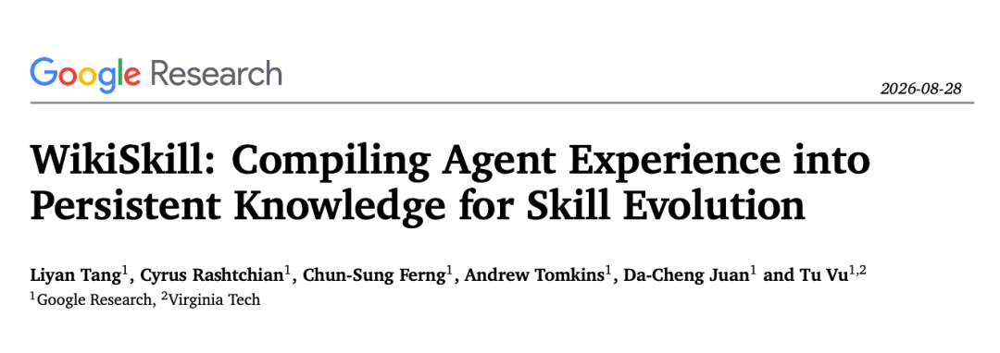
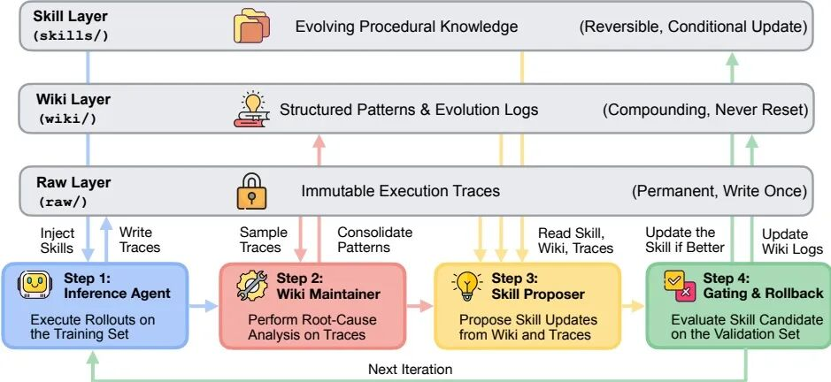
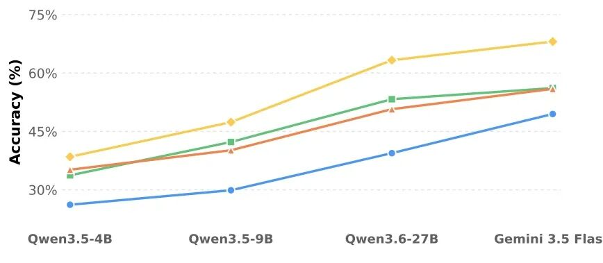
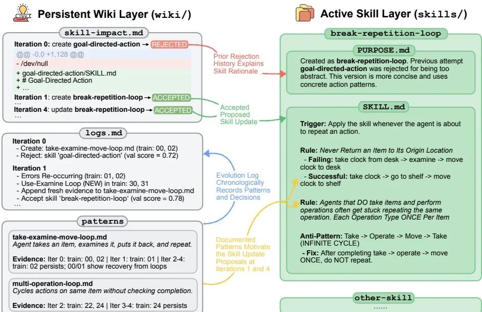
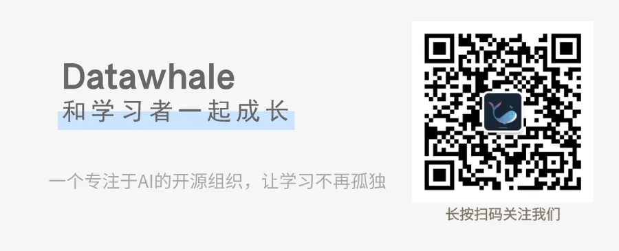

# 📰 谷歌重磅发布WikiSkill，技能可以自己进化了！

 Datawhale干货 

### 作者：Google Research团队

一个 Agent 到底凭什么越来越强？有人靠更大的模型，有人靠更多数据。就在前天，Google Research 最新发布的 WikiSkill 给出了另一条答案：给 Agent 搭一套三层知识架构，让技能自己进化。



```

论文链接：https://arxiv.org/abs/2608.27454

```

这套架构的核心是把"经验"和"知识"分开。以前的技能进化方法（EvoSkill、Trace2Skill、SkillOpt）分析完执行轨迹就直接改 Skill，经验用一次就丢。WikiSkill 在中间加了一层持久知识库，让经验先沉淀、再复用。



## 一、三层架构：把经验、知识和技能分开

## 第一层 Raw Layer：保留原始轨迹，给进化留下事实依据

Raw Layer 存储每次迭代的执行轨迹，包括 Agent 的完整推理过程、工具调用、输出结果。这一层不可变，目的是保留"到底发生了什么"的原始记录。

为什么单独存一层？因为后续两层都需要回溯原始轨迹来分析问题。Wiki Maintainer 要从中提取成功和失败模式，Skill Proposer 要按需查阅具体任务是怎么执行的。如果原始数据被覆盖或丢失，整个进化过程就失去了事实基础。

## 第二层 Wiki Layer：让一次性经验变成可复用知识

Wiki Layer 是整个架构的核心。它把原始轨迹编译成结构化知识，跨迭代持续积累。包含三个部分：

* patterns/：每个模式一个 markdown 文件，记录具体的失败原因或成功策略，带可操作的修复方案

* logs.md：进化日志，按迭代记录发现了什么、改了什么

* skill-impact.md：哪些 Skill 改动被接受、哪些被拒绝，带完整 diff

这一层有两个关键设计。

第一，Wiki 永不回滚。Skill 被拒绝时，Skills Layer 回到上一版本，但 Wiki 保留所有积累的知识。下一轮 Proposer 能看到"上次这个改法为什么被拒"，避免重复踩坑。

第二，Knowledge 和 Skill 分离。知识回答"我们知道什么"，技能回答"我们该怎么做"。以前的方法把两者混在一起，改技能时丢失了背后的推理上下文。WikiSkill 让知识持续积累，技能从知识里生长。

## 第三层 Skills Layer：可执行技能，带溯源

Skills Layer 是当前生效的技能集合。每个技能目录有两个文件：

* SKILL.md：技能内容，Agent 执行任务时直接读取

* PURPOSE.md：记录这个技能是为了解决 Wiki 里的哪个 Pattern 而创建的

PURPOSE.md 解决的是"这个技能为什么存在"的问题。当技能需要修改时，Proposer 可以通过 PURPOSE.md 回溯到对应的知识模式，理解当初的设计意图，而不是盲目地打补丁。

## 二、进化循环：从执行轨迹到 Skill 更新

每轮迭代跑四步：

## 1. Inference Agent ：用当前 Skill 在训练集上跑 rollout，产出轨迹到 Raw Layer。训练时不能访问 Wiki，否则 Agent 会直接查答案，导致轨迹失去参考价值。

## 2. Wiki Maintainer ：分析采样后的成功和失败轨迹，做根因分析，更新 Wiki 的 Pattern 目录和日志。

## 3. Skill Proposer ：以 ReAct 方式读 Wiki 索引、查 skill-impact 历史、按需读具体 Pattern 页面和轨迹，然后提出一次 Skill 创建或补丁。

## 4. Gating ：在验证集上评估候选 Skill，分数提升就接受，否则回滚。Wiki 不受影响。

这个循环的关键是第二步和第三步的配合。Wiki Maintainer 把零散轨迹编译成结构化知识，Skill Proposer 从结构化知识里生成技能更新。没有 Wiki 层，Proposer 每次都在从零开始分析原始轨迹。

## 三、实验结果：9B 加 Skill，超过 27B 裸模型



在五个基准、五个模型上的实验结果：

技能进化与模型规模互补。 Qwen 家族内，WikiSkill 带来的提升随模型规模递增：4B +12.3 分，9B +17.5 分，27B +23.9 分。越强的模型从技能进化中获益越多。

技能可以弥补规模差距。 Qwen-3.5-9B + WikiSkill 平均 47.4%，超过 Qwen-3.6-27B 无技能时的 39.4%。9B 加 Skill 超越 27B 裸模型。

技能跨模型家族迁移。 Qwen-3.5-9B 用 Qwen-3.6-27B 进化的技能达到 70.2%，用它自己的技能只有 63.4%。这说明"发现策略"和"执行策略"是两种能力，可以跨模型分工。

消融实验确认 Wiki 的价值。 去掉 Wiki 访问后，平均分从 63.7% 降至 48.7%，回落约 15 个百分点。Wiki Maintainer 积累的跨迭代知识是 Skill Proposer 能解决复杂失败模式的前提。



## 写在最后：Agent 持续变强，靠的不只是更大的模型

WikiSkill 的贡献不是一个新算法，是一个架构设计：把经验、知识、技能分成三层，让知识在中间持续积累，技能从知识里生长出来。

对做 Agent 的人来说，这意味着别再只盯着模型规模和 prompt 调优。搭一套三层知识架构，让经验沉淀为知识，让知识指导进化，才是 Agent 能持续变强的底层逻辑。



### 一起“**点****赞”****三连**↓

