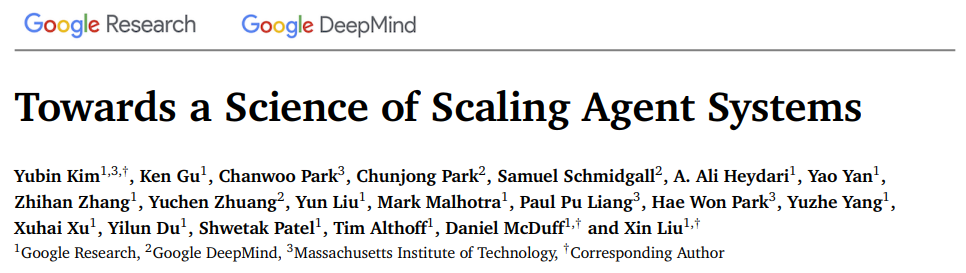
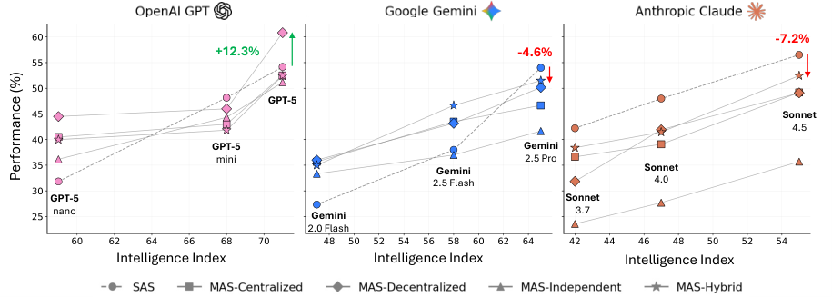
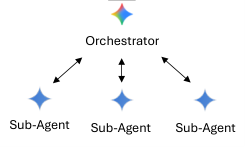
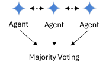
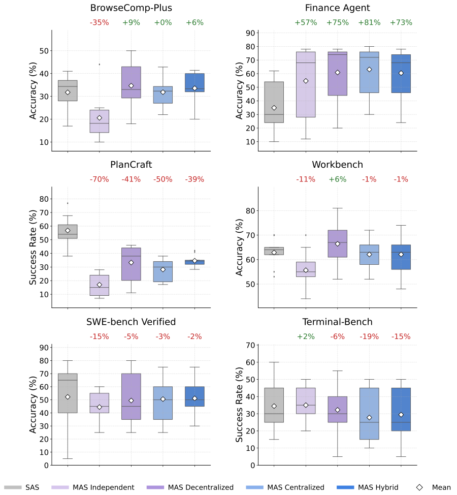
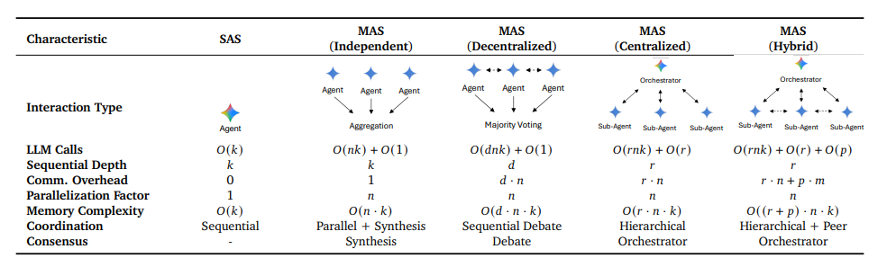
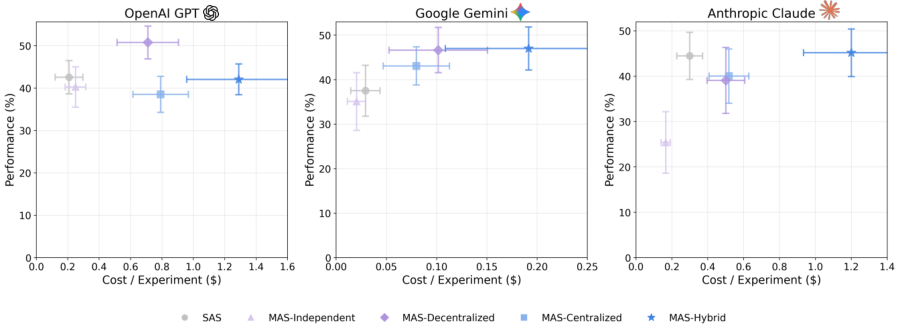

# 📰 重磅！Google发布多智能体最佳实践！

 Datawhale干货 

### 最佳实践：Google

最近各个厂商都在深入研究多智能体协作。让多个智能体工协作，各自负责一块任务，共同完成一个复杂目标。听起来逻辑很通，一个智能体搞不定的事情，多叫几个一起来干不就行了？

但真正搭过的人都知道，这里面的水比看上去深。系统跑起来了，效果却未必好，有时还不如单个智能体单独干。问题出在哪？是模型不够强，还是提示词没写好，或者根本没有一套可遵循的最佳实践？



```

论文地址：https://arxiv.org/abs/2512.08296

```

这正是 Google Research、DeepMind 和 MIT 最新发布的联合研究想回答的问题。他们做了 260 个受控配置，横跨 6 个基准、5 种架构、3 个模型家族，把可能影响结果的变量都控制住。他们得出的结论是，多智能体的效果不取决于你用了多先进的模型，而取决于任务结构适不适合分工协作。



他们把这套判断方法整理成了三条可查询的判据和一个贯穿约束。 以前「什么时候该用多智能体」「用哪种架构」是凭经验的启发式说法，这篇论文把它换成了能算的预测模型。输入任务特征和模型能力，就能算出该用哪种架构。

下面先说三个任务原型的答案。

## 一、规划、分析、工具密集三类任务，多智能体的用法完全不同

论文用了三个任务原型来示范这套方法怎么用。

第一个是规划任务。在 3D 环境里合成物品，查配方、拿材料、放进合成格、取出成品。这类任务工具少、单智能体基线已经不错，结论是直接用单智能体。

第二个是分析任务。给一家公司做财务尽调，收入、成本、市场因素各成一块，可以分头研究再汇总。单智能体基线中等，结论是用 Centralized 架构。这种架构有一个中央节点，负责把任务分给不同智能体，并在汇总结果前交叉核验它们的输出。



第三个是工具密集任务。比如 Workbench，提供 16 种工具。单智能体基线已经很高，但工具多意味着可并行的维度多，结论是用 Decentralized 架构。这种架构没有中央节点，智能体之间直接通信、互相质询。



三种任务，三种架构，没有一种是「多智能体更强」的答案。架构选得对不对，取决于任务长什么样、单智能体已经能做到哪。



## 二、五种架构的完整对比

论文实际测试了五种架构。除了上面示范的 Centralized 和 Decentralized，还有三种：SAS（单智能体系统）是基线，所有多智能体的效果都跟它比；Independent 三个智能体并行无通信，实现最简单但收益最低；Hybrid 是 Centralized 和 Decentralized 的组合，既有层级控制又有横向通信，但在顺序任务上退化最少。



从表里能看到几种架构的核心差异。Independent 三个智能体并行无通信，通信开销为 0，LLM 调用次数是 O(nk)，代价最低但收益也最低。Centralized 有 orchestrator 做层级协调，通信开销 O(r·n)，在聚合前插入验证。Decentralized 没有中央节点，智能体之间 sequential debate，通信开销 O(d·n)，并行度最高。Hybrid 是层级加横向灵活性的组合，通信开销 O(r·n+p·m)，最复杂也成本最高。

这五种架构不是随意选的，主要覆盖了协调的两个关键维度。Independent 只有并行没有通信；Decentralized 只有通信没有层级；Centralized 只有层级没有横向；Hybrid 两者都有。SAS 作为基线，用来衡量多智能体到底带来多少收益。

## 三、怎么判断，先看基线，再看任务能不能拆

这套判据背后有三个判断依据。

第一个是基线水平。 单智能体已经能拿到大部分分数时，剩余空间有限，而协调开销是实打实付出的。论文给出的分界线是 45%。基线低于这条线，多智能体有发挥空间；超过这条线，协调收益递减。这是全文最稳健的一条发现。

第二个是任务能不能并行分解。 工具越多，可并行的维度越多，协调结构能拿到的分解收益越大。但要注意，「可分解」不是「任务能不能拆成子任务」，而是「拆开之后，各部分还需不需要通信」。如果步骤顺序固定、状态共享，加协调是浪费；如果不同部分提供互补信息，加协调是杠杆。

第三个是防错靠什么。 独立并行跑的智能体之间没有任何通信，谈不上协调，收益只有 2 到 4 个百分点。而能在聚合结果前插入验证环节的架构，比如 Centralized 靠中央节点交叉核验、Decentralized 靠智能体之间互相质询，成功成本比最高。防错靠的是验证环节，不是智能体数量。 协调不足时多出来的智能体没有验证机制，只是把同一个提示词跑几遍取平均。

## 四、智能体数量有最优值，加得越多收益涨得越慢

除了这三个判断依据，还有一个横跨所有架构的约束。

智能体数量有最优值，而且代价涨得比神经网络参数还快。推理轮次随智能体数超线性增长，对照神经网络参数缩写的经典指数 0.76，智能体数的指数是它的两倍多。每加一个智能体，它要参与同步、接受验证，还可能传播错误。

每多一个智能体，协调成本就高一截，而性能收益在某个点后开始递减。最优值出现在「新加的智能体带来的收益刚好被它的协调成本吃掉」的位置。论文里的实测数据是 6 个智能体大约 69 轮推理。

为什么协调成本涨得这么快？除了同步和验证本身的开销，还有一个更麻烦的问题。一个智能体的错误输出会成为另一个智能体的输入，错误在系统里滚雪球。Independent 架构在工具少时收益只有 2 到 4 个百分点，正是因为它的智能体之间不通信、不验证，错误一旦产生就直接带进最终结果。Centralized 和 Decentralized 能拿到更高收益，不是因为它们并行度更高，而是因为它们在结果汇总前插入了验证环节，把错误拦在了传播路上。



这条约束的实际操作是「先证明小规模有效，再决定要不要扩展」。不要一开始就设计 10 个智能体的系统，先用 2 到 3 个验证核心逻辑，确认性能收益能覆盖协调开销后，再逐步增加。反过来，如果一个 6 智能体系统效果不好，第一反应应该是减少智能体数量，而不是换更强的模型。

加智能体不是简单的做加法。每多一个，协调成本就多一截，错误传播的风险就高一层。这个代价是累加的，不是一次性付清。所以「多叫几个一起来干」这个思路，在多智能体系统里不成立。

## 写在最后

设计多智能体系统时，最该花的功夫是先确认任务值不值得协作。

单智能体基线已经能拿 45% 以上，加了只会变差。任务步骤固定、状态共享，加了就是浪费。工具少、没有可并行的维度，加了也拿不到分解收益。这三个条件任何一个命中，第一反应都应该是「别加」，而不是「换个更强的模型试试」。

真正需要多智能体的场景很窄。基线低、工具多、各部分独立，同时满足这三件事，协调收益才可能超过协调开销。而即使满足了，也要先小规模验证，确认 2 到 3 个智能体能跑通核心逻辑，再决定要不要扩展。

下次设计多智能体系统前，先问自己这三个问题。答完再动手，比先堆 10 个智能体再调 prompt 要省事得多。

毕竟，加智能体不是免费的。每一分协调开销，都要从推理预算里出。


### 一起“**点****赞”****三连**↓

