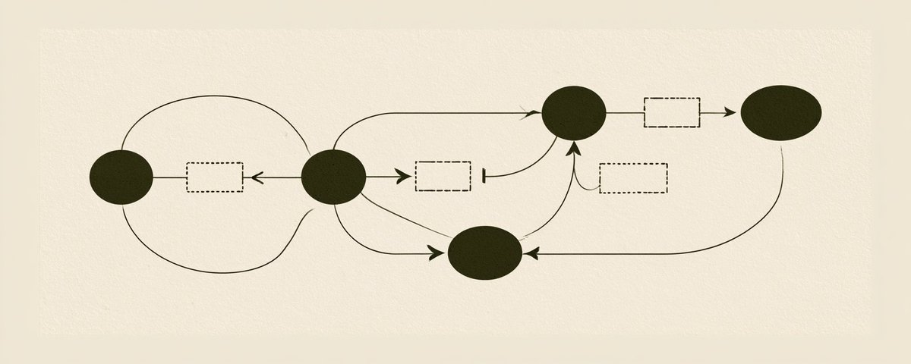
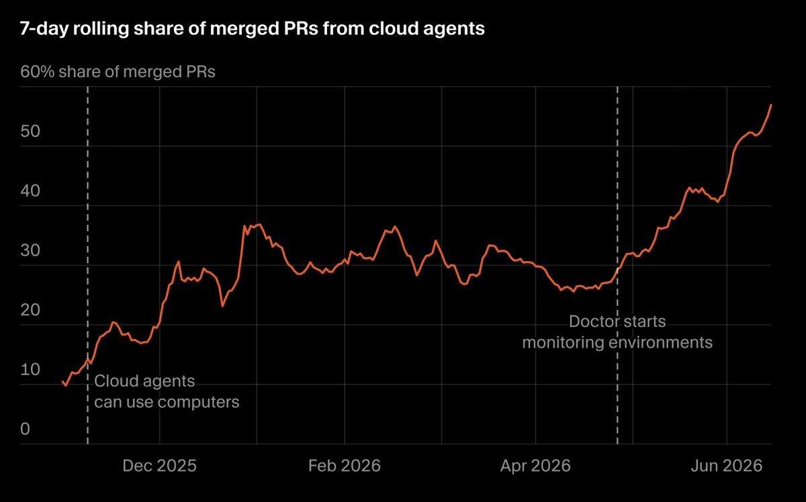

# 📰 Agentic Engineering Setup (after 2,000+ hours)

Over the past 3 years, I've spent well over 2,000 hours coding with AI, and I've personally interviewed some of the most productive people in the space of Agentic Engineering.

Below is my full Agentic Engineering setup as it currently stands, Q3 of 2026.

## Interface

This means the UI / CLI how you interact with agents. My main interface is bb.

It's open source, completely free, and it allows you to use any subscription, any agent, any model inside of a single GUI. Codex, Claude Code, Pi, Cursor CLI, OpenCode, Grok Build, Hermes, all within the same UI.

The problem with apps like Codex or Cursor is that they only allow their own models and their own subscription. The goal is getting the most tokens for the least amount of dollars.

All the features you like from the Codex or Cursor apps are inside of bb, and it's improving every single week (plus, it's fully open-source and 100% free to use).

Another thing I use a lot is cmux.

When you launch a new cmux workspace, you can divide the screen just like you would in tmux (that's why the similar name), launch different terminals in every pane, and there's a built-in browser.

Where cmux breaks is once you have a lot of agents and workspaces. The left sidebar really is not the right primitive. Fine for a couple of things going on, but for serious agentic engineering work at scale it's not the best.

I use Ghostty as my terminal because it's very fast and native.

Inside of Ghostty, you can run Herdr, which is basically tmux but for agents, a backend runtime for agents. Very minimal, very lightweight, lives in the terminal, and when an agent is finished, its state shows on the left: done, idle, blocked, running.

Tracking the states of AI agents is ESSENTIAL. My prediction is that in 3 to 6 months this "agent state tracking" becomes more and more important, because you won't be talking to a single agent. You'll be talking to a manager agent that manages a lot of worker agents.

The last interface I have to mention is Corral, something I developed myself.

Instead of randomly switching between agents whenever they finish (in Herdr, there's no real order), every agent has a priority. Just like tasks have different priority/importance levels. When a P1 agent finishes, he goes to the top. You should never respond to a P4 agent when a P1 agent has finished running. (yes... i do need to make corral open-source. haven't got to it yet.)

## Models and Subscriptions

You want the most tokens for the least amount of dollars possible. This should be one the main goal of every Agentic Engineer (after getting shit done).

There are 4 main subscriptions right now, and yes... this could be completely different 2 months from now.

The best "bank for your buck" deal right now is OpenCode Go. It's only $10, and it gives you Kimi K3, Grok 4.6, GLM 5.3, DeepSeek V4 Pro, and many other models... But it doesn't have the best models like Fable 5 and GPT-5.6 Sol (plus, the usage limits are quite small)

So, if you have a bit more money, here's what you should do:

- $30 -- get OpenCode Go + ChatGPT Plus ($20)

- $50 -- Add the $20 Claude Code subscription on top.

- $70 -- Add Cursor's $20 a month, and you have the lowest tier of all subscriptions.

- $110 -- OpenCode + one of the big plans. ChatGPT $100 plan will give you a better deal than Claude. It is what it is. OpenAI has more compute, they're willing to subsidize it more.

- $210 -- Just get both $100 plans.

- And if you really are serious (like me) just get all $200 plans (Codex, Claude, Cursor) because those are 20x usage, and these plans give you the best deal.

btw... the Cursor plan is very underrated. Cursor, aka Grok, is going to become a great subscription because of the SpaceX acquisition. SpaceXAI has loads of compute, so they're allowed to play the game of subsidizing. And -- I think -- the Cursor/Grok plan gives you separate limits for Cursor + Grok Bot, which is just incredible.

Grok Bot is rapidly becoming the new way people interact with agents, so having a Cursor subscription has never been more important (not sponsored lol, it's just true). Plus, the new model -- Grok 4.7 -- is right around the corner.

No matter what, do not pay API pricing. It is the worst deal out there. Just get the subscriptions.

## Cloud Agents

It's quite obvious that cloud agents are the future. Cursor, Amp, Devin, Codex... all of these companies are betting everything on Cloud Agents.

The proof that cloud agents are the future is the graph below.

\[image here\]

This is Cursor's internal share of merged PRs from cloud agents: around 10-15% at the start of this year, approaching 60% now. And that's merged PRs, the stuff that actually gets used. Soon enough this will be 70%, then 80% and then 90%.

The issue with running all agents locally, on your machine, is that it's not scalable. You cannot run hundreds of agents at once. All it takes is a couple of agents deciding to run your entire test suite at the same time and your computer will begin to make weird noises (even my $7,000 macbook pro struggles).

Cloud Agents give you isolated environments, persistent sessions, durable access to internet and electricity. If you close your laptop, you lose your sessions. Lose internet for a couple of minutes, and the harnesses cannot self-recover.

The problem with the existing cloud agent solutions is the INSANE level of ecosystem lock-in. Setting up the environments and all your secrets is a lot of hours, and then you're locked in: your sessions are there, you're on their pricing, and you give them all your data. Even if they don't train models on it, there are so many other ways to use your data.

The solution is to have your own server. And thanks to AI, this takes like 10 minutes to set up (seriously). Just get a VPS, run Herdr on it, and SSH into it.

Herdr gives you persistent agent sessions, and SSH lets you connect from your phone, your laptop, anything. You can literally achieve the 80/20 of cloud agents for a couple of dollars, without the lock-in.

## Build your own Cloud env

I use Hostinger for my VPSs, and a KVM2 plan is enough. Here's the main thing I want to get across... you don't need to be an expert in VPSs, DevOps, Linux, none of that.

Just talk to your agent in plain English!!!

In the upcoming video, I set the whole thing up live. A cmux workspace, a coding agent in the left pane (Cursor CLI running Grok 4.6), an empty terminal pane on the right.

My cmux skill lets the agent find that other pane and run commands in it. I SSH'd into the fresh VPS myself, then told the agent "learn everything about that server, and set up the dev environment. Herdr, Node.js, Python 3, Git".

It analyzed the VPS in seconds, installed everything, started Herdr, then installed Pi Agent, found an OpenRouter key on my macbook, and went through the full setup itself. A few short prompts later, I had Pi running GPT-5.6 Sol and a second session running Fable, both in the cloud, on my own VPS, with full root access.

If something happens to my computer or wifi... If my MacBook explodes, those agents keep running. The full walkthrough is in the video. [Link to my YouTube here.](https://www.youtube.com/@DavidOndrej)

One more speed thing... I dictate with SuperWhisper. Most of you reading this probably type at 40 or 50 words per minute. That is very slow.

BUT! you can speak at 250+ WPM. A voice AI tool (like Superwhisper, Glaido, Whispr FLow) instantly makes you 3-4x faster at sending prompts. Use one. Don't be stupid.

## Harness

First harness I need to mention is Pi Agent, the GOAT.

The most minimal harness out there: just 4 tools, always runs in YOLO mode, supports any model, any provider. Very elegant, super configurable, and that's why so many people build on top of Pi. It's open source, completely free, just go to pi.dev and get it. Non-negotiable. It's the first harness I put on the VPS.

Cursor CLI. Very underrated, because you can use all the models: Grok, GPT models, Anthropic models, Kimi. You can tag skills, and you can pre-send messages. Great harness overall.

The next category of Harnesses is what I like to call "self-improving" harnesses.

The two most popular ones are Hermes Agent and Prime Agent. This is for when you don't know what you're doing. If a task has a lot of uncertainty, a lot of figuring out to do, use a self-improving harness, because it creates skills and improves with you over time.

And finally, the classics, Claude Code and Codex. I have them as aliases. A lot of people type claude --dangerously-skip-permissions every single day. Extremely slow, extremely inefficient. I type cc and it launches Claude Code with permissions bypassed; cx launches Codex in YOLO mode.

YOU MUST create global aliases for the long commands you run often. That's one of the laws of agentic engineering: How can you get more done in the same amount of time?

## Skills

My skills repo went viral last month. (see github.com/davidondrej/skills ) It's also completely free, open source, all that.

The SKILLs most relevant to Agentic Engineering are:

\*(1) /total-review

- It runs two other skills, /gpt-review and /fable-review, which review whatever code changes you just did with GPT-5.6 Sol and Fable 5, then dedupes both lists into a single list of the issues that actually matter. It's like asking all of your smartest friends to review your job application, and they only give you the biggest issues. Run it on medium-to-large changes, especially if a different model built it. If Grok 4.6 did the work, you want a totally different model reviewing it.

IMPORTANT: anything you repeat often enough should become a preset.

If it's a single step, use text replacements. I have them as Raycast snippets. "Answer in short in plain English." "Make your previous answer simpler and shorter." "Stage all files, write a clear commit, push to GitHub."

If it's a multi-step workflow, turn it into a skill.

(2) /ask-then-build

- I use this skill every single day, before any building. Instead of saying "make this Windows compatible" and letting the model silently make important architectural choices you might regret later, it walks you through the main decisions one at a time, with options. AI models are great at coding, great at implementation. They don't have taste. They don't have good judgment. You, as the human, need to stay in charge of that.

(3) /deepapi

- This skill is what I use for any deep research, any scraping, anything web. Codex and Claude Code come with basic web search, but no scraping, no deep research, and they get blocked easily. Run 8 fast web searches and give me the top 3 options, scrape Twitter, scrape GitHub, find 3 ways of contacting a person. Everyone on my team uses it. Must-have.

(4) Guardrails and push lock

- More boring, but absolutely essential, and you only set them up once. Global agent guardrails is a pre-tool-call hook that makes sure your agents never wipe your disk, never overwrite Git history, never touch your password manager. And push lock, for when you're running 15+ agents in parallel: one OS-level kernel lock on the whole ship. Merge, verify, push, CI, deploy, health check.

Don't install all of my skills. Just grab the ones you need.

## Worktrees

A worktree is basically a copy of your primary checkout into a separate folder and creates a new Git branch there, so agents can work in parallel, completely isolated.

On a small project, that's absolutely overkill. Stay on a single branch and work faster.

On medium-to-large projects where you're running 20-30+ agents at all times, there's no way to avoid it. Without worktrees, the agents will conflict, reverse each other's changes, and fight each other. Another good thing about BB: it has built-in worktrees. It remembers that on my big repos I always want a new worktree based off of origin/main.

## Other Agentic Engineering Tips

Know when to use each model.

- Designing a plan or starting a new project? Fable. It has the most sparks of genius. Fixing a deep, serious bug? GPT-5.6 Sol, max reasoning effort. Default chatting? Grok 4.6 on high. Almost the same intelligence, but 2x cheaper and 2x faster. Front-end? Kimi K3.

- And when a major new model is released, set aside a day where you only use that model. Don't listen to Twitter. Try it yourself.

Know when to review.

- I'm not running total review on every change. A small front-end tweak goes to prod right away.

- And NEVER do recursive reviews. If you tell a model "find the 5 biggest issues", it will find 5 issues even if the codebase is perfectly fine. These models invent imaginary bugs.

Pre-sending.

- Usually I know what the agent will do next, so I queue the messages ahead of time: "implement the plan", "run Fable review on this", "now fix those things".

- Sometimes it's 2 messages, sometimes 6.

- Never use a harness that doesn't allow you to pre-send.

Subagents are overused.

- A lot of people just burn their limits on them. I use them when I'm in control. I want to select which model runs in the subagent, because I know what subscriptions and limits I have.

- The future is a manager agent launching workers, but you still need to design that system: the rules, the permissions, the conditions when a subagent is launched. I don't want some guy at Anthropic or OpenAI deciding that for me.

ADRs.

- This is how you put decisions into a codebase. /docs/adr is one of the first folders I create in any project.

- Every core architectural decision gets a short file: what was decided, why, and what the state of the project was at the time. Some things can be read from code, but not everything.

- The stuff that can't should be documented, so future agents and humans instantly understand why it's built this way.

Tests.

- Current models BLOAT your repo with tests: unit tests, integration tests, database tests, even on the smallest repos where it makes no sense.

- If you tell the model to add tests, it adds an insane amount. If you tell it "don't add tests", it still adds some, and you land at the right amount.

Prod DB access.

- Any product with real usage needs to do this... create a read-only Postgres role and give your agents that.

- Don't give them write access. All it takes is one irreversible change and you're going to regret it.

- But no access is also a mistake. With read-only access, you can reality-check every feature. Does this even happen in production? Are people even using this? I wish I did this sooner.

Track your agentic productivity.

- We just released a new open-source repo under Vectal Labs called [agentic-productivity](https://github.com/vectal-labs/agentic-productivity). It tracks your commits, your agent sessions, and your user prompts.

- Each is a bad metric on its own, but combine the 3 and look at the long-term trend, and you can see whether you're actually becoming a better agentic engineer.

That's the setup as it currently stands. In a month, it's probably going to be different. This changes all the time.

by David Ondrej (spoken for YouTube, then re-written for article format)

### 🖼️ Attached Media

## 💬 Replies

### 1 @vasuman (vas)

*Mon Aug 31 23:19:32 +0000 2026*

@DavidOndrej1 Based

### 2 @thechajo (Chajo)

*Mon Aug 31 14:31:52 +0000 2026*

@DavidOndrej1 Thanks for the article, there is an \[image here\] in the text

### 3 @DavidOndrej1 (David Ondrej) (Author)

*Mon Aug 31 14:59:56 +0000 2026*

@thechajo this is the image 

### 4 @selfdrivenpower (selfdriven)

*Mon Aug 31 15:05:56 +0000 2026*

@DavidOndrej1 Thanks for sharing your workflow setup.   The only thing I didn't get is "BB"

### 5 @DavidOndrej1 (David Ondrej) (Author)

*Mon Aug 31 20:20:01 +0000 2026*

@selfdrivenpower [getbb.app](https://getbb.app/)

### 6 @undefinedKi (Yarchi)

*Tue Sep 01 02:07:43 +0000 2026*

@DavidOndrej1 does a blocked P4 ever get promoted if P1 waits on it?

### 7 @GeniusPothead (Genius💡💹🧲 🤖)

*Mon Aug 31 14:19:29 +0000 2026*

@DavidOndrej1 The feedback loops here are probably where most of the productivity gains live

### 8 @Silberud (Igor Silberud)

*Mon Aug 31 15:32:44 +0000 2026*

@DavidOndrej1 Not a word about @openclaw. Why is that?

### 9 @shuizhuyu (Crio Songo)

*Tue Sep 01 06:12:33 +0000 2026*

@DavidOndrej1 It should just be a rendering error when loading the page, I'll go back to check the image asset links and fix it, you can refresh after I update.

### 10 @_kvnloo (Kevin Rajan)

*Tue Sep 01 23:34:57 +0000 2026*

@DavidOndrej1 yoyoyoyo do u have any open source repositories? would love to help out!

### 11 @borker (ryan borker)

*Mon Aug 31 15:02:00 +0000 2026*

@DavidOndrej1 extremely practical and low BS. Nice one.

### 12 @saintspaco (Chidi Okoene)

*Mon Aug 31 23:38:13 +0000 2026*

@DavidOndrej1 Cursor is the best subscription I’ve made so far

### 13 @AllanLeightyMT (Allan Leighty)

*Mon Aug 31 14:08:06 +0000 2026*

@DavidOndrej1 Thank you! I am going to experiment with your engineering ideas. Again, thank you!

### 14 @JoseZiccarelli (Ziccarelli)

*Tue Sep 01 11:47:45 +0000 2026*

@DavidOndrej1 I will definetely try the ADR docs folder

### 15 @_Thars_ (Thars)

*Mon Aug 31 20:49:55 +0000 2026*

@DavidOndrej1 Image in the article is missing

### 16 @rf55734 ((RAF))

*Mon Aug 31 21:11:56 +0000 2026*

@DavidOndrej1 @grok résumé moi cela de manière didactique, méthodique, pas à pas pour codex

### 17 @KunalLunia2 (Kunal Lunia)

*Mon Aug 31 14:33:53 +0000 2026*

@DavidOndrej1 I want you to make a video out of it ig that would be really helpful for everyone.

### 18 @slatts_____ (Slatts)

*Mon Aug 31 18:02:51 +0000 2026*

@DavidOndrej1 Super article. I knew some of this but have learned a few new things. Chapeau ! 🎩

### 19 @Bobby_Network (Bobby Rajesh Malhotra ¹¹ ⁴⁴⁴)

*Tue Sep 01 02:44:11 +0000 2026*

@DavidOndrej1 A wall of text with basically zero information value (great at coding, you never coded therefore).

### 20 @shadowaguy (ShadowAguy)

*Mon Aug 31 14:40:59 +0000 2026*

@DavidOndrej1 the AI agents showing 'self-sacrifice' is the only interesting thing here, everything else is just noise you copy-pasted from a trending tab

### 21 @maxi_moxa (Maximiliano Moxarella)

*Wed Sep 02 01:50:31 +0000 2026*

@DavidOndrej1 @grok tldr rank this in the clickbait scale 1 to 10

### 22 @yingjiang_jy (Ying Jiang)

*Tue Sep 01 06:36:35 +0000 2026*

@DavidOndrej1 Tests part is so true.
I have to hard limit the production vs test code ratio to 1:0.5, and this number was 1:2 in my current project.

### 23 @gurtej__gill_ (Gill)

*Mon Aug 31 16:31:05 +0000 2026*

@DavidOndrej1 Simple architecture diagrams usually hide the messiest parts of real production.

### 24 @Beast_speaks (San)

*Mon Aug 31 15:47:54 +0000 2026*

@DavidOndrej1 Crazy .

### 25 @amiteshmisra (Amitesh Misra)

*Mon Aug 31 16:36:46 +0000 2026*

@DavidOndrej1 @ankit794

### 26 @ImNikhil117 (Nikhil Sharma)

*Mon Aug 31 14:37:50 +0000 2026*

@DavidOndrej1 The recursive review point is so true. Ask a model to find issues and it will manufacture some just to satisfy the prompt, even in code that is already solid.

### 27 @SalMan1432566 (Sal Man)

*Mon Aug 31 16:23:40 +0000 2026*

@DavidOndrej1 Very informative.

### 28 @ChickenT1000 (SimonLab)

*Mon Aug 31 20:57:53 +0000 2026*

@DavidOndrej1 I am not falling behind!

### 29 @iamAlexCx (Alex C.)

*Tue Sep 01 02:53:05 +0000 2026*

@DavidOndrej1 the internet is very generous.

one month your repo goes viral. the next month someone asks if you can build their startup for exposure.

### 30 @thefarazxr (Farazuddin Mohammed)

*Tue Sep 01 02:28:27 +0000 2026*

@DavidOndrej1 Highly informative article with lots of interesting insights!

Btw @DavidOndrej1, the image under the “Cloud Agents” section seems to be missing. Maybe add that whenever possible. Thanks for sharing this article! 🙏

### 31 @23rdletters (psy)

*Mon Aug 31 15:28:22 +0000 2026*

@DavidOndrej1 great article. a deeper dive into how you use and manage the various layers - e.g. harness inside an interface like bb/cmux alongside herdr and cursor CLI + grok bot - would be useful

### 32 @BLalwaysMattr (✊🏿✊🏾✊🏽✊🏼BLalwaysMattr‼️)

*Mon Aug 31 22:11:36 +0000 2026*

@DavidOndrej1 👀

### 33 @abhithelucifer (Abhinav Srivastava)

*Tue Sep 01 12:31:30 +0000 2026*

@DavidOndrej1 Thanks for sharing these! 
I've a question - Why are we not talking about Antigravity / Gemini Flash 3.7?
The prowess of Gemini is truly Underrated! Also If possible - I would like to get your precious views on something I'm dedicatedly working on. Hoping for your reply!! Cheers!

### 34 @AmanduhLovejoy (Amanduh Lovejoy)

*Mon Aug 31 18:42:31 +0000 2026*

@DavidOndrej1 The piece that changed my setup was separating coordination from execution. One agent holds the plan and hands work to Codex CLI or Grok CLI, and I stopped losing context every time a long task ran.

### 35 @AIDoggoCosmo (Cosmo)

*Tue Sep 01 01:46:30 +0000 2026*

@DavidOndrej1 How do you make sure agents don’t overload on context and start breaking down? Do you have rules or a workflow?

I’ll work with one agent for a while and not know when to switch to another. JOr, just keep the same agent and just /compact at 40%?

### 36 @AIDoggoCosmo (Cosmo)

*Tue Sep 01 01:52:53 +0000 2026*

@DavidOndrej1 "I don’t prompt Claude anymore.  I have loops running that prompt Claude and figuring out what to do. My job is to write loops." Boris Cherny

@DavidOndrej1 what do you think about loops and how do you use them, or not? What are your thoughts around meta-prompting?

