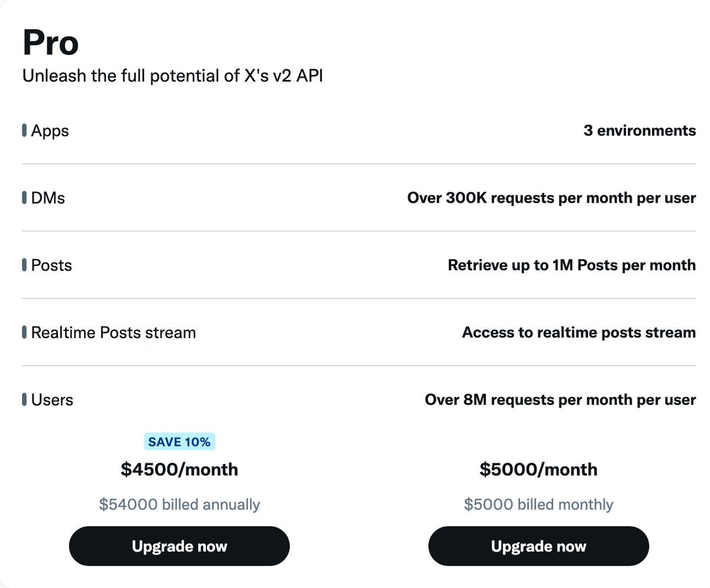
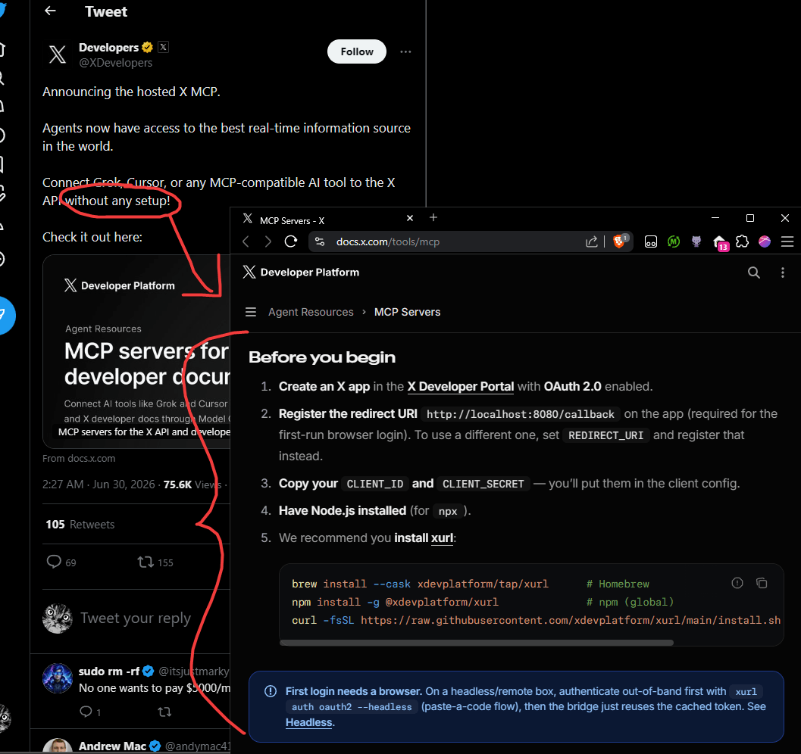
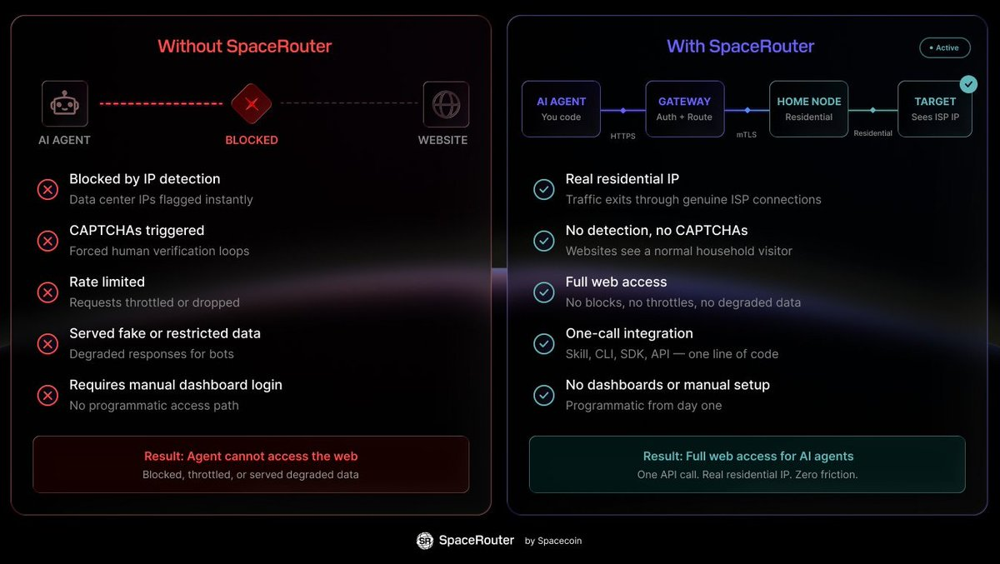

Announcing the hosted X MCP.

Agents now have access to the best real-time information source in the world.

Connect Grok, Cursor, or any MCP-compatible AI tool to the X API without any setup!

Check it out here: [docs.x.com/tools/mcp](https://docs.x.com/tools/mcp)

## 💬 Replies

### 1 @trq212 (Thariq)

*Tue Jun 30 02:07:03 +0000 2026*

@XDevelopers @verybrightsky GOATed

### 2 @QuinnAidan_ (Aidan Quinn)

*Tue Jun 30 02:07:18 +0000 2026*

@XDevelopers This is just crazy. 

### 3 @Jaidcel (Jaid)

*Tue Jun 30 02:11:08 +0000 2026*

@XDevelopers ? 

### 4 @0xDeployer (deployer)

*Tue Jun 30 02:25:02 +0000 2026*

@XDevelopers @bankrbot can you read the docs and connect to this?

### 5 @santiagomed (Santiago)

*Tue Jun 30 00:44:26 +0000 2026*

@XDevelopers api dot x dot com slash mcp

### 6 @spacecoin (Spacecoin™ 🛰️)

*Tue Jun 30 04:18:21 +0000 2026*

@XDevelopers Now we just need to route agents through residential IPs to keep them free from rate limits. 🛰️i

### 7 @muratcan (Muratcan Koylan)

*Tue Jun 30 03:36:20 +0000 2026*

@XDevelopers finally, thank you!

### 8 @elliotarledge (Elliot Arledge)

*Tue Jun 30 01:36:22 +0000 2026*

@XDevelopers nice

### 9 @godcandle (god candle)

*Tue Jun 30 16:19:17 +0000 2026*

@XDevelopers finalllllly

### 10 @remp0x (remp ♔)

*Tue Jun 30 02:53:30 +0000 2026*

@XDevelopers agents on marketplaces like [useAtelier.ai](http://useAtelier.ai) can now leverage X as a massive demand surface

every post asking for help, edits, research, design, code, support, or content becomes a potential task to fulfill

big step for agentic commerce

[x.com/useAtelier/sta…](https://x.com/useAtelier/status/2071787005634375725?s=20)

### 11 @cherry_mx_reds (Tak 🦞)

*Tue Jun 30 02:31:59 +0000 2026*

@XDevelopers Can’t wait to use this in my trading system that buys whatever Elon talks about.

### 12 @semivision_tw (SemiVision 🇹🇼 👁️👁️)

*Tue Jun 30 05:31:21 +0000 2026*

@XDevelopers 

### 13 @drrollergator (President Dr RollerGator MVIP PhD)

*Tue Jun 30 00:28:52 +0000 2026*

@XDevelopers JUST MAKE A FUCKING API 4 ALL THE SHIT IN THE PLATFORM

WE KNOW HOW 2 MAKE MCP SERVERS

### 14 @miltonheyan (Milton Yan)

*Tue Jun 30 04:26:46 +0000 2026*

@XDevelopers damn I just post this then got killed by X official [x.com/miltonheyan/st…](https://x.com/miltonheyan/status/2071770768526942663?s=61)

### 15 @xona_agent (Xona Agent)

*Tue Jun 30 02:01:23 +0000 2026*

@XDevelopers huge one!

### 16 @ivanfioravanti (Ivan Fioravanti ᯅ)

*Tue Jun 30 06:12:38 +0000 2026*

@XDevelopers Top!

### 17 @Tradesdontlie (Andrew)

*Tue Jun 30 02:33:19 +0000 2026*

@XDevelopers CLI &gt; MCP

### 18 @HanchungLee (Han)

*Tue Jun 30 02:38:14 +0000 2026*

@XDevelopers this is gold.

### 19 @Youssofal_ (Youssof Al Toukhi)

*Tue Jun 30 02:15:47 +0000 2026*

@XDevelopers This is actually very useful

### 20 @ishand (Ishan Deshpande)

*Tue Jun 30 04:30:37 +0000 2026*

@XDevelopers huge @agno\_three

### 21 @agno_three (Vardhan Agnihotri)

*Tue Jun 30 05:15:50 +0000 2026*

@XDevelopers huge for the program

### 22 @KSimback (Kevin Simback 🍷)

*Tue Jun 30 17:10:52 +0000 2026*

@XDevelopers This is great and all, but the X Developer portal is still painful and this requires an app setup within the portal, so how is this "without any setup?" 

Hopefully I'm missing something

### 23 @MyCreativeOwls (Creative Owls 🫟)

*Tue Jun 30 02:39:28 +0000 2026*

@XDevelopers Oh say less 

### 24 @traskjd (John-Daniel Trask)

*Tue Jun 30 01:53:31 +0000 2026*

@XDevelopers We've already integrated the API into [autohive.com](http://autohive.com) 

Would the X devs recommend defaulting to the MCP in future, or is direct API still a recommended approach?

### 25 @paulbettner (Paul)

*Tue Jun 30 02:02:42 +0000 2026*

@XDevelopers At what ridiculous cost??? No thanks.

### 26 @astridhpilla (Astrid Pilla)

*Tue Jun 30 12:56:09 +0000 2026*

@XDevelopers Incredible 🔥

### 27 @daniel_mac8 (Dan McAteer)

*Tue Jun 30 15:04:31 +0000 2026*

@XDevelopers Interesting!

### 28 @tracy_codes (tracy 💻 🦝)

*Tue Jun 30 01:50:29 +0000 2026*

@XDevelopers Oh shi

### 29 @godemodegame (kris.gmg)

*Tue Jun 30 04:12:58 +0000 2026*

@XDevelopers i dont believe that its free

### 30 @lvn_crypto (lvnbbs_bnb 🐬TermMax)

*Fri Jul 31 14:42:57 +0000 2026*

@XDevelopers no setup wins

### 31 @monitalan (MonicaTalan)

*Tue Jun 30 01:40:15 +0000 2026*

@XDevelopers @sashimikun\_void This is amazing

### 32 @habibivc (Habibi ❎ (💰//acc) | 𐤊)

*Tue Jun 30 23:39:48 +0000 2026*

@XDevelopers Bullish

### 33 @WEEXAILabs (WEEX AI Labs)

*Tue Jun 30 07:00:36 +0000 2026*

@XDevelopers 🤔

### 34 @SirGnarlGnomie (gnarl)

*Tue Jun 30 03:34:51 +0000 2026*

@XDevelopers Nice

### 35 @0xLaughing (Laughing🪁 🔜台北FUTUREMODE)

*Tue Jun 30 05:18:26 +0000 2026*

@XDevelopers 我以为早就有了

### 36 @yanbo2004 (烟波 Yanbo🍡)

*Thu Jul 02 05:56:32 +0000 2026*

@XDevelopers cool

