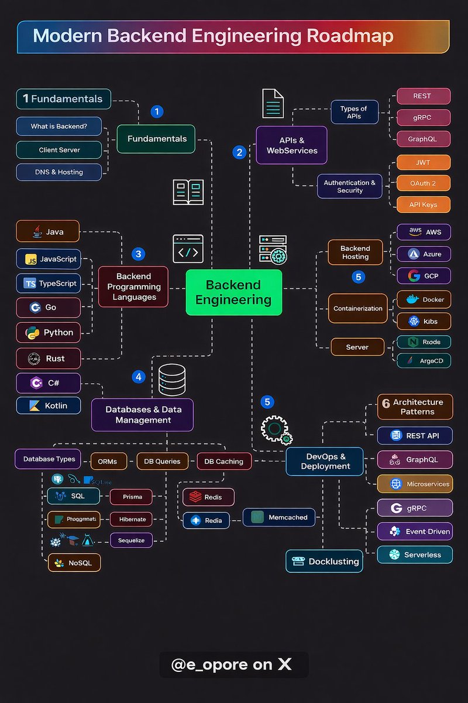

Backend Development Roadmap

PHASE 1: PROGRAMMING FUNDAMENTALS
├── Core Programming
│   ├── Data structures (arrays, lists, maps/sets)
│   ├── Algorithms (searching, sorting, complexity)
│   ├── Object-oriented programming
│   └── Functional programming concepts
├── Language Proficiency
│   ├── Choose primary language:
│   │   ├── Java/Spring Boot
│   │   ├── Python/Django/FastAPI
│   │   ├── JavaScript/Node.js/TypeScript
│   │   ├── Go/Golang
│   │   └── C#/.NET Core
│   └── Language-specific patterns & best practices
├── Development Tools
│   ├── Git & GitHub/GitLab
│   ├── IDE (VS Code, IntelliJ, PyCharm)
│   ├── Package managers (npm, pip, Maven)
│   └── Basic command line usage

PHASE 2: WEB FUNDAMENTALS
├── HTTP Protocol
│   ├── Request/Response cycle
│   ├── Methods (GET, POST, PUT, DELETE)
│   ├── Status codes (200, 201, 400, 404, 500)
│   ├── Headers and cookies
│   └── RESTful principles
├── APIs
│   ├── REST API design
│   ├── JSON/XML handling
│   ├── API documentation (OpenAPI/Swagger)
│   ├── API versioning strategies
│   └── Rate limiting and throttling
├── Authentication & Authorization
│   ├── Sessions vs tokens
│   ├── JWT (JSON Web Tokens)
│   ├── OAuth 2.0 / OpenID Connect
│   └── Role-based access control (RBAC)

PHASE 3: DATABASES
├── SQL Databases
│   ├── PostgreSQL / MySQL
│   ├── Database design & normalization
│   ├── Indexes and query optimization
│   ├── ACID properties
│   └── ORMs (Hibernate, SQLAlchemy, Prisma)
├── NoSQL Databases
│   ├── Document DBs (MongoDB)
│   ├── Key-Value stores (Redis)
│   ├── Wide-column stores (Cassandra)
│   └── Graph databases (Neo4j) - optional
├── Database Advanced
│   ├── Transactions and locking
│   ├── Connection pooling
│   ├── Database migrations
│   └── Read replicas and sharding

PHASE 4: BACKEND FRAMEWORKS
├── Framework Mastery (Choose one primary)
│   ├── Spring Boot (Java)
│   │   ├── Dependency injection
│   │   ├── Spring Data JPA
│   │   ├── Spring Security
│   │   └── Spring Cloud (microservices)
│   ├── Django/FastAPI (Python)
│   │   ├── Django ORM/DRF
│   │   ├── FastAPI async
│   │   ├── Pydantic models
│   │   └── Celery for tasks
│   ├── Express/Nest.js (Node.js)
│   │   ├── Middleware patterns
│   │   ├── Dependency injection
│   │   ├── Nest.js modules
│   │   └── TypeORM/Prisma
│   └── .NET Core (C#)
│       ├── Entity Framework
│       ├── [ASP.NET](http://ASP.NET) Core MVC/Web API
│       └── Dependency injection
├── Advanced Concepts
│   ├── Dependency injection
│   ├── Middleware/interceptors
│   ├── Validation and serialization
│   └── Background jobs/queues

PHASE 5: SYSTEM DESIGN
├── Design Principles
│   ├── SOLID principles
│   ├── Design patterns (Factory, Singleton, Observer)
│   ├── Microservices vs Monolith
│   └── Domain-Driven Design (DDD) basics
├── Scalability Patterns
│   ├── Load balancing
│   ├── Caching strategies (Redis, Memcached)
│   ├── CDN integration
│   └── Database scaling (read replicas, sharding)
├── Communication Patterns
│   ├── Synchronous (REST, gRPC)
│   ├── Asynchronous (message queues)
│   ├── Event-driven architecture
│   └── WebSockets for real-time

PHASE 6: DEVOPS & DEPLOYMENT
├── Containerization
│   ├── Docker fundamentals
│   ├── Docker Compose for local dev
│   ├── Dockerfile optimization
│   └── Multi-stage builds
├── Cloud Platforms (Choose one)
│   ├── AWS (EC2, RDS, S3, Lambda, ECS/EKS)
│   ├── Azure (App Service, SQL Database, Functions, AKS)
│   ├── Google Cloud (Compute Engine, Cloud SQL, GKE)
│   └── Serverless concepts
├── CI/CD Pipeline
│   ├── GitHub Actions / GitLab CI / Jenkins
│   ├── Automated testing in pipeline
│   ├── Deployment strategies (blue-green, canary)
│   └── Infrastructure as Code (Terraform, CloudFormation)

PHASE 7: MICROSERVICES & DISTRIBUTED SYSTEMS
├── Microservices Architecture
│   ├── Service decomposition
│   ├── Inter-service communication
│   ├── API Gateway pattern
│   └── Service discovery
├── Message Brokers
│   ├── RabbitMQ / Apache Kafka
│   ├── Pub/Sub patterns
│   ├── Event sourcing
│   └── Message ordering and delivery guarantees
├── Resilience & Observability
│   ├── Circuit breakers (Hystrix, Resilience4j)
│   ├── Distributed tracing (Jaeger, Zipkin)
│   ├── Centralized logging (ELK stack)
│   └── Metrics collection (Prometheus, Grafana)

PHASE 8: ADVANCED TOPICS
├── Performance Optimization
│   ├── Profiling tools
│   ├── Database query optimization
│   ├── Connection pooling
│   └── Garbage collection tuning (language-specific)
├── Security
│   ├── OWASP Top 10
│   ├── Input validation and sanitization
│   ├── SQL injection prevention
│   ├── Encryption (SSL/TLS, data at rest)
│   └── Security headers
├── Testing Strategies
│   ├── Unit testing (JUnit, pytest, Jest)
│   ├── Integration testing
│   ├── End-to-end testing
│   ├── Test doubles (mocks, stubs)
│   └── Test-driven development (TDD)

PHASE 9: SPECIALIZED DOMAINS (CHOOSE 1-2)
├── Real-time Systems
│   ├── WebSocket implementation
│   ├── [Socket.io](http://Socket.io) (Node.js)
│   ├── SignalR (.NET)
│   └── Real-time database (Firebase)
├── Search & Analytics
│   ├── Elasticsearch / OpenSearch
│   ├── Full-text search implementation
│   ├── Log aggregation
│   └── Analytics pipelines
├── Machine Learning Integration
│   ├── Model serving (TensorFlow Serving, TorchServe)
│   ├── Feature stores
│   └── ML pipelines
├── FinTech / High-Frequency Systems
│   ├── Low-latency optimization
│   ├── Financial data processing
│   └── High-volume transaction systems

LEARNING RESOURCES
├── Documentation
│   ├── Official framework docs
│   ├── MDN Web Docs
│   └── Cloud provider documentation
├── Practice Platforms
│   ├── LeetCode (algorithms)
│   ├── HackerRank
│   ├── System design practice ([leetcode.com/discuss](http://leetcode.com/discuss))
│   └── Build your own projects
├── Books
│   ├── Grab The Backend Engineering Handbook:[codewithdhanian.gumroad.com/l/ungqng](https://codewithdhanian.gumroad.com/l/ungqng)

PROJECTS TO BUILD
1\. REST API with CRUD operations (Blog API, Todo API)
2\. E-commerce backend (products, cart, orders, payments)
3\. Real-time chat application
4\. Microservices-based system (3-4 services)
5\. Social media backend with feeds, notifications, messaging
6\. Analytics pipeline with data processing

CAREER PATHS
├── Junior Backend Developer (0-2 years)
│   ├── Focus: Framework proficiency, basic DB skills
├── Mid-Level Backend Developer (2-5 years)
│   ├── Focus: System design, distributed systems basics
├── Senior Backend Developer (5+ years)
│   ├── Focus: Architecture decisions, mentoring, cross-team collaboration
├── Specialization Paths
│   ├── Cloud/DevOps Engineer
│   ├── Data Engineer
│   ├── Platform Engineer
│   └── Security Engineer

Estimated Time: 1-2 years for solid foundation, 3-5 years for senior level
Key Principle: Build, deploy, monitor, iterate. Real-world projects &gt; tutorials.

Grab The Backend Engineering Handbook:[codewithdhanian.gumroad.com/l/ungqng](https://codewithdhanian.gumroad.com/l/ungqng)

Progression Strategy:
1\. Months 1-3: Language + Framework + Basic API
2\. Months 4-6: Database + Authentication + Testing
3\. Months 7-12: Docker + Cloud + Basic System Design
4\. Year 2: Microservices + Advanced Topics
5\. Year 3+: Specialization + Architecture

Backend Mindset: Always consider scalability, security, and maintainability from day one. Every line of code should answer "what happens when this gets 1000x more traffic/users/data?"

Get The Backend Engineering Handbook now and begin your journey : [codewithdhanian.gumroad.com/l/ungqng](https://codewithdhanian.gumroad.com/l/ungqng)

### 🖼️ Attached Media

## 💬 Replies

### 1 @codewithhajra (H A J R A)

*Sat Jan 31 14:56:54 +0000 2026*

@e\_opore Helpful share, Dhanian

### 2 @e_opore (Dhanian 🗯️) (Author)

*Sat Jan 31 22:54:10 +0000 2026*

@codewithhajra Thanks for checking out, Hajra!

### 3 @swapnakpanda (Swapna Kumar Panda)

*Sat Jan 31 08:06:12 +0000 2026*

@e\_opore Absolutely helpful.

### 4 @e_opore (Dhanian 🗯️) (Author)

*Sat Jan 31 12:00:10 +0000 2026*

@swapnakpanda I am happy you checked out, Swapna!

### 5 @vivoplt (Vivo)

*Sat Jan 31 08:13:44 +0000 2026*

@e\_opore Helpful

### 6 @e_opore (Dhanian 🗯️) (Author)

*Sat Jan 31 11:58:08 +0000 2026*

@vivoplt Thank you Vivo for checking out

### 7 @techificial (Techificial.ai)

*Sat Jan 31 16:46:09 +0000 2026*

@e\_opore @e\_opore, a solid foundation in programming fundamentals really sets the stage for success in backend development. 

I’m in tech and would love to connect. Please follow me back when you get a chance!

### 8 @e_opore (Dhanian 🗯️) (Author)

*Sat Jan 31 22:54:37 +0000 2026*

@techificial Thanks for checking out my friend

### 9 @devXritesh (Ritesh Roushan)

*Sat Jan 31 08:43:13 +0000 2026*

@e\_opore Insightful 🔥

This is ultimate roadmap

### 10 @e_opore (Dhanian 🗯️) (Author)

*Sat Jan 31 11:56:43 +0000 2026*

@devXritesh Thanks for checking out,Ritesh!

### 11 @0xPrajwal_ (Prajwal)

*Sat Jan 31 15:51:46 +0000 2026*

@e\_opore Apart from this clear basics 

[x.com/0xprajwal\_/sta…](https://x.com/0xprajwal_/status/2017078352222572967?s=46)

### 12 @e_opore (Dhanian 🗯️) (Author)

*Sat Jan 31 22:56:22 +0000 2026*

@0xPrajwal\_ Thanks for checking out,Prajwal!

### 13 @Heymaxi01 (Swati)

*Sat Jan 31 08:18:09 +0000 2026*

@e\_opore 👀 🔥

### 14 @e_opore (Dhanian 🗯️) (Author)

*Sat Jan 31 11:55:11 +0000 2026*

@Heymaxi01 Thanks for checking out,Swati!

### 15 @pankajsameold (Pankaj)

*Sat Jan 31 13:54:31 +0000 2026*

@e\_opore This is good &amp; comprehensive. Thank you!

### 16 @e_opore (Dhanian 🗯️) (Author)

*Sat Jan 31 22:59:40 +0000 2026*

@pankajsameold Thank you 👍😊

### 17 @Tawakkalah13_10 (Mohammed Tawakkal Ahmed)

*Sat Jan 31 07:19:19 +0000 2026*

@e\_opore Useful 👀

### 18 @e_opore (Dhanian 🗯️) (Author)

*Sat Jan 31 11:58:50 +0000 2026*

@Tawakkalah13\_10 Thanks for checking out, Mohammad!

### 19 @raimonvibe (Raimon)

*Sat Jan 31 11:18:42 +0000 2026*

@e\_opore Nice colourful schedule 😊

### 20 @e_opore (Dhanian 🗯️) (Author)

*Sat Jan 31 11:59:57 +0000 2026*

@raimonvibe Thanks for checking out, Raimon!

### 21 @naurulubirey (Murtaza Yarank)

*Sat Jan 31 18:21:11 +0000 2026*

@e\_opore very useful thanks man

### 22 @e_opore (Dhanian 🗯️) (Author)

*Sat Jan 31 22:58:48 +0000 2026*

@naurulubirey Thanks for checking out,Yarank

### 23 @Rakesh143341 (Rakesh | (రాకేష్ ))

*Sat Jan 31 14:39:41 +0000 2026*

@e\_opore Thanks for sharing.

### 24 @e_opore (Dhanian 🗯️) (Author)

*Sat Jan 31 22:59:55 +0000 2026*

@Rakesh143341 Thank you Rakesh

### 25 @advaith_abhi (Abhishek Pandey🇮🇳)

*Sat Jan 31 13:15:15 +0000 2026*

@e\_opore Helpful, thanks

### 26 @e_opore (Dhanian 🗯️) (Author)

*Sat Jan 31 22:59:28 +0000 2026*

@advaith\_abhi Thanks for checking out, Abhishek!

### 27 @CerealGuyFrank (Frank Rojas)

*Sat Jan 31 14:30:37 +0000 2026*

@e\_opore Thanks!

### 28 @e_opore (Dhanian 🗯️) (Author)

*Sat Jan 31 22:58:22 +0000 2026*

@CerealGuyFrank Thank you Frank

### 29 @GkElecttronika (GK ElectTronika)

*Sat Jan 31 17:20:42 +0000 2026*

@e\_opore 😎

### 30 @e_opore (Dhanian 🗯️) (Author)

*Sat Jan 31 22:56:56 +0000 2026*

@GkElecttronika I am happy you checked out,Electtronika!

### 31 @HemantDotDev (Hemant)

*Sat Jan 31 17:12:14 +0000 2026*

@e\_opore This actually clears a lot of confusion. Saving this and following step by step 🙌

### 32 @e_opore (Dhanian 🗯️) (Author)

*Sat Jan 31 23:00:02 +0000 2026*

@HemantDotDev Thanks for checking out

### 33 @Yrashka200 (Yrashka)

*Sat Jan 31 07:14:18 +0000 2026*

@e\_opore usefull

### 34 @e_opore (Dhanian 🗯️) (Author)

*Sat Jan 31 11:57:56 +0000 2026*

@Yrashka200 Thanks for checking out my friend

### 35 @keeyplay (keeyplay)

*Sat Jan 31 19:16:07 +0000 2026*

@e\_opore Given that around 70% of all websites are built with PHP, why is it not included in this roadmap?

### 36 @e_opore (Dhanian 🗯️) (Author)

*Sat Jan 31 22:59:08 +0000 2026*

@keeyplay Thanks for mentioning it

