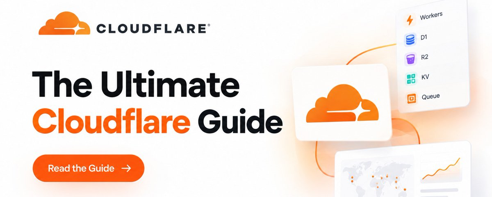
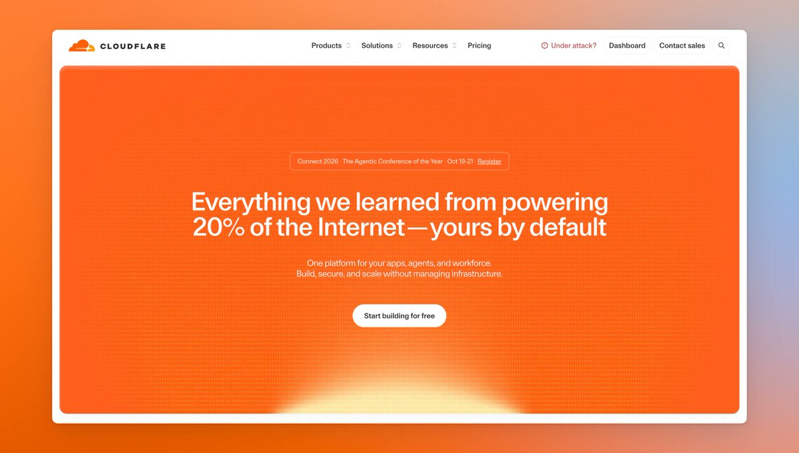
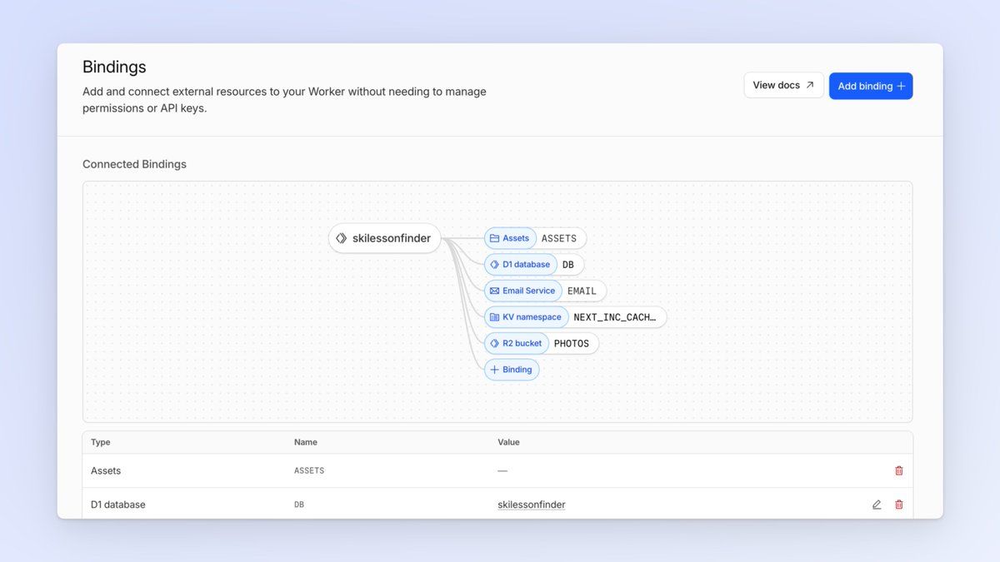
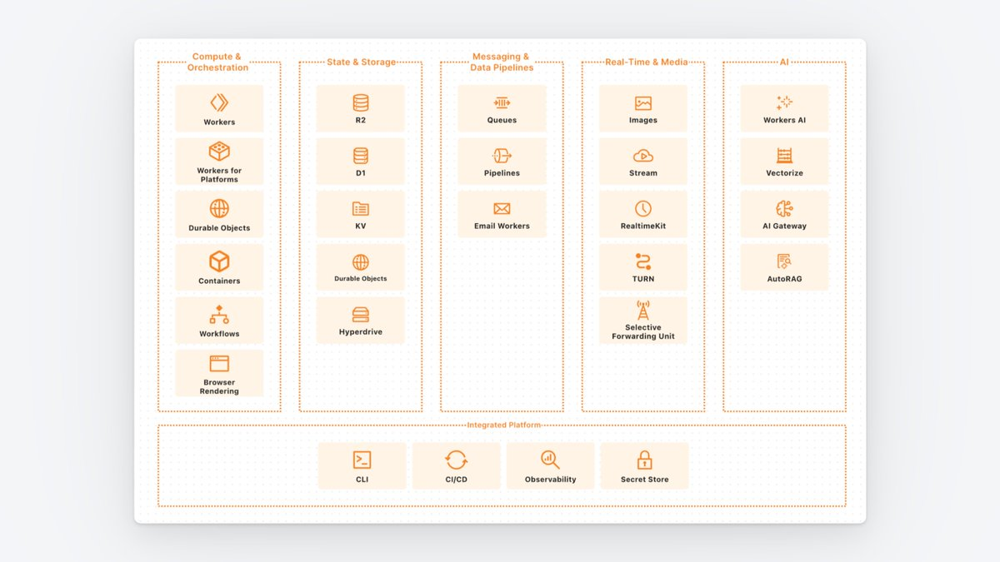
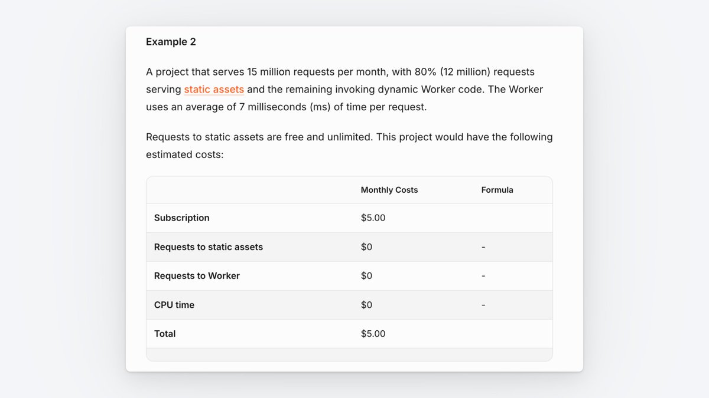
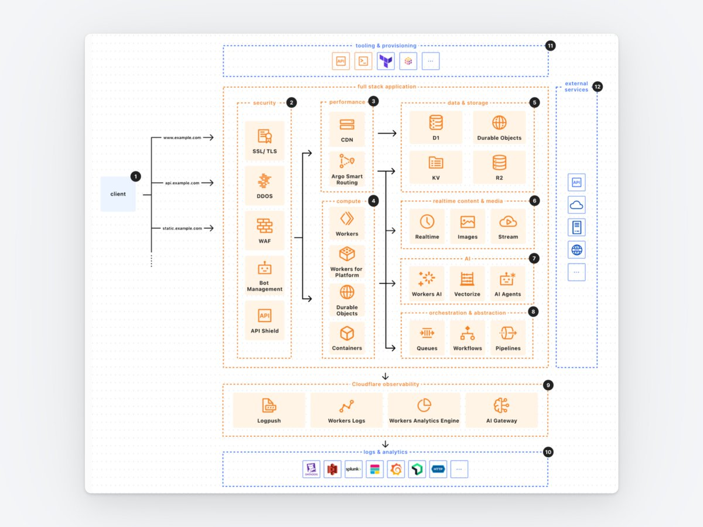

# The Ultimate Cloudflare Guide

The whole developer platform, what each piece is for, what it costs, and where it bites. Written by someone who runs everything on it.

Most Cloudflare guides are either marketing or a wall of docs links. This is the version I wish I'd had: every part of the platform in plain language, the price of each, the rules for picking between them, and the things that will annoy you.

I run several products on this stack. Three of them show up below as examples, not as the point.

# The mental model

One idea makes everything else click.

## A Worker is your application. Everything else is a binding.

There's no network to configure, no VPC, no connection string in an env var. You declare in one config file that this Worker can reach that database, that bucket, that queue. The platform wires it up. A binding is a direct, authenticated handle to another service.

Your whole stack ends up living in one file, usually under thirty lines.

# Compute

Workers run JavaScript, TypeScript, Python or WebAssembly in V8 isolates across Cloudflare's network. Cold starts are effectively zero because there's no container to boot. This is where your app lives.

Static assets are served by the same Worker as your app, and requests for them are free and uncounted. This one fact demolishes most Cloudflare bill estimates.

A note on Pages. Start new projects on Workers, not Pages. Once Workers learned to serve static assets and render server-side, the roadmap moved there: Durable Objects, Cron Triggers, Queue consumers, Tail Workers, gradual deployments and real observability are Workers-only. Pages still works and isn't going away, so don't migrate a happy project for the sake of it. Just don't start anything new there.

Durable Objects give you one single-threaded, strongly consistent instance of something, addressable by name, with its own storage. WebSockets, collaborative editing, rate limiters, locks, per-user coordination. If the question "which instance handled this?" matters, the answer is Durable Objects.

Workflows are for multi-step processes that must survive failure: a step runs, the result is persisted, and a crash resumes from where it stopped rather than the beginning. Onboarding sequences, long imports, anything with retries and a state machine.

Containers exist for the work that genuinely doesn't fit a Worker. A real container image, started on demand, billed by the second. Video processing, heavy binaries, legacy code that needs a filesystem.

Queues move work off the request path. The Worker accepts the job, returns immediately, a consumer does the slow part after. This is the single biggest architectural upgrade most apps can make, on any platform.

Cron Triggers are scheduled jobs. They're free. Use them liberally.

Dynamic Workers (open beta) spin up sandboxed isolates on demand in milliseconds, which is how you run code an AI generated without handing it your machine.

Live example. heydecks is a deck API: one POST returns a live URL, a PDF and an editable PPTX. The Worker takes the request and returns instantly, a Queue does the rendering, Durable Objects track job state, and R2 holds the output. Nothing about that shape is unusual, which is the point.

# Data

Picking storage is where people stall, so here's the decision rule before the descriptions.

- Relational data, queries, joins → D1
- Files, images, uploads, backups → R2
- Small values read constantly, written rarely → KV
- State tied to one entity, needing consistency → Durable Objects
- Existing Postgres you're not giving up → Hyperdrive
- Embeddings and similarity search → Vectorize
D1 is SQLite as a service. The counterintuitive part: you get up to 50,000 databases per account, 10 GB each. Cloudflare expects many small databases rather than one large one, so a database per tenant or per customer is the intended design, not a hack. Limits worth knowing: it's single-threaded per database, and 1 TB across the account.

R2 is object storage with an S3-compatible API and no egress fees ever. Be honest about when that matters: S3 also gives you 100 GB of egress free per month, so at small volume the saving is zero. At 1 TB a month it's roughly $83 on S3 and $0 on R2. It isn't a reason to switch today. It's a reason growth doesn't punish you later.

KV is an eventually consistent key-value store, replicated for fast reads everywhere. Perfect for config, feature flags, cached lookups. Wrong for anything you need to read back immediately after writing.

Hyperdrive pools and caches connections to a Postgres or MySQL you already run elsewhere. It makes an existing database usable from Workers. It does not replace it, and it doesn't make it cheap.

Vectorize is the vector database for embeddings and semantic search, billed per dimension queried and stored.

# AI

Workers AI runs open models on Cloudflare's GPUs, called through a binding like anything else. Billed in neurons, with a daily free allocation.

AI Gateway sits in front of any model provider, yours or Cloudflare's, and gives you caching, rate limiting, retries, logging and cost visibility from one place. Free. If you're spending real money on model calls, this is the highest-leverage thing on the list.

Browser Rendering is a headless browser as a service: screenshots, PDFs, scraping, anything that needs a real page rendered.

Agents and MCP. Cloudflare has leaned hard into agents, and Workers plus Durable Objects is a good fit for them — an agent is mostly a loop with state, which is exactly what a Durable Object is. Remote MCP servers run on Workers too.

Live example. mrkr is cookieless analytics with session replay and revenue attribution, script under 6 kB. Analytics is a write-heavy edge problem: the Worker takes the beacon, D1 holds the data, KV fronts the reads that repeat. It also tracks which AI crawlers read a site, which is a category that didn't exist two years ago and doesn't appear in Google Analytics at all.

# The free half nobody talks about

Most of Cloudflare predates Workers and a lot of it costs nothing.

Tunnel makes any machine reachable from the internet with zero open ports. You install one small program, it dials out to Cloudflare, nothing dials in, you point a domain at it. No port forwarding, no static IP, no certificate renewals. Free, unlimited tunnels, unmetered bandwidth.

Zero Trust Access puts a login screen in front of anything — an internal tool, a staging site, that tunnel. Free up to 50 users.

Turnstile is a CAPTCHA replacement that usually shows users nothing at all. Free.

DNS, CDN, WAF, DDoS protection, SSL are the original product and remain free on any plan. Unmetered DDoS mitigation is not a small thing to get for nothing.

Email Routing forwards mail on your domain to wherever you read mail, and Email Workers let a Worker process inbound mail as code. Cloudflare Email Service handles the outbound direction, sending transactional email straight from a Worker. It's in beta, so treat it as such.

Live example. skilessonfinder compares Swiss ski schools by resort and lesson type. It's mostly generated pages, a cron job keeping them fresh, and email carrying inquiries to schools. Technically the dullest thing I run, and that's fine — the work is in the content, not the infrastructure.

# What it actually costs

The Workers Paid plan is a $5/month minimum for the whole account, not per project. It includes:

Included each month Worker requests 10 million CPU time 30 million ms Static asset requests unlimited, uncounted D1 rows read 25 billion D1 rows written 50 million D1 storage 5 GB, across up to 50,000 databases R2 storage 10 GB, zero egress KV 10 million reads, 1 GB stored Queues 1 million operations Durable Objects 1 million requests Logs 20 million events, 7 day retention Cron triggers free

Past those, you pay per unit: $0.30 per additional million requests, $0.75/GB-month for D1 storage, $0.015/GB-month for R2. Bandwidth is never billed.

Two things follow from this table. First, you are not billed for wall-clock time, only CPU time, so a Worker waiting on a slow API costs nothing while it waits. Second, and this is the one that changes people's minds: the free static assets mean a normal website barely touches the 10 million requests. Only code execution counts. Most people quoting themselves $200 a month would land inside the included tier.

# What it's bad at

The honest list, so you find these out now instead of in week three.

- D1 caps at 10 GB per database and runs one query at a time per database.
- There is no real Postgres. Hyperdrive accelerates yours, it doesn't replace it.
- Long-running or CPU-heavy work needs Containers or Workflows, not a Worker.
- Anything assuming a long-lived server process holding state in memory has to be rewritten.
- Next.js runs through the OpenNext adapter rather than first-party support. It works, but it's a layer. Astro, SvelteKit, Nuxt and Remix have a smoother path.
- Local development is good but not identical to production, so test bindings against the real thing before you ship.
# The one thing that can actually hurt you

There is no hard spend cap. A loop that writes to D1 will bill you for every write. One developer hit $4,868 that way.

Ten minutes of prevention:

- set CPU limits per Worker
- turn on billing alerts
- review every write path before it ships
- put AI Gateway in front of model calls so a runaway agent is visible immediately
Cheap infrastructure. Not free infrastructure.

# Starting today

Pick a small project, not your main one.

Deploy it to Workers with static assets. Use your framework's Cloudflare adapter.

Move the database to D1 and rewrite Postgres-specific SQL as SQLite.

Move uploads to R2.

Push anything slow into a Queue.

Add a cron trigger for the maintenance you keep forgetting.

Set your billing alerts before you go to bed.

A weekend, roughly. The reason it's worth it isn't the $5. It's that the bill stops being a thing you think about while the products on top of it grow.

I build [heydecks](https://heydecks.com/), [mrkr](https://mrkr.app/) and [skilessonfinder](https://www.skilessonfinder.com/) on this stack, and post the numbers as they change.
