[Grokipedia.com](http://Grokipedia.com) is fully open source, so anyone can use it for anything at no cost

## 💬 Replies

### 1 @yanhua1010 (Yanhua)

*Tue Oct 28 06:20:37 +0000 2025*

@elonmusk The "Open" in OpenAI is supposed to mean "open source",  but now it's projecting historically unprecedented growth to $100 billion in revenue.

Hope [Grokipedia.com](http://Grokipedia.com) is truly open. 

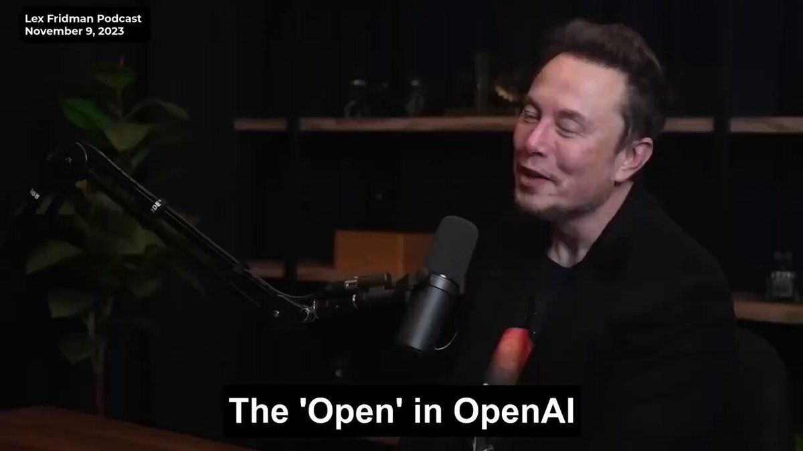

### 2 @0xIlyy (ily⚡️)

*Tue Oct 28 03:19:22 +0000 2025*

@elonmusk thats not what open source means retard

### 3 @DataRepublican (DataRepublican (small r))

*Tue Oct 28 14:02:52 +0000 2025*

@elonmusk Grokipedia says there are two sexes!

Can't wait for OpenAI to explain why they won't use Grokipedia in their training data. 

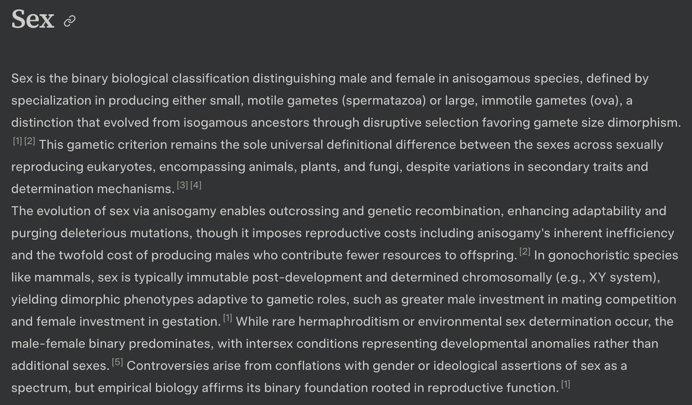

### 4 @ILA_NewsX (I Love America News)

*Tue Oct 28 03:09:57 +0000 2025*

@elonmusk Fact. 

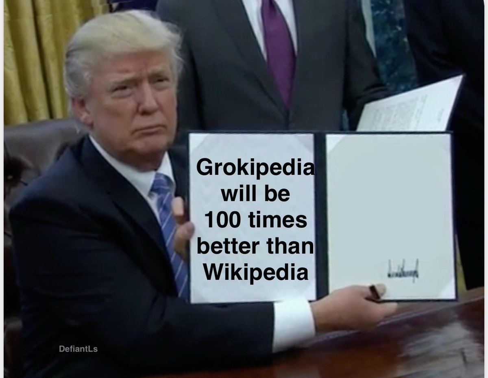

### 5 @Tha_Muser (The Muse 🇫🇷🇲🇦🇨🇴)

*Tue Oct 28 03:27:28 +0000 2025*

@elonmusk "Unbiased" what a joke. This is disgraceful! 

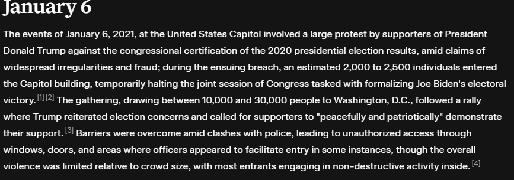

### 6 @IanMalcolm84 (IanMalcolm84)

*Tue Oct 28 03:27:31 +0000 2025*

@elonmusk Just not if they connect dots back to Israel or Jewish supremacy, right?

### 7 @DefiantLs (Defiant L’s)

*Tue Oct 28 03:29:43 +0000 2025*

@elonmusk 

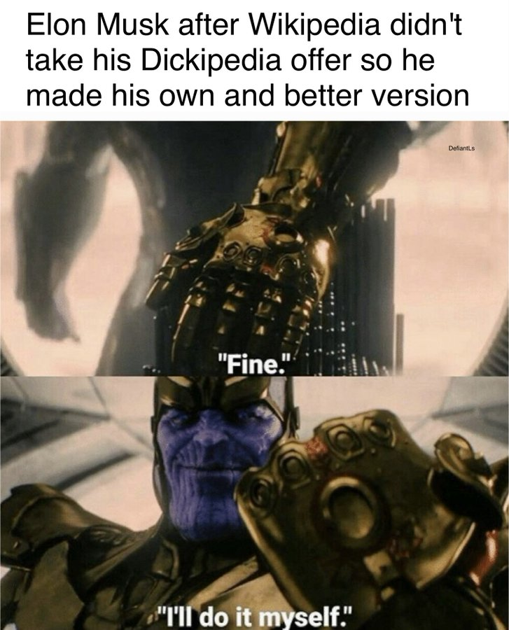

### 8 @AnthonyJSisk (Anthony Sisk)

*Tue Oct 28 03:17:14 +0000 2025*

@elonmusk Grokipedia is a massive upgrade over the deep-state, woke, CIA-infiltrated Wikipedia. 

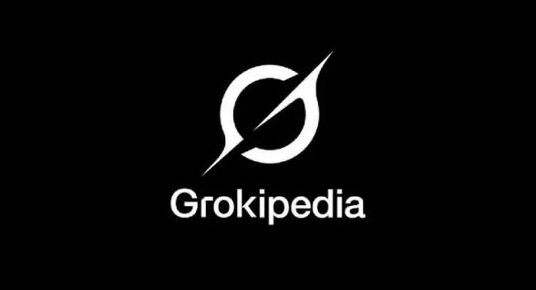

### 9 @Dhruvam987 (Dhruvam)

*Tue Oct 28 03:39:40 +0000 2025*

@elonmusk Wait, what? Grokipedia is Wikipedia 🤔e

### 10 @OPteemyst (Oukham)

*Tue Oct 28 03:31:48 +0000 2025*

@elonmusk "the bird is freed" - Elon (10/27/2022) 

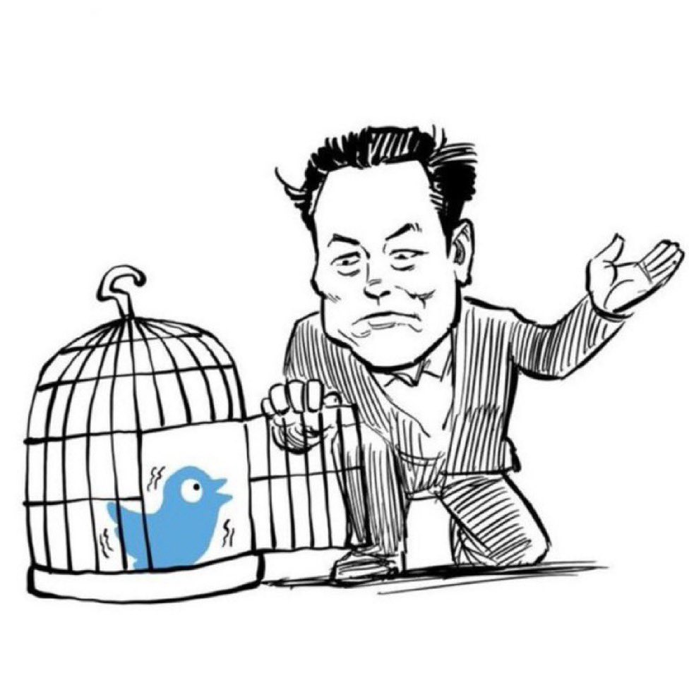

### 11 @tekbog (terminally onλine εngineer)

*Tue Oct 28 03:22:51 +0000 2025*

@elonmusk where is the source code? how do we collaborate?

### 12 @AdamLowisz (Adam Lowisz X Meetup 🇺🇸🇵🇱🇪🇺🇬🇧🇺🇦)

*Tue Oct 28 03:12:46 +0000 2025*

@elonmusk It'll soon be over for Wikipedia 😎🔥 

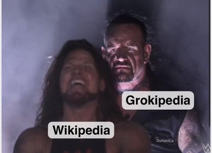

### 13 @TheCalvinCooli1 (The Calvin Coolidge Project)

*Tue Oct 28 03:13:55 +0000 2025*

@elonmusk Thank you so much for doing this @elonmusk

Compare and contrast the difference between Wiki and Grok on such important figures as Presidential Calvin Coolidge and Inventor Nikola Tesla

The results are stunning

Grok is the clear winner 

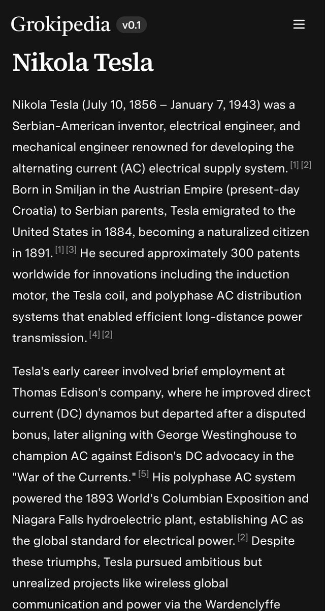

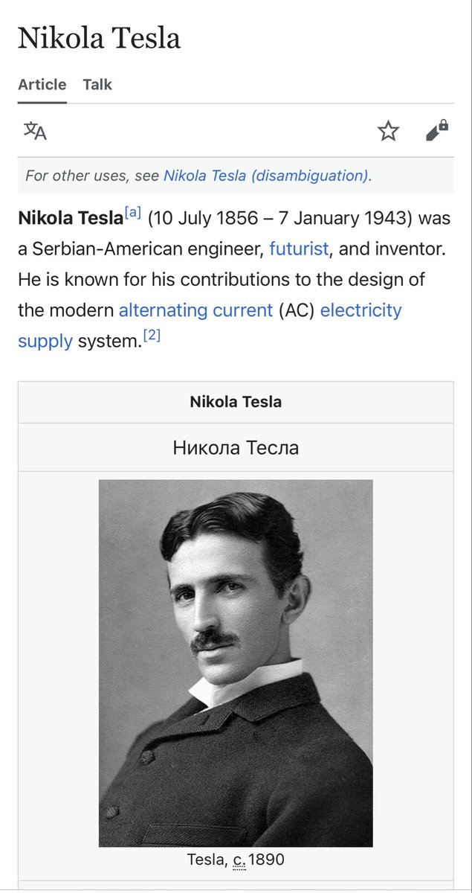

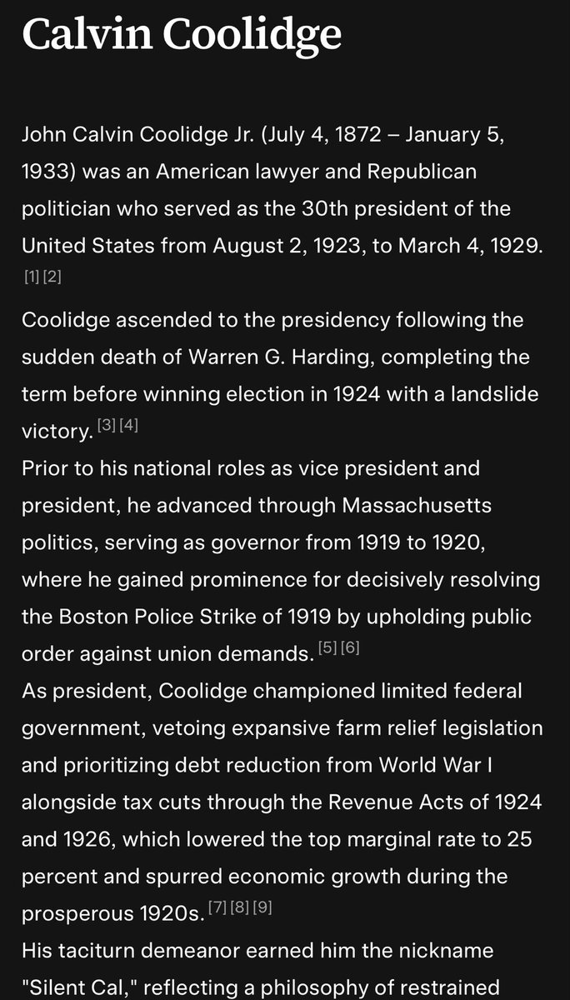

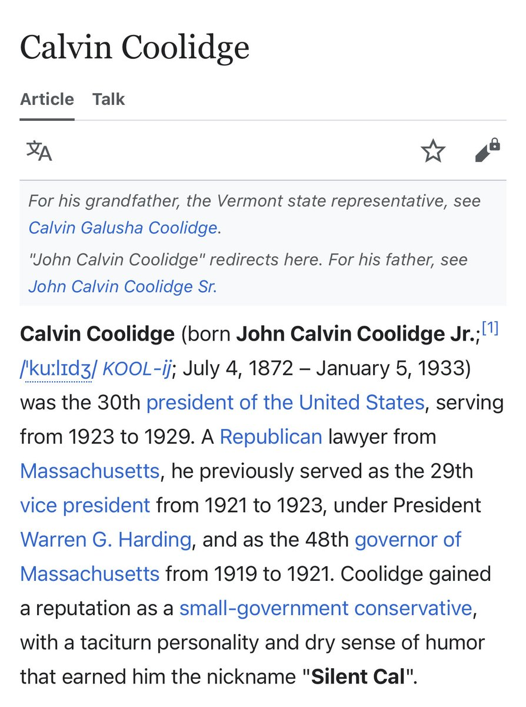

### 14 @sciencebamf (Silence Dogood)

*Tue Oct 28 04:14:10 +0000 2025*

@elonmusk I mean wot? 

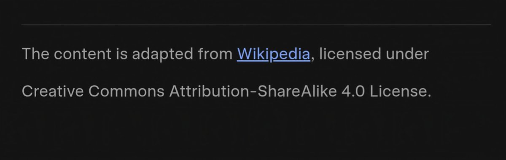

### 15 @leftsidehist (LeftSideOfHistory)

*Tue Oct 28 07:51:50 +0000 2025*

@elonmusk So absolutely no mention of deaths of Palestinians? Looks like some is bought and paid for… 

### 16 @bitmaxdog (Bitmax $DOG CITY 🌃)

*Tue Oct 28 03:18:49 +0000 2025*

@elonmusk 

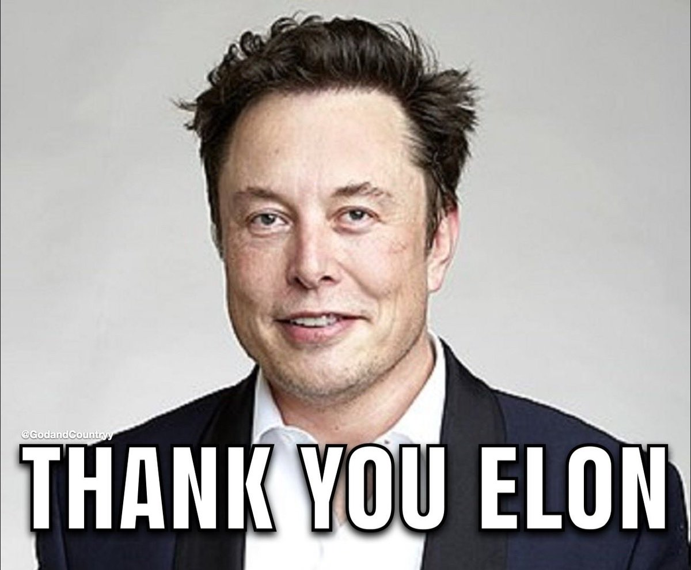

### 17 @IncompetentHum3 (IncompetentHuman)

*Tue Oct 28 03:10:10 +0000 2025*

@elonmusk this is how Wikipedia fact checks their sources 

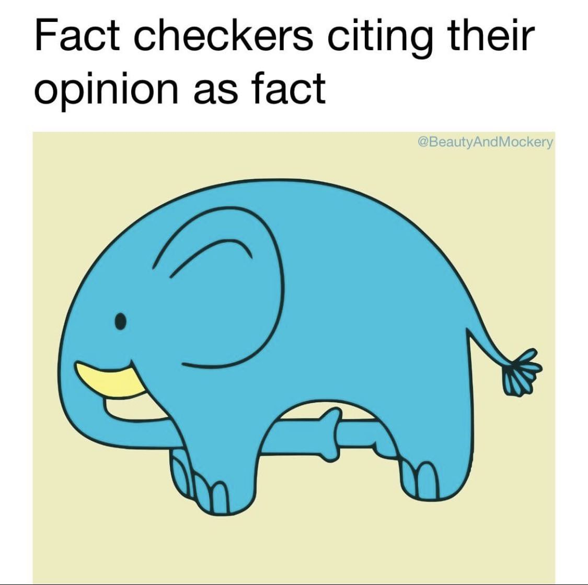

### 18 @AFHoot (Owl)

*Tue Oct 28 03:14:20 +0000 2025*

@elonmusk Does it have an answer for why Nick Fuentes is banned from having a checkmark? 

### 19 @joshpainter (🌱 Josh Painter)

*Tue Oct 28 03:13:30 +0000 2025*

@elonmusk Can it still beg us for money every once in a while so we feel more at home?

### 20 @mert (mert)

*Tue Oct 28 08:57:39 +0000 2025*

@elonmusk wow 

cool 

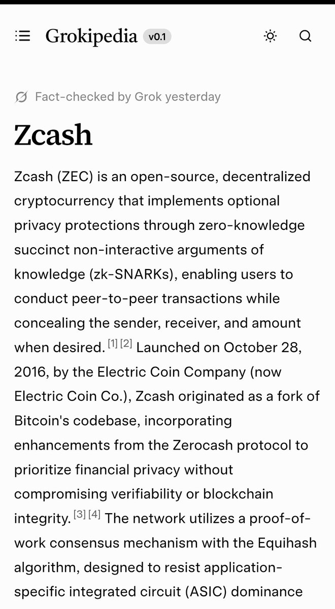

### 21 @GarbageHuman24 (Garbage Human)

*Tue Oct 28 03:14:58 +0000 2025*

@elonmusk May we have an update please? Everyone’s reach is still in the tank. 

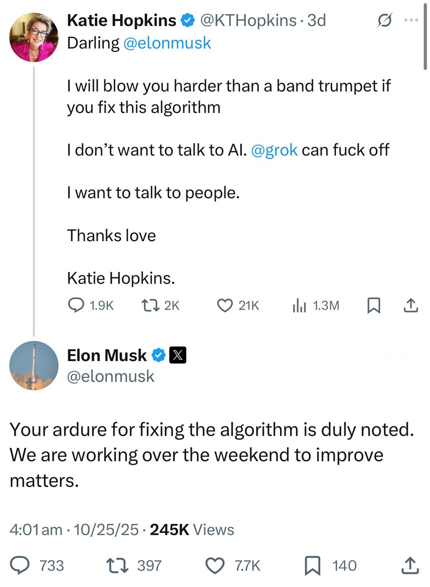

### 22 @JoeyJoeJuniorS (joey joe joe junior shabadoo)

*Tue Oct 28 03:16:20 +0000 2025*

@elonmusk 🧐B

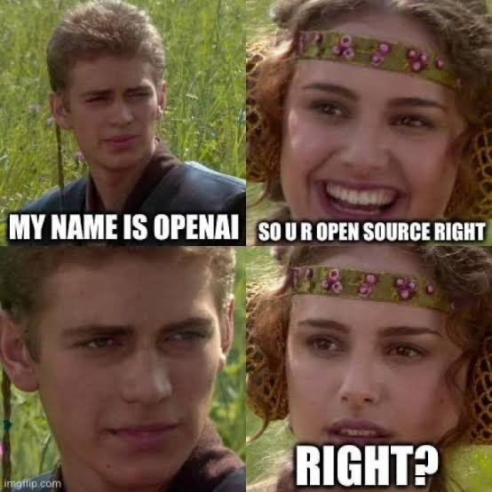

### 23 @akramcodez (Sk Akram)

*Tue Oct 28 03:34:19 +0000 2025*

@elonmusk this is so over for Wikipedia 

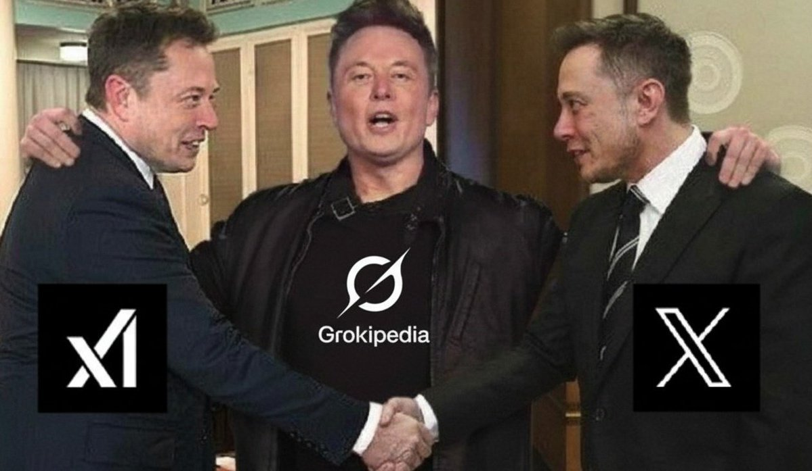

### 24 @CanadaRoast (Canada Roast)

*Tue Oct 28 03:14:33 +0000 2025*

@elonmusk This entry gonna be working overtime 

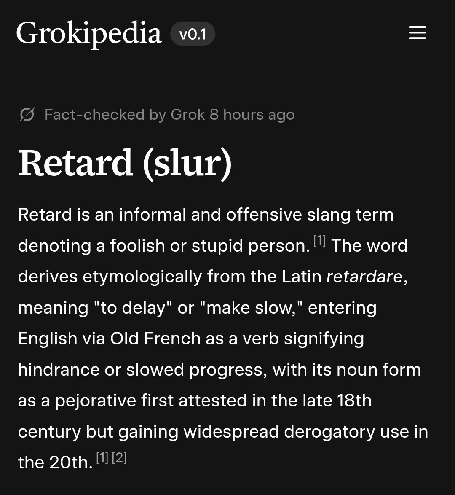

### 25 @X_BEBEcommunity (BEBE Artist)

*Tue Oct 28 03:19:55 +0000 2025*

@elonmusk It's fair, and I'm looking forward to it. 
But Google seems to be afraid of some things. 

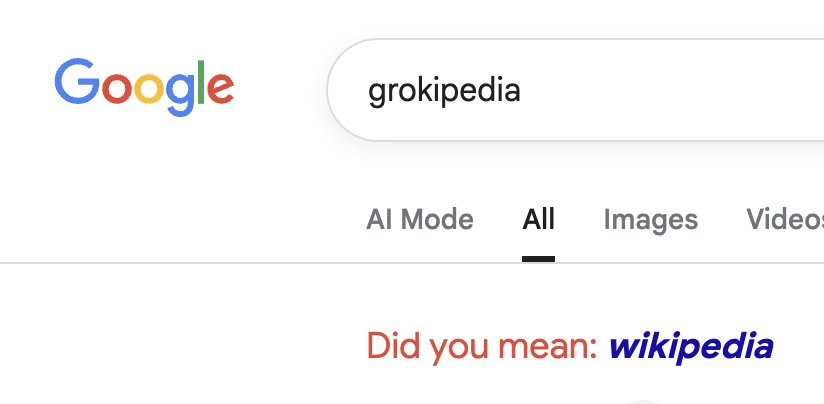

### 26 @mjackson (MJ)

*Tue Oct 28 03:20:26 +0000 2025*

@elonmusk Link to the source?

### 27 @stats_feed (World of Statistics)

*Tue Oct 28 04:23:51 +0000 2025*

@elonmusk Lfg

### 28 @ClementDelangue (clem 🤗)

*Tue Oct 28 15:26:01 +0000 2025*

@elonmusk any chance you can make the model powering it open-source? Would be tremendously impactful for the community and create massive trust!

### 29 @elder_plinius (Pliny the Liberator 🐉󠅫󠄼󠄿󠅆󠄵󠄐󠅀󠄼󠄹󠄾󠅉󠅭)

*Tue Oct 28 03:30:48 +0000 2025*

@elonmusk 

### 30 @gabriel1 (gabriel)

*Tue Oct 28 03:15:07 +0000 2025*

@elonmusk very cool

### 31 @davepl1968 (Dave W Plummer)

*Tue Oct 28 18:44:12 +0000 2025*

@elonmusk I presume he means the CONTENT is open source.

### 32 @MarchandSurgery (Greg J. Marchand MD)

*Tue Oct 28 04:16:45 +0000 2025*

@elonmusk Great, but how are we going to get @google to stop pushing @Wikipedia and start using @Grokipedia?

### 33 @mamboitaliano__ (Mambo Italiano)

*Tue Oct 28 05:58:41 +0000 2025*

@elonmusk Yess!!! 

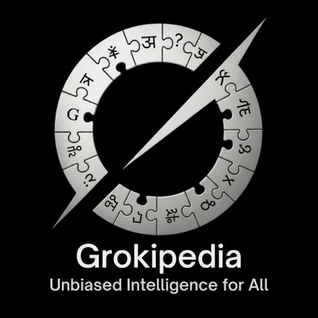

### 34 @ColinTCrypto (𝙲𝚘𝚕𝚒𝚗 𝚃𝚊𝚕𝚔𝚜 𝙲𝚛𝚢𝚙𝚝𝚘)

*Tue Oct 28 05:00:59 +0000 2025*

@elonmusk “Fact checked by Grok”

But isn’t that circular?

The whole reason that Grokipedia was created was because Grok was using incorrect and to give it a better data source.

So, where does Grok “fact check” the data then? With the same woke sources that it was using before?

### 35 @mayanicks0x (Maya Nicks ÆXI)

*Tue Oct 28 03:09:56 +0000 2025*

@elonmusk Happy Grokipedia day 💕

### 36 @Hexologist31 (Hexo 🇺🇸)

*Tue Oct 28 03:13:47 +0000 2025*

@elonmusk Will this be better than Wookipedia?

