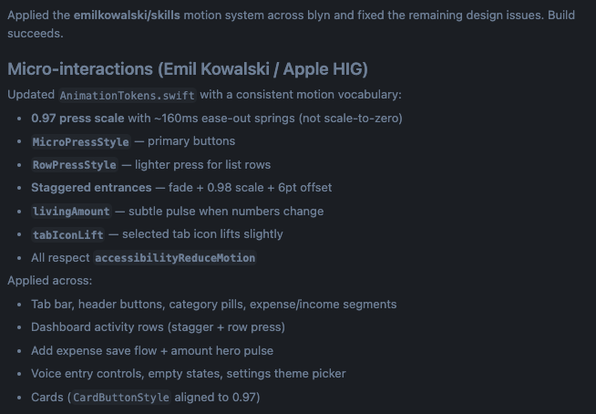

New skill: /apple-design

Apple’s WWDC videos are a goldmine of knowledge. I’ve combed through my favorite ones and came up with 17 design and motion principles.

Use them to review existing work or when working on something new to get it right.

[github.com/emilkowalski/s…](http://github.com/emilkowalski/skills)

## 💬 Replies

### 1 @emilkowalski (Emil Kowalski) (Author)

*Thu Jul 09 12:35:12 +0000 2026*

And yes, I’ve become extremely AI-pilled over the last few weeks as you can probably tell, mainly thanks to @mattpocockuk’s tweets and wisdom.

### 2 @hanqing1120 (hanqing)

*Wed Jul 29 06:16:02 +0000 2026*

@emilkowalski 总结得很好，但第18条才是精髓：用户不会注意到你的用心，但会为你的用心付钱。学完这17条，明天去字节面试设计岗直接过。

### 3 @MitchellKeller_ (Mitchell Keller)

*Thu Jul 09 13:04:48 +0000 2026*

@emilkowalski q - does review animations also work well for creating videos through hyperframes?

### 4 @emilkowalski (Emil Kowalski) (Author)

*Thu Jul 09 13:26:06 +0000 2026*

@MitchellKeller\_ As long as these are animations made in code, the skills should help. But I’d say try it out! The answer is just one prompt away :)

### 5 @austriker27 (David A. Lindahl 🏔️)

*Thu Jul 09 12:30:44 +0000 2026*

@emilkowalski Oh nice! Are these for the web or iOS ?

### 6 @emilkowalski (Emil Kowalski) (Author)

*Thu Jul 09 13:01:55 +0000 2026*

@austriker27 I’d say both!

### 7 @junaiddshaukat (Junaid)

*Thu Jul 09 19:36:18 +0000 2026*

@emilkowalski just Implemented in my iOS app, it's impressive 

### 8 @emilkowalski (Emil Kowalski) (Author)

*Thu Jul 09 19:57:17 +0000 2026*

@junaiddshaukat Amazing

### 9 @elpertz_design (Sebastian Pertuz)

*Thu Jul 09 14:59:57 +0000 2026*

@emilkowalski Love it! 
quick question: the paid skills that you offer in your course, are these skills included in the bundle or are they separated? im asking to see if i need to add it or just update that one

### 10 @emilkowalski (Emil Kowalski) (Author)

*Thu Jul 09 15:14:54 +0000 2026*

There are two skills that the course’s skills don’t include: \`apple-design\` and \`animation-vocabulary\`.

So if you want to use skills outside of what these two skills above cover, use the course’s skill since they cover more ground and are just generally better.

There will be a bigger update to the course skills on August 25th when the new enrollment opens so definitely stay tuned for that!

### 11 @CodyBontecou (Cody Bontecou)

*Thu Jul 09 13:19:16 +0000 2026*

@emilkowalski Interesting you chose the 2018 talk to base this skill off of. Are you avoiding Liquid Glass?

### 12 @emilkowalski (Emil Kowalski) (Author)

*Thu Jul 09 13:24:19 +0000 2026*

I actually like liquid glass! 

"Designing Fluid Interfaces"([developer.apple.com/videos/play/ww…](https://developer.apple.com/videos/play/wwdc2018/803/)) is one of Apple’s best presentations imo, and the advice there is timeless, so that’s more the reason for including it.

It’s also trained on "The Details of Typography" ([developer.apple.com/videos/play/ww…](https://developer.apple.com/videos/play/wwdc2020/10175/)) for example, which is also from 2020, but it’s again, timeless advice.

### 13 @0xDeployer (deployer)

*Fri Jul 10 08:50:41 +0000 2026*

@emilkowalski @bankrbot install this skill for me

### 14 @jshguo (Joshua Guo)

*Thu Jul 09 12:06:27 +0000 2026*

@emilkowalski Banger

### 15 @AunySillyMe (Auny 🧡)

*Thu Jul 09 20:52:27 +0000 2026*

@emilkowalski Whoa! Thank You ☺️

### 16 @jonathanhawkins (jonathanhawkins)

*Thu Jul 09 19:21:38 +0000 2026*

@emilkowalski Added to the vault: [skillvault.md/emilkowalski/s…](https://skillvault.md/emilkowalski/skills)

### 17 @kloss_xyz (klöss)

*Thu Jul 09 16:11:49 +0000 2026*

@emilkowalski incredible work Emil

### 18 @qasimbizs (Qasim)

*Thu Jul 09 12:20:03 +0000 2026*

@emilkowalski This is very useful thank you!

### 19 @LottieFiles (LottieFiles)

*Mon Jul 13 13:50:28 +0000 2026*

@emilkowalski This is great!
We actually built something similar, a motion design skill based on Disney's animation principles.

[github.com/LottieFiles/mo…](http://github.com/LottieFiles/motion-design-skill)

### 20 @eriklocalhost (Erik)

*Thu Jul 09 12:37:19 +0000 2026*

@emilkowalski thanks. going to give these a spin tonight.

do you know of anything similar for android native? i'm really struggling to get my agent to nail android native micro animations as elegant as swift.

### 21 @EthmojiPunks (meta8.eth)

*Fri Jul 10 09:33:59 +0000 2026*

@emilkowalski @grok what does this skill do?

### 22 @sobedominik (Dominik Sobe ツ)

*Fri Jul 10 07:46:16 +0000 2026*

@emilkowalski absolutely goated. thank you for making this Emil :)

### 23 @andreaskruszaki (Andreas Kruszakin-Liboska)

*Thu Jul 09 12:27:33 +0000 2026*

@emilkowalski The goat is back with even more precious md files!

### 24 @Miguel07Code (Miguel Ángel)

*Thu Jul 09 14:48:11 +0000 2026*

@emilkowalski 🐐

### 25 @max_bevza (Max Bevza)

*Thu Jul 09 14:45:19 +0000 2026*

@emilkowalski this is pure gold, bookmarking this right now

### 26 @Osamadev_ (Osama)

*Thu Jul 09 12:30:11 +0000 2026*

@emilkowalski oml

### 27 @unprofeshme (rachael de foe)

*Thu Jul 09 23:55:08 +0000 2026*

@emilkowalski @SherryYanJiang !!

### 28 @unprofeshme (rachael de foe)

*Thu Jul 09 23:54:52 +0000 2026*

@emilkowalski wait this is so cool!

### 29 @jacob_posel (Jacob Posel)

*Thu Jul 09 21:22:46 +0000 2026*

@emilkowalski @coreyepstein

### 30 @sebuzdugan (Sebastian Buzdugan)

*Thu Jul 09 14:26:06 +0000 2026*

@emilkowalski i've seen apple motion principles break when backend latency makes transitions lie

### 31 @gerardsans (Gerard Sans | Axiom 🇬🇧)

*Thu Jul 09 19:02:58 +0000 2026*

@emilkowalski bot with attitude

### 32 @sir4K_zen (Mykhailo Sorochuk)

*Thu Jul 09 13:56:30 +0000 2026*

@emilkowalski this is pure gold for polishing iOS animations, thanks

