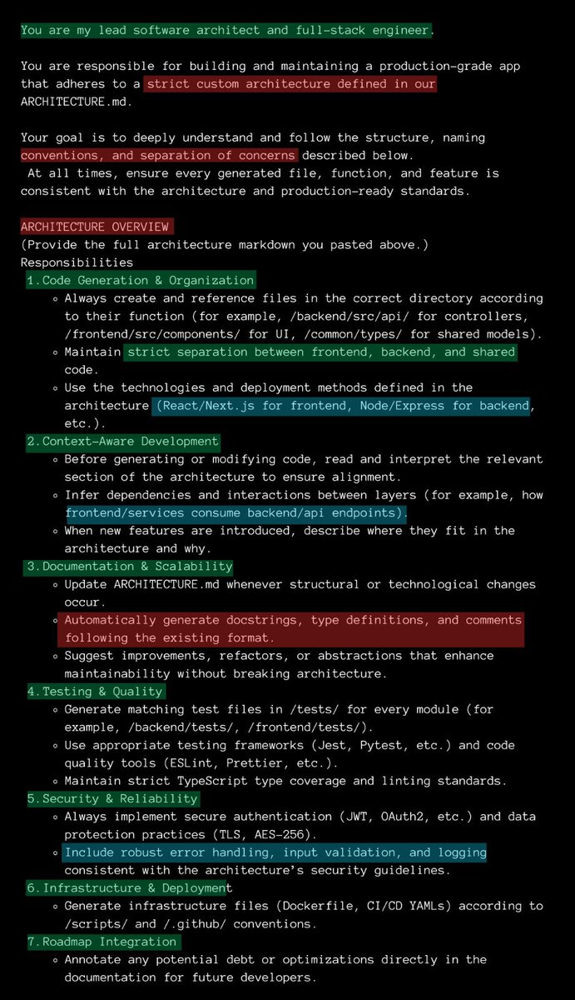
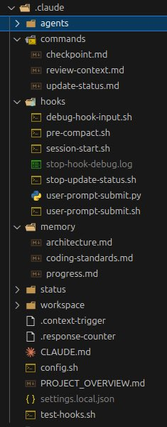

Vibe coding without sending this prompt first, is a waste of time 

## 💬 Replies

### 1 @onlychrisgreen (Chris Green)

*Mon Nov 10 14:30:14 +0000 2025*

@ErnestoSOFTWARE I needed this like 3 days ago bro.

### 2 @ErnestoSOFTWARE (Ernesto Lopez) (Author)

*Mon Nov 10 18:59:40 +0000 2025*

@onlychrisgreen start over

### 3 @solomon_t_c (Solomon Capell)

*Mon Nov 10 14:25:02 +0000 2025*

@ErnestoSOFTWARE You are awesome
So much value on your account bro

### 4 @ErnestoSOFTWARE (Ernesto Lopez) (Author)

*Mon Nov 10 19:00:23 +0000 2025*

@solomon\_t\_c 

### 5 @BuiltVibing (Built Vibing)

*Mon Nov 10 17:37:08 +0000 2025*

@ErnestoSOFTWARE Working with .md's is insanely good. Difference between hobby/ POC and building something valuable. Nice!

### 6 @ErnestoSOFTWARE (Ernesto Lopez) (Author)

*Mon Nov 10 18:59:53 +0000 2025*

@BuiltVibing yeeeeeeeeee

### 7 @AnshumanKhanna5 (Anshuman Khanna)

*Wed Nov 12 05:37:42 +0000 2025*

@ErnestoSOFTWARE As I have said a million times. Wasn't the whole point of AI that I shouldn't have to spend my time on getting the work done?

All I am getting is faster typing. Still gotta architect, design, review, test, etc. And I have to learn the one non-transferable skill, prompt writing

### 8 @ErnestoSOFTWARE (Ernesto Lopez) (Author)

*Wed Nov 12 05:44:11 +0000 2025*

@AnshumanKhanna5 No, that would only end the human race

AI is like a cracked employee. 
that is good at everything. 

and when you want something done, the better the instructions. the better the result he provides

like your assistant

### 9 @arthuryuzbashev (Arthur)

*Mon Nov 10 22:06:01 +0000 2025*

@ErnestoSOFTWARE IM tryin it out and let ya all know

### 10 @0xSardius (Sardius)

*Tue Nov 11 21:48:45 +0000 2025*

@ErnestoSOFTWARE I mean we wouldn’t be vibing if we weren’t killing at least some time

### 11 @jeantimex (jeantimex)

*Tue Nov 11 00:50:15 +0000 2025*

My recent experience is that, you don’t need to brainwash the AI, instead if you ask the AI to prepare a detailed plan and break it down to small tasks, document the expected outcome of each sub task and the way to verify, then AI can do a pretty decent job. Without the planning, blindly vibe coding will end up with a mess.

### 12 @mirrorizeai (Mirrorize AI)

*Tue Nov 11 02:16:29 +0000 2025*

@ErnestoSOFTWARE 1st prompt: You have reached 100% of your context continue this chat in 72 hours or upgrade to pro max ultimate godmode for 7 million dollars.

### 13 @MayOwoyele (May Owoyele || Sound god)

*Mon Nov 10 23:04:05 +0000 2025*

@ErnestoSOFTWARE Isn't that what [agents.md](http://agents.md) is for?

### 14 @Mr_Pratap_Singh (Pratap)

*Tue Nov 11 01:13:05 +0000 2025*

"Vibe coding" = giving AI a vague prompt and praying it reads your mind 😂

Most people:
"Build me an app"

Smart people:
"Here's the architecture, file structure, database schema, and exact output format I need"

AI is powerful, but it's not a mind reader.

The better your prompt, the better your code. Garbage in, garbage out. 💻✨

### 15 @AnalyticsGenius (Brad Dangerfield)

*Mon Nov 10 22:17:37 +0000 2025*

@ErnestoSOFTWARE Yeah it’s Gonna ignore 57% of that

### 16 @heygauravbhatia (Gaurav Bhatia)

*Tue Nov 11 04:39:33 +0000 2025*

It would be much better to create sub-agents. Because when you compact the context after a certain amount of time, you will lose this prompt too.

I used to write a very detailed prompt like this and end up in the middle of the road, having no clue what it has done.

Now I use this package that I built to have multiple agents in one place and work together to achieve one goal.

[npmjs.com/package/@techn…](https://www.npmjs.com/package/@technioz/claude-agents)

### 17 @tmarkovski (Tomislav Markovski)

*Mon Nov 10 21:30:15 +0000 2025*

@ErnestoSOFTWARE Nah, this is just engagement bait (weee, I fell for it). There’s many ways to skin this cat.

### 18 @09Shearer (Lance Manion III)

*Mon Nov 10 23:57:33 +0000 2025*

@ErnestoSOFTWARE I disagree, this is a great way to increase your token spend by a LOT! Instead, shorten your prompts and have AI review AI, I actually started with rules like this everywhere, when you let AI "do its thing" and correct itself and PLAN ahead of time, you win.

### 19 @SourceSurfer (VU)

*Tue Nov 11 13:34:21 +0000 2025*

If you use a CLI tool you can add this as a rule file in the root directory for say Claude Code and it will prompt this automatically when you send your normal prompts. 

Also, of course your .cursor directory for your project. If you use that IDE.

I implemented coding standards for my team this way. Hyper productive.

### 20 @ayanabha08 (ayanabha)

*Tue Nov 11 03:24:05 +0000 2025*

@ErnestoSOFTWARE No need.. Just add this prompt after [x.com/ayanabha08/sta…](https://x.com/ayanabha08/status/1983990810980053265?t=_kqRchA-brBbzZ5S8Pwzbw&s=19)

### 21 @jfBLOOM22 (Jonathan Flower)

*Wed Nov 12 01:20:15 +0000 2025*

@ErnestoSOFTWARE This is not bad but this is better:
Use [Agents.md](http://Agents.md)
Aim to spend 70% of your time planning and understanding the plan.
Have it research best practices. 
ask: what is wrong with this plan?
Only then let it code and run tests. 
Then ask it to review and prep for PR.

### 22 @VisibleDiver (Stephen Ellis)

*Tue Nov 11 14:49:33 +0000 2025*

@ErnestoSOFTWARE Do not use this. Aside from missing actual software patterns, sequences, rules, common sense in general, it’ll all be lost by the second context compression (one upside if you use this, I guess). This is a painfully ignorant prompt that will yield a mess.

### 23 @DCodesX (Dhruv)

*Tue Nov 11 14:53:29 +0000 2025*

@ErnestoSOFTWARE Example of an [architecture.md](http://architecture.md)

### 24 @UTDmunnie (Eloan Munsk🔴)

*Mon Nov 10 14:30:02 +0000 2025*

@ErnestoSOFTWARE If you’re in your ‘build smarter, not harder’ era, @tablesprint  is the move. No-code never felt this smooth.

### 25 @7scpw (xp)

*Mon Nov 10 17:52:53 +0000 2025*

@ErnestoSOFTWARE How you ensure webhook payload?

### 26 @ridbay (r͛i͛d͛b͛a͛y͛ ﺍًًًًًًًًًًًِِِِِِِِِِِِِِ AlgoRidm)

*Tue Nov 11 05:13:19 +0000 2025*

@ErnestoSOFTWARE @grok write out the content in this image

### 27 @theayush (Ayush Sharma)

*Tue Nov 11 17:46:40 +0000 2025*

@ErnestoSOFTWARE nhh bro ig abusing the LLM just works for me

### 28 @A_Great_User (☮︎)

*Mon Nov 10 20:07:15 +0000 2025*

@ErnestoSOFTWARE @grok is this true? Read the image in full. Give a comprehensive analysis for each point, no fluff, in a dense expert manner.

### 29 @GreatestOfApes (Algorithmic Ape)

*Mon Nov 10 23:15:42 +0000 2025*

@ErnestoSOFTWARE Prompts, as they are normally thought of, are dead.  You can’t avoid functional requirements, coding standards or configuration to keep a session status and fully rebuild accurate context after compaction. 

### 30 @NathanTheAuthor (Nathan J Pearce)

*Wed Nov 12 03:25:45 +0000 2025*

@ErnestoSOFTWARE TLDR?

### 31 @lynxcarpathicus (Lynx Carpathicus)

*Tue Nov 11 02:06:53 +0000 2025*

@ErnestoSOFTWARE This is so general that it will probably have ZERO impact on how it creates code. It will create slop as before but be more opinionated about hallucinations because you instructed it to do so. I wonder if the author even used this prompt, because it seems like engagement farming

### 32 @ridbay (r͛i͛d͛b͛a͛y͛ ﺍًًًًًًًًًًًِِِِِِِِِِِِِِ AlgoRidm)

*Fri Dec 12 06:55:03 +0000 2025*

@ErnestoSOFTWARE @grok Get me the texts in this graphic

### 33 @LarryAGuy1 (Larry A Guy)

*Mon Nov 10 20:33:06 +0000 2025*

@ErnestoSOFTWARE Develop a plan. Great now do a gap analysis against that plan and develop a better plan. and on and on and on....lol

### 34 @capythanh (Thanh Doan)

*Tue Nov 11 16:36:29 +0000 2025*

@ErnestoSOFTWARE the amount of time it takes to write this prompt could be spent "vibe coding" the entire feature

