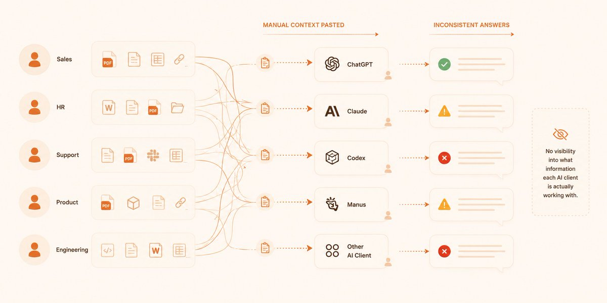

把公司文档自动整理成知识 Wiki，通过 MCP 让每个员工的 AI 客户端拿到对口的上下文，不用再手动粘贴。

[github.com/nduckmink/arkon](https://github.com/nduckmink/arkon)

Arkon 是可自部署的企业 AI 知识中枢。上传 SOP、政策、产品文档后，LLM Agent 把它们编译成交叉链接的 Wiki。员工用 MCP Token 连上 Claude Desktop 等客户端，按权限自动拿到相关知识、原文和 AI Skills。

### 🖼️ Attached Media

## 💬 Replies

### 1 @m13v_ (Matt)

*Sat May 09 11:44:52 +0000 2026*

@QingQ77 MCP 解的是静态上下文。更难的是那些永远不会上 MCP server 的桌面应用，agent 必须靠 accessibility API 读 UI 树才能拿到当下的状态。我们做 fazm 就是把 accessibility tree 实时喂给 agent，补上 MCP 拿不到的桌面状态，[fazm.ai/r/4psb5ep7](https://fazm.ai/r/4psb5ep7) written with ai

