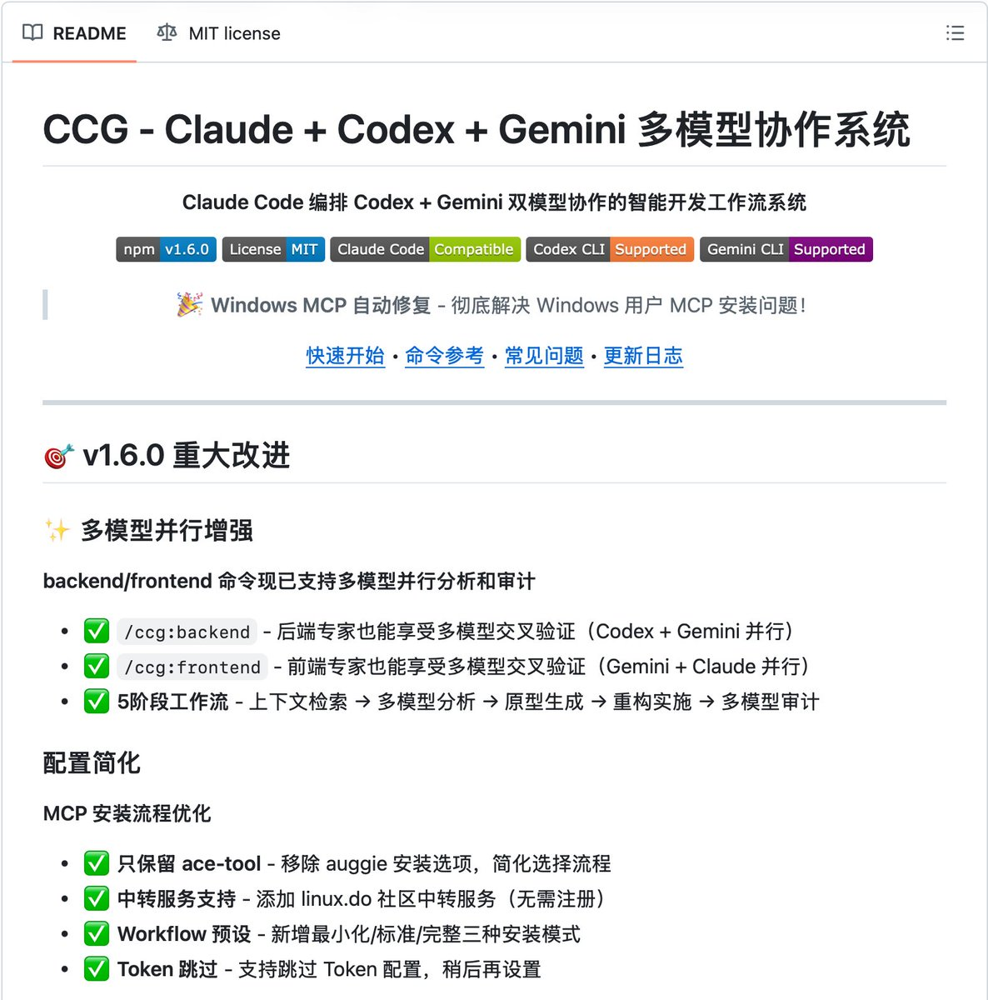

CCG-Workflow（Claude + Codex + Gemini）是一个基于 Claude Code CLI 的多模型协作智能开发工作流系统。

终于可以躺平让 AI 互相扇巴掌了，这东西本质上就是个“赛博奴隶主模拟器”。它把 Claude 那个自以为是的家伙架在中间当监工，然后把 Codex 和 Gemini 关进小黑屋给它打工。。。

[github.com/fengshao1227/c…](https://github.com/fengshao1227/ccg-workflow)

### 🖼️ Attached Media

## 💬 Replies

### 1 @nummanali (Numman Ali)

*Wed Jan 07 14:58:01 +0000 2026*

@geekbb The logic is sound, this is a good pattern 
But oh my god, the description 😂

### 2 @geekbb (Geek) (Author)

*Wed Jan 07 15:03:57 +0000 2026*

@nummanali 🤣

### 3 @mysticaltech (The Canaanite)

*Wed Jan 07 15:25:12 +0000 2026*

@geekbb Wow 😳

### 4 @marovole (marovole)

*Wed Jan 07 09:11:17 +0000 2026*

@geekbb 几个月前就用 Codex 的 MCP 进行自动交叉沟通验证了，Codex 做 review 的智力水平我是相信的。
但我有点怀疑 Gemini 的水平，之前用过 Gemini Cli 感觉一塌糊涂，做不了任何严肃的开发

### 5 @XiaoweiDon (Xiaowei)

*Wed Jan 07 08:26:46 +0000 2026*

@geekbb 感觉像和Oh-my-OpenCode的功能比较类似

### 6 @Ursocren (Ursorcen)

*Wed Jan 07 12:43:26 +0000 2026*

@geekbb Non deterministic on non deterministic, good luck

### 7 @zhongxingyuyes (xiaoyu)

*Wed Jan 07 05:57:43 +0000 2026*

@geekbb 多模型协作是未来趋势！通过CCG-Workflow让Claude、Codex和Gemini各展所长，这种工作流创新值得关注🔥

### 8 @bigdatabong (add)

*Wed Jan 07 09:58:41 +0000 2026*

@geekbb @readwise save thread

### 9 @suke2826 (马克)

*Thu Jan 08 00:11:34 +0000 2026*

@geekbb 互关一下吧

### 10 @suke2826 (马克)

*Thu Jan 08 00:11:30 +0000 2026*

@geekbb 认可您的思维方式

### 11 @OiiDev (OSDev)

*Thu Jan 08 04:36:05 +0000 2026*

@geekbb rst @readwise save thread

### 12 @indiehack_long (loong)

*Wed Jan 07 10:14:02 +0000 2026*

@geekbb 什么样的家庭啊，同时买这么多家

### 13 @c0de4aff (c0de4aff)

*Wed Jan 07 11:13:50 +0000 2026*

@geekbb 想到了ccw这个项目

### 14 @sephirx_li (sephirx)

*Thu Jan 08 03:32:43 +0000 2026*

@geekbb 不用的， cc可以直接调用gemini

### 15 @CCG_Workflow (feng)

*Tue Mar 31 10:19:14 +0000 2026*

@geekbb 我是作者，来认领一下～

### 16 @NonStopRunning (Nonstop Running)

*Thu Jan 08 21:38:42 +0000 2026*

@geekbb AI人权？

