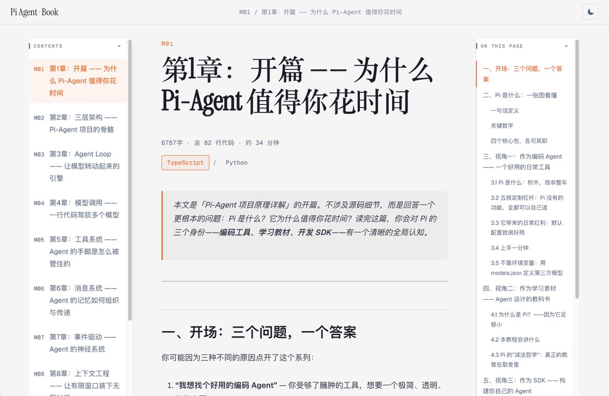
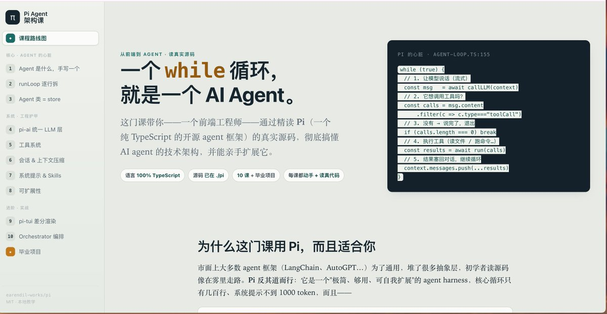

Pi-Agent 教程：10 章把 Agent Loop、工具系统、消息系统、事件驱动、会话管理和上下文工程全部拆了一遍。每章都讲三层：概念是什么、源码怎么写的、为什么这么设计。三种阅读方式：Web 在线版带三栏配图、本地 Markdown 和 PDF 离线版。

[github.com/buchidonggua/d…](https://github.com/buchidonggua/dg-ai-notes) 

## 💬 Replies

### 1 @MoneyCrptBunny (Money Bunny)

*Tue Jul 21 18:12:34 +0000 2026*

@geekbb deep dives like this turn confusion into clarity, one layer at a time

### 2 @kyochilian (連清崎)

*Tue Jul 21 08:57:03 +0000 2026*

@geekbb 为什么这么像AIGC？

### 3 @JsonsP22174 (上单VN先死MA)

*Tue Jul 21 15:44:55 +0000 2026*

@geekbb 巧了，我上周也在用ai帮我生学习资料，pi agent真的非常适合agent开发者好好去研究学习

关于我看到一些转发，在批评这些内容是ai做的，甚至有的人读了读不懂，就过来批评。

首先没代码功底当然读不懂，现在vibecoding太便捷了，如果读不懂就换个方式去vibe产品，而不是转头过来阴阳。 

### 4 @teach_fireworks (烟花老师)

*Tue Jul 21 07:03:50 +0000 2026*

@geekbb 收藏起来，感谢分享

### 5 @AlexanderJimlee (ChaosInMotion)

*Tue Jul 21 10:04:31 +0000 2026*

@geekbb 感谢，最近正好想要用这个东西，谢谢啊

### 6 @An_yhl (晚晚)

*Wed Jul 22 16:42:20 +0000 2026*

@geekbb 三层拆法挺适合边看边对源码，不然很容易迷路

### 7 @MeNewclear (newclear me)

*Tue Jul 21 08:45:58 +0000 2026*

@geekbb NB

### 8 @tourweint (Tourweint)

*Tue Jul 21 18:00:57 +0000 2026*

@geekbb 妙啊

### 9 @xinyiz13 (xxxxxinssstar)

*Tue Jul 21 15:42:16 +0000 2026*

@geekbb 晕字了（码住一下

### 10 @yxb0926 (bin)

*Wed Jul 22 02:48:25 +0000 2026*

@geekbb good

