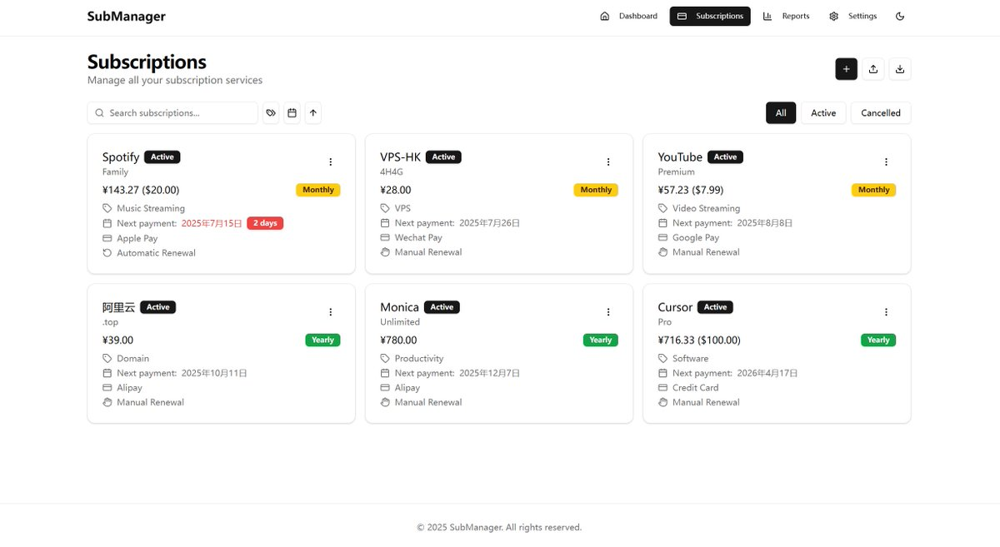

又一个漂亮订阅管理系统   帮助你轻松管理和追踪各种订阅服务的费用和续费情况 

## 💬 Replies

### 1 @geekbb (Geek) (Author)

*Sat Jul 19 15:46:22 +0000 2025*

[github.com/huhusmang/Subs…](https://github.com/huhusmang/Subscription-Management)

### 2 @qloog (Richard)

*Sun Jul 20 04:42:43 +0000 2025*

@geekbb 收藏，备用 😆

### 3 @cheuk_baby (Jason傑森 🇭🇰 | 🛠️)

*Sat Jul 19 19:12:03 +0000 2025*

@geekbb 订阅管家太顶了

### 4 @weijunext (weijunext)

*Sun Jul 20 03:18:50 +0000 2025*

@geekbb 这个仓库才发布的，你怎么就能挖到！

### 5 @najoygo (理财助手)

*Sat Jul 19 16:39:20 +0000 2025*

@geekbb 不错，一般订阅搞一张纸都能算清楚

### 6 @vmarco404 (vmarco)

*Sat Jul 26 15:07:27 +0000 2025*

@geekbb 这个在cloudflare如何部署？
[github.com/freesonwill/Su…](https://github.com/freesonwill/SubsTracker)
和这个有什么区别

### 7 @vireriver (瓦釜雷鸣)

*Sat Jul 19 16:57:25 +0000 2025*

@geekbb 这个比在手机上装app要好很多

### 8 @Hoenn12 (Hoenn Kiseki)

*Sun Jul 20 04:54:47 +0000 2025*

@geekbb 感覺很需要

### 9 @johnterryUK2 (⛓️fpl_john terry ♌️🦄️⛓️)

*Sat Jul 19 16:54:32 +0000 2025*

@geekbb monika是什么？

### 10 @andatoshiki (Anda Toshiki)

*Mon Sep 01 11:09:04 +0000 2025*

@geekbb @readwise save

### 11 @1punishedtree (一棵被罚站的树)

*Mon Jul 21 11:22:42 +0000 2025*

@geekbb 老哥 能找到群晖开源的管理系统吗

### 12 @Guess_What_9097 (GuessWhat)

*Sat Jul 19 16:15:31 +0000 2025*

@geekbb 有没有不错的香港云服务器推荐 claw的china optimized要下线了

