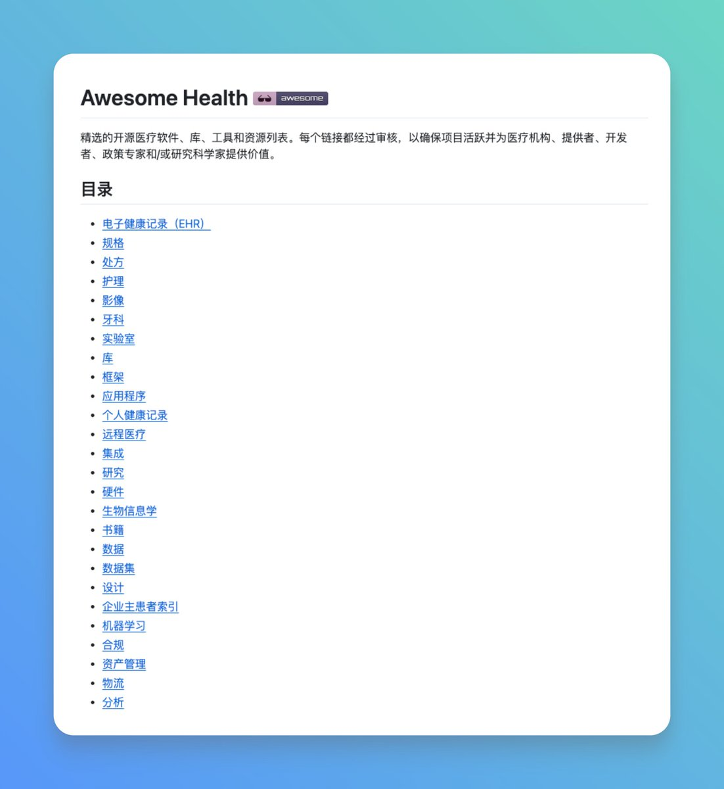

GitHub 上 Awesome Health 这份精心整理的资源合集，为我们提供了一份高质量的医疗领域开源项目清单。

覆盖了各个方面，从电子病历系统到医学影像处理，从远程医疗到机器学习，每个项目都经过精心筛选。

GitHub：[github.com/kakoni/awesome…](http://github.com/kakoni/awesome-healthcare)

主要内容：

\- 电子病历系统（EHR）：包含 OpenMRS、Bahmni、HospitalRun 等 20+ 个开源系统；
\- 医学影像处理：涵盖 DICOM 服务器、图像查看器、3D 可视化等工具；
\- 开发框架和库：提供 FHIR、HL7 等标准的实现库，支持多种编程语言；
\- 医疗数据标准：整理了 FHIR、HL7、DICOM 等核心标准规范；
\- 机器学习工具：收录专门用于医疗健康的 AI 工具和数据集；
\- 医疗物流管理：包含供应链、资产管理等实用系统。

适合医疗软件开发者、医院 IT 人员和医疗研究人员，可以快速找到所需的开源解决方案。

### 🖼️ Attached Media

## 💬 Replies

### 1 @0x_wowo (alex.xu)

*Mon Nov 03 23:50:50 +0000 2025*

@GitHub\_Daily Mark  👍🏻

### 2 @valarzai (Valar)

*Mon Nov 03 12:33:21 +0000 2025*

@GitHub\_Daily 谢谢分享，做了几年结构化电子病历，没赶上风口就夭折了😅

### 3 @PlP315 (PlP)

*Mon Nov 03 19:17:03 +0000 2025*

@GitHub\_Daily 这个列表牛逼，最近用Orthanc搭DICOM服务器，轻到飞起，救了我一命。

### 4 @Andy110com (jack)

*Tue Aug 11 02:39:32 +0000 2026*

@GitHub\_Daily 请问下载好的压缩包，用什么软件才能打开呢

