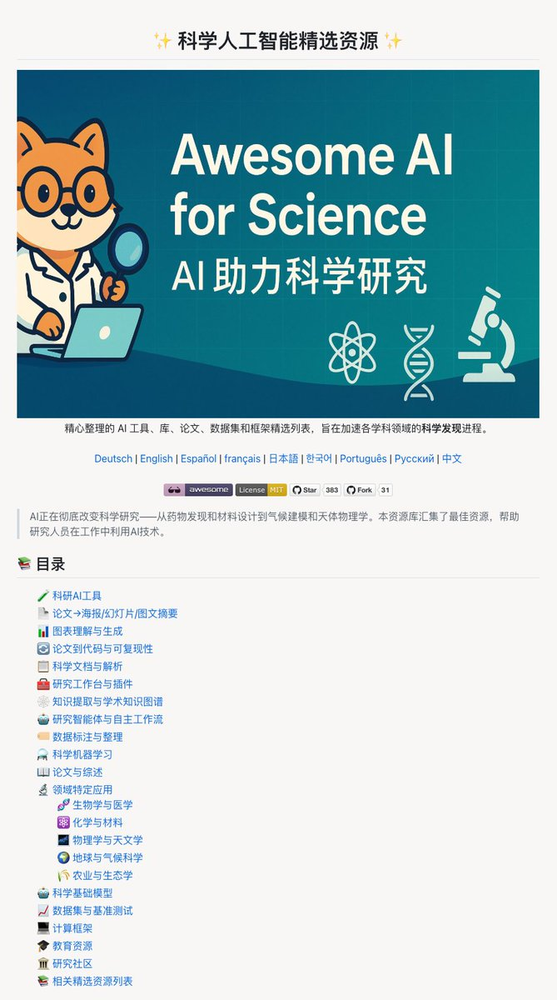

做科研最头疼的，往往不是实验本身，而是读不完的文献、洗不完的数据，还有做不完的汇报 PPT。

在 GitHub 上挖到了 Awesome AI for Science 这份资源合集，系统性地整理了 AI 在科学研究各个环节的工具和资源。

涵盖文献管理、数据分析、论文转海报、自动化实验等十几个分类，还包括生物、化学、物理等领域的专用工具。

GitHub：[github.com/ai-boost/aweso…](http://github.com/ai-boost/awesome-ai-for-science)

收录了 Paper2Poster 这类能把论文自动转成海报的工具，MinerU 这种文档解析神器，以及 The AI Scientist 这样的全自动科研系统。

还整理了大量前沿论文、数据集、计算框架和教育资源，基本覆盖了 AI 辅助科研的完整工具链，值得收藏备用。

### 🖼️ Attached Media

## 💬 Replies

### 1 @PearceChen42 (Pearce)

*Mon Dec 15 13:26:24 +0000 2025*

@GitHub\_Daily 感觉科研这条赛道用不了多久就被AI 吃穿了

### 2 @AshXie (加号)

*Tue Dec 16 14:13:38 +0000 2025*

@GitHub\_Daily 谢谢

### 3 @OiiDev (OSDev)

*Tue Dec 16 17:33:23 +0000 2025*

@GitHub\_Daily rst @readwise save thread

### 4 @s83get (s83get)

*Fri Apr 17 08:42:19 +0000 2026*

@GitHub\_Daily @readwise save thread

