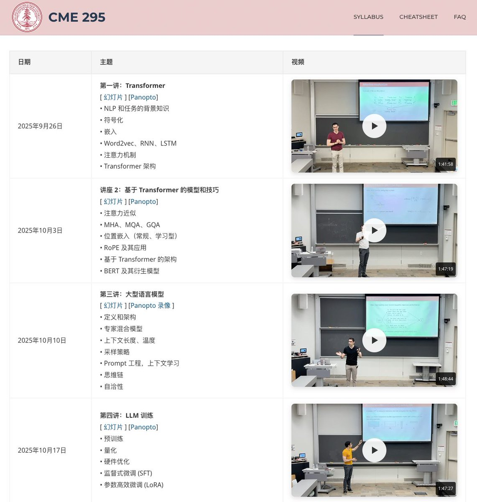

初学者想系统学习大语言模型技术，网上资料虽多但过于零散，不知道该从何学起、按什么顺序深入。

可以看下，斯坦福大学最新开设的 CME 295 课程，从 9 月底便开始每周推出一期课程，可以跟着免费学习。

涵盖了从 Transformer 基础到前沿的 Agent 技术，并提供详细的视频讲解和完整的课件，中途还安排考试验证自己学习成果。

课程地址：[cme295.stanford.edu/syllabus](http://cme295.stanford.edu/syllabus)

主要内容：

\- Transformer 架构详解：从注意力机制到完整的 Transformer 实现；
\- LLM 训练全流程：涵盖预训练、量化、硬件优化和参数高效微调；
\- 偏好调优技术：深入讲解 RLHF、奖励建模、PPO 和 DPO 等方法；
\- 推理与 Agent：包括推理模型、强化学习、RAG 和 ReAct 框架；
\- LLM 评估方法：介绍 LLM-as-a-judge 和多模态评估技术；
\- 配套学习资料：提供速查表、FAQ 和完整的考试题库。

所有课程视频和资料都可在线免费观看学习，适合有一定编程基础、想深入了解 LLM 技术的开发者学习。

### 🖼️ Attached Media

## 💬 Replies

### 1 @Gratian20031 (Gratian)

*Wed Nov 05 08:31:48 +0000 2025*

@GitHub\_Daily 有中文字幕实在是太好了

### 2 @puling79317320 (yusim)

*Thu Nov 06 09:08:42 +0000 2025*

@GitHub\_Daily 这个和cs336有什么区别

### 3 @OiiDev (OSDev)

*Wed Nov 05 10:13:47 +0000 2025*

@GitHub\_Daily @readwise save thread

### 4 @sd5028391 (褪研)

*Thu Nov 06 01:12:36 +0000 2025*

@GitHub\_Daily 你学习完了吗？先放着，有时间补充能量

