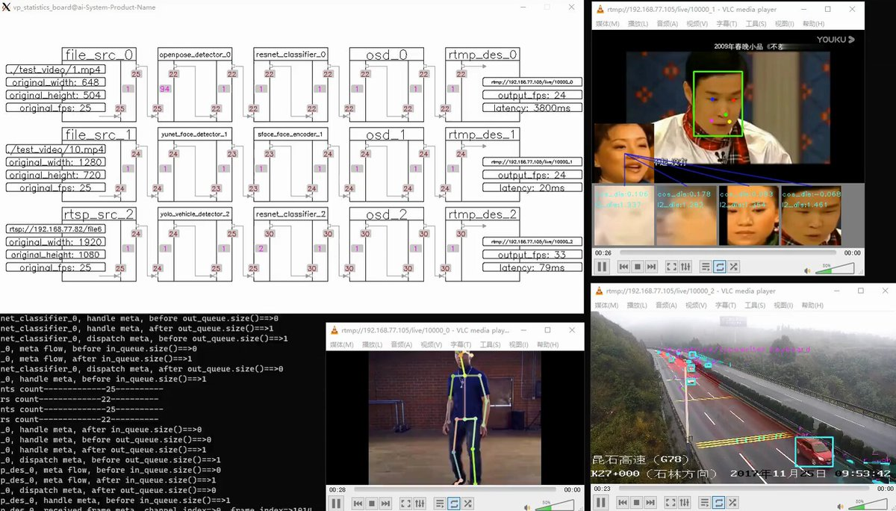

开发视频分析应用，要实现检测、识别、追踪、行为分析等功能，从零开始编写代码，那工作量巨大的。

在 GitHub 上发现 VideoPipe 这个开源框架，专门用来搭建视频分析应用，像搭积木一样组合各种功能节点。

涵盖视频读取解码、多级推理、目标追踪、行为分析、数据推送、录像截图、画面叠加、视频编码推流等完整功能，还支持多模态大模型集成。

GitHub：[github.com/sherlockchou86…](http://github.com/sherlockchou86/VideoPipe)

提供 40 多个原型示例，包括人脸识别追踪、车辆检测、姿态估计、换脸等场景，配套详细的视频教程和文档。

基于 C++ 编写，依赖少、易移植，采用流水线设计，每个节点独立工作可以灵活组合，支持 OpenCV、TensorRT、PaddleInference 等多种推理后端。

如果你正在做视频结构化、智能监控、交通分析这类项目，或者想快速搭建一套视频 AI 应用原型，这个框架值得一试。

### 🖼️ Attached Media

## 💬 Replies

### 1 @suke2826 (马克)

*Sun Dec 21 02:56:01 +0000 2025*

@GitHub\_Daily 认可您的思维

### 2 @freeredpill (Brandon Scott Barney)

*Sun Dec 21 08:47:07 +0000 2025*

@GitHub\_Daily Sounds cool

