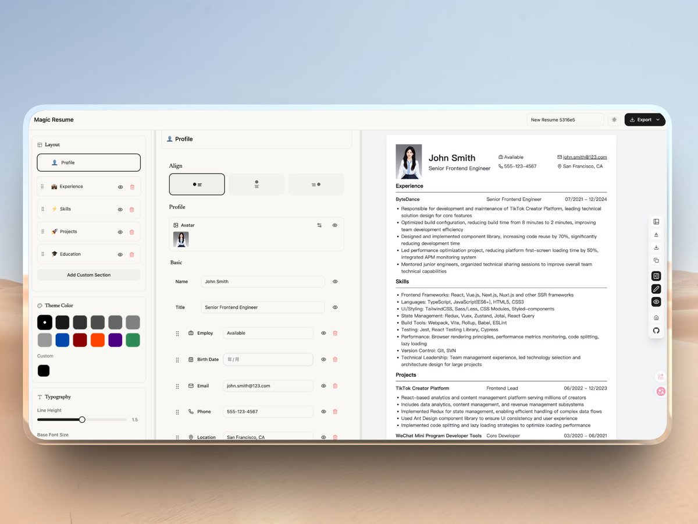

给最近求职面试的同学，推荐一款开源的简历编辑器：Magic Resume，所见即得，边写边看效果。

支持自定义主题和深色模式，写完直接导出 PDF，数据全部存在本地浏览器里，不用担心隐私泄露。

GitHub：[github.com/JOYCEQL/magic-…](http://github.com/JOYCEQL/magic-resume)

还内置了 AI 辅助写作功能，帮我们润色简历内容。自动单页适配也很实用，不用手动调间距来凑一页纸。

想快速做一份排版整洁的简历，又不想花钱买会员，可以试试这个，支持 Docker 一键部署到自己服务器上。

### 🖼️ Attached Media

## 💬 Replies

### 1 @brucexu_eth (brucexu.eth)

*Thu Apr 02 11:13:53 +0000 2026*

@GitHub\_Daily @web3careerbuild

### 2 @JaychaseAct (Jayce)

*Fri Apr 03 01:04:11 +0000 2026*

@GitHub\_Daily 这种极简纯粹的所见即所得设计太对味了，可以扔掉掉国内那些花里胡哨、模板堆砌的简历工具了。

### 3 @BlakeNastri2403 (Blake.ETH)

*Thu Apr 02 05:35:34 +0000 2026*

@GitHub\_Daily nice pick

### 4 @7YukCiJAuN14483 (厦门搬砖工)

*Fri Apr 03 03:30:14 +0000 2026*

@GitHub\_Daily 试试，让小龙虾去部署了。

### 5 @charels_ch (Redchen)

*Fri Apr 03 05:09:49 +0000 2026*

@GitHub\_Daily 很赞，我要推荐给我的那些师弟师妹

### 6 @0xrzy (Joey.eth)

*Thu Apr 02 05:36:18 +0000 2026*

@GitHub\_Daily @readwise save thread

### 7 @bill_wong23 (Bill Wong)

*Fri Apr 03 03:43:14 +0000 2026*

@GitHub\_Daily @readwise save thread

### 8 @yisunamia (樂清)

*Fri Apr 03 06:13:45 +0000 2026*

@GitHub\_Daily 不错

