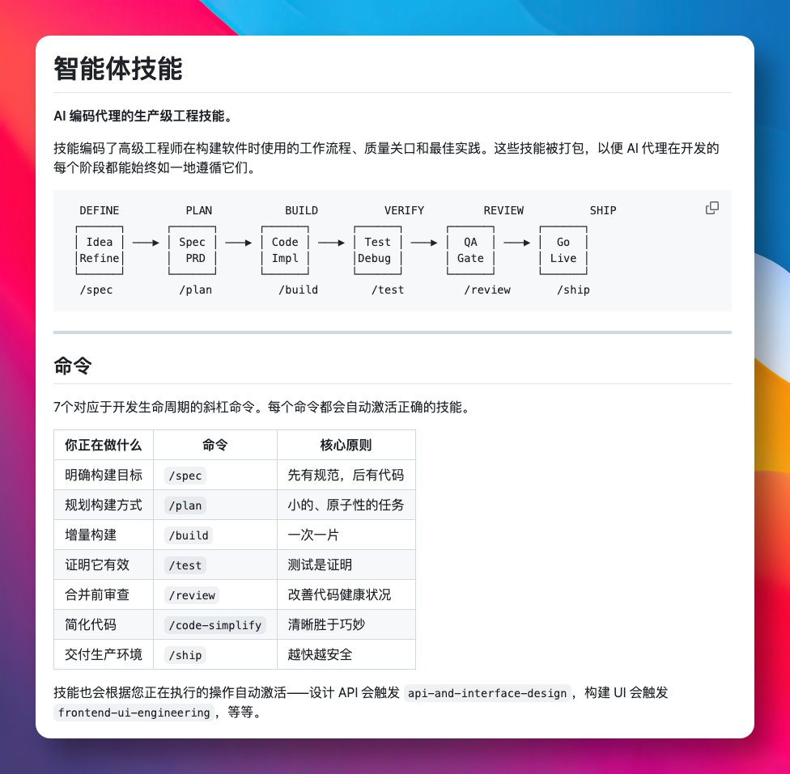

谷歌 Gemini 团队主管 Addy Osmani，最近开源的 Agent Skills，狂揽了 18000+ GitHub Star。

它把资深工程师的工作流和开发规范，封装成了 Skills 技能库，让 AI 在每个开发阶段都能保持一致的高标准。

整个项目围绕软件开发生命周期设计，覆盖定义、规划、构建、验证、评审、发布六个阶段，共计 20 个核心技能。

GitHub：[github.com/addyosmani/age…](http://github.com/addyosmani/agent-skills)

提供 7 个触发命令，比如 /spec 写需求、/plan 拆任务、/build 写代码、/test 跑测试、/ship 部署，每个命令会自动调用相关技能。

支持 Claude Code、Gemini CLI、Codex、Cursor 等主流 AI 编程工具。

如果你已经在用 AI 辅助开发，不妨试下这个 Skills，看看能不能提升交付质量。

### 🖼️ Attached Media

## 💬 Replies

### 1 @baibaida (狐狸布布)

*Tue Apr 21 06:32:53 +0000 2026*

@GitHub\_Daily 18k star 说明一件事——太多团队被"同一套流程每个人做得都不一样"折磨过了…skill化这步迟早要走 不管用不用Claude

### 2 @tonitrades_ (toni)

*Tue Apr 21 16:03:32 +0000 2026*

@GitHub\_Daily 18k stars says this isn't about AI getting smarter.
It's about humans finally writing down what good actually means.

### 3 @truechatdata (Chat Data)

*Tue Apr 21 19:21:49 +0000 2026*

@GitHub\_Daily The useful shift here is treating skills less like prompt snippets and more like operational guardrails for the whole SDLC. The win is not just faster codegen, it is getting planning, testing, and review to stay consistent across runs.

### 4 @JuanAuriti (Juan Camilo Auriti | GEO)

*Tue Apr 21 05:42:37 +0000 2026*

Hey — I follow your posts about useful AI/GitHub repos, and I think one of my projects might be a good fit for the kind of tools you share.

It’s called GEO Optimizer: an open-source tool that started with GEO audits and now includes diff, batch audits, local tracking, monitoring, AI answer snapshots, citation quality scoring, and factual-accuracy checks.

If it looks interesting to you, I can send over the repo + a very short overview.
10:18

### 5 @miaorfeng9527 (miaorfeng)

*Tue Apr 21 08:40:35 +0000 2026*

@GitHub\_Daily 这个和speckit有什么不同

