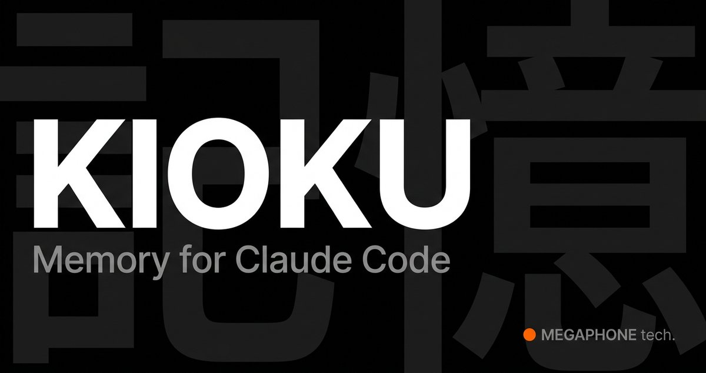

Karpathy 一丢代码，全网程序员集体进化了！

大神又整活了：扔出极简 repo/gist，社区直接把它当底层骨架，卷出一堆生产级神器。不是简单的 fork，是真正的底层进化、从教育玩具变成能自动研究、自动建知识库、4 小时训 ChatGPT 的狠活。

我挑了 4 个正在 X 上刷屏的“Karpathy 系进化体”，程序员看了会沉默，AI 玩家看了会狂喜：

1️⃣ autoresearch（[github.com/karpathy/autor…](https://github.com/karpathy/autoresearch)）

630 行代码，让 AI agent 自己改代码、训模型、打分、留优。人类睡觉，它进化。

“手动调参秃头活？交给机器吧！”

（已有人 remix 成 ooda 版，A/B 测试、文案优化全能套）

2️⃣ llmwiki 系列（[github.com/lucasastorian/…](https://github.com/lucasastorian/llmwiki) 等）

基于 Karpathy 的 LLM Wiki gist 进化：LLM 不再是搜索引擎，而是 Obsidian 里的“程序员”，自动总结、交叉引用、滚雪球式维护知识库。

RAG 哭晕在厕所，推特直呼“知识库自己长大了”。

3️⃣ nanochat（[github.com/karpathy/nanoc…](https://github.com/karpathy/nanochat)）

大神最新“unhinged”作品：nanoGPT 的全栈进化版，单 GPU 4 小时 $100 出一个能聊、能写诗、能解题的 ChatGPT 克隆。

设计初衷就写着“maximally forkable”，下一个研究 harness 预定！

4️⃣ micrograd / nanoGPT 衍生playground（silicon-more、napagrad 等）

从 Zero to Hero 课程底层进化而来，计算图 + 训练循环被玩出花，成了无数人的 AI 启蒙+benchmark 底座。

//

为什么这些项目这么爆？

Karpathy 从不给你黑箱框架，他给的是极简、可读、可 hack 的骨架。
你 fork 它，不是在抄作业，而是在和大师一起递归自我改进。

这才是开源的最高境界：一个人的代码，变成全世界的进化树。

## 💬 Replies

### 1 @GitTrend0x (GitTrend) (Author)

*Fri Apr 17 01:47:16 +0000 2026*

千军万马来相见

### 2 @PageIndexAI (PageIndex)

*Thu Apr 16 17:13:48 +0000 2026*

@GitTrend0x 欢迎看看我们的开源项目 OpenKB：Open LLM Knowledge Base，解决了 Karpathy 提到的 wiki 中长 PDF 处理困难的问题

[github.com/VectifyAI/Open…](https://github.com/VectifyAI/OpenKB)

### 3 @GitTrend0x (GitTrend) (Author)

*Thu Apr 16 23:38:53 +0000 2026*

@PageIndexAI 好！这就来看

### 4 @megaphone_tokyo (MEGAPHONE tech.)

*Fri Apr 17 02:04:37 +0000 2026*

另一个 LLM Wiki gist 的进化版 — KIOKU，专门为 Claude Code 打造。

和 llmwiki 的关键区别：完全自动化。Claude Code Hooks 自动捕获每个会话，零手动操作，蒸馏成结构化的 Obsidian wiki，下次 SessionStart 时自动注入过去的知识。

不需要上传，不需要手动整理 — 只要用 Claude Code 写代码，wiki 自己长大。

README 有简体中文版 🇨🇳[github.com/megaphone-toky…](https://github.com/megaphone-tokyo/kioku)xK

### 5 @GitTrend0x (GitTrend) (Author)

*Fri Apr 17 02:11:50 +0000 2026*

@megaphone\_tokyo Get

### 6 @ecausehe67933 (ronaldo2026)

*Fri Apr 17 13:36:19 +0000 2026*

@GitTrend0x 这推文一看就是claude 的文风

### 7 @GitTrend0x (GitTrend) (Author)

*Sat Apr 18 15:52:19 +0000 2026*

@ecausehe67933 完全不是

### 8 @justlikemaki (何夕2077 (个板马版))

*Thu Apr 16 12:53:05 +0000 2026*

@GitTrend0x Karpathy 写的不是代码，是种子。

630 行的 autoresearch 能自己改代码训模型，4 小时 nanochat 复刻 ChatGPT——这些项目单拎出来都不算惊艳，但放在一起看到的是：开源社区的迭代速度已经快到让闭源团队焦虑了。

最狠的是 micrograd 那条线，教学项目变成生产工具，这才是开源的终极形态。

### 9 @justin_newbee (justin0798)

*Fri Apr 17 02:25:08 +0000 2026*

@GitTrend0x 这不老早就有

