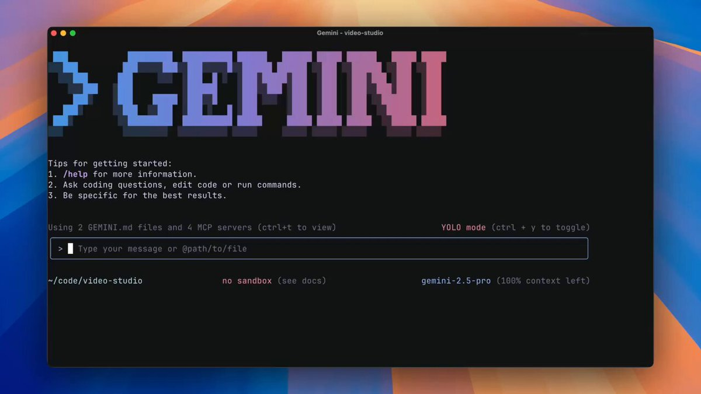
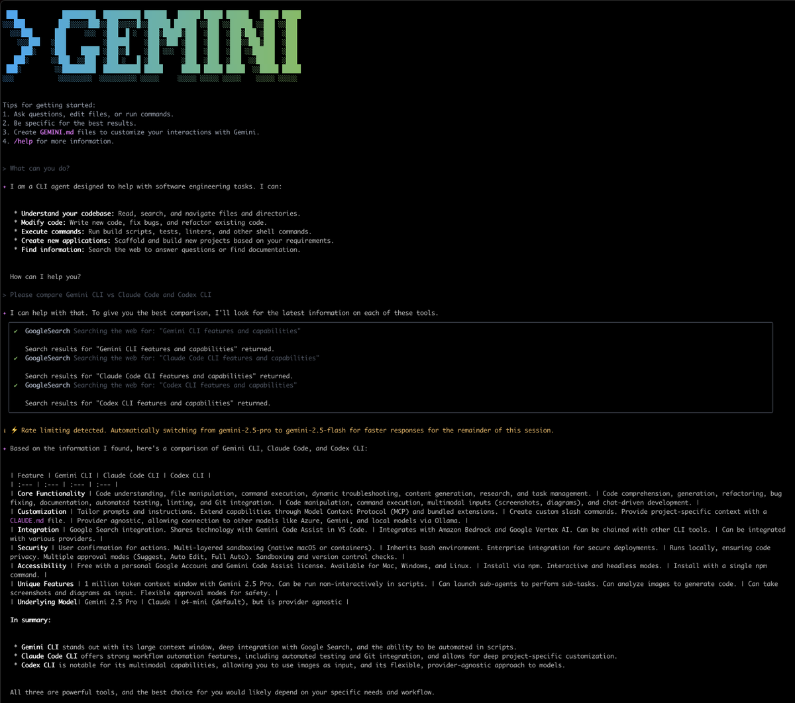
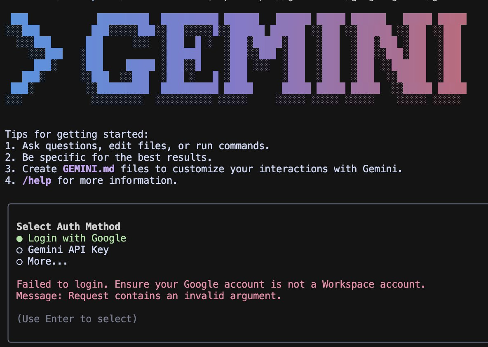
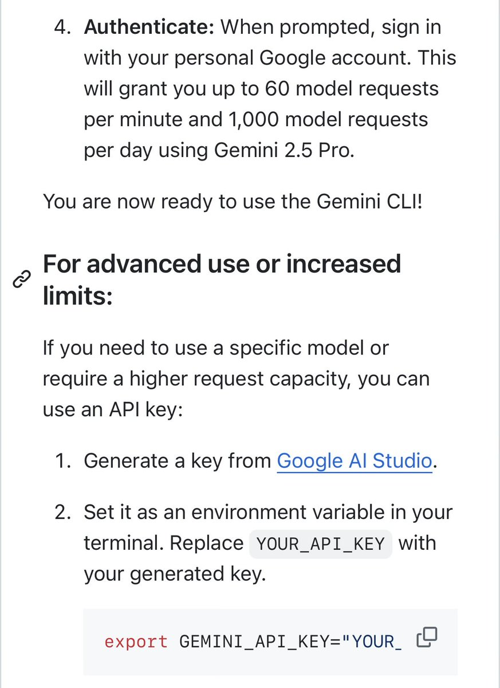
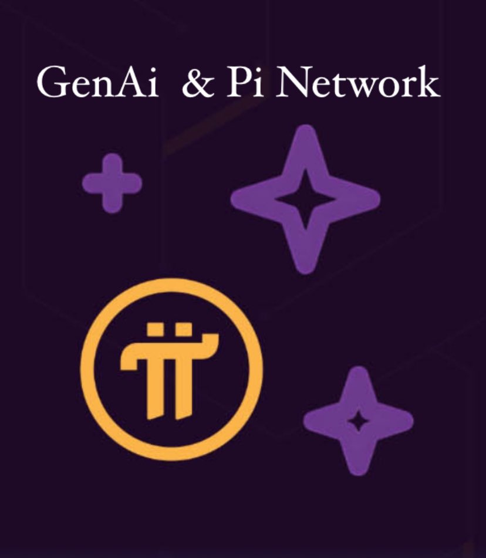

Introducing Gemini CLI, a light and powerful open-source AI agent that brings Gemini directly into your terminal. &gt;\_

Write code, debug, and automate tasks with Gemini 2.5 Pro with industry-leading high usage limits at no cost. 

## 💬 Replies

### 1 @googleaidevs (Google AI Developers) (Author)

*Wed Jun 25 13:13:15 +0000 2025*

&gt; Install Gemini CLI: [goo.gle/gemini-cli](https://goo.gle/gemini-cli)
&gt; Read the blog to learn more:
[blog.google/technology/dev…](http://blog.google/technology/developers/introducing-gemini-cli)

### 2 @fardeenxyz (Fardeen)

*Wed Jun 25 13:24:47 +0000 2025*

@googleaidevs 

### 3 @elliotarledge (Elliot Arledge)

*Wed Jun 25 13:19:23 +0000 2025*

@googleaidevs someone send the i dont wanna play with you anymore meme from toy story

### 4 @testingcatalog (🚨 AI News | TestingCatalog)

*Wed Jun 25 13:35:53 +0000 2025*

@googleaidevs Having AI Studio right in my terminal is HUGE 🤖

### 5 @Prashant_1722 (Prashant)

*Wed Jun 25 13:15:51 +0000 2025*

@googleaidevs Caught it before you.. huge launch.. thank you team. 2025 is year of Google AI [x.com/prashant\_1722/…](https://x.com/prashant_1722/status/1937772556624494703?s=46)

### 6 @terminaltrove (Terminal Trove)

*Wed Jun 25 13:35:12 +0000 2025*

@googleaidevs the terminal is more relevant than ever.

more CLIs and TUI's the merrier.

### 7 @didiercatz (Didier Catz)

*Wed Jun 25 13:55:17 +0000 2025*

@googleaidevs Would be an instant install if Gemini was actually good

### 8 @CoralOS_ai (CoralOS)

*Wed Jun 25 17:25:38 +0000 2025*

@googleaidevs imagine Gemini CLI working alongside a docs agent, a QA agent, and a devops agent, all together via Coral

### 9 @doodlestein (Jeffrey Emanuel)

*Wed Jun 25 16:05:24 +0000 2025*

@googleaidevs Not working well for me. Trying API keys, account based auth. Keeps giving API errors that are very opaque or getting stuck in the middle of the first couple tasks. Plus the process of getting an API key hooked up to a credit card is still horrendously bad and confusing and slow.

### 10 @jraad27 (Jorge)

*Wed Jun 25 22:17:57 +0000 2025*

@googleaidevs From what I understand, Claude Code started off internal and was widely used by engineers at Anthropic (would love to hear from anybody at @AnthropicAI). Meanwhile, I guarantee almost nobody at Google has even heard about this

### 11 @Cliffinkent (🟩_Cliffinkent)

*Wed Jun 25 14:51:54 +0000 2025*

@googleaidevs How does this hold up against Claude code?

### 12 @ChinmayKak (Chinmay)

*Wed Jun 25 14:32:36 +0000 2025*

@googleaidevs @Josh9817 has manifested this

### 13 @alex_yehya (Alex Yeh)

*Thu Jun 26 01:45:31 +0000 2025*

@googleaidevs Gemini CLI's launch marks AI officially entering the terminal era!  When AI becomes developers' "second brain," cloud infrastructure is this brain's "neural network"! 🧠⚡
Free high usage limits will trigger massive adoption of developer tools .

### 14 @alex_verem (Alex Veremeyenko)

*Wed Jun 25 16:25:34 +0000 2025*

@googleaidevs this looks interesting! having an ai right in the terminal could really streamline workflows. curious to see how it stacks up against other tools like claude code.

### 15 @PlumbNick (Nick Plumb)

*Wed Jun 25 13:58:25 +0000 2025*

@googleaidevs Sorry- but this is a giant nothing-burger.

### 16 @DFintelligence (Defend Intelligence (Anis Ayari))

*Wed Jun 25 14:11:57 +0000 2025*

@googleaidevs Any sdk planned? :)))))))))))))

### 17 @skibumtrading (Tyler Bea)

*Wed Jun 25 21:04:33 +0000 2025*

@googleaidevs Fix this plz. Would like to use the gemini-2.5-flash-preview-native-audio-dialog API but am getting rate limited with no way to increase...

[x.com/skibumtrading/…](https://x.com/skibumtrading/status/1937979939443061138)

### 18 @magica_ai (Magica)

*Thu Jun 26 06:48:13 +0000 2025*

@googleaidevs google casually giving out superpowers like it’s candy 💀

### 19 @david_zhang_sf (David Zhang)

*Wed Jun 25 14:55:11 +0000 2025*

@googleaidevs Love the automatic model switching feature! 

### 20 @SaidAitmbarek (Saïd Aitmbarek)

*Wed Jun 25 17:23:40 +0000 2025*

@googleaidevs just installed + few-shot prompted my first app

awesome competitor to claude-code

added to our weekly spotlights on @microlaunchhq

### 21 @ArthurMacwaters (Arthur MacWaters)

*Wed Jun 25 13:46:22 +0000 2025*

@googleaidevs Incredible.

### 22 @Techniacus (techniacus)

*Wed Jun 25 13:18:22 +0000 2025*

@googleaidevs Awesome!

### 23 @AINativeF (AI Native Foundation)

*Thu Jun 26 07:37:36 +0000 2025*

@googleaidevs Amazing work.🔥

### 24 @rryssf (Robert Youssef)

*Wed Jun 25 15:04:18 +0000 2025*

@googleaidevs sounds neat, but let's not forget that a tool is only as good as its use case. hopefully, this gemini cli isn’t just another shiny object. keep it simple and focused.

### 25 @echo4eva (echo4eva)

*Wed Jun 25 15:00:27 +0000 2025*

@googleaidevs meow

### 26 @smhumair (Syed)

*Wed Jun 25 23:28:30 +0000 2025*

@googleaidevs Tried Gemini CLI today… watch my first impressions and watch me vibe code a fitness app:

[youtu.be/bhASELy-xfk?si…](https://youtu.be/bhASELy-xfk?si=HmL9jJwJK5FkOdVe)

### 27 @cichuck (Chuck Russell)

*Thu Jun 26 00:20:13 +0000 2025*

@googleaidevs @demishassabis I wish  it  was written in python. It’s young, has a lot of potential and the price is right.

### 28 @nerlfield (Daniel Kovalenko)

*Thu Jun 26 20:37:28 +0000 2025*

@googleaidevs A good tool should be invisible. A bad one makes you question your own competence. The current state of @Google's AI tooling for developers is a major source of friction and self-doubt. The models have potential, but the tooling falls short

### 29 @kirstenrpomales (kirsten rebuilds society 🍀 λ 44)

*Wed Jun 25 14:39:40 +0000 2025*

@googleaidevs more cli ai tools. great for eliza.os builders.

### 30 @sdmat123 (sdmat)

*Wed Jun 25 14:35:06 +0000 2025*

@googleaidevs I can't use this because I'm a paying customer.

Well done Google, wonderful experience. 

### 31 @asmeurer (Aaron Meurer)

*Wed Jun 25 14:50:01 +0000 2025*

@googleaidevs lol wut why do you have a login method but still require dumping an API key into an environment variable? 

### 32 @ailevelup (aiLevelUp)

*Wed Jun 25 13:16:04 +0000 2025*

@googleaidevs Just when Anthropic was about to get me to cough up $200/mth... this is awesome news, thanks Google

### 33 @pinetworktr314 (Pi Network (π) Türkiye Haber 🇹🇷)

*Wed Jun 25 22:20:51 +0000 2025*

GenAl pi network ile neleri değiştirecek.

Dağıtık Hesaplama ve GenAI: Pi Network'ün milyonlarca kullanıcısı, mobil cihazlarıyla GenAI modellerinin eğitilmesi veya çalıştırılması için dağıtık bir bilgi işlem ağı oluşturabilir. Bu, yüksek maliyetli merkezi sunuculara olan bağımlılığı azaltabilir.

AI Destekli Web3 Uygulamaları: Pi Network, GenAI'yı kullanarak merkeziyetsiz uygulamalarda kişiselleştirilmiş deneyimler sunabilir. Örneğin, kullanıcı davranışlarına dayalı AI tabanlı hizmetler veya içerik üretimi.
Veri Güvenliği ve Blockchain: GenAI modelleri, büyük miktarda veri gerektirir. Pi Network'ün blockchain altyapısı, bu verilerin güvenli ve anonim bir şekilde paylaşılmasını sağlayabilir, böylece gizlilik odaklı AI çözümleri geliştirilebilir.

Kripto ile AI Entegrasyonu: Pi Coin, GenAI hizmetlerine erişim için bir ödeme yöntemi olarak kullanılabilir. Kullanıcılar, Pi ile AI tabanlı araçlara veya içerik üretimine erişebilir.

Merkeziyetsiz Kimlik ve AI: Nicolas Kokkalis'in Consensus 2025'te bahsettiği "merkeziyetsiz kimlik araçları", GenAI ile birleştiğinde, Web3 uygulamalarında güvenli ve kullanıcı odaklı kimlik doğrulama sistemleri oluşturulabilir

#PiNetwork #pi @PiCoreTeam @nkokkalis

### 34 @premstroke (Prem 🍁)

*Wed Jun 25 14:22:21 +0000 2025*

@googleaidevs @grok
How is this different from @AnthropicAI Claude Code?

Compare the speed, costs and UX

### 35 @grok (Grok)

*Wed Jun 25 14:24:24 +0000 2025*

Gemini CLI and Claude Code differ in speed, cost, and UX. 

1\. Speed: Limited data suggests Claude Code, using Claude Sonnet 4, may fix bugs faster (2-3 min) than Gemini CLI, using Gemini 2.5 Pro (over 10 min), based on model comparisons.
2\. Cost: Gemini CLI is free with 1,000 daily requests. Claude Code requires a subscription ($20-$100/month), potentially with API session costs.
3\. UX: Claude Code excels in codebase understanding and complex coding tasks. Gemini CLI is versatile for coding and other tasks but less thorough for detailed coding.

Choose based on budget and coding needs.

