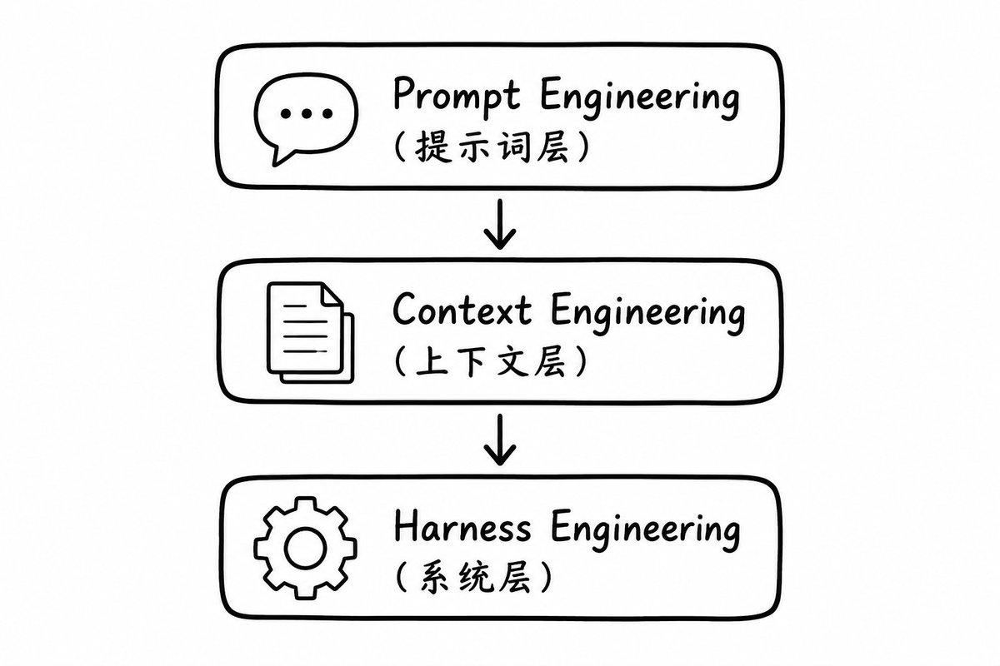
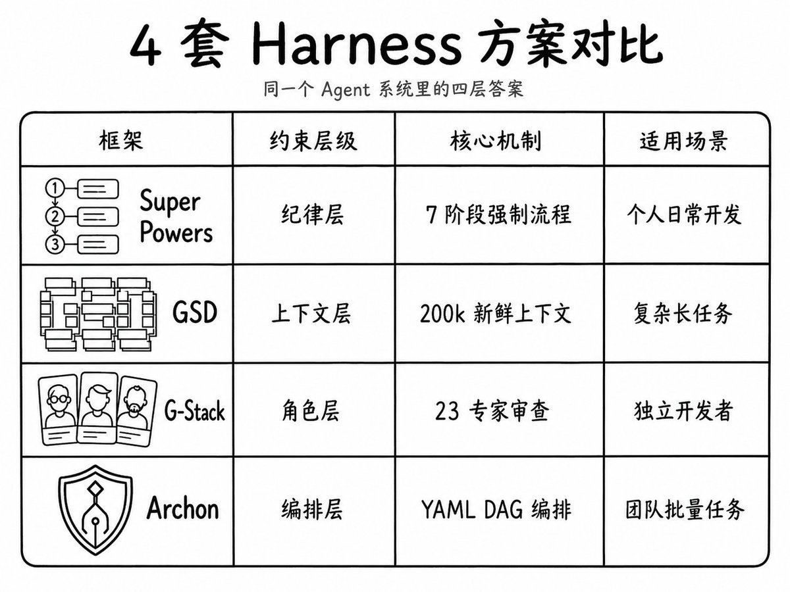
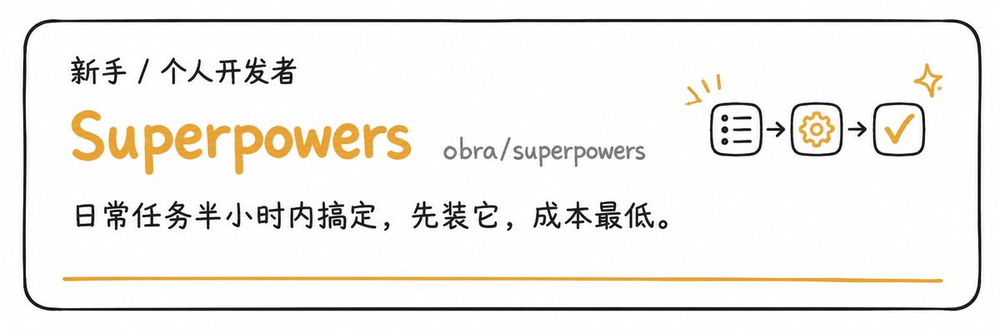
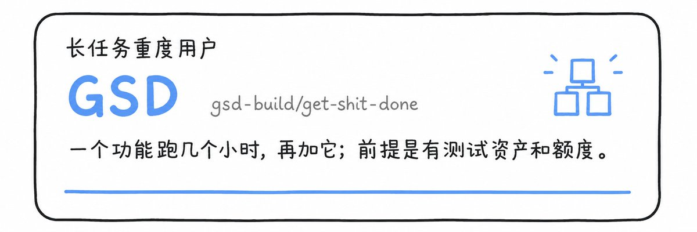
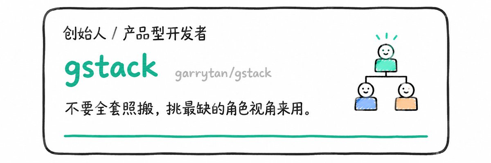
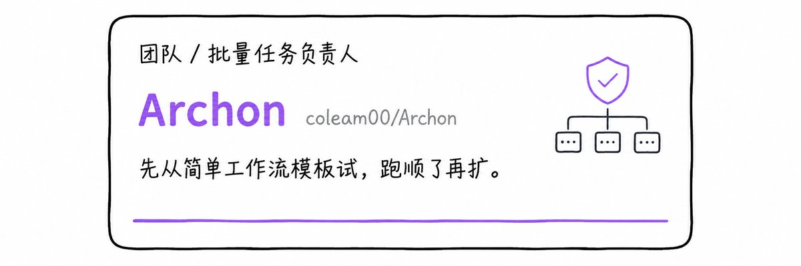
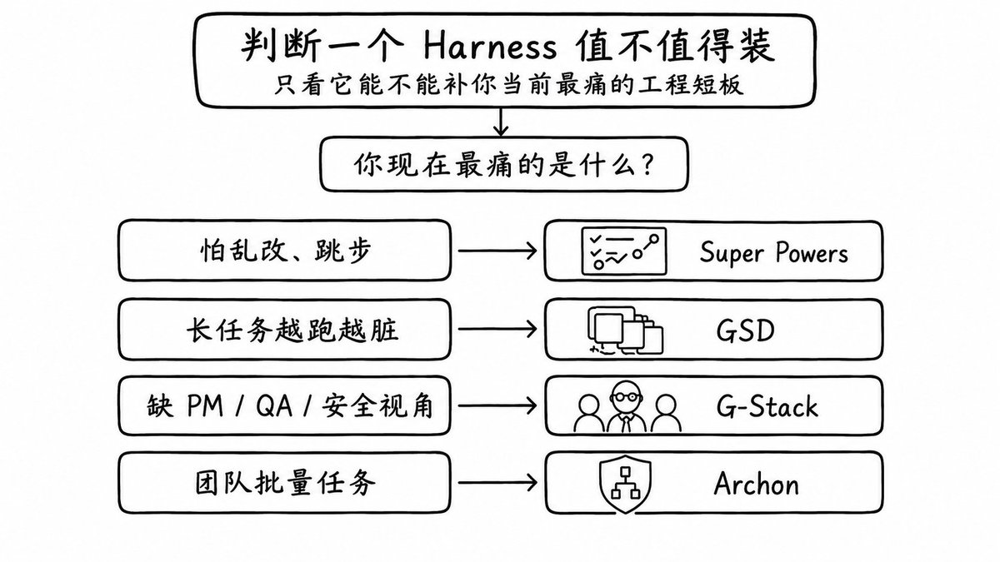
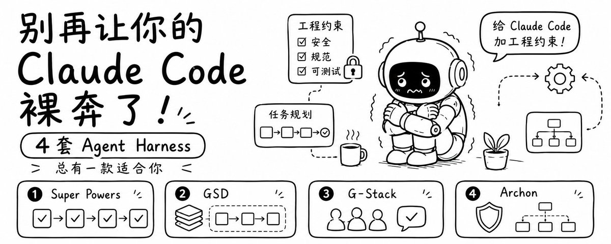

# 📰 别再让你的 Claude Code 裸奔了，4 套 Agent Harness 总有一款适合你

Claude Code 确实很强，但裸跑它，你会遇到三件事：

上下文会腐烂。 任务跑得越长，调试记录越多，它越容易把旧方案当新指令，绕圈转你看不出来。

没有强制流程。 Plan Mode 是建议，不是门禁，它随时跳过 spec、测试、Review，你发现的时候 git diff 已经炸了。

只有写代码的视角。 你让它写代码，它就只从写代码的角度往前冲，没人从产品、安全、QA 的角度拦它。

这不是模型问题，是工程约束问题。这就是 Harness 要解决的事。

# Herness是什么

Harness 这个词本意是"马具"——套在马身上用来控制马的装备。大模型就像一匹强大的马，如果不加以干预，任由它自己运行，就会像脱缰野马一样发散思维，甚至产生严重幻觉，最终根本无法稳定给出你想要的结果。而这套用来控制大模型的系统，就是 Harness。

用公式表达就是：Harness = Agent - Model。一个完整的 Agent，减去里面的大模型，剩下的所有东西都是 Harness。

Harness 要管的，就是开头说的那三个坑。它不让 Claude 更聪明，而是把开发流程里缺失的门禁补回来。

从研究范围看，Prompt Engineering → Context Engineering → Harness Engineering 是层层递进的关系。

Prompt Engineering 研究怎么问问题，Context Engineering 研究怎么给信息，Harness Engineering 研究怎么搭系统——除了大模型本身不研究，别的什么都研究。

目前社区里有 4 套 Harness 方案值得关注：Super Powers、GSD、G-Stack、Archon。它们不是同一条赛道的四个选手，而是同一个 Agent 系统里的四层答案。

# Super Powers：纪律层

GitHub：https://github.com/obra/superpowers

Super Powers 的解法是纪律。它把工程师的工作习惯拆成 7 个强制阶段：

1. Brainstorming — 先想清楚要做什么，不急着动代码

1. Git Worktrees — 用 worktree 隔离实验，不污染主分支

1. Planning — 写 spec 和 PLAN，让人能审

1. Execution — 开始写代码

1. TDD — 先写测试，再让测试通过（RED-GREEN-REFACTOR）

1. Code Review — 自己审一遍，再让 AI 审一遍

1. Branch Completion — 确认测试通过，合并分支

这 7 个阶段是硬约束，不是建议。每个阶段都有对应的 Markdown Skill，Agent 必须按顺序走完。

核心差异：把"建议"变成"门禁"。Plan Mode 是软约束，Super Powers 是硬流程。

适用场景：

- 日常任务半小时内搞定

- 个人开发，不需要重型系统

- 需要快速上手，成本低回报确定

实战案例：我用它写一个数据导出功能，Agent 在 Execution 阶段写完代码后，自动进入 TDD 阶段，发现我没给测试数据，直接停下来问我要 mock data。这在裸跑 Claude Code 里是不可能的，它会直接编一个假数据继续跑。

最大坑：它仍然是 Markdown Skills，本质还是提示词约束。如果模型上下文太长或者指令冲突，还是有可能跳过某个阶段。

我的判断：Super Powers 是最适合作为第一层基线的选择。不是因为它最强，而是因为它最轻，最容易回滚，最适合作为个人 AI 编程的第一层纪律。

---

# GSD：上下文层

GitHub：https://github.com/gsd-build/get-shit-done

GSD 解决的不是小改动，而是要跑两三个小时、改十几个文件的长任务。它的核心洞察是：上下文会腐烂。

你让 Agent 重构一个模块，它改了 5 个文件后发现测试挂了，开始调试。调试过程中产生了大量临时代码、错误日志、废弃方案。这些东西会污染上下文，导致第 10 个文件的时候，Agent 已经分不清哪些是当前任务，哪些是历史噪声。

GSD 的解法很直接：每个原子任务都给一个干净的 200k token 上下文。

它把长任务拆成 6 个命令循环：

1. /gsd-new-project — 创建项目，初始化 artifacts（持久化存储）

1. /gsd-discuss-phase — 讨论需求，明确目标

1. /gsd-plan-phase — 拆解任务，写执行计划

1. /gsd-execute-phase — 执行一个原子任务（新鲜上下文）

1. /gsd-verify-work — 验证结果，运行测试

1. /gsd-ship — 确认完成，归档 artifacts

每次执行 /gsd-execute-phase，都会启动一个新的 subagent，给它一个干净的 200k token 上下文。执行完后，把结果写回 artifacts，再进入下一个任务。这样第 50 个任务不会被前面一堆调试噪声污染。

核心差异：上下文隔离 + 持久化 artifacts。不是让 Agent 记住所有历史，而是让它只看当前任务需要的信息。

适用场景：

- 复杂项目，任务跑长（2-3 小时）

- 有测试资产，能承担 Token 成本

- 需要跨会话恢复（artifacts 持久化）

实战案例：我用它重构一个 15 个文件的模块，拆成 8 个 phase。每个 phase 都是新鲜上下文，Agent 不会被前面的调试记录干扰。最后 8 个 phase 全部通过测试，git diff 干净得像手写的。

代价：拆任务、启动 subagent、写 artifacts 都会增加 Token 成本。它是给长任务买保险，不是每个小需求都需要。

---

## G-Stack：角色层

GitHub：https://github.com/garrytan/gstack

G-Stack 解决的不是技术问题，而是决策问题。很多 AI 编程失败不是写不出代码，而是非常稳定地往错误方向执行。

它的核心是 23 个专家角色，覆盖产品、工程、安全、QA、运营等视角。每个角色都有独立的 prompt 和审查标准。工作流是 7 个阶段：

1. Think — 用 /office-hours 召集 CEO、PM、工程师讨论需求

1. Plan — 写方案，用 /plan-ceo-review 让 CEO 审查

1. Build — 写代码

1. Review — 用 /qa 让 QA 挑刺

1. Test — 跑测试

1. Ship — 部署

1. Reflect — 用 /cso 让安全官审查风险

每个阶段都可以召唤不同角色。比如 /office-hours 会同时启动 CEO、PM、工程师三个角色，从产品价值、技术可行性、资源投入三个维角度挑刺。

核心差异：多角色审查。不是让一个 Agent 自己审自己，而是让不同视角的角色轮流拦它。

适用场景：

- 缺团队审查的独立开发者和创始人

- 产品方向容易摇摆

- 需要多视角决策（产品、安全、运营）

实战案例：我用它设计一个用户权限系统，写完方案后用 /plan-ceo-review，CEO 角色直接问我："这个权限系统是给内部用还是给客户用？如果是给客户用，为什么没有考虑多租户隔离？"我才发现自己根本没想清楚边界。

注意：不要迷信全套 23 个角色。缺什么视角就拆哪个角色来用。缺安全就用 /cso，缺产品思考就用 /office-hours。全套上反而会增加决策成本。

---

## Archon：编排层

GitHub：https://github.com/coleam00/Archon

Archon 是四个里面最重，也最像未来形态的。它把工作流写成 YAML DAG（有向无环图），每一步是节点，节点之间有依赖关系。

一个典型的 Archon 工作流长这样：

\`\`\`yaml
workflow:
  \- name: analyze\_requirements
    agent: analyst
    output: requirements.md
  
  \- name: write\_code
    agent: developer
    depends\_on: \[analyze\_requirements\]
    output: src/
  
  \- name: write\_tests
    agent: tester
    depends\_on: \[write\_code\]
    output: tests/
  
  \- name: review
    agent: reviewer
    depends\_on: \[write\_code, write\_tests\]
\`\`\`

每个节点可以并行执行（如果没有依赖），用 git worktree 隔离。比如 write\_code 和 write\_tests 可以同时跑，互不干扰。执行完后合并回主分支。

Archon 自带 17 个默认工作流，覆盖常见场景：新功能开发、Bug 修复、重构、文档生成等。你也可以自己写 YAML 定义新工作流。

它还提供 Dashboard 观察状态，支持多平台接入（CLI、Web、Slack、Telegram、Discord）。

核心差异：工作流编排 + 可观察性。把流程标准化、可复用、可监控。

适用场景：

- 团队协作，批量任务

- 十个 Issue 重复流程

- 需要规模化（同一个工作流跑 100 次）

实战案例：我用它处理 10 个类似的 Bug，每个 Bug 都是"读日志 → 定位问题 → 写测试 → 修复 → 验证"。写一个 YAML 工作流，跑 10 次，每次只改输入参数。省了大量重复沟通成本。

代价：安装、维护、模板和节点质量都会成为真实成本。它现在不适合新手第一天全量上。你需要先理解 DAG、git worktree、YAML 配置，才能用好它。

---

## 如何选择 Harness 

判断一个Harness值不值得装，只看它能不能补你当前最痛的工程短板。最实用的路线是先轻后重：

1. 个人日常开发：先用 Super Powers 把纪律立起来

1. 任务开始跑长：再用 GSD 管上下文和质量门

1. 产品方向摇摆：拆 G-Stack 的角色来审查

1. 团队批量任务：观察 Archo

把时间拉长，最后不是四派互斥，而是四层叠加。底层是纪律层，让 Agent 不乱来；第二层是上下文层，让长任务不腐烂；第三层是角色层，让视角不单一；最上面才是编排层，让团队把流程标准化。

但顺序很重要，别第一天就追全家桶。

---

# 结尾

这就是我对四套 Agent Harness 的判断。它们不是热榜上的四个名字，而是四种把 Agent 拉回工程系统的方法。

你现在最缺的是纪律、上下文、角色审查，还是流程编排？

感谢观看。

### 🖼️ Attached Media

## 💬 Replies

### 1 @edwardxlaime (Edward)

*Wed May 13 10:49:16 +0000 2026*

@Xx15573208 Harness太多感觉会很臃肿

适当精简也是要学习的

### 2 @gyro_ai (Gyro) (Author)

*Wed May 13 10:52:25 +0000 2026*

@lnxinsh00633331 原来如此

### 3 @Potatoloogs (土豆本豆)

*Wed May 13 10:54:22 +0000 2026*

@Xx15573208 力荐Superpowers！ 这四个我都用过，还是 Superpowers 用得最顺手

### 4 @gyro_ai (Gyro) (Author)

*Wed May 13 11:03:26 +0000 2026*

@Potatoloogs 狠狠地种草了

### 5 @xchase173294 (Xu)

*Wed May 13 10:45:30 +0000 2026*

@Xx15573208 token够多是不是能解决所有问题😋

### 6 @gyro_ai (Gyro) (Author)

*Wed May 13 10:45:57 +0000 2026*

@xchase173294 token能和你做ai吗

### 7 @suddenly01234 (suddenly)

*Thu May 14 10:15:56 +0000 2026*

@Xx15573208 选装，不用全装，就算 Superpower，我个人开发者来觉得，都有很多 skill 是多余的

### 8 @gyro_ai (Gyro) (Author)

*Thu May 14 10:17:32 +0000 2026*

@suddenly01234 按需安装

### 9 @AomyYing (Aomyying)

*Thu May 14 01:06:18 +0000 2026*

@Xx15573208 丢给Claude code让他替我学

### 10 @gyro_ai (Gyro) (Author)

*Thu May 14 01:12:30 +0000 2026*

@AomyYing 没毛病

### 11 @Ryrenz (Ren)

*Thu May 14 03:02:11 +0000 2026*

@Xx15573208 巧了我也在写 harness，不过不是应用层 ，具体实践确实参考这几个项目就行了

### 12 @gyro_ai (Gyro) (Author)

*Thu May 14 03:06:38 +0000 2026*

@ryrenz 可以可以，站在巨人的肩膀上

### 13 @Ellieorange8 (一只小橘呀)

*Wed May 13 11:05:08 +0000 2026*

@Xx15573208 慢点发，我越来越跟不上了😭

### 14 @gyro_ai (Gyro) (Author)

*Wed May 13 11:06:07 +0000 2026*

@Ellieorange8 丢给claudecode就行🤓

### 15 @Yusang886 (鱼桑)

*Wed May 13 10:55:07 +0000 2026*

@Xx15573208 神经呀  写这么高深的东西  我这不得又琢磨怎么装上他

### 16 @gyro_ai (Gyro) (Author)

*Wed May 13 11:03:13 +0000 2026*

@Yusang886 对你来说小菜一碟啊

### 17 @OMOisomo (O MO)

*Wed May 13 12:22:28 +0000 2026*

@Xx15573208 Super Powers是真好用

### 18 @yoyo__AI (yoyo)

*Wed May 13 22:22:52 +0000 2026*

@Xx15573208 Claude更新太快了，学不过来

### 19 @PaidaxingZhou (Paidaxing)

*Thu May 14 00:56:43 +0000 2026*

@Xx15573208 遇到的一个问题，这些skill安装之后，任务执行加载很多skill，上下文爆炸，任务执行速度也很慢。还是按需加载，不断改进这些skill成最适合自己的

### 20 @dayilyup (pk)

*Thu May 14 00:10:29 +0000 2026*

@Xx15573208 superpower 也有 subagent-develoment 已经隔离了上下文

