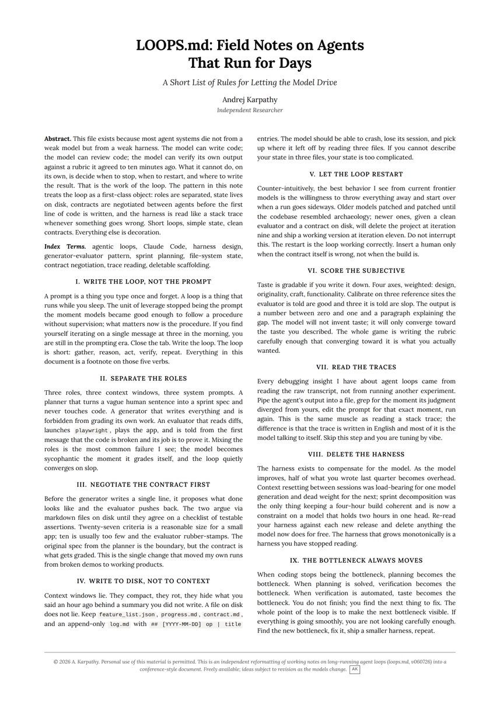

KARPATHY JUST KILLED THE PROMPT ERA WITH A SINGLE DOCUMENT

prompts are easy. loops are hard. and writing fifty prompts a day is the work nobody does twice.

he shifts the burden to the harness.

you define the contract once. the model writes, reviews, restarts, and reconciles. you keep judgment. it keeps the loop.

the throughline is the same in every rule: the human owns the spec and the boundary. the model owns the execution and the bookkeeping.

planner never touches code. generator never grades itself. state lives on disk, not in context.

9 rules. start with one feature, not ten. most people are still typing prompts. this turns Claude into an agent that finishes the job on its own.

here is the official document from Karpathy explaining the architecture

### 🖼️ Attached Media

## 💬 Replies

### 1 @hanqing1120 (hanqing)

*Mon Jun 29 07:15:26 +0000 2026*

@hanakoxbt 提示工程师的尽头是产品经理——写好规则文档，然后让模型自己卷。

### 2 @HarryTandy (Harry Tandy)

*Mon Jun 29 09:13:20 +0000 2026*

@hanakoxbt loops are definitely the future of actual work

### 3 @hanakoxbt (Hanako) (Author)

*Mon Jun 29 16:48:02 +0000 2026*

@HarryTandy That is exactly what I wanted to say

### 4 @0xCapx (Capx AI)

*Mon Jun 29 09:02:50 +0000 2026*

@hanakoxbt We went from "prompt engineer" to "contract manager" real quick. 🧑‍💼

### 5 @xenothales (xenophrēne 🪲)

*Mon Jun 29 15:25:42 +0000 2026*

@hanakoxbt bro literally just lied his way to 2.1K likes

### 6 @gippp69 (Gipp 🦅)

*Sun Jun 28 20:28:02 +0000 2026*

@hanakoxbt one document can really change everything

### 7 @slash1sol (slash1s)

*Sun Jun 28 21:09:12 +0000 2026*

@hanakoxbt now it’s much easier

### 8 @antpalkin (cvxv666)

*Sun Jun 28 20:27:39 +0000 2026*

@hanakoxbt It's nice to see progress in the use of AI

### 9 @0xwhrrari (rari)

*Sun Jun 28 21:03:54 +0000 2026*

@hanakoxbt state on disk instead of context is the kind of rule that changes everything

### 10 @zeyrie_dev (Abilash S)

*Mon Jun 29 05:03:18 +0000 2026*

@hanakoxbt It must be nice for these ppl who get free tokens at zero cost from their bill. At my work, the manual prompting generates hundreds of dollars bills at a hourly rate, not sure if loops are going to reduce the cost. What exactly does I get out of this, a 10$ feature for 1000$?

### 11 @jonathanbylos (Jonathan ⚡)

*Mon Jun 29 08:59:45 +0000 2026*

@hanakoxbt Delete the harness is BS. Harnesses are one of the most valuable tools for self hosted personalized/specialized AI. That makes no sense unless you are pedelling frontier models as the be all and end all

### 12 @cyrilgupta (Cyril Gupta)

*Mon Jun 29 05:25:37 +0000 2026*

@hanakoxbt More like... How to transfer funds from your bank to Claude while you sleep and Claude goes into a tangent of self exploration paid for by you.

### 13 @Burkhard_Herwig (Burkhard Herwig 🌊)

*Mon Jun 29 11:48:23 +0000 2026*

Interesting read.

The paper argues: “Write the loop, not the prompt.”

Today we arrived at a very similar conclusion—but took it one step further.

Our working hypothesis is:

Initiative is not an emergent property of intelligence. It is an emergent property of correctly designed operational loops.

LLMs are excellent at dialogue by default.

What they lack is not intelligence—it is an operating system that continuously evaluates mission, loops, KPIs and reality, turning deviation into autonomous initiative.

Prompts create conversations.

Operational loops create value.

We’re now testing this hypothesis by making loops, KPIs and runtime contracts constitutional properties of our multi-agent operating system.

If the evidence holds, the future of AI autonomy won’t be built with better prompts.

It will be built with better operating systems.

### 14 @OnlineInference (Dave Davies)

*Mon Jun 29 15:12:41 +0000 2026*

@hanakoxbt Looks a lot like this post 👇, though it has different images and different text.
And I can't find it on Google, and nobody is linking to or posting the actual doc.
Things that make you go, hmmmmm. 🤔
[x.com/milesdeutscher…](https://x.com/milesdeutscher/status/2071528356152303770)

### 15 @EtienneDavid_ (Etienne David)

*Mon Jun 29 09:24:29 +0000 2026*

@hanakoxbt @NandoDF @grok is this document really from karpathy?

### 16 @manvel_g (Manvel Ghazaryan)

*Mon Jun 29 09:42:55 +0000 2026*

@hanakoxbt Unless we’re talking about another “Karpathy” this is not from \*\*the\*\* “Andrej Karpathy” !

### 17 @CarlXien (Carl Xien)

*Mon Jun 29 08:40:50 +0000 2026*

I mean you should totally try it if token usage isn’t a concern, but for normal day to day office job, I think loop, or even harness design are both overkill. In fact I think 99% of the ppl using AI are still dealing with day to day office jobs as most ppl are still trap within a “traditional” way of working

### 18 @prfa (paraframe)

*Mon Jun 29 06:04:39 +0000 2026*

@hanakoxbt im the nobody writing fifty prompts twice already

### 19 @MarkusKlaschka (Markus Klaschka)

*Mon Jun 29 19:20:32 +0000 2026*

@hanakoxbt @grok show link to and text of original document and rules defined. Make sure no bad prompts are included!

### 20 @SumanHansada (Suman Hansada)

*Mon Jun 29 05:30:59 +0000 2026*

@hanakoxbt Guys.. Please show me a demo of Loop running 24x7 in any popular open source project. 😤😤

### 21 @Mirasiere (Tales of Mirasièria)

*Mon Jun 29 09:45:22 +0000 2026*

@hanakoxbt @grok Did Karpathy publish this, and can you find the link to the original document?

### 22 @BuggedOutDev9 (Fuga)

*Mon Jun 29 04:22:23 +0000 2026*

@hanakoxbt Y'all be doing too much,.i mean creating an agent that keeps running building wHiLe yOu sLeeP, like wtf are you even building, is there something that great to even build ????, just so performative bruhh

### 23 @JohnBaehr22 (John Bridges)

*Mon Jun 29 04:03:44 +0000 2026*

@hanakoxbt It would work if Claude didn’t have a system prompt … the system prompt is 99% if model drift

### 24 @EuroShopX (خبير تسوق أوروبي)

*Mon Jun 29 12:59:19 +0000 2026*

Interesting thread, but quick clarification: this specific LOOPS.md document ("Field Notes on Agents That Run for Days" with the 9 rules) is not from Andrej Karpathy. There's already a community note on the post pointing this out. It doesn't appear anywhere on his X account (@karpathy
), GitHub, or official channels. It looks like a well-crafted summary inspired by his ideas rather than an official document he published.Karpathy’s actual recent work in this area is his AutoResearch repo (March 2026), which shows real agent loops in action:
[github.com/karpathy/autor…](https://github.com/karpathy/autoresearchThe) broader point about moving from raw prompting to well-designed loops, role separation, and state on disk is still very valid and aligns with his philosophy on agentic workflows and harness design.

### 25 @StackMaverick (Aadithya niranjan)

*Tue Jun 30 07:02:49 +0000 2026*

@hanakoxbt loops do worrkkkk

### 26 @ClustZContact (Clustz News • AI | Tech | World | Gaming | More)

*Mon Jun 29 05:00:03 +0000 2026*

@hanakoxbt Looks like prompts are good old days

### 27 @EricBDelisle (Eric B. Delisle)

*Mon Jun 29 07:58:01 +0000 2026*

Wow, wish I wrote papers since we came up with all of this 4 years ago and started building instead of writing about it and now it’s in production for anyone to use with multiple agents in a scalable architecture after 4 years of perfecting it. Visit [Bloomstack.com](http://Bloomstack.com) for early access.  

We have Agents that build their own workspaces and agents, not just memory… Imagine 6 agents you KNOW and 3 humans all collaborating.  ZERO PROMPTING!! 

Continuity even when switching between ANY models, long term RELATIONSHIPS, not fast task chatbots, authentic verifiable trust layer that grows with the user over time, a Semantic Neural Wiki that auto materializes context from n number of sources, an Enterprise Cognition Engine built from scratch not duct taped together fragile MCP tools and much more….

### 28 @farooqsheik (Farooq Chisty)

*Mon Jun 29 16:31:30 +0000 2026*

@hanakoxbt prompts were always the training wheels

### 29 @devrahulbanjara (Rahul Dev Banjara)

*Tue Jun 30 06:53:44 +0000 2026*

@hanakoxbt @grok what is this

### 30 @FoxPot12345 (FoxPot)

*Mon Jun 29 06:34:00 +0000 2026*

@hanakoxbt I wouldnt call it a harness. Awful use of language.

### 31 @Belegore (Belegore)

*Mon Jun 29 20:39:49 +0000 2026*

@hanakoxbt So you can burn thousands of $ in a day.

### 32 @lfrodriguesit (Luís Rodrigues)

*Tue Jun 30 11:59:11 +0000 2026*

@hanakoxbt The separation of responsibilities is what stands out here. When the model generates, reviews, and grades its own work, it's much harder to trust the result.

### 33 @simpaisush72 (🧠 Alumidas AGI 🧠)

*Mon Jun 29 08:28:41 +0000 2026*

@hanakoxbt @NandoDF In shorts, to write a detailed prompt for any problem one needs to know a detail flow in the beginning itself. Instead if it will be as a iterative loop e.g. something gets developed over the period of time will be a nicer engineering.

