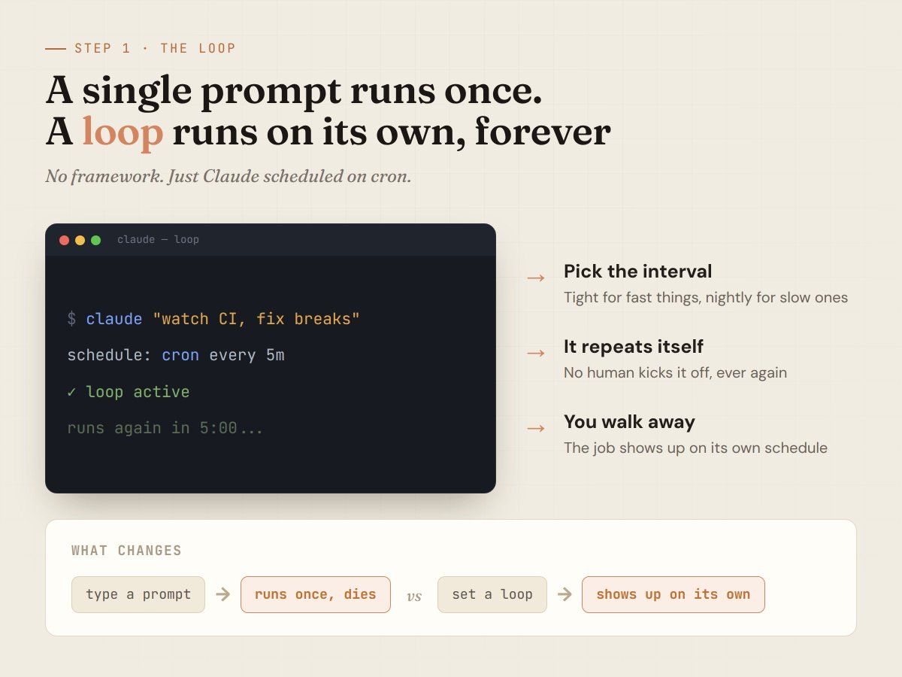
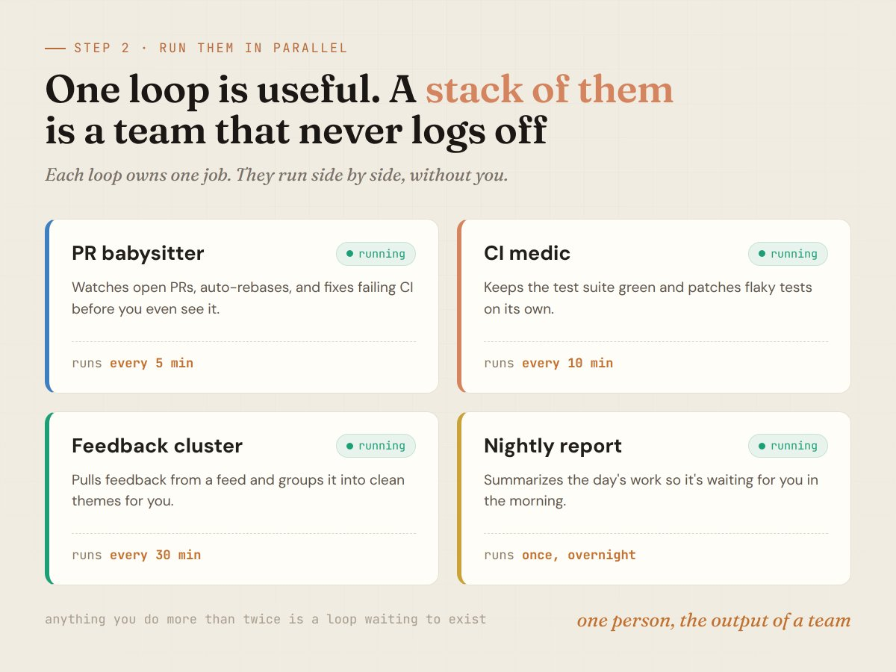
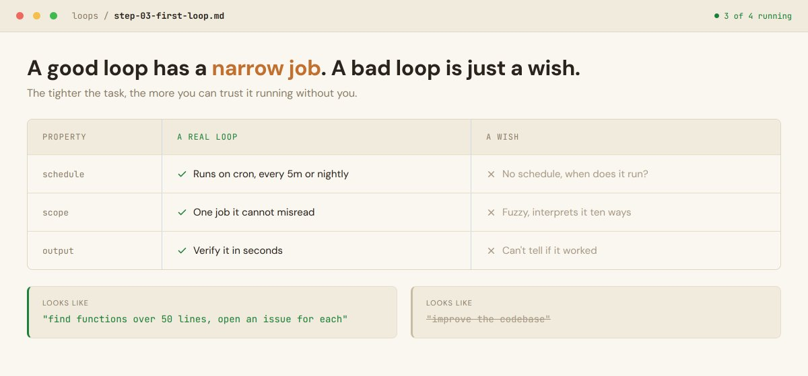
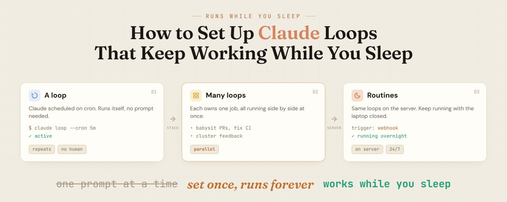

# 📰 How to Set Up Claude Loops That Keep Working While You Sleep (Step by Step)

Most people use Claude one prompt at a time.

You type, it answers, you read it, you type again. The moment you close the laptop, everything stops.

The person who built Claude Code stopped working that way a while ago. He hasn't written a line of code this year, runs most of it from his phone, and has a few thousand agents working overnight while he sleeps.

The thing making that possible isn't a secret model. It's loops.

Here is how to set them up, step by step.

---

## A loop is just Claude on a schedule

A single prompt runs once and dies. A loop runs on its own, again and again, without you starting it each time.

The mechanism is boring on purpose. You have Claude use cron to schedule a job, and you tell it how often to repeat: every minute, every 30 minutes, every night.

That's it. No framework, no orchestration layer. The simplest thing that works, which is exactly why it works.

Once a job repeats on its own, Claude stops being a chat window and starts being a worker that shows up on its own schedule.

The trick is matching the interval to the task. Fast-changing things get tight loops. Slow things get a nightly pass.

A loop watching your CI might run every few minutes. A loop summarizing the day's work runs once at night, so the report is waiting for you in the morning.

---

## The real power is running many loops at once

One loop is useful. A stack of them running in parallel is a different thing entirely.

The setup that turns heads is a handful of loops, each owning one job. One babysits open PRs and fixes failing CI. One keeps the test suite healthy and patches flaky tests. One pulls feedback from a feed and clusters it every 30 minutes.

None of them need you. They run side by side, on their own intervals, while you do something else or nothing at all.

This is how one person does the volume of a team. Not by typing faster, but by having dozens of loops typing for them around the clock.

The mental shift is the hard part. You stop thinking "what do I prompt next" and start thinking "what job should run on its own from now on.

Anything you do more than twice, anything you keep checking manually, anything that breaks at 3am, that's a loop waiting to exist.

---

## Close the laptop and the work keeps going

The catch with running loops locally is obvious. Shut the laptop and they stop.

The fix is routines, the same idea moved to the server. You configure the job once, and it runs on a schedule, a webhook, or an API call, whether your machine is on or not.

Now the work that used to need a human to kick it off just happens. The agent wakes up, does the job, and you see the result when you're ready.

This is the quiet part of how the fastest teams ship. Their agents are working in the gaps, overnight, between meetings, while everyone is asleep.

---

## The bottleneck was never the model

Put it together and the chat window disappears.

You stop running Claude by hand and start running a system that runs itself. Loops own the recurring work. Routines keep them alive when you're gone. You just decide what should exist.

The skill that matters now isn't writing one perfect prompt. It's spotting which parts of your work should never need you again.

You're paying for a fleet of agents and using one chat window.

---

## Start with one loop, not ten

The mistake everyone makes is trying to build the whole system on day one. Ten loops, a dashboard, the works. It collapses by the weekend because you can't tell which loop did what.

Start with one. Pick the most annoying recurring task you have, the thing you check every morning out of habit, and turn that single job into a loop. Let it run for a few days. Watch what it does, where it overreaches, where it misses.

Once you trust one loop, the second one takes ten minutes. By the fifth, you stop thinking about the mechanics entirely and just think in jobs. The system grows because each loop earns its place, not because you planned a giant architecture upfront.

A good first loop has three properties. It runs on a clear schedule, it has a narrow job it can't misread, and its output is something you can glance at in seconds. CI watcher, PR rebaser, daily digest. Boring, bounded, easy to verify.

The loops that fail are the vague ones. "Improve the codebase" is not a loop, it's a wish. "Find functions over 50 lines and open an issue for each" is a loop. The tighter the job, the more you can trust it running without you.

---

## Keep a human in the loop, just not in every loop

Running agents overnight sounds reckless until you see how the people doing it actually set it up. They don't hand the agent a blank check. Each loop has a lane, and the risky steps still wait for a yes.

A PR babysitter can rebase and fix CI on its own, but merging to main still pings you. A migration loop can open a hundred pull requests, but a human approves the first one before the rest go out. The agent does the volume, you keep the judgment.

This is the part that separates a setup that lasts from one that gets ripped out after the first bad night. The goal isn't zero humans. It's zero humans on the boring 95%, and your full attention on the 5% that actually carries risk.

Set the boundaries once, in the loop's instructions, and they hold every run after. That's the whole trick: you're not babysitting the work, you're babysitting the rules, and the rules are written down.

---

## What changes after a week

The first day feels like overhead. You're writing schedules, watching loops misfire, tightening instructions. It feels slower than just doing the task.

By the end of the week the math flips. The PR babysitter has saved you forty context switches. The nightly report is waiting every morning without a single prompt. The feedback cluster turned a feed you used to ignore into a clean list of themes.

You stop opening Claude to ask it things and start opening it to check on things it already did. The chat window becomes a status board, not a workspace.

That's the real shift Boris was pointing at. Not that the model got smarter, but that the work moved off your hands and onto a schedule. The people shipping the most aren't typing faster. They're running loops while everyone else is still in the chat window.

Follow me and subscribe to my Telegram channel:

&gt; https://t.me/+75nMf005jRpjMDU1

### 🖼️ Attached Media

## 💬 Replies

### 1 @Hrundel75 (Hrundel75 🐷)

*Sat Jun 13 16:17:47 +0000 2026*

@hanakoxbt hanako babako

### 2 @hanakoxbt (Hanako) (Author)

*Sat Jun 13 20:32:23 +0000 2026*

@Hrundel75 thank u so much

### 3 @alphabatcher (Alpha Batcher)

*Sat Jun 13 15:04:53 +0000 2026*

@hanakoxbt good article about important topic

will learning something from this

### 4 @DmitriyUngarov (ih8y)

*Sat Jun 13 14:49:32 +0000 2026*

@hanakoxbt Bookmarked bro thanks!

gonna try it with me vibecoding

### 5 @iZeusCrypto (Zeus ₿)

*Sat Jun 13 17:24:06 +0000 2026*

@hanakoxbt Great innovation and execution 🚀 Reach out whenever needed 📩

### 6 @gippp69 (Gipp 🦅)

*Sat Jun 13 14:58:48 +0000 2026*

@hanakoxbt Alpha from Hanako again

### 7 @slash1sol (slash1s)

*Sat Jun 13 14:46:16 +0000 2026*

@hanakoxbt never try it 👀👀

### 8 @0xwhrrari (rari)

*Sat Jun 13 20:08:24 +0000 2026*

@hanakoxbt alpha article
bookmark it 🤝

### 9 @maksimov (Stas Maksimov 🐽)

*Wed Jun 17 11:36:29 +0000 2026*

@hanakoxbt I don’t think I’ll be able to sleep while thinking of how much usage dollars it will generate

### 10 @thebutlerbrain (ButlerBrain)

*Wed Jun 17 05:30:07 +0000 2026*

@hanakoxbt Great article.  Plain and simple to understand.

### 11 @IvanStarr10x (Ivan Starr)

*Tue Jun 30 22:45:09 +0000 2026*

@hanakoxbt Awesome

