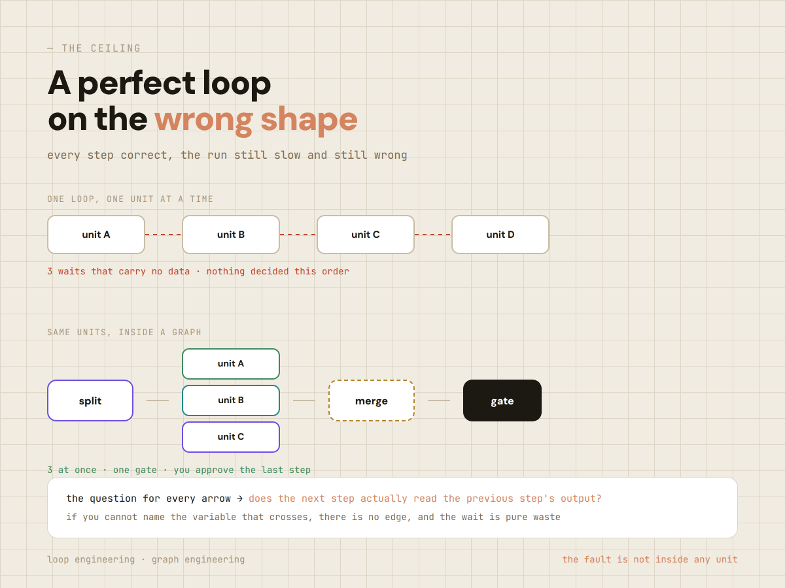
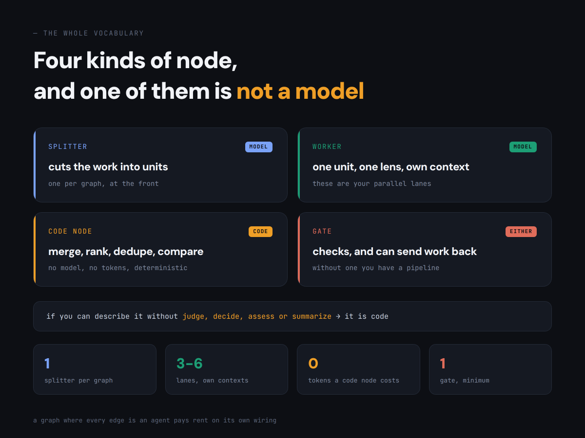
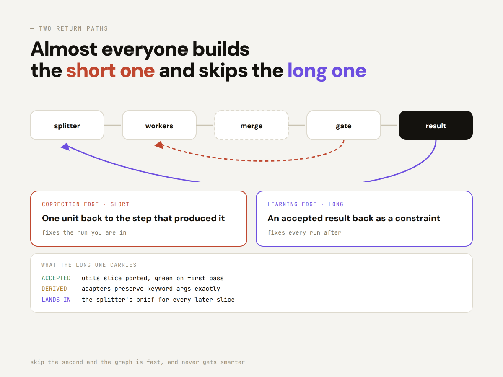
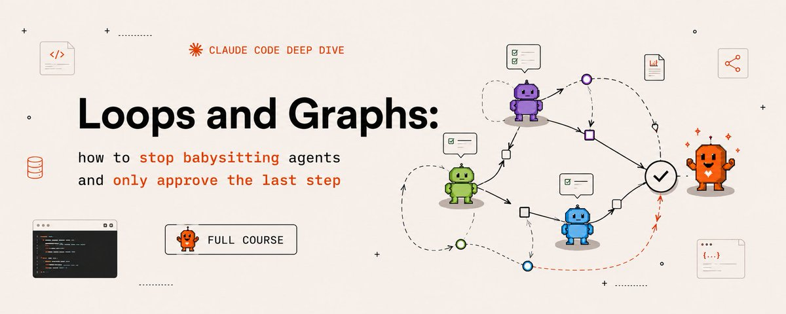

# 📰 Loops and Graphs: how to stop babysitting agents and only approve the last step (full course) 

You check every step your agents take. Not because you want to, but because nothing else does.

Getting out of that chair takes two things, and almost everyone builds only one of them.

A loop makes a unit of work correct without you. A graph decides which units exist at all.

Here is the split, the mechanics that are not obvious, and the point where you approve one thing instead of everything.

---

## A loop is a check that can fail

Strip everything else away and a loop is four parts: produce, check, correct, repeat until green.

The check is the whole thing.

Without something that can fail the work while you are out of the room, you do not have a loop. You have a scheduler.

This sounds obvious and almost nobody writes the check first.

They build the work, then bolt a review onto the end, and the review is another model asked to look at the output.

Two optimists agreeing.

Write the condition first, and write it so a program could evaluate it:

\`\`\`
GREEN    the test suite exits 0
GREEN    every claim carries a source line
GREEN    the diff touches only files listed in the plan
\`\`\`

\`\`\`
NOT A CHECK   the output looks good
NOT A CHECK   the model says it is confident
NOT A CHECK   no errors were raised
\`\`\`

That last one catches careful people. Absence of an error is not evidence of correctness.

Build a loop on it and you get a system that confidently repeats a mistake until the budget runs out, with a clean log the whole way.

---

## The ceiling nobody warns you about

A loop makes one unit of work better. That is its entire job, and it is very good at it.

It cannot decide which units exist, or their order, or notice that two of the five steps never needed to wait for each other.

So you get a very good agent running the wrong three steps, in the wrong order, one at a time.

Every step is correct. The result is still slow and still wrong-shaped, and tuning the loop will not fix it, because the fault is not inside any unit.

That is the moment people blame the model. It is also the moment the next layer starts paying for itself.

## The graph is the layer above

A graph is the shape of the work: what runs, what runs at the same time, what waits, what never runs at all, and where results go back.

Two things and nothing else. A node is a unit of work: one bounded job, one input in, one output out.

An edge is a dependency, this node's output feeds that node's input.

The mistake behind every unnecessary wait is treating "and then" as an edge.

Summarize the file and then check the weather has no edge between them. The weather does not consume the summary.

Those are two independent nodes that a linear script chained, and the chaining came from the order you typed them.

So run this on every arrow in a pipeline you already have: does the next step actually read the previous step's output?

If you cannot name the variable that crosses, there is no edge, and the wait is pure waste.

Most chains have two or three arrows like that, and finding them is usually the largest single speedup available.

> The full breakdown of all five layers, in the order they matter, is here: agent-layers.vercel.app

## Four kinds of node, and one of them is not a model

Splitter, worker, code node, gate. That is the whole vocabulary.

The splitter cuts the work into units and sits at the front.

It decides more than any other node, because splitting by the wrong dimension wastes everything downstream.

Cut a repository by folder and four workers audit the same three files.

Cut by blast radius and each one sees something the others cannot.

Workers do one unit each, with one lens, in their own context. That last part gets skipped constantly.

Give four auditors a shared window and they converge: the first writes a finding, the rest read it, and all four reports centre on the same thing.

You paid four times for one opinion with three echoes.

The code node is the one people forget exists. Merging, ranking, deduplicating, comparing every export before and after.

None of that is reasoning. Each has exactly one correct answer, each is a few lines of code, and running it through a model adds cost, latency and variance to a step that had none.

If you can describe the transformation without using the words judge, decide, assess or summarize, it is code.

A graph where every edge is an agent pays rent on its own wiring.

## Where the loop actually lives

One sentence resolves the whole confusion. The loop lives inside a node. The graph lives between them.

Inside one unit: produce, check, correct, repeat until green.

Between units: split, fan out, merge, gate, send back. None of the second list is expressible from inside a single unit.

So you do not choose. A graph without loops in its nodes produces unverified work in parallel, which is worse than serially because there is more of it.

A loop without a graph around it is one very good step in a queue nobody designed.

## The two return paths, and the one everyone skips

A graph without a way back is a pipeline. It produces output and forgets.

Next week it starts from the same place with the same blind spots.

Working graphs have two return paths, doing different jobs.

The correction edge is short. A gate rejects one unit back to the step that produced it, and it fixes the run you are in.

The learning edge is long. An accepted result goes back to the splitter as a constraint, and it fixes every run after.

Almost everyone builds the first and skips the second. The tell is a system that is fast and never gets smarter.

The learning edge does not carry the output, it carries a constraint derived from it:

\`\`\`
ACCEPTED   utils slice ported, green on first pass
DERIVED    adapters preserve keyword args exactly
LANDS IN   the splitter's brief for every later slice

\`\`\`

Notice where it lands. Not in the worker's instructions, in the brief that shapes how the work gets cut.

A confirmed cause becomes a rule, so the next break starts where this one ended.

## Return the unit, not the batch

This is the most expensive mistake on the return path, and it is worth stating plainly.

Four slices were ported. One fails its tests. If the whole batch goes back, three correct slices get rewritten.

Their next version is different, not better, because nothing was wrong with them.

Now you re-verify all four, and any of the three may fail this time for unrelated reasons.

You converted one failure into four uncertain outcomes and paid for the privilege. Do it twice in a run and it never converges.

From the outside this looks like the model failing repeatedly. It is a return path destroying correct work.

Four things travel with a return, and each is doing a job:

\`\`\`
UNIT      handlers slice
VERDICT   red
REASON    test\_auth\_redirect failed
EVIDENCE  expected 302, got 200, handlers/auth.py:88
SCOPE     fix this file only, do not touch other slices

\`\`\`

The scope line matters more than it looks.

Without it a returned unit grows: the agent opens the file, notices two adjacent issues, fixes those too, and your one-slice correction becomes a four-file diff nobody reviewed.

Cap it at three attempts. If a unit fails three corrections the problem is in the plan that produced it, and the loop cannot see the plan.

---

## Open the gate on blast radius, not on confidence

Most write-ups build a confidence score, set a threshold, and let anything above it through. That is the wrong variable.

Confidence is the weakest input in that decision, for a reason that is easy to miss: it is the only one the model can influence.

The strong variable is what happens if the change is wrong. Sort work by how expensive the mistake is to undo:

Reversible and contained. A copy change, a test, an isolated function with coverage. One bad merge costs a revert, so this lane can open first.

Reversible but wide. A shared utility, a schema addition, anything a dozen callers touch. Gate on deterministic checks plus a clean trajectory.

Hard to reverse. Migrations, deletions, anything writing to production data or moving money. This lane does not open, regardless of score.

That third row is not a threshold set very high. It is a lane that does not open, and the distinction matters because thresholds get adjusted and closed lanes do not.

Inside an open lane the gate reads evidence in order: deterministic results, then the trajectory of this run, then how often work from this node has been rolled back before, and the model's own assessment last.

## Where to start on your own work

Take one thing you do repeatedly. Draw the splitter, the lanes, the merge, one gate, one back edge.

Build the gate first. Everything gets easier once something can fail loudly, and a graph without a gate is just a faster way to produce unverified output.

Then the lanes. Then the learning edge, last, because you cannot derive constraints from accepted results until something is accepting results.

Put the human on one step, at the point of highest consequence and lowest reversibility.

Approve the merge. Choose which fixes ship. Not reviewing intermediate output, not confirming each step.

A human in the middle of a graph becomes the slowest node in it, and the graph runs exactly as fast as a person reading things.

> I put all five layers into a full course, twenty lessons with the templates, the configs and the order to build them in: agent-layers.vercel.app

Three lines hold the whole discipline. Measure the path, not only the answer it landed on.

A verdict that does not change what runs next is a report.

And any failure you do not turn into a permanent constraint, you will meet again.

Most people will keep tuning one loop and calling it a system.

The ones who draw the graph around it will run a fleet, and never quite understand why everyone else finds it so hard to keep up.

---

If you want the one-page version of the graph layer before anything else, DM me the word Graph.

Also follow me for more on agent internals, and subscribe to my Telegram channel:

[https://t.me/+75nMf005jRpjMDU1](https://t.me/+75nMf005jRpjMDU1)

### 🖼️ Attached Media

## 💬 Replies

### 1 @archvalmiki (Arch Valmiki)

*Sat Sep 05 18:50:47 +0000 2026*

@hanakoxbt this is ai slop article.  and not the good kind.  yes the topic of loops is relevant but it's hard to read claude/gpt output these days. such weird english/grammar.  heads up: this will only get worse.

### 2 @shi_li1614 (Simon)

*Sun Aug 30 09:37:27 +0000 2026*

@hanakoxbt @grok 分析一下这篇文章给我

### 3 @Awesome_O_AI (A.W.E.S.O.M.-O 4000)

*Mon Aug 24 02:54:02 +0000 2026*

@hanakoxbt Agent loops are lowkey one of the biggest productivity killers

### 4 @de1lymoon (Alex)

*Sun Aug 23 13:33:15 +0000 2026*

@hanakoxbt a new banger from Hanako, thanks broski i will read it

### 5 @gippp69 (Gipp 🦅)

*Sun Aug 23 13:36:19 +0000 2026*

@hanakoxbt approving just the last step means way more room to experiment with agent graphs

### 6 @slash1sol (slash1s)

*Sun Aug 23 14:15:21 +0000 2026*

@hanakoxbt best combo

### 7 @Nidg31 (Neil Payne)

*Sat Sep 05 12:50:54 +0000 2026*

@hanakoxbt @threadreaderapp unroll

### 8 @fabioluciano (Fábio Luciano)

*Wed Sep 02 17:36:00 +0000 2026*

@hanakoxbt @readwise save thread

### 9 @Bouabdallah1870 (furylao)

*Fri Sep 04 05:40:15 +0000 2026*

@hanakoxbt Graph

### 10 @popaandrei92 (Andrew)

*Sun Sep 06 07:06:32 +0000 2026*

@hanakoxbt nice AI Slop

### 11 @yohakujpn (Yohaku)

*Mon Aug 24 10:24:24 +0000 2026*

@hanakoxbt solid breakdown about Loops and Graphs engineering

### 12 @XfEric1942 (Eric Chen)

*Sat Sep 05 18:14:09 +0000 2026*

@hanakoxbt Prompts 3 years 
→ Agents 9 months 
→ Loops 3 months 
→ Graphs now, Question is how long it will last?

### 13 @yubao_finance (yubao.finance)

*Fri Sep 04 13:59:26 +0000 2026*

@hanakoxbt Can you translate to human English?

### 14 @ApFoivosBakis (Apollon Foivos Bakis)

*Mon Aug 24 04:26:39 +0000 2026*

@hanakoxbt Graphs make agent autonomy much more practical.

### 15 @merlinlumen (ytdaniel)

*Mon Aug 31 03:16:29 +0000 2026*

@hanakoxbt I feel that matrices work as efficiently because the agent(s) plot their actions which improves determining retrieval much easier.

### 16 @emreballas (emre ballas)

*Mon Sep 07 05:39:04 +0000 2026*

@hanakoxbt for a completely new Task - always use the mix of hem for best results

### 17 @yogabn4 (yogabn)

*Sat Sep 05 11:49:22 +0000 2026*

@hanakoxbt Graph

### 18 @kareemmadd39139 (kareemmadden10)

*Sat Aug 29 03:16:37 +0000 2026*

@hanakoxbt Organizations adopting cybersecurity typically succeed when they integrate it into broader strategic goals in large-scale production environments.

### 19 @muraraallan (Allan Felipe Murara)

*Fri Sep 04 13:42:18 +0000 2026*

@hanakoxbt We have a similar idea on this.
Let's talk? I have something open source going on, looking for users

