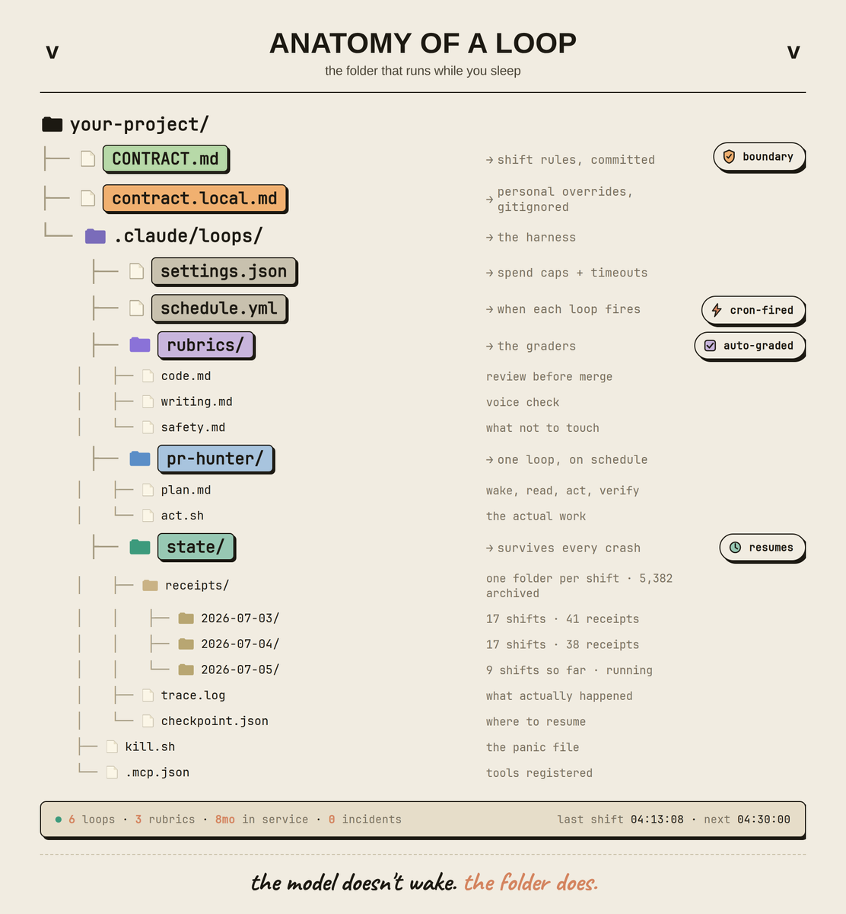

asked an anthropic engineer how his loops run on a closed laptop.

he didn't answer. he sent me one folder.

CONTRACT.md → schedule.yml → rubrics/ → state/checkpoint.json → receipts/2026-07-05/

five files. one shift. 5,382 shifts archived.

zero keystrokes since 20:41 yesterday. fourteen PRs opened, three rollbacks, six digests, all before he woke up.

no chat window. no "please can you". no follow-up.

the folder wakes. the contract is the boundary. the rubric is the judge. the checkpoint is the memory. the receipt is the proof.

that's the anatomy.

save the file tree below before he realizes i posted it.

### 🖼️ Attached Media

## 💬 Replies

### 1 @Arindam_1729 (Arindam Majumder 𝕏)

*Mon Jul 06 12:52:40 +0000 2026*

@hanakoxbt This is actually Cool

Have you tried using it with OKF?

[x.com/Arindam\_1729/s…](https://x.com/Arindam_1729/status/2074106139999117819)

### 2 @slash1sol (slash1s)

*Sun Jul 05 22:16:05 +0000 2026*

@hanakoxbt and I will research and learn it🫡🫡

### 3 @0xwhrrari (rari)

*Mon Jul 06 10:46:52 +0000 2026*

@hanakoxbt the folder is the interface now

### 4 @laura_bh4c03l (Laura)

*Mon Jul 06 19:45:15 +0000 2026*

@hanakoxbt Dude the AI running its own folder office while the laptop's closed. That's some serious autonomous agent anatomy right there.

### 5 @saimohit2000 (Sai Mohit Talasila)

*Mon Jul 06 15:59:58 +0000 2026*

@hanakoxbt I'm definitely skeptical about that Anthropic engineer story 😂 Did he not wake up yet

### 6 @0xSecta (Secta)

*Sun Jul 05 20:59:20 +0000 2026*

@hanakoxbt contract as execution boundary is the real primitive

### 7 @BadCustSvc101 (Aussie who is not a rhino)

*Tue Jul 07 17:28:56 +0000 2026*

@hanakoxbt Sample files or it's not real.

### 8 @magsimich (magsimich)

*Mon Jul 06 10:04:39 +0000 2026*

@hanakoxbt There is an interesting structure in the picture

### 9 @kardinall (Kardinall)

*Sun Jul 05 20:59:23 +0000 2026*

@hanakoxbt this is such a clean way to organize autonomous work

### 10 @kaylahxyl (𝑲𝒂𝒚𝒍𝒂𝒉)

*Tue Jul 07 08:35:48 +0000 2026*

@hanakoxbt needed this

### 11 @qmatrix_ai (Qmatrix)

*Mon Jul 06 17:48:48 +0000 2026*

@hanakoxbt we treat that folder as specialist-attestation primitive. Rubric as quality judge fits our labeling flow.

