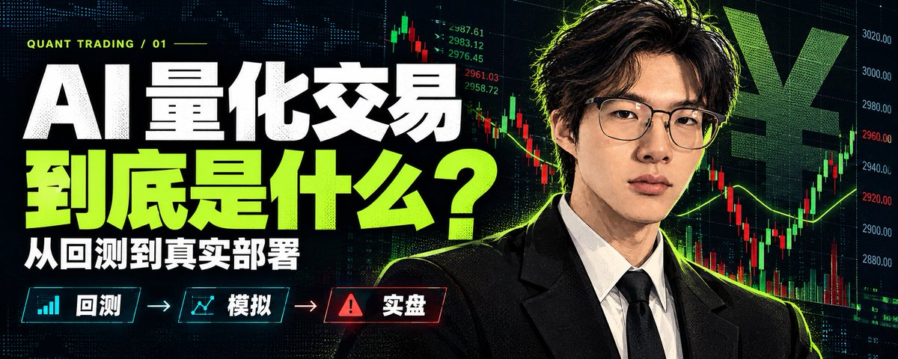
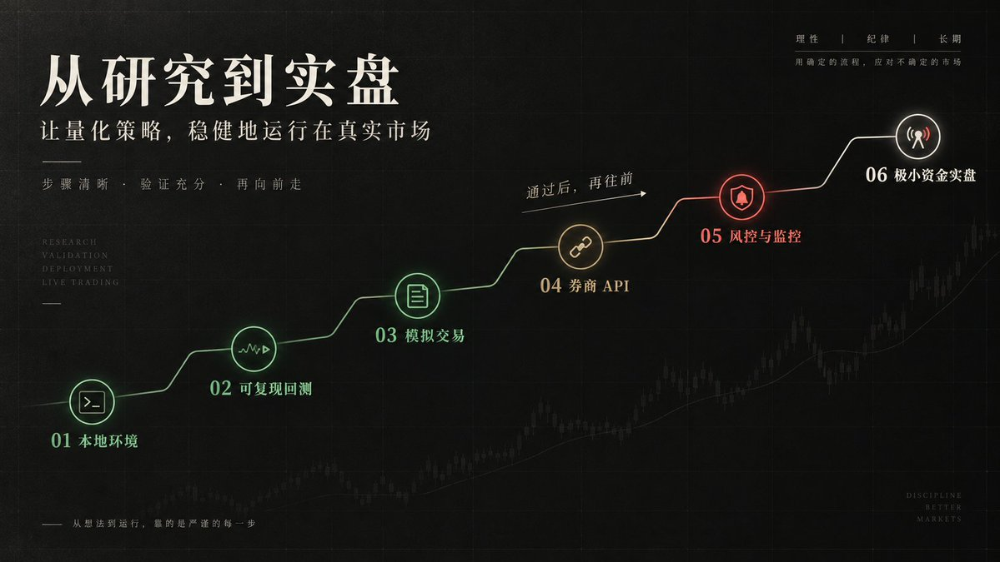
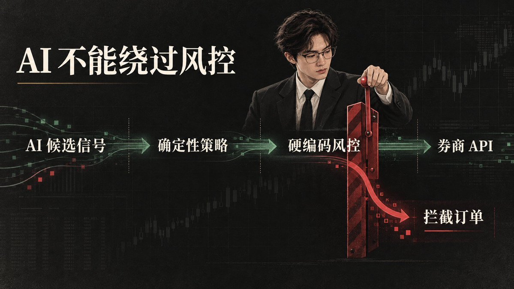
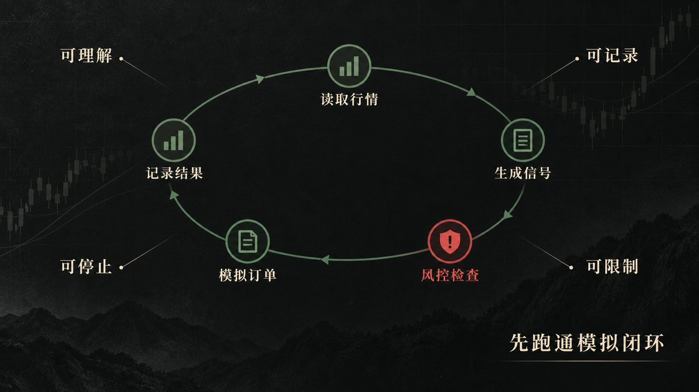

# 📰 AI 量化交易到底是什么？从回测到真实部署，一篇讲清楚

来源：[X 状态](https://x.com/chchenhao0129/status/2099748082753937907) · [X 文章](https://x.com/i/article/2099730817530601472)

前几天，一位读者问我：

> 有没有适合零基础的量化交易教程？最好能做成一个装在自己电脑上、可以自动运行的交易系统。这样的东西怎么做，AI 又能帮到什么程度？

如果只回答“可以”，那几乎等于什么也没说。

因为网上所谓的“量化系统”，可能指三种完全不同的东西：

- 一段拿历史数据计算收益的回测代码
- 一个只展示行情和信号的本地软件
- 一套连接券商账户、能够自动下单并持续监控的真实交易系统

粉丝想要的，显然是第三种。

所以这一期，我不只想教你运行一段演示程序，而是想把整张地图摊开：

- 量化交易究竟是什么？
- 一套真实系统由哪些部分组成？
- 怎样一步步部署到个人电脑？
- AI 应该接在哪里？

> 真实可运行，不等于真实能赚钱。

我们可以把数据、策略、回测、模拟盘、券商 API、风控和 AI 真正连接起来，但任何系统都不能绕过市场风险，也不能凭一段代码承诺收益。

## 一、量化交易不是预测未来，而是把决定写成规则

人交易时常说：

> 这只股票最近挺强，我感觉还能涨。

但程序听不懂“挺强”。

这就像你不能只对一个第一次做饭的人说“盐放适量”。你必须把感觉换成清清楚楚、能够重复执行的条件：

- 什么时候买？
- 买多少？
- 什么时候卖？
- 最多允许亏多少？

例如：

- 短期均线上穿长期均线时，产生买入信号
- 单个标的最多使用账户资金的 10%
- 亏损达到某个阈值时退出
- 当日总亏损超过上限后，停止所有新交易

这种把交易想法写成明确条件的过程，专业上叫作策略规则化（Strategy Formalization）。

程序根据这些条件给出的“买、卖或不动”，叫作交易信号（Trading Signal）。

因此，量化交易的本质不是“让 AI 猜下一只牛股”，而是完成四件事：

把想法变成明确规则

用历史数据检验规则

在模拟环境中验证运行

通过券商官方接口执行，并用风控限制风险

> 真正的量化系统，绝不只是一个策略文件。

## 二、小白先认识这八个基本概念

在继续拆系统之前，先把后面会反复出现的几个词讲明白。

你不需要背定义，只要先知道它们分别在回答什么问题。

1. K 线：把一段时间的价格压缩成一根“小蜡烛”

一只股票一天之内会不断变化。

如果把每一秒的价格全部摊开，很难一眼看懂。于是，人们把一天的信息压缩成几个关键数据：

- 开盘时是多少
- 最高到过哪里
- 最低跌到哪里
- 收盘时是多少
- 当天成交了多少

这组数据叫作开盘价、最高价、最低价、收盘价和成交量，英文缩写是 OHLCV。

把这些数据画出来，就是常见的K 线（Candlestick）。

一根 K 线可以代表一分钟、一天或一周，所以写策略时必须先统一时间周期。

2. 均线：给摇摆的价格画一条“大致方向”

价格每天上下跳，很像一个人走路时不断左右晃动。

把最近若干天的价格取平均，就能看出他整体在往哪边走。

这条平均价格线叫作移动平均线（Moving Average，MA）。

如果对最近 15 天的收盘价做简单平均，就是15 日简单移动平均线（SMA 15）。

短期均线从下向上穿过长期均线，叫作金叉；反方向则叫作死叉。

但要注意：

> 金叉和死叉只是根据历史价格生成的信号，不是未来一定涨跌的保证。

3. 仓位：不是只决定买不买，还要决定买多少

同样判断正确，一个人投入 100 元，另一个人押上全部积蓄，承担的风险完全不同。

因此，系统不能只给出“买入”，还必须规定这次使用多少资金。

资金投入的比例叫作仓位（Position Size）。

决定每次买多少、总共持有多少的规则，叫作仓位管理（Position Sizing）。

> 很多策略不是输在方向，而是输在一次押得太重。

4. 止损和止盈：提前写好什么时候退出

如果买入以后才临时决定“再等等看”，人的贪婪和恐惧就会不断改变标准。

更可控的办法，是在交易发生前就写清楚：

- 什么情况下认错？
- 什么情况下收下利润？

亏损达到预设条件后退出，叫作止损（Stop Loss）。

盈利达到预设条件后退出，叫作止盈（Take Profit）。

它们能限制单次交易的结果，但不能保证一定在设定价格成交。市场发生跳空时，实际损失仍可能超过预期。

5. 市价单和限价单：现在成交，还是等到我的价格

去菜市场买东西，你可以说：

> 按现在的价格，立刻给我。

也可以说：

> 降到 10 元，我才买。

交易中的订单也有类似区别。

希望尽快按照市场可以获得的价格成交，叫作市价单（Market Order）。

只接受指定价格或更优价格，叫作限价单（Limit Order）。

两者各有取舍：

- 市价单更重视成交，但价格可能不理想
- 限价单能够控制价格，却可能一直无法成交

6. 手续费和滑点：屏幕上的价格不等于最终成本

程序看到价格是 10 元，不代表你一定能用 10 元买到。

交易需要支付佣金等费用，而且从发出订单到真正成交之间，价格可能已经发生变化。

佣金等费用叫作交易费用（Transaction Costs）。

理想价格和实际成交价格之间的差距，叫作滑点（Slippage）。

> 回测如果不计算手续费和滑点，就像算开店利润时忘了房租和运费，结果通常会比现实好看。

7. 收益率和胜率：赢得多，不等于最后赚得多

假设十次交易中，有九次各赚 10 元，最后一次却亏了 200 元。

你的判断多数时候都对，但总结果仍然亏损。

赚钱交易占全部交易的比例，叫作胜率（Win Rate）。

资金相对起点增长或减少的比例，叫作收益率（Return）。

评价一套策略不能只看胜率，还要结合：

- 平均盈利
- 平均亏损
- 整体收益
- 最大回撤

8. 流动性：你想买卖时，市场上有没有人接

热门商品很容易卖掉。

冷门商品即使标着价格，也不一定能够立刻找到买家。交易市场同样如此。

资产能否在不明显影响价格的情况下迅速成交，叫作流动性（Liquidity）。

资金越大、标的越冷门，真实成交与回测假设之间的差距通常越明显。

由订单本身推动价格变化而产生的成本，叫作市场冲击（Market Impact）。

理解这八个概念以后，再看量化系统就不会只剩下一堆缩写：

- K 线提供信息
- 均线生成一种可能的信号
- 仓位决定押多少
- 订单类型决定怎样成交
- 手续费、滑点和流动性决定理想结果能否接近现实

## 三、一套真实系统，至少有七个部分

如果把一套量化系统想象成一家自动运转的餐厅：

- 行情数据是送进厨房的食材
- 策略是菜谱
- 风控是食品安全员
- 订单系统是传菜员
- 券商接口是连接顾客的窗口
- 日志是每一张小票
- 报警系统是烟雾报警器

少了菜谱，厨房不知道做什么。

少了安全员，菜谱再好也可能出事。

没有小票和报警器，出了问题也没人知道发生过什么。

换成专业语言，这套结构叫作自动化交易系统架构（Automated Trading System Architecture）。

它的完整链路是：

> 行情数据 → 策略信号 → 风控检查 → 订单管理 → 券商 API → 成交回报 → 日志与报警

1. 行情数据：系统的眼睛

行情数据告诉系统价格、成交量、时间和交易状态。

专业上，这些信息叫作市场数据（Market Data）。

研究阶段可以读取本地 CSV 文件；真实运行时，通常要使用券商或数据服务提供的实时行情。

数据一旦缺失、延迟或时间错位，后面再聪明的策略也没有意义。

2. 策略引擎：系统的大脑

策略引擎只负责回答两个问题：

- 现在是否出现交易信号？
- 目标仓位是多少？

这一部分专业上叫作策略引擎（Strategy Engine）。

它不应该直接拿着账户密钥随意下单。

研究逻辑和交易执行分开，后面才能单独测试、替换和审计。

3. 风控引擎：系统的刹车

风控引擎要在订单发出前再检查一次：

- 单次买入是否过大
- 总仓位是否超限
- 当日亏损是否达到停止线
- 是否出现重复订单
- 数据是否已经过期
- 市场是否处于可交易时间

这套独立检查机制叫作交易前风控（Pre-trade Risk Control）。

> 策略说“买”，不代表系统一定会买。风控应该拥有最终否决权。

4. 订单管理：系统的管家

真实订单并不是按下买入以后就结束了。

一笔订单可能处于不同状态：

- 已提交
- 部分成交
- 全部成交
- 已撤单
- 被拒绝

负责追踪这些状态的部分，专业上叫作订单管理系统（Order Management System，OMS）。

它还要避免程序断线重连后重复买入。

5. 券商接口：系统伸向真实市场的手

券商接口是本地程序与真实账户之间的桥梁。

它负责：

- 查询账户资金
- 查询持仓
- 提交订单
- 撤销订单
- 接收成交结果

专业上，这种接口叫作券商 API（Broker API）。

把不同券商的接口翻译成系统统一格式的代码，叫作适配器（Adapter）。

不同券商的接口、权限和市场规则并不通用，因此不存在一份适用于所有账户的万能代码。

6. 数据库与日志：系统的黑匣子

系统至少应该保存：

- 交易信号
- 风控结果
- 订单编号
- 成交结果
- 持仓快照
- 异常信息

这叫作日志记录与审计追踪（Logging and Audit Trail）。

否则系统出错以后，你连“它为什么买了这笔”都回答不了。

7. 监控和报警：系统的值班员

监控系统负责发现：

- 行情停止更新
- 券商连接中断
- 订单连续被拒
- 持仓出现异常
- 程序意外退出

专业上，这部分叫作监控与告警（Monitoring and Alerting）。

出现严重异常时，系统应该停止新交易，并立刻通知你。

> 这七个部分连接起来，才接近一套真实可操作的量化交易系统。

## 四、我先在本地跑通了第一站

为了确认整条路线不是停留在概念上，我先让程序拿着同一套规则回到过去，假设当时就这样买卖，再看看结果。

这种“用历史数据重放策略”的方法，专业上叫作回测（Backtesting）。

这次实验使用了开源框架 Backtrader，并在电脑上完成了最小回测。

实验使用官方示例中的甲骨文（ORCL）历史日线数据，具体条件如下：

- 起始资金：1000
- 每次固定交易：10 股
- 均线周期：15 天
- 手续费：每次成交金额的 0.1%

我设计了两种相反的规则：

- **策略 A：追热闹。**价格高于均线时买入，低于均线时卖出。
- **策略 B：捡便宜。**价格低于均线时买入，高于均线时卖出。

实验结果

2000 年

- 策略 A（追热闹）：1000 → 961.95，最大回撤约 15%
- 策略 B（捡便宜）：1000 → 1024.11，最大回撤约 14%

2001 年

- 策略 A（追热闹）：1000 → 942.67，最大回撤约 9%
- 策略 B（捡便宜）：1000 → 888.28，最大回撤约 16%

以上均为计入 0.1% 手续费后的期末资金。

这些数字只是教学回测，不是真实收益，而且还没有计算滑点。

但结果非常有代表性：

> 2000 年表现更好的策略 B，换到 2001 年反而亏得更多。

这说明，回测真正要验证的不是“能不能找到一组赚钱数字”，而是这套规则换一段行情以后还能不能活下来。

用一段数据调整策略，再换一段没有参与调整的数据检验，专业上叫作样本外测试（Out-of-sample Testing）。

表格中的“最大回撤”，可以理解成账户从阶段最高点往下掉得最深的一次。

专业上，这叫作最大回撤（Maximum Drawdown）。

最终收益告诉你可能赚多少，最大回撤则告诉你途中可能有多难熬。

以后再看到一条漂亮的收益曲线，可以先问四个问题：

- 算手续费了吗？
- 算滑点了吗？
- 最深跌过多少？
- 换一段行情还有效吗？

> 本地回测是整套系统的第一站，但绝不是终点。

## 五、真正部署到电脑，需要走完六个阶段

新车不可能刚装好方向盘，就直接开上高速。

它要先在电脑里测试，再进入封闭场地，确认刹车、仪表和报警都正常，最后才允许载人上路。

在量化交易里，这种由研究逐步走向真实交易的过程，专业上叫作研究—模拟—实盘部署流程（Research-to-Production Pipeline）。

比较稳妥的路线，是让同一套策略逐级通过六道门。

阶段一：搭建本地研究环境

电脑上需要准备：

- Python
- 项目虚拟环境
- 代码编辑器
- Git

所有依赖应该写入项目配置，不要把软件包散装进系统 Python。

项目目录可以从一开始就分开：

- quant-system/：项目根目录
- data/：历史数据
- strategies/：策略规则
- backtests/：回测程序
- broker/：券商 API 适配
- risk/：风控规则
- logs/：运行日志
- config/：非敏感配置
- main.py：启动入口

API 密钥不要写进代码，也不要上传到 GitHub。

它们应该放在本机环境变量或专门的密钥管理工具中。

阶段二：完成可复现回测

先选择一个框架，把第一套简单策略跑通：

- Backtrader：适合学习事件驱动回测
- VectorBT：适合快速分析大量参数
- VeighNa：更接近国内常见的实盘架构
- Qlib：偏向 AI 量化研究

第一期没必要全部安装。

框架选一个，先把这些信息记录完整：

- 使用的数据
- 策略规则
- 手续费
- 滑点
- 仓位
- 交易次数
- 最大回撤
- 最终收益

每次运行还要保存使用的数据范围、参数、代码版本和最终结果。

否则今天得到的漂亮曲线，明天可能连你自己都无法复现。

阶段三：接入模拟盘

模拟盘就像正式演出前的带妆彩排：

舞台、灯光和流程都尽量接近真实，只是不承担真钱损失。

专业上，这叫作模拟交易（Paper Trading）。

这一阶段使用实时或接近实时的行情，但不动真钱。

它的目的不是继续调出更高收益，而是测试系统工程：

- 开盘后能不能正常收到行情
- 信号会不会重复触发
- 订单被拒时怎样处理
- 断线重连后会不会重复下单
- 本地持仓与券商持仓是否一致
- 收盘后能不能生成交易报告

回测里不会出现的麻烦，大多会在这里第一次出现。

阶段四：接入券商官方 API

先根据自己要交易的市场，选择支持程序化交易的券商，再申请接口权限和模拟账户。

接入顺序也不要反过来：

实现只读功能，查询账户、资金和持仓

实现下单与撤单

处理订单状态和成交回报

在模拟账户中逐项验证

如果涉及 A 股等受监管市场，还应该提前向持牌券商确认：

- 程序化交易报告要求
- 接口权限
- 账户要求
- 适用的交易规则

> 合规不是系统做完后的补充项，而是决定系统能否上线的前置条件。

阶段五：加上风控、监控和自动启动

准备长期运行时，要让程序具备“出错时自动停手”的能力。

最低限度应该包括：

- 单笔金额上限
- 单个标的仓位上限
- 每日亏损上限
- 数据过期保护
- 重复订单保护
- 一键停止开关

不同系统可以使用不同的自动启动方式：

- Mac：launchd
- Windows：任务计划程序
- Linux：systemd

这些工具可以让交易程序按照计划启动，并留下运行记录。

但自动重启不能覆盖所有情况。

如果退出原因不明，系统更安全的行为通常是停止下单并发出报警，而不是盲目恢复交易。

阶段六：极小资金上线

只有当回测、样本外测试和模拟盘都通过，日志、风控与报警也能正常工作，才进入真钱阶段。

开始时应该使用自己能够完全承受损失的极小资金，并给系统设置比理论策略更严格的限制。

把策略正式放入真实运行环境，专业上叫作生产部署（Production Deployment）。

使用极小资金逐步验证，可以理解为小规模实盘验证（Small-scale Live Validation）。

放大资金的依据不应该是某一天赚钱，而应该是系统经过足够长时间后，真实成交、风险和预期基本一致。

## 六、AI 应该怎样接进这套系统？

AI 可以接入，但最好分成两层。

第一层：开发和研究助手

这是当前最实用，也最适合普通人的用法。

你可以让 Codex 或其他编程智能体帮助你：

- 安装和检查本地环境
- 阅读开源框架文档
- 把自然语言策略写成 Python
- 补充手续费、滑点和风控
- 批量运行不同年份和不同标的数据
- 测试代码
- 修复报错
- 分析运行日志
- 生成回测或模拟交易报告

这一层的 AI 不直接掌握真钱账户。

它帮助你建造系统，但关键代码和运行结果仍然由你审核。

这种使用方式可以叫作人机协同开发（Human-in-the-loop Development）：

> AI 负责执行和建议，人负责检查与批准。

第二层：系统中的 AI 模块

如果要让 AI 成为量化系统的一部分，可以让它处理传统规则不擅长的信息，例如：

- 把公告或新闻整理成结构化标签
- 对研究资料进行分类
- 发现日志中的异常模式
- 生成盘后解释
- 生成风险报告

但大模型的输出具有随机性，也可能产生事实错误。

这类不完全稳定、每次可能略有不同的输出，专业上叫作非确定性输出（Non-deterministic Output）。

因此，AI 给出的内容应该先转成结构化结果，再经过固定规则检查。

比较稳妥的关系是：

AI 提供研究结果或候选信号

确定性策略进行计算

硬编码风控决定是否放行

券商官方 API 执行订单

> AI 可以参与判断，但不应该绕过风控，直接拥有下单权。

更不建议使用视觉 AI 操作交易软件的鼠标。

界面变化、弹窗和网络延迟都可能让点击位置出错，而且整个过程很难审计。

真实系统应该使用官方 API，让每个订单都能够被记录和追踪。

## 七、第一版系统应该做成什么样？

零基础的第一个最小可行产品（MVP），不需要预测股价，也不需要同时支持多个市场。

可以只设定一个目标：

> 在自己的电脑上，让一套简单策略读取历史数据完成回测；通过后接入一个券商模拟账户；每天自动启动、读取行情、生成信号，经过仓位与亏损限制后提交模拟订单，并把结果记录到日志中。AI 负责协助开发、解释结果和检查异常，不直接绕过规则下单。

当这条链能够稳定运行，你就已经拥有了一个真正可操作的量化系统雏形。

它不一定赚钱，但至少：

- 数据是真的
- 订单流程是真的
- 运行中遇到的问题也是真的

你可以在这个基础上继续修改策略、更换数据源、增加市场，或者接入更复杂的 AI 模块。

反过来，如果连模拟盘的断线、拒单和日志都没有处理，就算回测收益再漂亮，也只能算一段研究代码。

## 写在最后

AI 时代，写出一段策略代码正在变得越来越容易。

难的是把它变成一套可靠的系统：

- 数据从哪里来？
- 策略为什么下单？
- 风控怎样拦截？
- 订单如何追踪？
- 程序出错后谁会知道？
- 每一次结果能不能复现？

所以这期最想讲清楚的，不是“我找到了一个自动赚钱的模型”，而是：

> 普通人已经可以借助 AI，把一套真实的量化系统部署到自己的电脑上；但 AI 降低的是开发门槛，不是市场风险，更不是责任门槛。

真正值得追求的第一步，不是让机器替你赚钱，而是让它按照你能理解、能检查、能停止的规则运行。

当你能分清回测、模拟盘与真实交易，理解策略、风控和券商 API 各自负责什么，也知道 AI 应该被放在哪一层，这篇文章的目的就达到了。

至于是否真的要把它部署到电脑上，先别急着问“能不能自动赚钱”。

先确定三件事：

自己要交易什么市场

使用哪家券商

系统需要做到回测、模拟盘还是实盘

然后，再判断这套系统需要走到哪一步。

> 技术可以把规则自动执行，却不能替任何人消除风险。

真正可靠的系统，不是永远不会出错，而是它的每一步都能被理解、被记录、被限制，也能在出现异常时被及时停下来。

本文仅用于技术学习和量化系统工程介绍，不构成投资建议、收益承诺或法律意见。涉及真实交易前，请确认所在地监管要求及券商规则。

## 参考资料

- Backtrader Quickstart
- 中国证监会：《证券市场程序化交易管理规定（试行）》相关公告
- VectorBT
- VeighNa / vn.py
- Microsoft Qlib

