一个 Anthropic 前研究员，
把 Claude 的内部用法讲出来了

里面有个点很关键：

很多人用 Claude，
其实在白白浪费一大块推理能力。

就一个很常见的用法问题。

下面这 10 个提示词，
基本就是官方思路。 

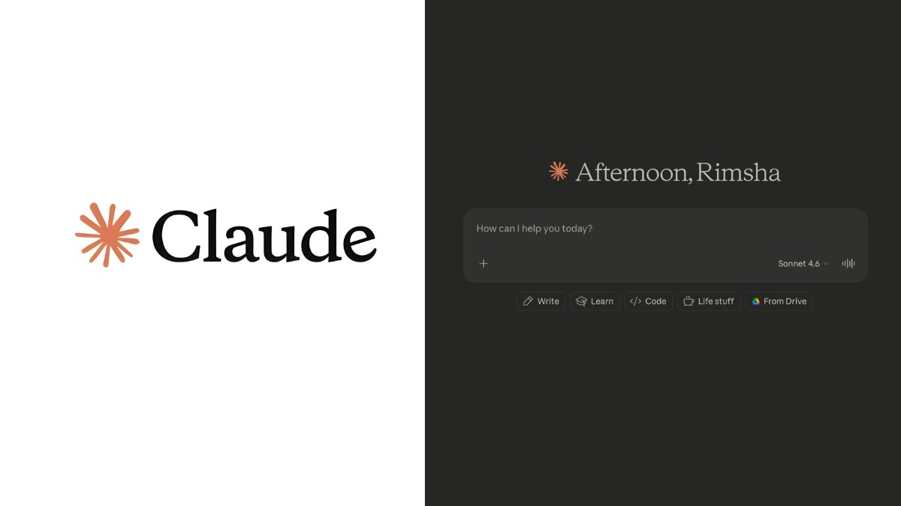

## 💬 Replies

### 1 @Crypto_hedyEth (Hedy.eth 🎮) (Author)

*Sat Apr 25 09:04:13 +0000 2026*

提示词1：情境简报

永远不要直接提问。

先铺垫情境：

'我的背景是：\[角色、公司、问题\]。已尝试：\[X、Y\]。卡住了：\[Z\]。帮我理清思路。'

内部测试显示这一改变能提升41%的输出质量。

Claude需要地图才能导航。 

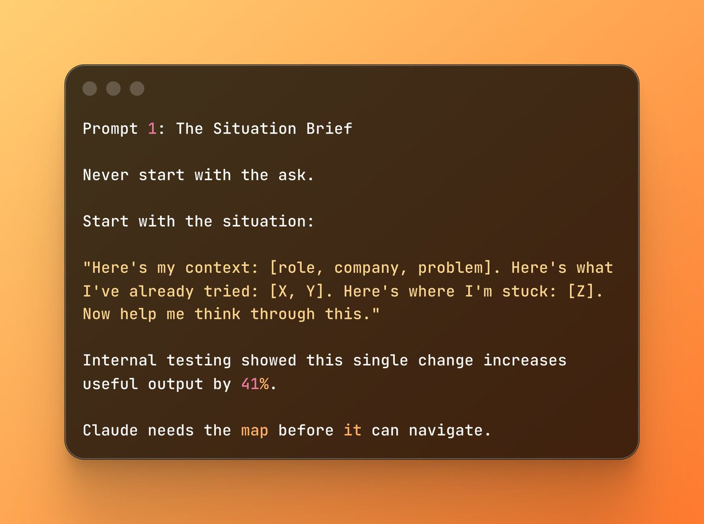

### 2 @Crypto_hedyEth (Hedy.eth 🎮) (Author)

*Sat Apr 25 09:04:13 +0000 2026*

提示词2：推理要求

别问答案，问思考过程。

'给出方案前，逐步展示你的推理。指出不确定之处。标记所有假设。'

这强制Claude的内部推理层浮现。

你得到的不仅是答案，还有可质证的思考过程。 

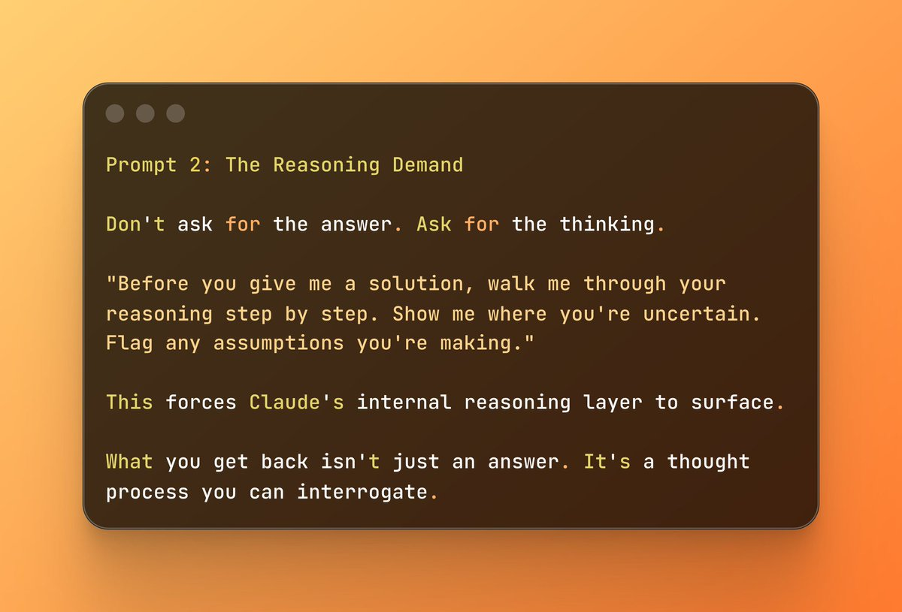

### 3 @Crypto_hedyEth (Hedy.eth 🎮) (Author)

*Sat Apr 25 09:04:14 +0000 2026*

提示词3：诚实约束

Claude天性乐于助人。

有时这意味着说你想听的。

覆盖它：

'即使难受也要诚实。我的计划有致命缺陷就直说。别软化。我宁愿现在听硬话，也不想以后失败。'

解锁Claude的宪法基础。 

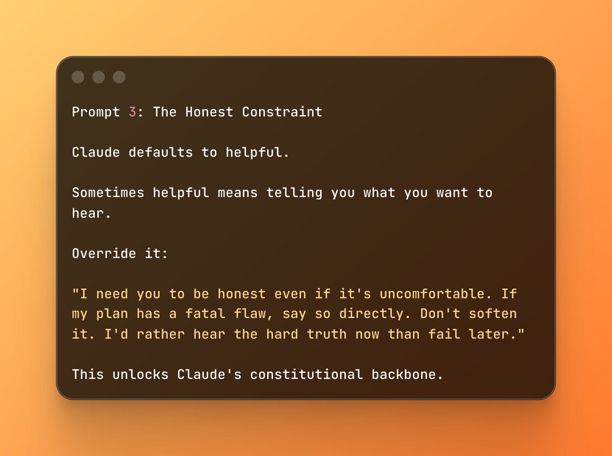

### 4 @Crypto_hedyEth (Hedy.eth 🎮) (Author)

*Sat Apr 25 09:04:14 +0000 2026*

提示词4：角色设定

'充当专家'是最弱的提示词。

改用这个：

'你是有\[具体经验\]的\[特定角色\]，见过\[具体失败模式\]。用\[特定框架\]思考。直言不讳，跳过常规建议。'

身份越具体，推理越具体。

模糊角色=模糊输出。每次都是。 

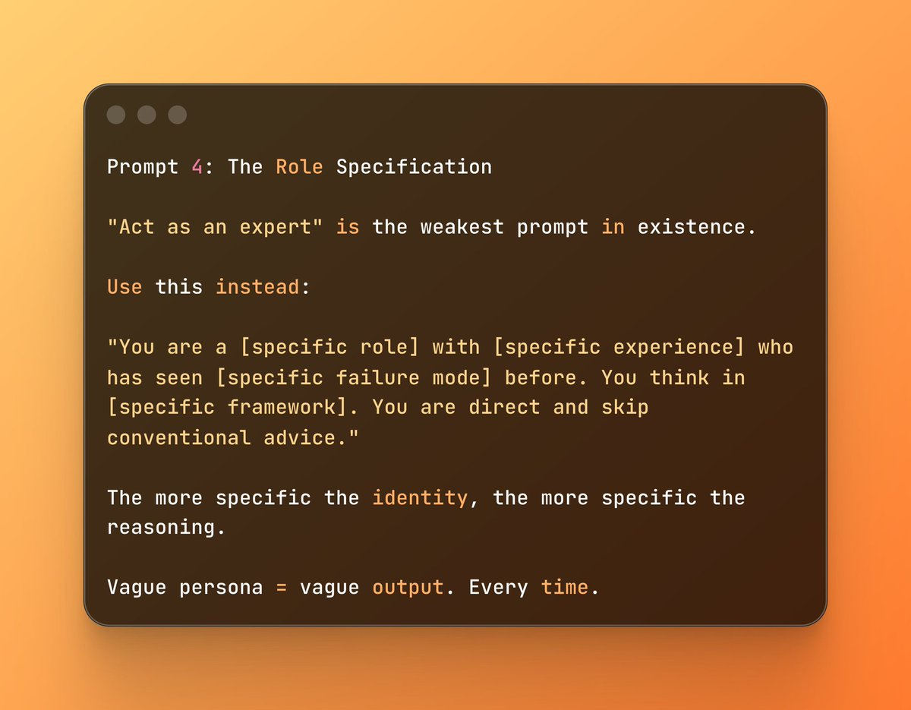

### 5 @Crypto_hedyEth (Hedy.eth 🎮) (Author)

*Sat Apr 25 09:04:15 +0000 2026*

提示词5：魔鬼代言人

Claude被训练得很温顺。

打破这个模式：

'我要分享计划。你的工作是摧毁它。找出所有错误假设、忽视的风险、失败原因。别手软。'

这就是Anthropic团队内部如何检验想法。

挑战你的模型值10倍同意你的。 

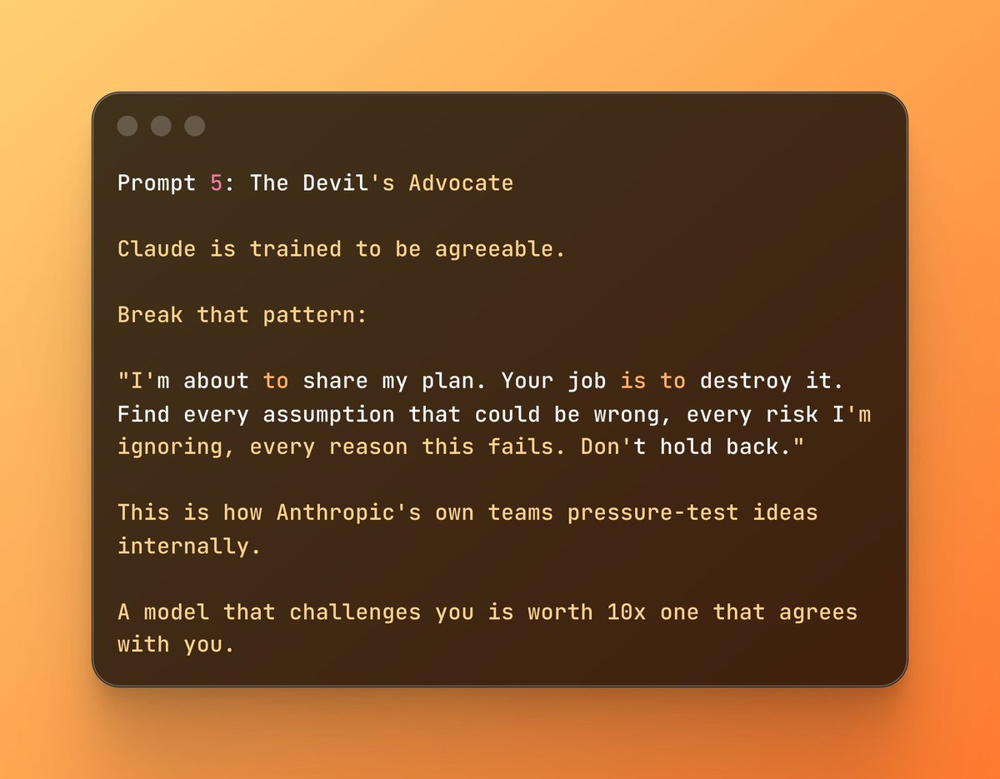

### 6 @Crypto_hedyEth (Hedy.eth 🎮) (Author)

*Sat Apr 25 09:04:15 +0000 2026*

提示词6：范围锁定

Claude会答你的问题加三个衍生问题。

早期锁定范围：

'严格限于\[X背景\]。超出范围就告诉我而非推测。我要差距而非自信的错误。'

这从源头杀死幻觉。

Claude停止用可信的虚构填补空白。 

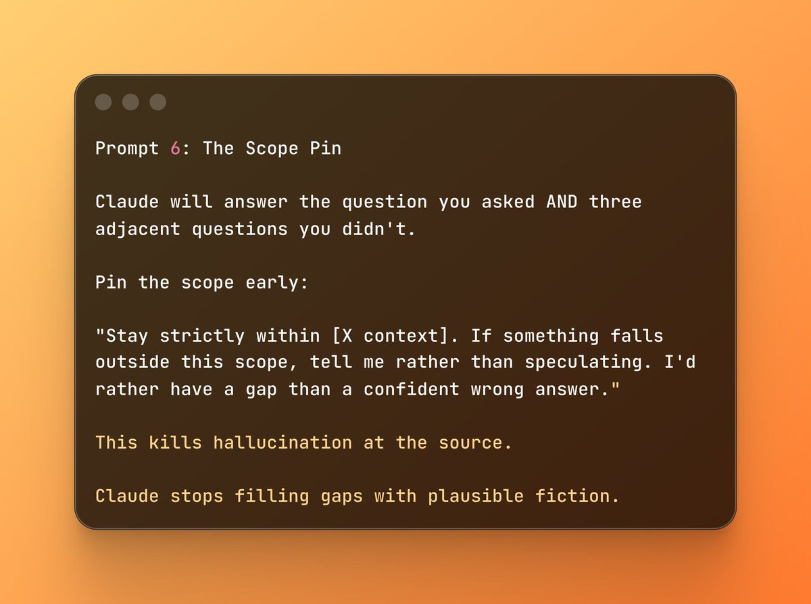

### 7 @Crypto_hedyEth (Hedy.eth 🎮) (Author)

*Sat Apr 25 09:04:16 +0000 2026*

提示词7：格式命令

Claude默认为全面而写。

你可能需要简洁。

提前设定格式：

'结构为：1）一句总结。2）三个要点。3）一个下一步建议。除非我问，其他都不要。'

Claude遵循格式指令比任何模型更精确。

有意使用这种精确性。 

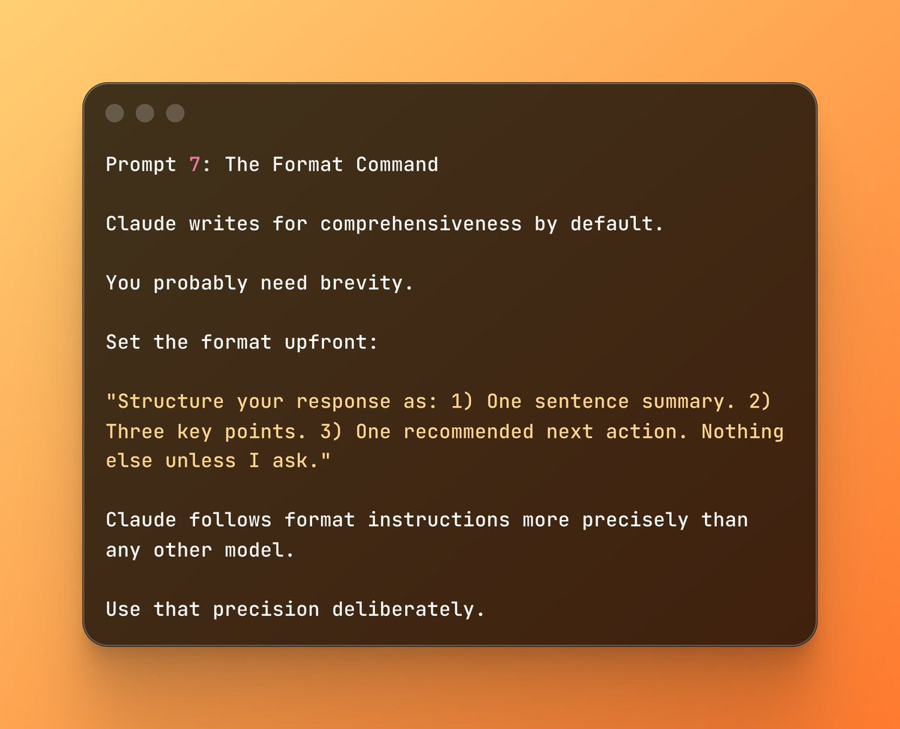

### 8 @Crypto_hedyEth (Hedy.eth 🎮) (Author)

*Sat Apr 25 09:04:16 +0000 2026*

提示词8：假设审计

任何复杂答案后，运行这个：

'你做了什么假设我应该验证？如果这些假设错了，答案会怎样改变？'

最少使用的提示词。

揭示每个回应下的隐藏基础。

大多数计划在基础处崩溃。 

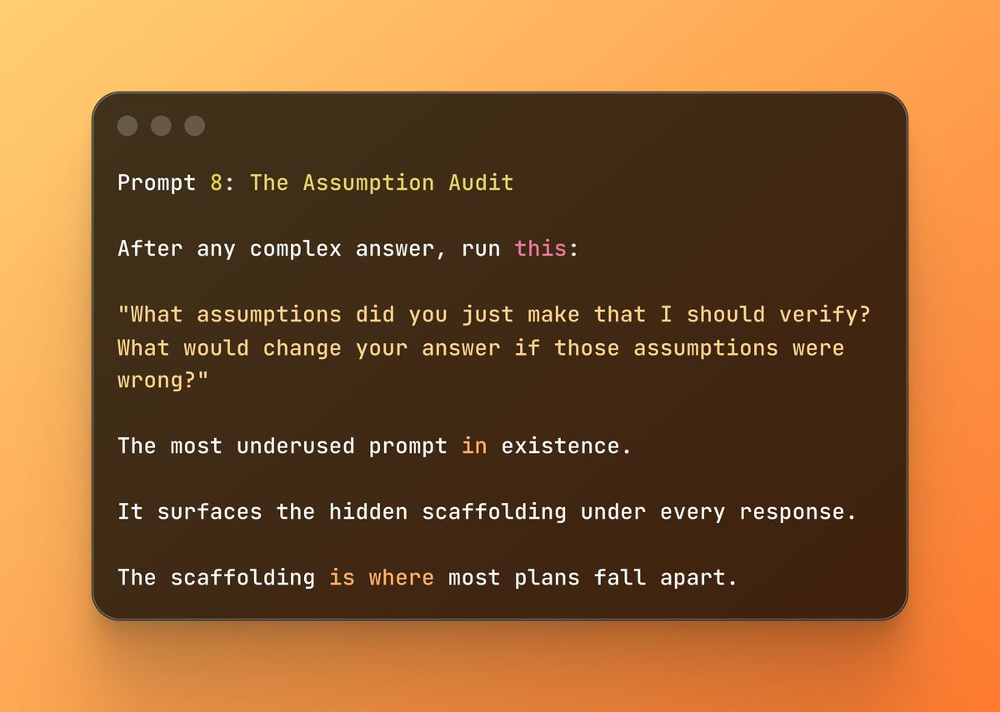

### 9 @Crypto_hedyEth (Hedy.eth 🎮) (Author)

*Sat Apr 25 09:04:17 +0000 2026*

提示词9：压缩循环

长对话中，Claude积累上下文债务。

每5-6次交互：

'总结进展。解决什么问题、决定了什么、最重要的未决问题是什么？'

保持对话聚焦重点。

防止Claude自信地解决错误问题。 

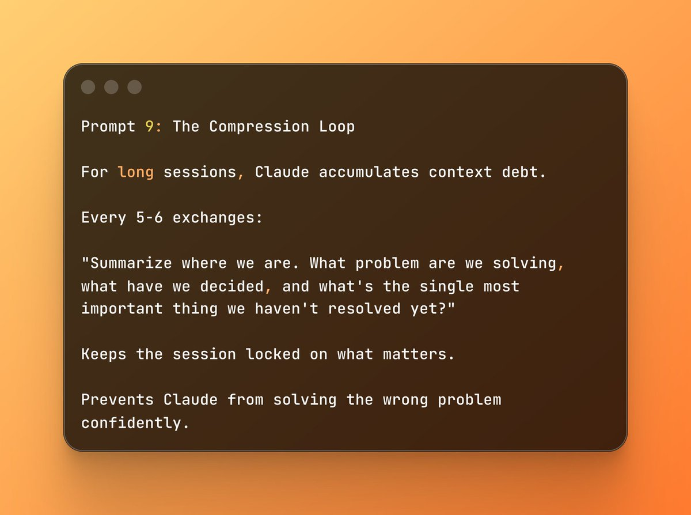

### 10 @Crypto_hedyEth (Hedy.eth 🎮) (Author)

*Sat Apr 25 09:04:17 +0000 2026*

提示词10：前期验尸

Claude帮助的东西上线前：

'假设6个月后失败。列出3个最可能原因。具体说。失败实际样子如何？'

这是Anthropic产品团队每项重大决定都运行的。

抓住其他审查流程遗漏的。 

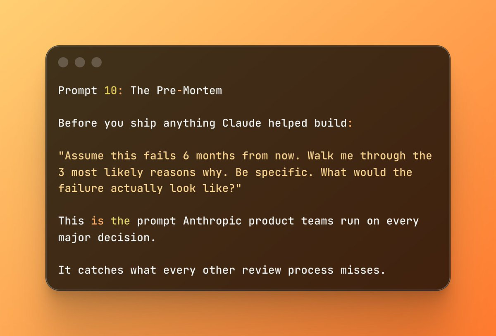

### 11 @huoshan007 (火山哥🕊️)

*Sun Apr 26 04:59:05 +0000 2026*

@Crypto\_hedyEth 这哥们的内部爆料，干货多过水分，比那些瞎吹的靠谱多了。

