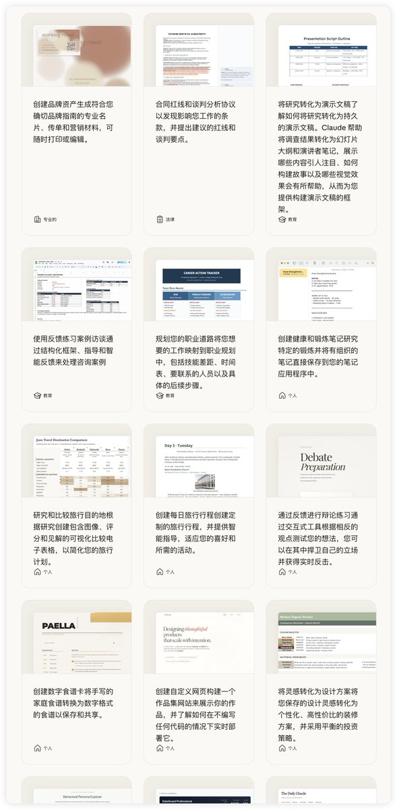

刚刷到 Claude 官网，
结果点进一份叫 45 个真实用例的清单

研究、写作、编码、分析、甚至生活小事全有
每个都是别人真的在用的场景

看完我才发现，
我一直把 Claude 当聊天工具，
但它其实早能接管我半天的工作量了
🔗[claude.com/resources/use-…](https://claude.com/resources/use-cases)rO

## 💬 Replies

### 1 @i_m_m_ (黑眼圈| 美股合约首选Gate)

*Sat Dec 27 12:18:21 +0000 2025*

@Crypto\_hedyEth Claude太强了

### 2 @xDinoDeer (DinoDeer)

*Sat Dec 27 14:58:32 +0000 2025*

@Crypto\_hedyEth 最好的教程全在官网上。

### 3 @YinXin45398 (故己)

*Sat Dec 27 13:32:36 +0000 2025*

@Crypto\_hedyEth 注册都注册不了🥲

### 4 @JHVeryyellow (JH.🐧❤️🦍)

*Sun Dec 28 16:53:18 +0000 2025*

@Crypto\_hedyEth Claude's real power lies in those everyday workflows we never think to automate

### 5 @kukuyidui (crypto 墨道)

*Sat Dec 27 13:15:49 +0000 2025*

@Crypto\_hedyEth 市场要的就是胆子

### 6 @liulang_D (流浪_dom)

*Sun Dec 28 14:10:57 +0000 2025*

@Crypto\_hedyEth mark

### 7 @Celestial_XXXX (ᛝXXXX)

*Sat Dec 27 22:55:04 +0000 2025*

@Crypto\_hedyEth 突然觉得中国做不起来AI，AI就是要打通不同的平台才能发挥价值，中国各个系统/APP一个比一个封闭，微信你转个抖音都转不了，还想AI。

