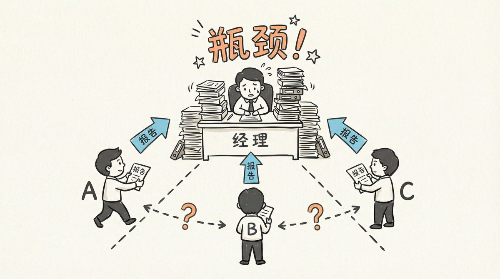
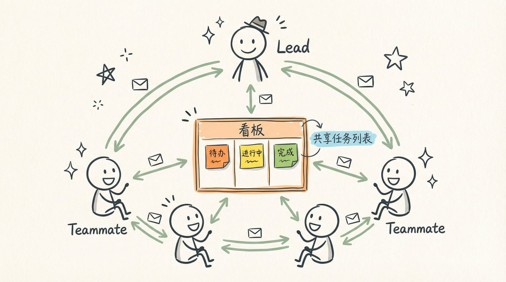
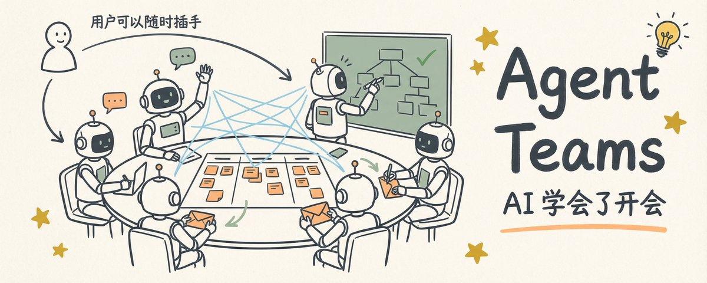

# 📰 新范式还是碎钞机？Claude Code Agent Teams 浅度解析

2026 年 2 月，一位 Anthropic 的工程师做了一件疯狂的事：他让 16 个 AI 同时工作，从零开始用 Rust 编写一个 C 编译器——目标是能编译 Linux 内核，经过2000 次 AI 会话、10 万行代码，最终这个编译器竟然真的跑起来了，成功在 x86、ARM 和 RISC-V 三个架构上编译了 Linux 6.9。

虽然可能有炒作的成分，但是这背后的技术，Anthropic 刚刚发布的 Agent Teams, 是一个值得研究的话题。它和之前的多 Agent 方案有什么本质区别？为什么说它可能代表了 AI 开发工具的一次架构跃迁？

旧模式：所有成果都要交回「经理」的桌上

在 Agent Teams 出现之前，Claude Code 已经支持一种多 Agent 机制——Subagents（子代理）。它的工作方式很像传统的「经理-下属」关系：

主 Agent（经理）

├── Subagent A → 干完活，交报告给经理

├── Subagent B → 干完活，交报告给经理

└── Subagent C → 干完活，交报告给经理

经理把任务拆好，分给三个下属，每个人干完回来汇报。听起来很合理吧？

但问题在于，上下文会累积。三个 Subagent 就是三份报告摆上经理的办公桌，五个就是五份。随着任务推进，经理的桌面仍然会越来越拥挤，越来越难在一堆材料里专注思考某一件事。

而且，下属之间互相看不见。A 不知道 B 在做什么，B 也不知道 C 发现了什么。所有信息都要经过经理中转。当任务简单时没问题，当任务复杂起来，经理就成了瓶颈。

比如你在调试一个 Bug。A 觉得是前端问题，B 觉得是后端问题，C 觉得是数据库问题。在 Subagent 模式下，它们各自调查完，分别给经理一份报告。但 A 的发现可能直接推翻 B 的假设，B 的结论可能需要 C 进一步验证——这种「交叉验证」在旧模式下根本做不到。

新模式：AI 学会了「开会」

2026 年 2 月 5 日，Anthropic 随 Opus 4.6 一起发布了 Agent Teams。架构从根本上变了：

Team Lead（队长）

├── Teammate A ←→ Teammate B   （直接对话）

├── Teammate B ←→ Teammate C   （直接对话）

└── 共享任务列表（所有人可见、可认领）

这个设计背后藏着两个根本性的变化。

变化一：信息按需流动，而非自动回流

 Agent Teams 的 teammate 和 Subagent 一样都有自己独立的上下文窗口，但信息的流动方式完全不同。

Subagent 完成任务后，成果摘要会自动作为工具调用的返回值写入主 Agent 的上下文——像交作业一样，每个人干完活都往经理桌上放一份。经理不需要主动去要，摘要自己就来了。

Agent Teams 的信息流动则更像团队内部发邮件。每个 teammate 在自己的上下文里深入工作，需要分享发现时主动发送一条针对性的消息——可以发给 Lead，也可以直接发给其他 teammate。当然，teammate 完成工作后也会自动通知 Lead，但 Lead 收到的是一条完成通知，而不是一整份结果摘要被自动塞进自己的上下文。

这个区别带来的直接好处是：每个 teammate 的上下文始终纯净，可以把全部容量用在自己的任务上；而 Lead 的上下文也更轻量，收到的是针对性的消息和通知，而不是自动堆上来的完整报告。

变化二：Teammate 之间可以直接对话

Agent Teams 内置了一套邮箱系统（Mailbox），支持：

\- 点对点消息：直接给某个特定 teammate 发消息

\- 广播：同时通知所有 teammate

上下文纯净 + 直接通信，这两个特性叠加在一起，解锁了一种 Subagent 根本做不到的协作模式——对抗式调查。

你可以让五个 teammate 各带一个假设，独立深入调查，然后互相辩论：

&gt; "用户反馈应用只收到一条消息就断开了。生成 5 个 teammate 分别调查不同假设，让它们互相尝试推翻对方的理论，像科学辩论一样。"

由于每个 teammate 的上下文完全独立，它们不会被彼此的推理过程"污染"——每个人都是从自己的角度独立得出结论，然后再碰撞。这比在同一个上下文里"假装从不同角度思考"要可靠得多。单个 AI 容易「锚定」——找到一个看似合理的解释就停下来了。多个独立 AI 互相挑战，存活下来的假设更可能接近真相。

团队是怎么运转的：五个核心机制

1\. 共享任务列表：不用催，自己抢活干

所有 teammate 共享一个任务看板。任务有三种状态：待认领 → 进行中 → 已完成。任务之间还能设置依赖——"任务 D 必须等 B 和 C 都完成才能开始"。当某个任务的前置依赖全部完成，它会自动解除阻塞。

最妙的是：teammate 完成手头任务后，会自动去看板上认领下一个任务，不需要 Lead 逐一分配。为了防止两个 teammate 同时抢同一个任务（就像两个外卖骑手同时接了同一单），系统用了文件锁来保证互斥。

2\. 委托模式：管住队长的手

在 team 模式下，Lead 被限制为只能做协调——生成 teammate、发消息、管任务——不能碰代码。就像足球教练在比赛中不能亲自上场。

3\. 计划审批：队长审图，工人才能开工

对于复杂任务，你可以要求 teammate 先制定计划，由 Lead 审批后才能动手。这不是普通的计划模式——而是一个 Lead 和 teammate 之间的审批工作流：teammate 提交计划，Lead 审阅后批准或打回并附上反馈，teammate 修改后重新提交。就像盖楼之前先过设计评审——在图纸上改方案，比推倒重建便宜太多了。

你还能给 Lead 设定审批标准，比如"只批准包含测试方案的计划"或"拒绝涉及数据库改动的计划"。

4\. 用户可以直接和任何 Teammate 对话

这是和 Subagent 的又一个重要区别。在 Subagent 模式下，你只能和主 Agent 交流。而在 Agent Teams 中，你可以随时插手任何一个 teammate 的工作：

\- In-process 模式：用 \`Shift+Up/Down\` 选择 teammate，直接输入消息

\- Split-pane 模式（需要 tmux/iTerm2）：每个 teammate 有独立面板，点击即可交互

如果发现某个 teammate 方向跑偏了，可以直接给它发消息纠正，不用通过 Lead 转达。

5\. Hooks 质量门控

Agent Teams 提供了两个关键 Hook，让你对团队行为设置自动化规则：

\- TeammateIdle：teammate 即将空闲时触发。返回 exit code 2 可以让它继续工作——"禁止摸鱼"

\- TaskCompleted：任务标记完成时触发。返回 exit code 2 可以阻止完成——"测试还没过，不许提交"

实战：16 个 AI 是怎么写出编译器的

回到开头那个故事，具体是怎么做到的？

\- 每个 Agent 运行在独立的 Docker 容器中

\- 通过 git 同步代码——每个 agent 有本地副本，完成后 push 到上游

\- 用极简的任务认领机制：往 \`current\_tasks/\` 目录写一个文件表示"这事我认领了"

\- Agent 不断循环：完成任务 → 拉取上游更新 → 合并冲突 → 推送 → 释放锁 → 开始下一个

这个实验沉淀出了几条非常有价值的经验：

为 AI 设计工作流，而不是套用人类的。Agent 需要特殊格式的错误输出（每个 ERROR 在同一行，方便 grep），需要极其详细的 README（因为每个新会话都是从零开始的"新员工"），需要增量式的进度报告（因为 AI 没有时间概念）。

高质量测试是自主协作的基石。没有好的测试，agent 就会"自信满满地解决错误的问题"。在没有人类实时监督的情况下，测试就是唯一的真相来源。

专业化分工比通才更高效。不同 agent 被分配了明确的角色——代码去重、性能优化、质量改进、文档编写——每个人专注自己擅长的领域，效果远好于"所有人什么都干"。

写在最后

当然，独立上下文 + 消息通信的架构也意味着更高的 Token 消耗——每个 teammate 都是一个完整的 Claude 实例，Token 开销随 teammate 数量成倍增长。在那个编译器项目中，16 个 agent 消耗了 20 亿 input tokens，花费约 2 万美元。我实际测试下来，大概是普通模式 3-5 倍的 Token 消耗。Agent Teams 目前仍是实验性功能，目前仍有很多不足之处：不支持会话恢复、不能嵌套团队、每个会话只能管理一个团队。

但这些都是工程问题，可以迭代解决。更值得关注的是它指向的方向：从 Subagents 到 Agent Teams，AI 开发工具经历了从「并行执行」到「协作智能」的进化。每个 AI 在自己纯净的上下文中深入思考，需要时通过消息交换发现——像极了人类团队里，每个人有自己的专业视角，通过开会来达成共识。

如果你正在面对一个复杂的编程问题，并且恰好有充足的 token 额度，不妨试一试 “Hey Claude, 请组建 team, 帮我解决这个问题！”

\---

Agent Teams 目前为实验性功能（Research Preview），需在 settings.json 中添加 "CLAUDE\_CODE\_EXPERIMENTAL\_AGENT\_TEAMS": "1"  手动开启。详见 \[Anthropic 官方文档\](https://code.claude.com/docs/en/agent-teams)。

参考资料：

\- \[Orchestrate teams of Claude Code sessions\](https://code.claude.com/docs/en/agent-teams)

\- \[Building a C compiler with a team of parallel Claudes\](https://www.anthropic.com/engineering/building-c-compiler)

\- \[Anthropic releases Opus 4.6 with new agent teams — TechCrunch\](https://techcrunch.com/2026/02/05/anthropic-releases-opus-4-6-with-new-agent-teams/)

### 🖼️ Attached Media

## 💬 Replies

### 1 @AlpacaNotes (小羊驼杂记)

*Mon Feb 09 14:45:51 +0000 2026*

@Jason\_Young1231 我现在已决定放弃用opus进行复杂的编程任务了。它们不是很聪明的样子，总是抓不住重点。

不过确实语言风格很好，比隔壁那家满嘴黑话（还不知道从哪里学来的）相比，读起来舒适了许多

### 2 @Jason_Young1231 (Jason Young) (Author)

*Mon Feb 09 14:48:53 +0000 2026*

@AztecaAlpaca 哈哈哈，可以试试普通 gpt-5.2 不带 -codex 的模型，说话的抽象程度会低一些😂

### 3 @wayne_zhang0 (Wayne)

*Wed Feb 11 09:54:41 +0000 2026*

@Jason\_Young1231 @grok 记录下

### 4 @gunxinjn179361 (aitom)

*Tue Feb 10 22:27:25 +0000 2026*

@Jason\_Young1231 @grok 记录下，并看看openclaw能否借鉴

