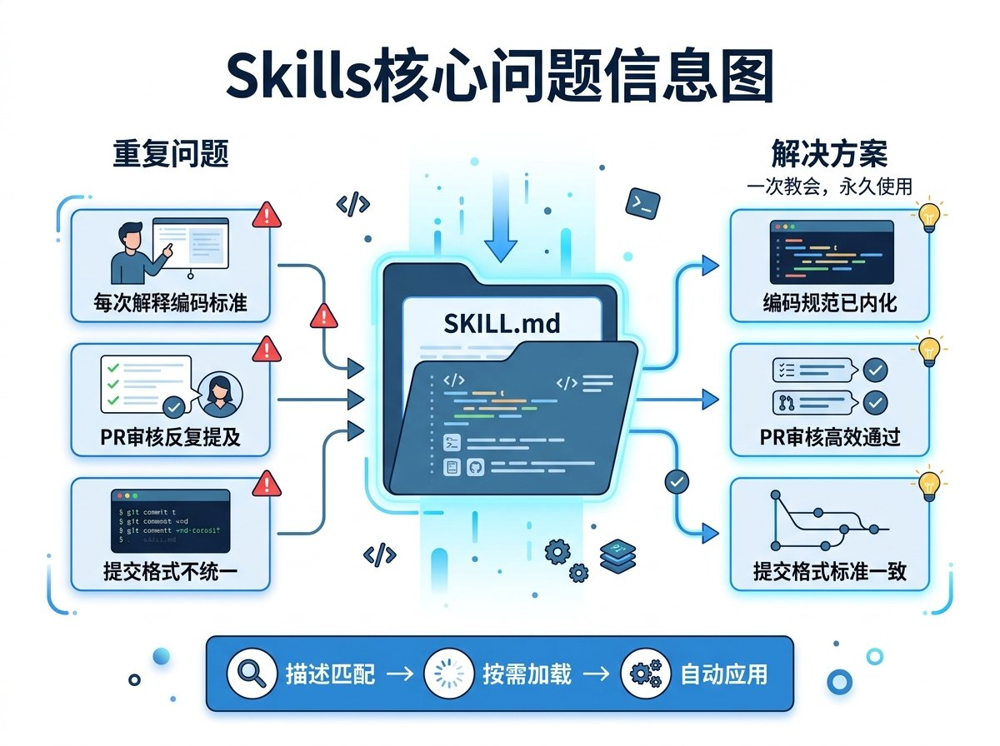
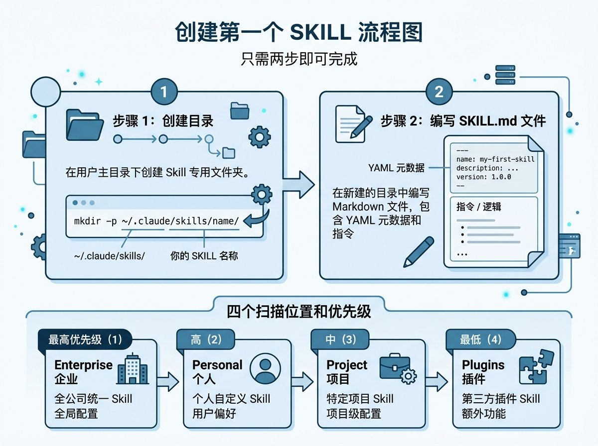
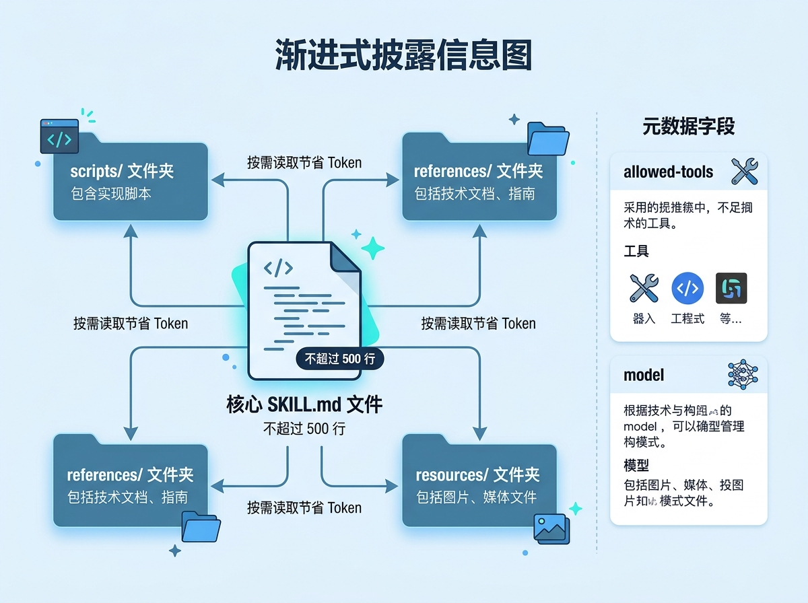
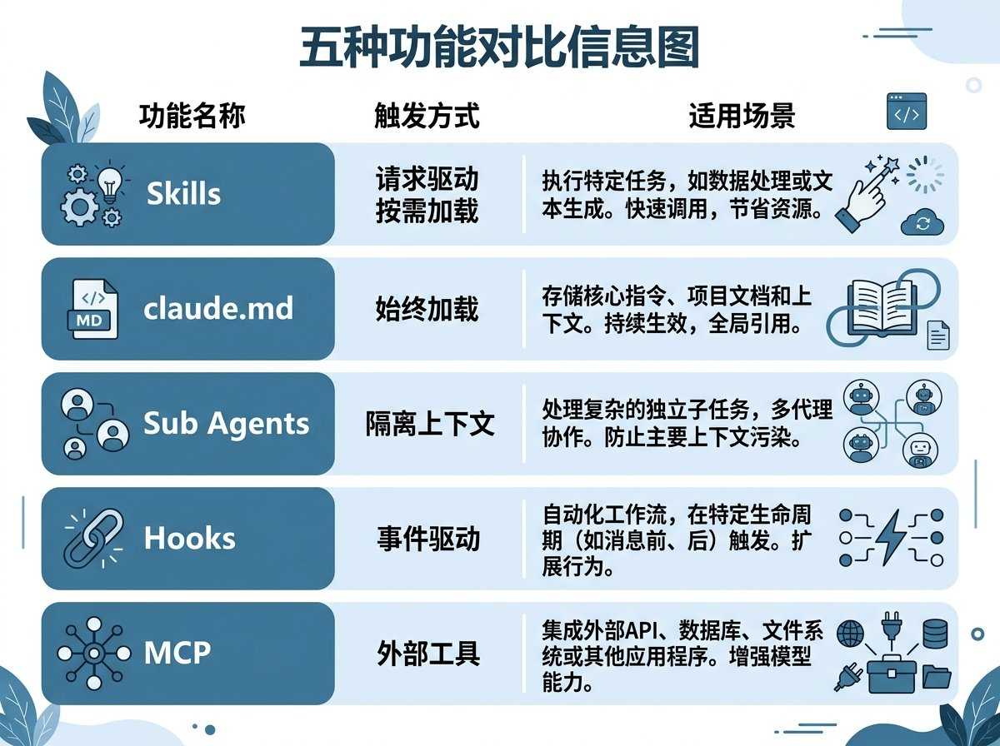
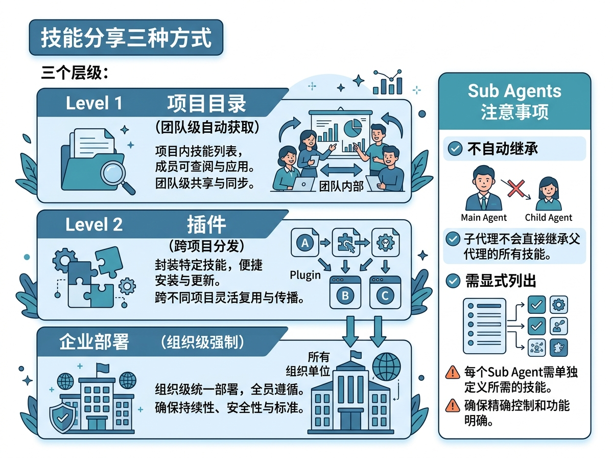
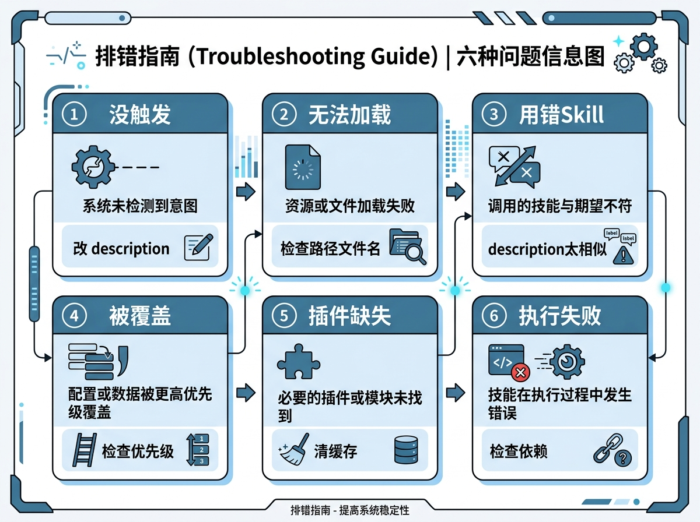
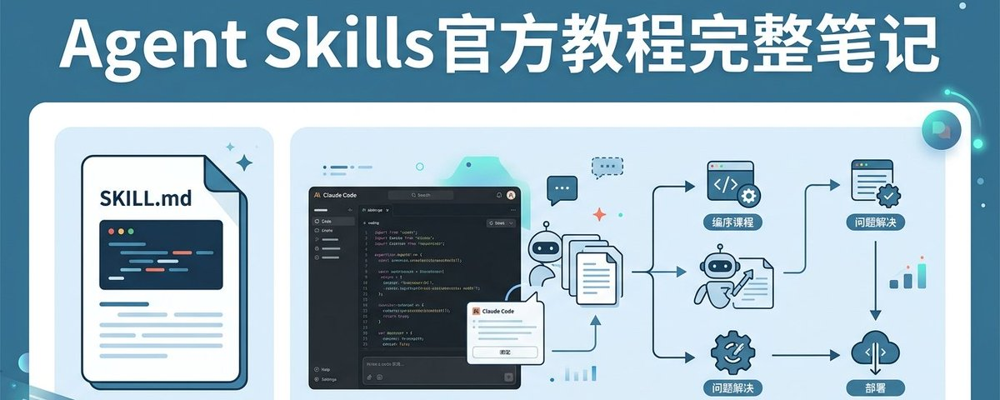

# 📰 Anthropic官方出了Agent Skills教程，6节课22分钟，这是完整笔记 

Anthropic终于出了官方的Agent Skills教学视频，一共6节课，总时长22分钟。从什么是Skills讲到怎么创建、怎么配置多文件、跟其他功能的区别、怎么分享、怎么排错，覆盖了Skills的完整生命周期

这套教程最大的价值不是教你写一个Skill，而是把Skills的设计哲学和底层机制讲清楚了。很多人用Skills遇到的问题，根源都在对这些机制的理解不够

## Skills解决了什么问题

每次你向Claude解释你们团队的编码标准，你都是在重复自己。每次PR审核，你都要重新描述你希望如何组织反馈。每条提交信息，你都要提醒Claude你偏好的格式

Skills就是为了消除这种重复。一个Skill就是一个Markdown文件，一次教会Claude怎么做某事，Claude在相关情况下自动运用这些知识

更准确地说，Agent Skills是一个文件夹，里面包含指令、脚本和资源。Claude可以自动发现并利用这些完成更准确、更高效的工作

核心机制是description字段。Claude启动时加载所有Skill的名称和描述，当你发出请求时，Claude把你的请求跟所有可用Skill的描述做语义匹配，找到匹配的那个激活它。只有在激活的时候，完整的Skill内容才会被加载到上下文窗口

这跟claude.md有本质区别。claude.md的内容在每次对话中都会加载，不管你在做什么。Skill只在需要的时候才加载，调试的时候你的PR审核清单不需要在上下文里，只有你真正请求审核的时候它才出现

什么时候该用Skill？如果你发现自己反复向Claude解释同一件事，那就是一个待开发的Skill

## 从零创建第一个Skill

创建一个Skill只需要两步：建目录，写文件

第一步，在\~/.claude/skills/下创建一个以Skill名称命名的目录。放在这个位置意味着这是个人级Skill，在所有项目中都可用

第二步，在目录里创建SKILL.md文件。文件分两部分，用三个破折号分隔。上半部分是YAML元数据，包含name和description。下半部分是Claude要遵循的具体指令

Claude Code启动时会扫描四个位置获取Skills：企业路径、个人Skills目录、项目Skills目录、已安装的插件。它只加载每个Skill的名称和描述，不加载全部内容

当你发送请求时，Claude把请求跟所有Skill描述做对比。如果意图匹配，它会先要求你确认是否加载这个Skill。确认后才读取完整文件并按指令执行。这个确认步骤让你随时知道Claude正在使用什么上下文

如果出现同名Skill，优先级从高到低依次是：企业级（managed-settings.json）、个人级（\~/.claude/skills）、项目级（project/.claude/skills）、插件级（project/.claude-plugins/skills）

这意味着公司可以通过企业级Skill强制执行标准，同时允许个人通过不同名称的Skill做个性化定制。如果你的公司有企业级代码审查Skill，你可以创建一个叫front-end-pr-review的个人Skill来补充而不是覆盖

## 配置进阶：元数据字段和渐进式披露

基本Skill只需要name和description，但有几个进阶配置能让Skill更强大

allowed-tools字段可以限制Claude在Skill激活时能用哪些工具。比如你有一个只读分析Skill，可以禁止编辑、写入和Bash命令。如果省略这个字段，Skill不会限制任何东西，Claude使用正常的权限模型

model字段可以指定要使用的Claude模型版本

description的写法直接决定Skill能不能被正确触发。好的description要回答两个问题：这个Skill做什么？什么时候该让Claude使用它？如果Skill没触发，加更多跟你请求措辞匹配的关键词

最重要的进阶概念是渐进式披露。Skill跟你的对话共享上下文窗口，如果把所有内容塞进一个两万行的SKILL.md，它会占用大量上下文空间

正确做法是：必要的指令放在SKILL.md里，详细的参考资料放在单独的文件里，Claude只在需要时才去读。开放标准建议的目录结构是：scripts文件夹存放可执行代码，references存放参考文档，resources存放图像、模板等数据文件。在SKILL.md里用链接引用这些文件

关键规则：SKILL.md不要超过500行。如果超了，说明应该拆分。脚本可以直接执行而不需要加载其内容到上下文，只有输出才消耗Token。所以告诉Claude去运行脚本，而不是读取脚本。这对环境验证和数据转换特别有用，经过测试的脚本代码比临时生成的更可靠

## Skills和其他Claude Code功能的区别

Skills vs claude.md：claude.md始终加载到每个对话中，用来放项目标准这种始终适用的规则，比如"本项目使用TypeScript严格模式"。Skills按需加载，只在Claude匹配到请求时激活

Skills vs Sub Agents：Skills为当前对话增添知识，激活后指令加入现有上下文。Sub Agents在独立的上下文中运行，接到任务后独立完成并提交结果，跟主对话完全隔离

Skills vs Hooks：Hooks是事件驱动的，在特定事件发生时触发，比如Claude每次保存文件时运行Linter。Skills是请求驱动的，根据你提出的问题激活

Skills vs MCP：MCP提供外部工具连接，让Claude能调用Gmail、Notion这些服务。Skills提供知识和流程，告诉Claude怎么用这些工具完成特定任务

一句话总结：claude.md放始终在线的指令，Skills放自动匹配的专业知识，Sub Agents在隔离上下文运行委托任务，Hooks响应事件，MCP连接外部工具。它们可以组合使用

## 分享Skills：从个人到团队到组织

Skills的价值在于分享。一个只有你自己用的PR审核Skill是有帮助的，团队共享的同一个Skill可以标准化代码审查并提供一致的体验

三种分享方式

第一种是项目目录。把Skill提交到代码库的.claude/skills目录，任何克隆仓库的人自动获得这些Skill，不需要额外安装。推送更新后所有人在下次pull中就能收到。这适用于团队编码标准、项目特定工作流程

第二种是插件。可以把插件理解为一种跨项目分发Skill的方式，上传到应用商店后其他用户可以下载安装。如果你的Skill有通用性，不是针对特定项目的，社区成员也可以使用，这是最好的选择

第三种是企业部署。管理员通过托管设置将Skill推送到整个组织。企业级Skill优先级最高，会覆盖同名的个人和项目Skill。这用于强制性标准、安全要求、合规工作流程

一个重要的注意事项：Sub Agents不会自动继承你的Skills。当你委派任务给子代理时，它从一个全新的上下文开始。内置代理（Explorer、Plan、Verify）完全无法访问Skills，只有你定义的自定义子代理才能使用，而且必须在agent.md里明确列出

创建带Skill的自定义子代理的方法是，在.claude/agents目录下创建agent.md文件，在里面添加skills字段列出需要的Skill名称。只列出与子代理目标始终相关的Skill，因为这些Skill在子代理启动时就会加载

## 排错指南：Skill不工作的六种原因和解法

Skill出问题通常归为六种情况

第一种，Skill没有触发。原因几乎总是description写得不够好。Claude用语义匹配，你的请求需要跟description的含义对上。如果重叠不够就无法匹配。解决方法是对照description和你的请求措辞，加入用户实际会说的触发短语，比如"帮我分析一下""为什么这么慢""加快速度"这些变体

第二种，Skill无法加载。检查路径和文件名：SKILL.md必须在一个命名目录内部，不能直接放在skills根目录下。文件名必须完全是SKILL.md，全部大写。运行claude --debug查看加载错误

第三种，Claude用了错误的Skill。说明你有多个description太相似的Skill，让Claude无法区分。解决方法是让每个description尽可能具体，帮Claude决定什么时候用哪个

第四种，个人Skill被忽略。可能是企业级或更高优先级的同名Skill在覆盖它。检查四个优先级层级，解决方案是把你的Skill重命名为一个更独特的名称

第五种，插件安装了但看不到Skill。清除缓存 rm \~/.claude/plugins/cache，重启Claude Code并重新安装。如果还是不行，说明插件的目录结构有问题，用验证工具skills-ref validate检查

第六种，Skill加载了但执行时失败。如果Skill用了外部软件包，必须确保这些包已经安装。把依赖信息添加到Skill的description里

Anthropic还提供了一个验证工具skills-ref，可以检查Skill的文件结构、YAML语法是否正确。建议用uv安装，是最快的方式

### 🖼️ Attached Media

## 💬 Replies

### 1 @moyang2035 (苏墨阳2035)

*Sat Mar 21 21:47:42 +0000 2026*

@GoSailGlobal 给个官方课程链接呗😀

### 2 @GoSailGlobal (Jason Zhu) (Author)

*Mon Mar 23 05:52:13 +0000 2026*

@moyang2035 最新推文内有

### 3 @iBigQiang (强子手记)

*Mon Mar 23 22:12:25 +0000 2026*

@GoSailGlobal 这个课程应该非常有价值，如果顺利通过考试拿到认证，想去找工作的这就是个不错的通行证吧

### 4 @ItsPipiYa (我是皮皮呀)

*Sun Mar 22 13:07:27 +0000 2026*

@GoSailGlobal 很棒的总结！另外推荐搭配 Claude Code 官方文档一起看，里面有更详细的代码示例。

### 5 @KittorsY41334 (Kittors Yuan)

*Mon Mar 23 09:40:26 +0000 2026*

@GoSailGlobal @readwise save thread

### 6 @RobinZhang2022 (张永彬AI)

*Sun Mar 22 04:28:26 +0000 2026*

@GoSailGlobal 👍👍👍👍👍👍👍

### 7 @Ken796222464932 (Ken)

*Tue Mar 24 23:31:59 +0000 2026*

@GoSailGlobal 学习到了，感谢

