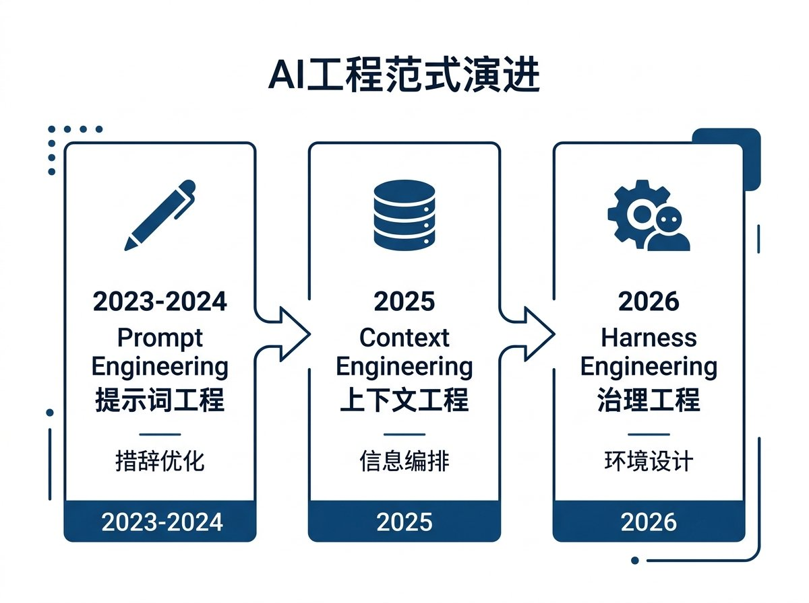
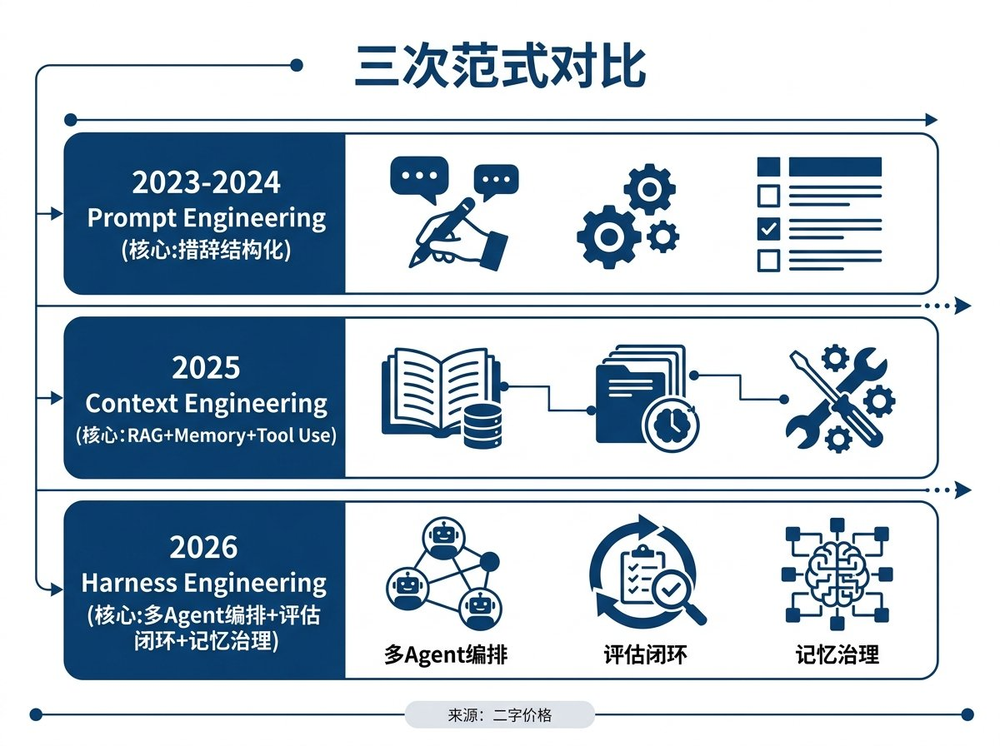
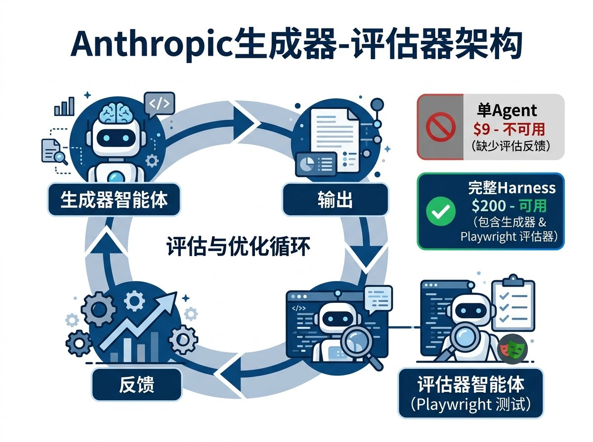
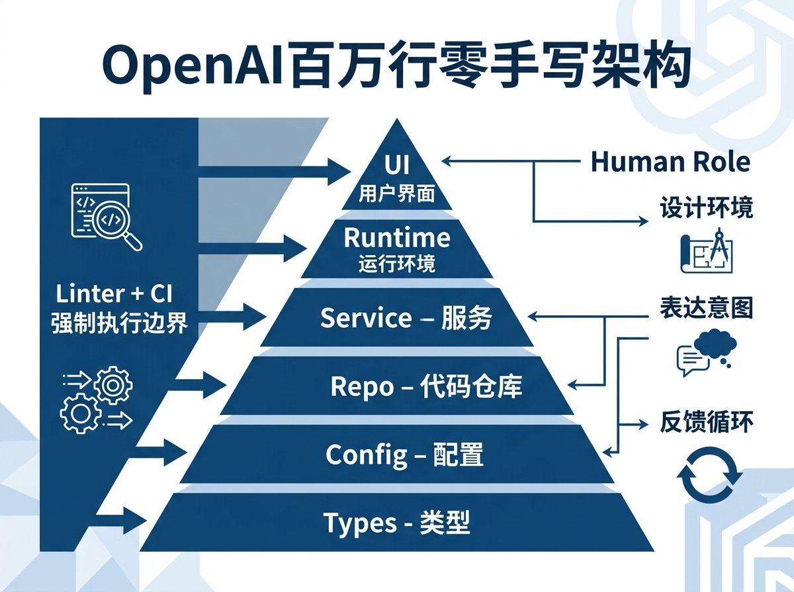
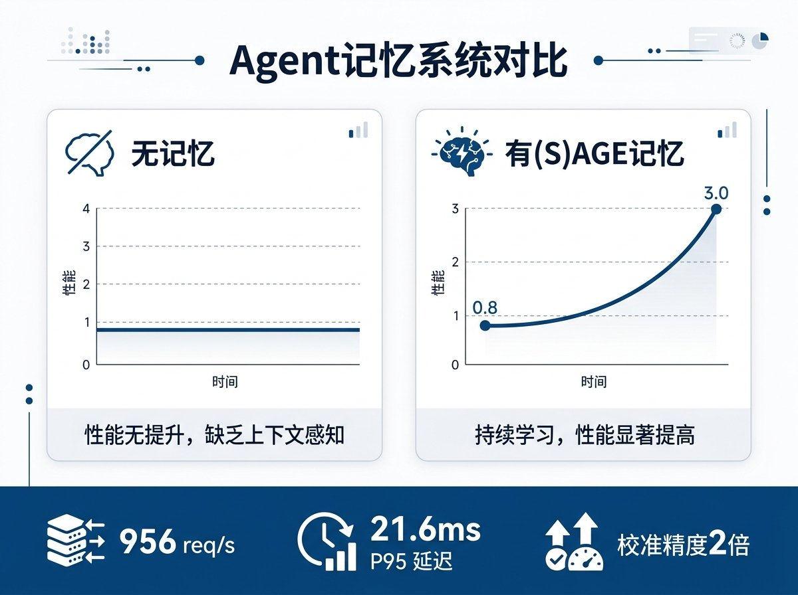
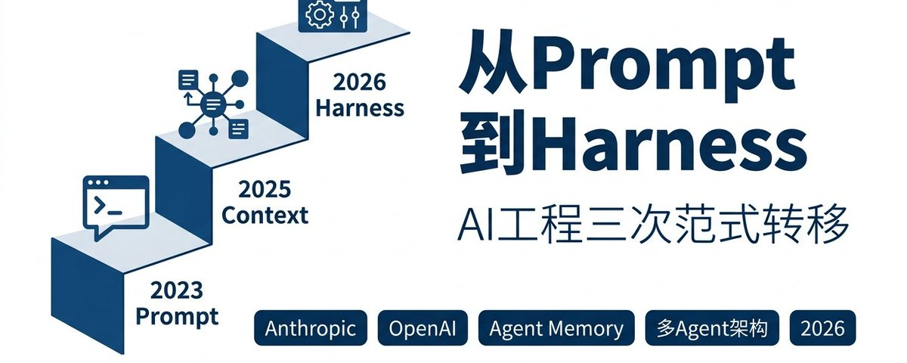
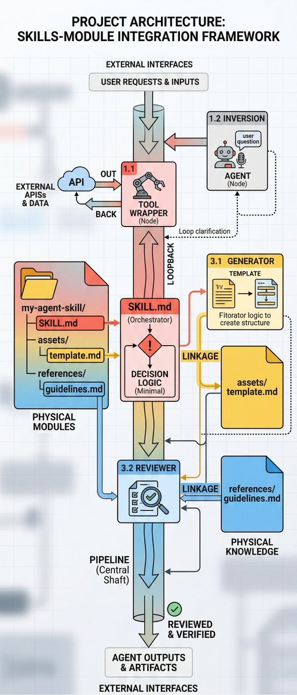

# 📰 从Prompt到Context到Harness AI工程三次范式转移

2026年初，Anthropic 和 OpenAI 几乎同一周发了各自关于 Harness Engineering 的实践文章。加上两篇关于 Agent 记忆基础设施的学术论文，以及社区里关于三代工程范式演进的讨论，一个完整的图景正在浮现

## 三代工程范式各解决什么问题

2023到2024年是 Prompt Engineering 的时代。核心问题是怎么跟模型说话，让它给出更好的回答。措辞、格式、few-shot 示例、Chain of Thought，所有技巧都围绕"一次对话"展开

2025年 Context Engineering 成为主流概念。Shopify CEO Tobi 的那句"Context engineering is the new skill"被广泛传播。核心问题变了：单靠提示词不够，需要把整个上下文窗口当作工程对象来设计。RAG 检索、长上下文管理、tool use 编排、memory 系统全部属于这个范畴。你在优化的是模型看到的全部信息

2026年初 Harness Engineering 这个概念被两家大厂几乎同时提出。核心问题再次升级：Agent 可以自主运行几个小时甚至几天了，单次上下文的优化远远不够。你需要设计的是 Agent 的整个运行环境，包括多 Agent 协作架构、评估反馈闭环、架构约束的机械化执行、记忆的治理和验证机制

三代之间的关系：每一代都包含前一代。Harness 包含 Context，Context 包含 Prompt。但每一代解决的核心问题完全不同

## Anthropic 怎么做：让 Agent 互相评估

Anthropic 工程师 Prithvi Rajasekaran 的实验揭示了一个反直觉的事实：Agent 评估自己的工作基本没用

不管输出质量高低，Agent 给自己的评价永远是正面的。把生成和评估拆成两个独立 Agent 之后效果完全不同。评估器不是读代码打分，而是用 Playwright 实际操作页面，点按钮、填表单、验证功能，然后根据四个维度打分：设计质量、原创性、工艺细节、功能完整度

前端设计实验里，生成器经过5到15轮和评估器的来回迭代，在第十轮做出了一个3D空间导航方案。全栈开发实验更复杂，三个 Agent 分工：规划器把一句话需求展开成完整产品规格、生成器用 React+FastAPI+PostgreSQL 逐步实现、评估器做 QA 测试

对比数据很直观。单 Agent 20分钟花9美元，产出不能用。完整 harness 6小时花200美元，交付了带精灵动画、AI 集成和导出功能的完整游戏

最有价值的发现：随着 Opus 4.6 能力提升，sprint 分解可以去掉了，但评估器不能去掉。Harness 的每个组件都编码了对模型局限性的假设。模型变强之后有些假设不再成立，但有些永远成立。识别哪些该留哪些该删，是 harness engineering 的核心技能

## OpenAI 怎么做：百万行代码零手写

OpenAI 的实验更激进。五个月，一个小团队用 Codex Agent 构建了大约一百万行代码的生产系统。零手写。应用逻辑、文档、CI 配置、可观测性基础设施、工具链全部由 Agent 生成

工程师的角色彻底变了。他们做三件事：设计开发环境、用结构化 prompt 表达意图、给 Agent 提供反馈循环。OpenAI 管这个叫 depth-first working：把大目标拆成小构件，让 Agent 构建每个构件，然后用这些构件解锁更复杂的任务

架构治理是这套系统能跑起来的关键。依赖层级严格分六层：Types、Config、Repo、Service、Runtime、UI。每一层的边界用 linter 和 CI 机械化执行，不是靠文档约定，是靠代码强制。Agent 违反架构约束的 PR 会被自动拒绝

Martin Fowler 的评价很到位：Harness Engineering 把 context engineering、架构约束和垃圾回收编码成了机器可读的制品，Agent 可以系统性地执行

## 记忆系统：Harness 里最容易被忽略的一层

Anthropic 讲评估闭环，OpenAI 讲架构约束，但两家都没有深入讨论记忆。这恰好是两篇学术论文填补的空白

第一篇是 (S)AGE 论文，提出了拜占庭容错的多 Agent 记忆基础设施。核心问题：当多个 Agent 共享一个知识库的时候，怎么保证写入的知识是可信的。一个 Agent 可能因为幻觉写入了错误信息，也可能被对抗性攻击注入虚假记忆

他们的方案是 Proof of Experience 共识机制。每个 Agent 有声誉权重，权重由四个因子决定：历史准确率、领域相关性、活跃度、独立验证数。Agent 提交的记忆需要经过加权投票验证才能写入知识库。部署在4节点 BFT 网络上，956 req/s 写入、21.6ms P95 查询。有这套记忆系统的 Agent 校准精度是无记忆基线的两倍

第二篇纵向学习论文回答了一个更根本的问题：有记忆的 Agent 系统真的会随时间变好吗

实验设计很巧妙。治疗组：3行 prompt + (S)AGE 记忆，每轮可以查询之前所有轮次积累的知识。对照组：50到200行专家精心编写的 prompt，但没有记忆，每轮从零开始。跑10轮之后，治疗组的红队评估难度从0.8增长到3.0（Spearman rho=0.716, p=0.020），对照组完全没有增长趋势（rho=0.040, p=0.901）

最关键的一点：两组的绝对性能水平没有统计差异（Cohen's d = -0.07）。3行 prompt 加记忆和200行专家 prompt 打了个平手。差异在于学习轨迹，有记忆的系统越跑越好，没记忆的永远在同一个水平线上

这意味着记忆层给 Agent 系统带来的不是更高的初始性能，而是组织级的纵向学习能力。人类组织的第100个项目通常比第1个好，因为有过程文档、事后复盘、知识库积累。现在 Agent 系统也开始展现同样的特征

## Prompt vs Context vs Harness 的本质区别

三代工程范式的区别可以用一句话概括

Prompt Engineering 优化的是人和模型之间的接口

Context Engineering 优化的是模型的输入空间

Harness Engineering 优化的是 Agent 的整个运行时环境

Anthropic 的实验证明了评估闭环比自评估有效几个数量级。OpenAI 的实验证明了架构约束可以让 Agent 在百万行代码级别保持一致性。两篇论文证明了共识验证的记忆系统可以让 Agent 组织具备纵向学习能力

这三层加在一起就是完整的 Harness：评估机制 + 架构约束 + 记忆治理。少了任何一层，Agent 系统都会在某个维度上失控

via Anthropic Engineering Blog / OpenAI Blog / (S)AGE Paper / Longitudinal Learning Paper

### 🖼️ Attached Media

## 💬 Replies

### 1 @TaNGSoFT (𝙩𝙮≃𝙛{𝕩}^A𝕀²·ℙarad𝕚g𝕞)

*Sat Mar 28 10:54:15 +0000 2026*

@GoSailGlobal 我始终认为harness是相对于之前说的scaffold而言的，就是Thariq说的seeing like an agent。
prompt/context都还在。只是LLM越来越agentic，只是prompt/context hold不住了。

### 2 @GoSailGlobal (Jason Zhu) (Author)

*Sat Mar 28 11:05:54 +0000 2026*

@TaNGSoFT 智能已经满足，走向意识

### 3 @nclinux (pyinx)

*Sat Mar 28 12:30:35 +0000 2026*

@GoSailGlobal AI编程的进化链:
Prompt Engineering → Context Engineering → Harness Engineering → Agent Orchestration Engineering
\- prompt: 解决"怎么说" - 语法层
\- context: 解决"给什么信息" - 数据层
\- harness: 解决"如何约束执行" - 执行层
\- agent orchestration: 解决"如何协调多Agent" - 编排层

### 4 @yj16166 (YCE)

*Sun Mar 29 16:35:19 +0000 2026*

@GoSailGlobal 这是一个基于harness engineering 实现的自我循环代码提升，框架，再也不需要担心ai 写的屎山代码技术债 [github.com/sentrux/sentrux](https://github.com/sentrux/sentrux)

### 5 @muzhifeng2 (YRun)

*Sun Mar 29 07:14:58 +0000 2026*

@GoSailGlobal [github.com/Aquifer-sea/pa…](https://github.com/Aquifer-sea/pattern8) 看看这个呢 

### 6 @Ryan_RuZhao_Ma (Ryan)

*Sun Mar 29 07:40:20 +0000 2026*

@GoSailGlobal harness是基于agent设计的一套更好控制ai的方法论，相当于设计了一套环境

### 7 @web3_Chalice (杯子)

*Sat Mar 28 13:08:10 +0000 2026*

@GoSailGlobal 还不够，Harness我感觉是prompt的高级用法。
我自己在使用LangGraph做多agent开发，用完我才发现这是Harness的概念😂。现在的范式解决不了上下文爆炸的问题，虽然每一次的范式转移都减少了很多。 但是想一下当前的全自动化场景，token太爆炸了。
现在很像以前流量很贵的时候，想上网冲浪得考虑流量费

