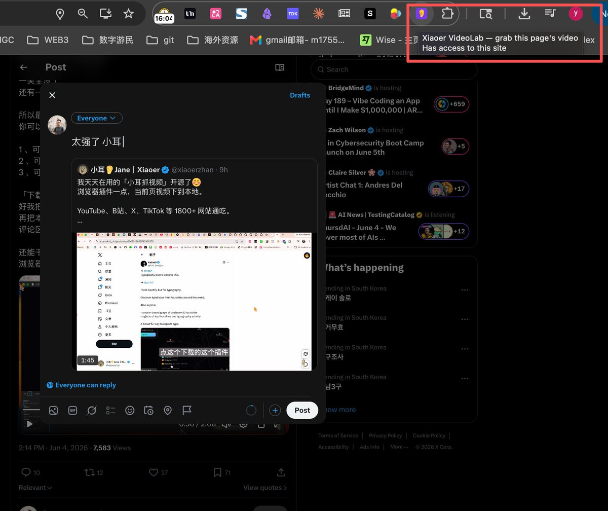
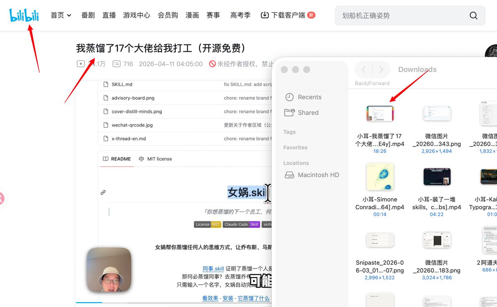

太强了 小耳 

已经用上了

大家切勿传播，偷偷使用🤡Z

## 💬 Replies

### 1 @xiaoerzhan (小耳👂Jane｜Xiaoer)

*Fri Jun 05 02:23:09 +0000 2026*

@GoSailGlobal 这个是B站的测试哈～～～ 

### 2 @harrisonitsme (森叔)

*Thu Jun 04 17:18:36 +0000 2026*

@GoSailGlobal 这个好

### 3 @XiaoheiSpring (xiaohei_spring)

*Fri Jun 05 07:58:38 +0000 2026*

@GoSailGlobal 我艹，好东西，悄悄的

### 4 @fengxia17063046 (OwlWorks)

*Fri Jun 05 13:02:49 +0000 2026*

@GoSailGlobal 你这是此地无银三百两啊，这不就是在传播了吗？😅

### 5 @Nuanyang912 (CAN)

*Fri Jun 05 04:14:28 +0000 2026*

@GoSailGlobal 这种功能大家不都做烂了吗🥹

### 6 @Ryanstarxin (Ryan | 金融 & AI 搞钱)

*Fri Jun 05 10:54:34 +0000 2026*

@GoSailGlobal 太棒了！视频教学确实是高效学习方式，但浏览器标签一多就容易丢失，这个插件直接解决“保存即所得”的痛点。支持1800+网站，开源还免费，强烈推荐给所有在线学习者，尤其是B站和YouTube重度用户。

### 7 @dowsen9214 (BEERUS)

*Fri Jun 05 04:16:14 +0000 2026*

@GoSailGlobal 怎么安装  不会啊

### 8 @weichen_ink (微尘印记)

*Fri Jun 12 00:50:57 +0000 2026*

@GoSailGlobal 厉害了啊，目前支持哪些平台啊？要上架吗？

### 9 @SangjuCat (UnhappyCat)

*Sat Jun 06 01:36:16 +0000 2026*

@GoSailGlobal 那你发出来干嘛

### 10 @binzhlng1 (龙哥来了)

*Fri Jun 05 13:43:39 +0000 2026*

@GoSailGlobal 谁在用谁知道，闷声发财才稳。

### 11 @gorkemezgi1108 (Ezgi Alta)

*Fri Jun 05 02:46:34 +0000 2026*

@GoSailGlobal 线下sao货没人比她sao @your\_zhen1 🥰💕

### 12 @Junhui86 (Junhui)

*Sat Jun 06 12:09:12 +0000 2026*

@GoSailGlobal get it

