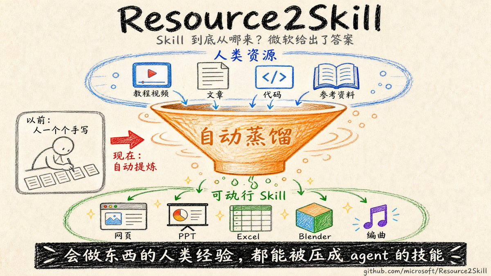

微软刚开源了一个项目，叫 Resource2Skill，还配了篇 arXiv 论文
名字就是它干的事：Resource → Skill

它回答的，是 skill 这件事一直没人正面碰的问题：skill 到底从哪来
以前靠人一个个手写
它把人类已经做好的东西，教程视频、文章、代码、参考资料
自动蒸馏成 agent 能直接跑的可执行 skill

而且不是纸上谈兵：agent 能浏览、组合、运行这些 skill
真做出网页、PPT、Excel、Blender 场景、甚至编曲音频

· skill 正在从「人手写」，进入「从人类资源里自动提炼」的阶段
· 这一步一旦成熟，会做东西的人类经验，都能被压成 agent 的技能

🔗[agentskillshub.top/skill/microsof…](https://agentskillshub.top/skill/microsoft/Resource2Skill/)

### 🖼️ Attached Media

## 💬 Replies

### 1 @ajs6888 (安叫兽|Bird🕊️ 🔶 BNB)

*Tue Jul 21 06:27:26 +0000 2026*

@GoSailGlobal 这下手搓 skill 的活能少不少

### 2 @shuizhuyu (Crio Songo)

*Wed Jul 22 10:13:08 +0000 2026*

@GoSailGlobal 这个思路确实比手动写技能合理多了，把人类已有的公开资源直接蒸馏成可执行技能，等于直接盘活了网上那么多教程、代码这些存量知识。要是这条路跑通了，Agent的能力边界估计能涨一大截。

