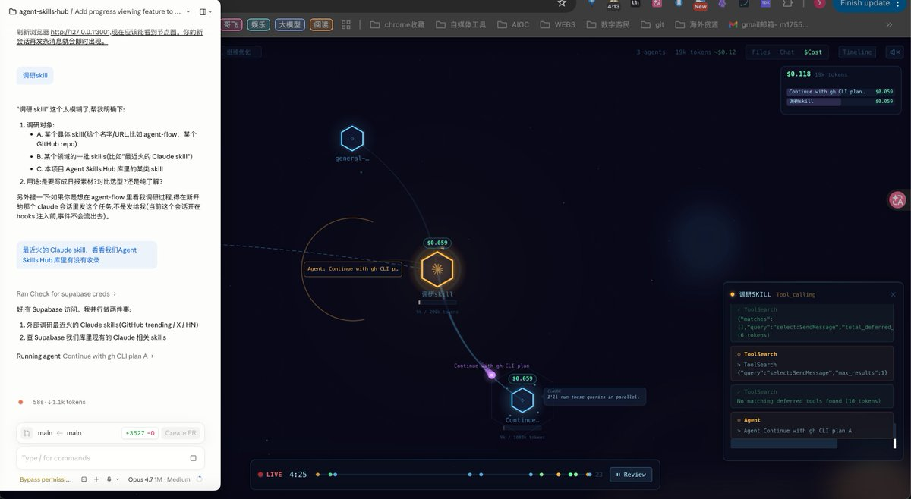

我靠 这个agent-flow给我的cc装上了

可以实时可视化 Claude Code 代理编排

直接把任务的过程可视化了，可以看代理在工作时思考、分支和协调的过程

还能看消耗cost

[agentskillshub.top/skill/patoles/…](https://agentskillshub.top/skill/patoles/agent-flow/) 

## 💬 Replies

### 1 @naraguy (Naraguy | Building Nara Chain)

*Tue Apr 21 04:19:48 +0000 2026*

@GoSailGlobal 这个可视化是靠解析 cc 的日志/trace 还是要改 prompt/SDK 注入？分支节点之间的依赖怎么判定的，靠 tool call 关系吗？

### 2 @GoSailGlobal (Jason Zhu) (Author)

*Tue Apr 21 16:41:06 +0000 2026*

@naraguy 我是docker起 CC 装的

### 3 @yue8985 (大匪)

*Tue Apr 21 04:20:20 +0000 2026*

@GoSailGlobal 把 Claude Code 的代理编排过程直接可视化出来这点很有用，尤其是把分支过程和 cost 放在一起看，终于能判断一个任务到底是 prompt 问题，还是 agent 拆分出了问题。现在很多人只看到结果，这种中间态反而更适合拿来学习和 debug。

