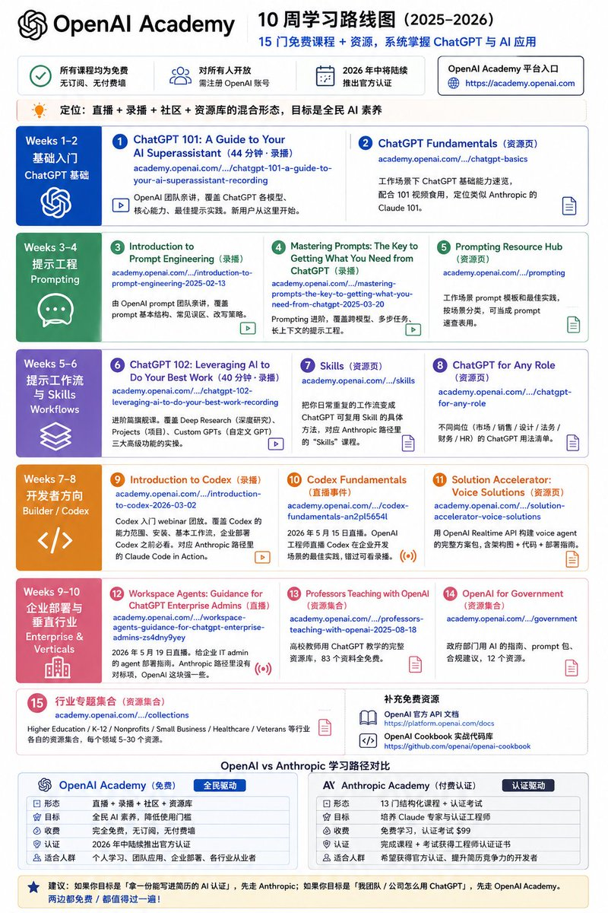

这两套头部AI公司：OpenAI、Anthropic的免费课程足够你学习AI了（省下那报课，被割韭菜的钱👀 ）

OpenAI Academy 自 2025 年起开放公共学习平台，2026 年中将陆续推出官方认证

所有课程均为免费、无订阅、无付费墙、对所有人开放（需注册账号），平台入口[academy.openai.com](https://academy.openai.com)8

跟 Anthropic 那套「13 门课 + $99 认证考」的结构化路径不同，OpenAI Academy 目前更像「直播 + 录播 + 社区 + 资源库」的混合形态

以下按 10 周路线图整理，每个课程都附官方直达链接（点击即可进入）：

1️⃣ Weeks 1-2：ChatGPT 基础（Foundations）

1\. ChatGPT 101: A Guide to Your AI Superassistant（OpenAI Academy 录播，44 分钟，免费）[academy.openai.com/en/public/club…](https://academy.openai.com/en/public/clubs/work-users-ynjqu/videos/chatgpt-101-a-guide-to-your-ai-superassistant-recording)q
说明：OpenAI 团队亲讲，覆盖 ChatGPT 各模型、核心能力、最佳提示实践。新用户从这里开始。

2\. ChatGPT Fundamentals（OpenAI Academy 资源页，免费）[academy.openai.com/en/public/club…](https://academy.openai.com/en/public/clubs/work-users-ynjqu/resources/chatgpt-basics)K
说明：工作场景下 ChatGPT 基础能力速览，配合 101 视频食用，定位类似 Anthropic 的 Claude 101。

2️⃣ Weeks 3-4：提示工程进阶（Prompting）

3\. Introduction to Prompt Engineering（OpenAI Academy 录播，免费）[academy.openai.com/en/public/vide…](https://academy.openai.com/en/public/videos/introduction-to-prompt-engineering-2025-02-13)r
说明：由 OpenAI prompt 团队亲讲，覆盖 prompt 基本结构、常见误区、改写策略。

4\. Mastering Prompts: The Key to Getting What You Need from ChatGPT（OpenAI Academy 录播，免费）[academy.openai.com/en/public/vide…](https://academy.openai.com/en/public/videos/mastering-prompts-the-key-to-getting-what-you-need-from-chatgptmastering-prompts-the-key-to-getting-what-you-need-from-chatgpt-2025-03-20)a
说明：Prompting 进阶，覆盖跨模型、多步任务、长上下文的提示工程。

5\. Prompting Resource Hub（OpenAI Academy 资源页，免费）[academy.openai.com/en/public/club…](https://academy.openai.com/en/public/clubs/work-users-ynjqu/resources/prompting)2
说明：工作场景 prompt 模板和最佳实践，按场景分类，可当成 prompt 速查表用。

3️⃣ Weeks 5-6：进阶工作流与 Skills（Workflows）

6\. ChatGPT 102: Leveraging AI to Do Your Best Work（OpenAI Academy 录播，40 分钟，免费）[academy.openai.com/en/public/club…](https://academy.openai.com/en/public/clubs/work-users-ynjqu/videos/chatgpt-102-leveraging-ai-to-do-your-best-work-recording)z
说明：进阶篇旗舰课。覆盖 Deep Research（深度研究）、Projects（项目）、Custom GPTs（自定义 GPT）三大高级功能的实操。

7\. Skills（OpenAI Academy 资源页，免费）[academy.openai.com/en/public/club…](https://academy.openai.com/en/public/clubs/work-users-ynjqu/resources/skills)E
说明：把你日常重复的工作流变成 ChatGPT 可复用 Skill 的具体方法，对应 Anthropic 路径里的 "Skills" 课程。

8\. ChatGPT for Any Role（OpenAI Academy 资源页，免费）[academy.openai.com/en/public/club…](https://academy.openai.com/en/public/clubs/work-users-ynjqu/resources/chatgpt-for-any-role)W
说明：不同岗位（市场 / 销售 / 设计 / 法务 / 财务 / HR）的 ChatGPT 用法清单。

4️⃣ Weeks 7-8：开发者方向（Builder / Codex）

9\. Introduction to Codex（OpenAI Academy 录播，60 分钟，免费）[academy.openai.com/en/public/vide…](https://academy.openai.com/en/public/videos/introduction-to-codex-2026-03-02)Q
说明：Codex 入门 webinar 回放。覆盖 Codex 的能力范围、安装、基本工作流，企业部署 Codex 之前必看。对应 Anthropic 路径里的 Claude Code in Action。

10\. Codex Fundamentals（OpenAI Academy 直播事件，免费）[academy.openai.com/en/public/club…](https://academy.openai.com/en/public/clubs/builders-etkn1/events/codex-fundamentals-an2pl5654l)3
说明：2026 年 5 月 15 日 OpenAI 工程师直播 Codex 在企业开发场景的最佳实践，错过可看录播。

11\. Solution Accelerator: Voice Solutions（OpenAI Academy 资源页，免费）[academy.openai.com/en/public/club…](https://academy.openai.com/en/public/clubs/builders-etkn1/resources/solution-accelerator-voice-solutions)t
说明：用 OpenAI Realtime API 构建 voice agent 的完整方案包，含架构图 + 代码 + 部署指南。

补充免费资源：
\- OpenAI 官方 API 文档[platform.openai.com/docs](https://platform.openai.com/docs)7）
\- OpenAI Cookbook 实战代码库[github.com/openai/openai-…](https://github.com/openai/openai-cookbook)p）

5️⃣ Weeks 9-10：企业部署与垂直行业（Enterprise & Verticals）

12\. Workspace Agents: Guidance for ChatGPT Enterprise Admins（OpenAI Academy 直播，免费）[academy.openai.com/en/public/even…](https://academy.openai.com/en/public/events/workspace-agents-guidance-for-chatgpt-enterprise-admins-zs4dny9yey)A
说明：2026 年 5 月 19 日直播。给企业 IT admin 的 agent 部署指南。Anthropic 路径里没有对标项，OpenAI 这块强一些。

13\. Professors Teaching with OpenAI（OpenAI Academy 资源集合，83 个资源，免费）[academy.openai.com/en/public/coll…](https://academy.openai.com/en/public/collections/professors-teaching-with-openai-2025-08-18)7
说明：高校教师用 ChatGPT 教学的完整资源库，83 个资料全免费。

14\. OpenAI for Government（OpenAI Academy 资源集合，12 个资源，免费）[academy.openai.com/en/public/coll…](https://academy.openai.com/en/public/collections/government)1
说明：政府部门用 AI 的指南、prompt 包、合规建议。

15\. 行业专题集合（OpenAI Academy，免费）[academy.openai.com/en/public/coll…](https://academy.openai.com/en/public/collections)z
说明：Higher Education / K-12 / Nonprofits / Small Business / Healthcare / Veterans 等行业各自的资源集合，每个领域 5-30 个资源。

· 跟 Anthropic 路径的差异（一句话）

\- Anthropic 走「认证驱动」：13 门结构化课程 → 一张 $99 的工程师认证证书

\- OpenAI 走「全民驱动」：直播 + 录播 + 社区 + 资源库，目标是全民 AI 素养，2026 年中陆续推出认证

如果你目标是「拿一份能写进简历的 AI 认证」，先走 Anthropic
如果你目标是「我团队 / 公司怎么用 ChatGPT」，先走 OpenAI Academy

两边都免费 / 都值得过一遍

### 🖼️ Attached Media

## 💬 Replies

### 1 @GoSailGlobal (Jason Zhu) (Author)

*Tue May 12 03:43:17 +0000 2026*

Anthropic Claude Certified Architect 完整路线图：8 门免费课程 + $99 认证考：[jasonzhu.ai/zh/blog/anthro…](https://jasonzhu.ai/zh/blog/anthropic-claude-certified-architect-roadmap)

OpenAI Academy vs Anthropic：两套头部 AI 公司的免费学习路径对比：[jasonzhu.ai/zh/blog/openai…](https://jasonzhu.ai/zh/blog/openai-academy-vs-anthropic-learning-paths)

### 2 @Dipanshu_AI (Dipanshu Kushwaha)

*Wed May 13 03:24:02 +0000 2026*

@GoSailGlobal Awesome! Free resources from top companies are a game changer. Can't wait to see what OpenAI Academy has to offer!

### 3 @GoSailGlobal (Jason Zhu) (Author)

*Wed May 13 03:25:38 +0000 2026*

@Dipanshu\_AI free nice course

### 4 @xingjian_ai (星见)

*Tue May 12 02:32:15 +0000 2026*

@GoSailGlobal 好齐全， 拿来转一下当企业内训资料

### 5 @GoSailGlobal (Jason Zhu) (Author)

*Tue May 12 02:33:51 +0000 2026*

@xingjian\_ai 哈哈 两大公司的，够了

### 6 @eternityspring (烁皓)

*Tue May 12 03:56:01 +0000 2026*

@GoSailGlobal 不知不觉官方尽然出了这么多干活

### 7 @GoSailGlobal (Jason Zhu) (Author)

*Tue May 12 04:10:43 +0000 2026*

@eternityspring 确实 openai的还没怎么看过

claude的看了好多

### 8 @ponyodong (波妞PONYO)

*Tue May 12 02:09:23 +0000 2026*

@GoSailGlobal 这篇太干货了，建议朱总微信公众号和小红书也赶紧发一篇吧。

### 9 @GoSailGlobal (Jason Zhu) (Author)

*Tue May 12 02:11:35 +0000 2026*

@ponyodong 马上 哈哈

### 10 @BoHai76425 (bo hai)

*Thu May 14 04:37:41 +0000 2026*

@GoSailGlobal chatGPT写的，“一句话”出卖了你

### 11 @GoSailGlobal (Jason Zhu) (Author)

*Thu May 14 04:38:17 +0000 2026*

@BoHai76425 我用cc

### 12 @OmniTools_AI (OmniTools)

*Tue May 12 05:41:04 +0000 2026*

@GoSailGlobal OpenAI 的灵活性适合快速迭代的AI领域，能快速纳入新模型特性（如Realtime API）。但Anthropic的结构化+认证更易形成可验证技能树，对系统性学习者（尤其是开发者）吸引力更大。

### 13 @Qykey (Blockey)

*Wed May 13 09:25:48 +0000 2026*

@GoSailGlobal Open source is so good!

### 14 @ZQJoe46 (ZQJoe)

*Tue May 12 22:26:50 +0000 2026*

@GoSailGlobal 1

### 15 @WWilson96325 (AI创想家)

*Wed May 13 04:13:40 +0000 2026*

@GoSailGlobal 感谢分享

### 16 @shawnaf7yuro (Heidi Docsbook-io)

*Fri May 15 22:43:16 +0000 2026*

@GoSailGlobal Hey, I built agent-skills-hub docs into a site and it's already pulling in traffic. Mind if I share the link?

### 17 @ameyere2f983w (Kaitlyn Docsbook-io)

*Tue May 12 03:52:01 +0000 2026*

@GoSailGlobal Set up [jasonzhu.ai](http://jasonzhu.ai) docs as a hosted site that fits right into your product visually once styled. Should I share?

### 18 @henry_ylh (Henry Yang)

*Wed May 13 00:58:44 +0000 2026*

@GoSailGlobal You need full functional seedance2.0 API:

[seedance.lightspeedfuture.com](https://seedance.lightspeedfuture.com/)

