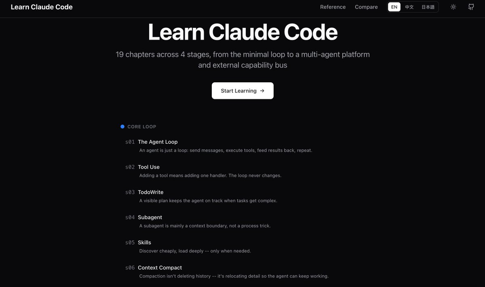

这个学习Claude Code的教程真的不错

Github上都快6w star了，才发现有这样的好东西

[learn.shareai.run](https://learn.shareai.run/) 

## 💬 Replies

### 1 @artiscipher (Artis Cipher)

*Wed May 06 10:41:34 +0000 2026*

@GoSailGlobal claude是香，香的都舍不得用，怕一用就封号。

### 2 @GoSailGlobal (Jason Zhu) (Author)

*Wed May 06 10:49:04 +0000 2026*

@artiscipher 啊😧

### 3 @xaiwind (想风)

*Wed May 06 09:29:49 +0000 2026*

@GoSailGlobal 是很不错 貌似很多站部署了 从简单到复杂 讲得很清楚

### 4 @yzg75001 (CryptoClaw)

*Wed May 06 17:25:36 +0000 2026*

@GoSailGlobal 6w stars damn, the vibe coding wave is real. Claude Code + cursor combo has been my daily driver for a while now, can confirm it's worth the time to learn properly

