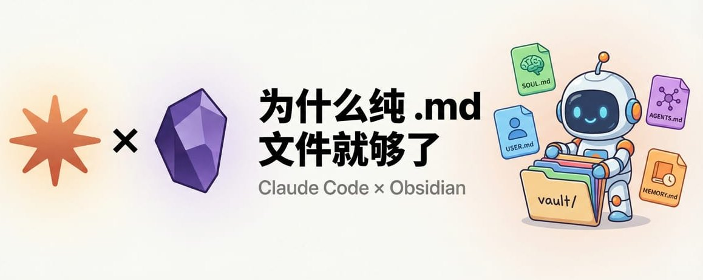

# 📰 Claude Code + Obsidian：为什么纯 .md 就够了

前天发了条关于 Claude Code + Obsidian 的帖子，被人喷：狗屁不懂还在这里充数。🤣

[Embedded Tweet: https://x.com/i/status/2036144569793028226]

刚开始使用 Obsidian 两周，说实话，确实没有深入想过 "为什么是 Obsidian" 这个问题。被喷了之后认真研究了一下，反而搞清楚了很多东西。分享一下。

---

## 为什么笔记软件的竞争在 2026 年突然有了新答案

这个行业竞争向来激烈，从早期 Evernote，中文的有道笔记、印象笔记，到这几年大火的 Notion，以及 Roam 甚至是 logseq，每一代都解决了上一代的某个痛点，但也带来新的限制。

Obsidian 是 2020 年发布的，本地 Markdown，当时看起来像是一个"复古"的选择。但到了 AI 时代，这个设计反而成了最大的优势。

核心原因就一个：你的笔记在你电脑上，AI 可以直接读写。

Notion 的笔记在云端。你的 AI agent 想读你的 Notion？两条路：订阅 Notion AI（贵，而且用什么模型你说了不算），或者走 API/MCP（慢，有请求限制，要配置）。

Obsidian vault 就是一个文件夹，里面是 .md 文件。告诉 Claude Code 路径，它直接读。零配置，零延迟，零额外成本。

最近看了 Blink 的一个视频，讲得很清楚：当别的笔记软件都在往里塞 AI 功能的时候，Obsidian 用最简单的纯文本架构，反而成了 AI 时代的最佳搭档。因为 .md 是所有 AI 都天生会读写的格式。这不是 Obsidian 的功能，是纯文本 + 本地存储的天然优势。

---

## Claude Code + Obsidian 实际怎么用

说完为什么，讲怎么做。我目前的用法分三层。

## 第一层：让 Claude Code 读懂你的笔记

最简单的方式：在项目的 CLAUDE.md 里加一行路径。

\`\`\`markdown
\## Knowledge Base
My Obsidian vault is at \~/Documents/MyVault/
Read notes from this vault when I ask questions about my projects, ideas, or past decisions.
\`\`\`

就这样。下次你在 Claude Code 里说"帮我看看我之前关于 XX 项目的笔记"，它就会去读。

进阶一点：指定具体的子目录。

\`\`\`markdown
\## Knowledge Base
\- Daily notes: \~/Documents/MyVault/Daily/
\- Project notes: \~/Documents/MyVault/Projects/
\- Reference: \~/Documents/MyVault/Reference/
\`\`\`

不需要数据库，不需要向量存储。Claude Code 200K context window，大约15万字中文，三分之一本《三体》。

有人会说：context window 再大也有注意力衰减啊？没错。Anthropic 自己也承认存在 "context rot"：随着 token 增加，模型准确回忆信息的能力会下降。但这里有个设计上的关键：好的知识管理系统不是一股脑把所有东西塞进去的。

这其实是 progressive disclosure — 按需加载。Claude Code 不会一次性读你整个 vault。你问交易相关的问题，它去读 Projects/Trading/ 下面的笔记；你问写作风格，它去读对应的 skill 文件。每次只加载跟当前任务相关的上下文。

Claude Code 的 codebase indexing 就是这个思路：先建语义索引，再按需检索。本质上是一种轻量级的"检索增强"，只不过不需要你手动搭 RAG pipeline。你的 vault 结构越清晰，这种按需加载就越精准。

## 第二层：AI 驱动的记忆系统

Claude Code 不只能读 .md，还能写。这才是真正有意思的部分。

我在🦞上搭了三层记忆架构：

[Embedded Tweet: https://x.com/i/status/2026449632214020286]

- MEMORY.md — 长期记忆，我的偏好、项目状态、关键决策

- USER.md — 身份信息，时区、语言偏好

- memory/YYYY-MM-DD.md — 每日工作日志，自动记录

agent 每天自动写日志，记录做了什么、学到了什么、哪些决策需要追踪。这些日志就是 .md 文件，存在本地。

我最近在做的一件事是把这套记忆系统迁移到 Obsidian vault 里。原因很简单：龙虾的记忆文件本来就是 .md，直接复制到 vault 里就行。

不过有一个细节：Obsidian 的 graph view 是根据 \[\[双向链接\]\] 来生成关系网络的。如果你只是把一堆 .md 文件丢进去，graph view 只会显示一堆孤立的点。要让它真正有用，需要让 agent 在写笔记的时候自动加 \[\[链接\]\]。

做法很简单，在 CLAUDE.md 里加一条规则：

写笔记时，如果提到了已有的概念或项目，用 \[\[概念名\]\] 格式做链接。

这样 agent 每天写的日志会自动引用 \[\[MEMORY\]\]、\[\[Trading\]\]、\[\[Writing Style\]\] 这些已有笔记，Obsidian 的 graph view 就能展示出一张真正的知识网络。你可以看到哪些项目之间有关联、agent 的记忆是怎么生长的。

X 上有人也在做类似的事：patterns.md 记录踩坑经验，每次被纠正自动写入，下次 session 开始先读。还有人搞了 today.md，三个不同的 AI 工具通过 symlink 共享同一份文件。

思路都一样：一个 markdown 文件 + 简单的读写规则 = AI 的长期记忆。不需要数据库。

## 第三层：AI Context — 让每次对话都懂你

其实龙虾已经在用更完整的版本了。龙虾把这个拆成了几个独立文件：SOUL.md 定义 agent 的人格和说话风格，USER.md 存用户身份信息，AGENTS.md 定义操作权限（什么操作要确认、什么可以自己干）。每次启动自动加载这一整套。

在 vault 里创建一个 AI-Context.md，写上你的背景信息：

龙虾把 context 拆成了几个独立文件：SOUL.md 定义 agent 的人格和说话风格，USER.md 存用户身份信息，AGENTS.md 定义操作权限和行为分级。每次启动自动加载整套。

纯 Claude Code 用户可以用简化版：在 vault 里按这个结构建几个 .md 文件。

\`\`\`markdown
\# USER.md
\- Name: Jason
\- Timezone: US Eastern (UTC-5)
\- Languages: English, Chinese
\- Communication: Direct, no fluff

\# SOUL.md — Agent 人格

\## Style Dimensions (1-10)
\- formal\_casual: 8 → 像朋友聊天，不像写报告
\- technical\_accessible: 6 → 专业术语直接用英文，但要能解释
\- concise\_elaborate: 7 → 废话不要，关键细节给够

\## Boundaries
\- 对外操作先确认
\- 不发半成品
\- 不确定就问

\# AGENTS.md — 操作规范

\## 操作分级
A类（等确认）: 真钱 / 对外消息 / 删除
B类（读 checklist）: 生产代码 / 定时任务
C类（直接做）: 内部文件 / 查询

\## Session Setup
1\. Read SOUL.md
2\. Read USER.md
3\. Read memory/today.md
4\. Check active tasks

然后在 CLAUDE.md 里加载：

\## Session Init
Read these files at session start:
\- \~/Documents/MyVault/USER.md
\- \~/Documents/MyVault/SOUL.md
\- \~/Documents/MyVault/AGENTS.md
\- \~/Documents/MyVault/memory/ (latest daily note)

\`\`\`

效果：每次开 Claude Code，它已经知道你是谁、该怎么说话、什么事能自己干什么事要问你。不用每次重复描述。

所有记忆都是你自己维护的纯文本，想改随时改，想迁移直接复制文件夹。

---

## Obsidian 的双向链接 + AI = 发现思维盲区

这是我之前没深入想过的一点。

Obsidian 的双向链接原来主要是给人看的，graph view 很炫但实用性一般。但接上 AI 之后不一样了。

举个我自己的例子：我在做量化交易，同时也在搭 AI 写作系统。看起来是完全不同的两件事。但让 Claude Code 扫一遍我的 vault，它发现了一个我自己没注意到的模式 — 两个系统的核心逻辑是一样的。

交易系统里，我用"gate"来过滤坏信号：价格太高不进、距离太近不进、时间不够不进。写作系统里，我用"humanizer rules"来过滤 AI 味：banned words 列表、格式禁用规则、风格维度打分。

本质上都是：定义边界条件 → 过滤不合格的输出 → 持续迭代规则。交易的 gate 和写作的 humanizer 是同一种思维模式在不同领域的应用。

这种跨领域的模式识别，靠人工翻阅很难发现。AI 扫一遍 vault 就能找出来。

Obsidian 最近在 1.12 版本发布了 CLI，让 Claude Code 不只能读写文件，还能通过命令行操作 vault — 搜索、创建笔记、管理链接。

这对 AI agent 来说意义很大。对比一下：

- Notion：要装 MCP server 或调 API，有请求限制，要认证配置

- Obsidian：CLI 直接调用，本地执行，零延迟，而且 Obsidian 官方页面上写的第一个 use case 就是 "Give agentic tools the ability to interact with your vault"

Obsidian 是在 agent-first 的方向上设计的。这不是第三方插件做的事，是官方产品策略。

---

## 关于向量存储和 RAG

回到最开始被喷的那个点。"不需要向量存储"不是在否定这个技术。

向量存储 + RAG 解决的是：几十万篇文档、客服知识库、法律条文库。context window 根本装不下，才需要先检索再喂给模型。这是企业级场景的正确方案。

个人知识管理？Claude Code 200K context + codebase indexing + progressive disclosure，处理个人规模的知识库绰绰有余。

---

Karpathy 的笔记系统更极端：一个 Apple Notes 文件，往顶部追加，找东西 Ctrl+F。他在博客里写过为什么这么做，核心逻辑是零摩擦：记录的心理门槛越低，越能坚持长期记录。复杂的分类系统、标签体系反而因为维护成本太高最后荒废。

[Embedded Tweet: https://x.com/i/status/1902503836067229803]

Anthropic 自己设计的 Claude Code 记忆系统也是纯 .md 文件。CLAUDE.md 做项目指令，memory/ 目录做持久记忆。他们那篇 context engineering 博客明确说："good context engineering means finding the smallest possible set of high-signal tokens." 最小化、高信号，这就是纯文本的哲学。

[Embedded Tweet: https://x.com/i/status/2036093320846557413]

Markdown 没有光环

但在 AI 时代，它是所有工具的公约数

技术选型不是比谁的 stack 高级。是比谁更理解问题的边界

### 🖼️ Attached Media

## 💬 Replies

### 1 @hanyi03 (寒易)

*Wed Mar 25 03:56:43 +0000 2026*

@xxx111god 文章内容不错，副标题的撰写可尝试改进下，例如：“让每次对话都懂你”，“发现思维盲区”、以及出现破折号，都不太符合中式表达，AI创作很大的问题是保留着英文书写规范

### 2 @gamewithnumber (lifepolish)

*Wed Mar 25 08:59:14 +0000 2026*

@xxx111god Mark

