# 📰 实操教程｜2026 年实测，全程不用手机号,注册一个 Google 账号

很多人卡在 Google 注册的手机验证上,以为这关绕不过去。我刚用 iPhone 的 Gmail 客户端完整跑了一遍——全程没填手机号,直接注册成功。

关键就在中间那个被很多人忽略的"跳过"按钮。这篇把每一步和注意点讲清楚,照着做就能复现。

---

## 先讲清楚一件事:那个"跳过"按钮

注册到一半,Google 会让你"添加电话号码"。这里很多人下意识就填了,或者以为不填就过不去。其实页面左下角有个蓝色的「跳过」——这个手机号本来就是可选项,点跳过,注册照样继续,而且能一路走到底拿到账号。

我这次就是全程点跳过过来的,最后成功创建了 Gmail 账号。

## 为什么我这次能跳过成功?(这才是重点)

得诚实说一句:"跳过"能不能真生效,不是百分百的。 它取决于你注册时的环境干不干净。环境对了,Google 根本不强制要手机;环境脏,它就会在某一步卡你短信。

所以照着步骤点之前,先把环境调到位:

① IP 要干净。 公共机场、共享节点的出口 IP 大多被 Google 标了高风险,这种 IP 注册容易被要求短信。优先用原生 IP、住宅 IP 或冷门干净的独享节点。自建 VPS 的独享干净出口,往往比共享机场稳。（  我目前用的是帮瓦工的VPS：https://bandwagonhost.com/aff.php?aff=81656&pid=87 ）

② 设备别带历史包袱。 同一台手机登过一堆 Google 号、或近期注册失败过,指纹已脏。全新设备 / 抹掉重置后第一次注册最稳;要批量就上指纹浏览器,每个号一套独立指纹 + 独立 IP。

③ 时区语言和 IP 对齐。 IP 落在美国、系统却是中国时区中文,这种割裂最容易触发验证。三者尽量对上。

④ 节奏像真人。 别秒填秒点,姓名生日填得像个真实的人(成年、正常英文名),每步停顿几秒。

一句话:我能一路跳过,是因为环境干净。你复现的前提也是先把环境弄干净。

## 完整注册步骤

- 打开 Gmail App,点右上角头像

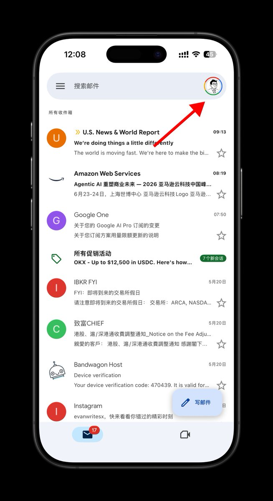

- 账号列表拉到底,点「添加其他账号」

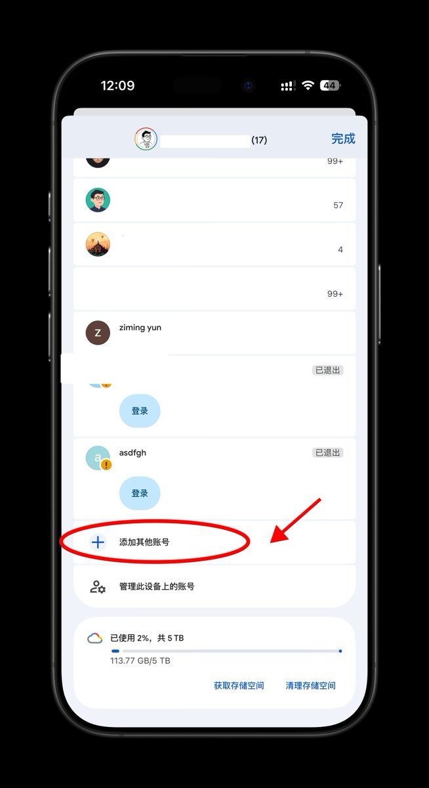

- 选「Google」(不是 iCloud / Outlook)

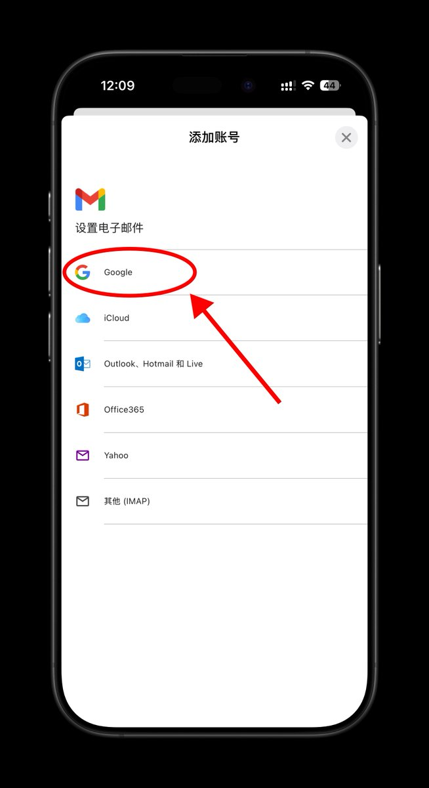

- 登录页别填邮箱,点左下角「创建账号」

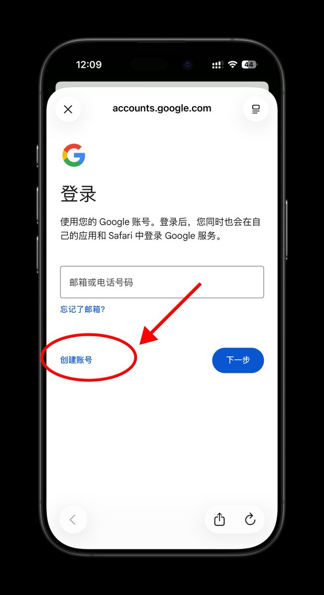

- 填姓名(姓可选填,名字像真人)

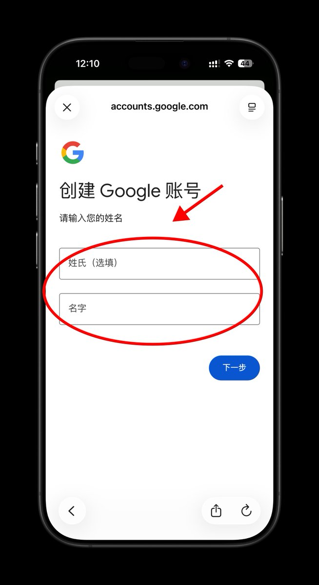

- 填生日和性别(设成年人,否则触发未成年额外验证)

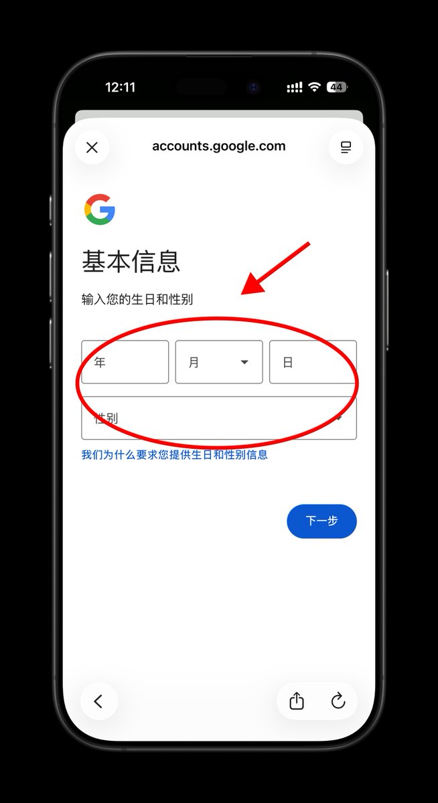

- 选系统推荐的、或自己创建 Gmail 地址

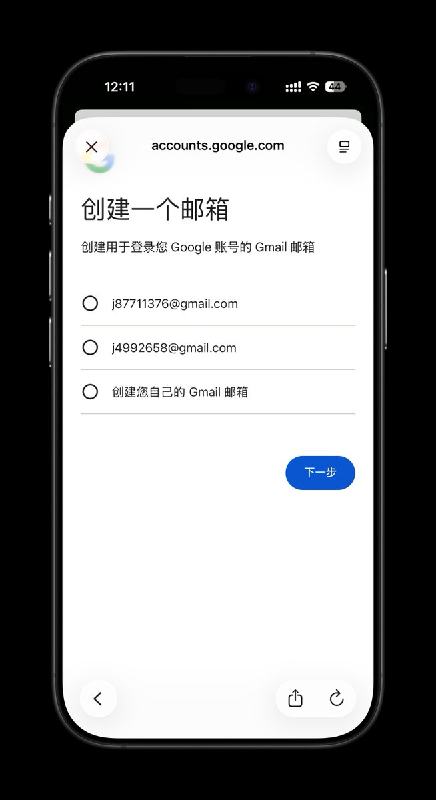

- 设密码(字母+数字+符号,勾"显示密码"核对)

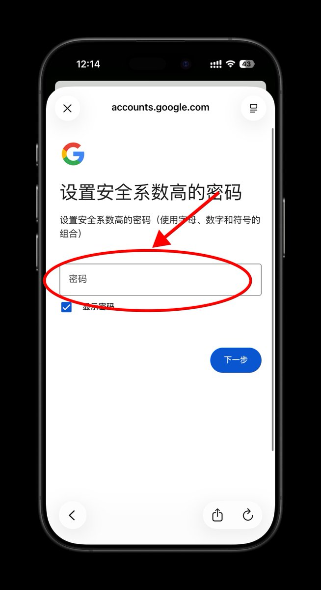

- 到"添加电话号码"页面,点左下角「跳过」(全程免手机号的关键就在这一步)

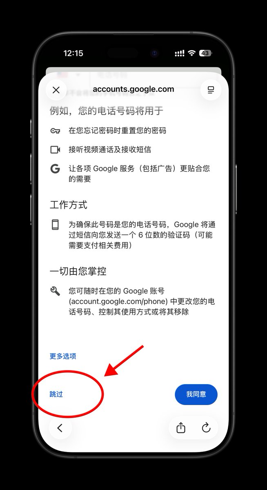

- 核对账号信息 → 同意隐私条款 → 完成

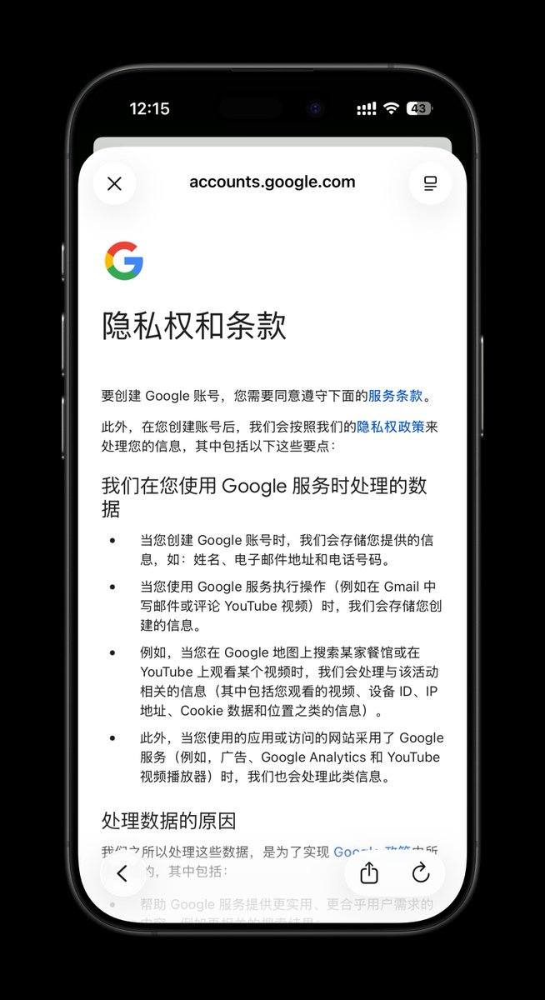

走完第 10 步,账号就建好了,全程一个手机号都没用上。

## 注册成功后建议做的事

如果你想给账号加一层找回保障,可以注册完之后再自己去绑手机号(像我图里那样)——这时候绑是你主动选的,而不是被强制的,可控得多。当然也可以不绑,用辅助邮箱做找回。

我这里测试绑定了我的+86 手机号，依然能丝滑通过，如果有条件，建议绑定一张海外电话号码，比如高解锁率、低成本保号的英国giffgaff，

▎我的店铺购买地址：https://weidian.com/item.html?itemID=7764910517&spider\_token=7381&wfr=c

▎也可以通过 Telegram：@EvanCreates （微信同号） 联系我购买

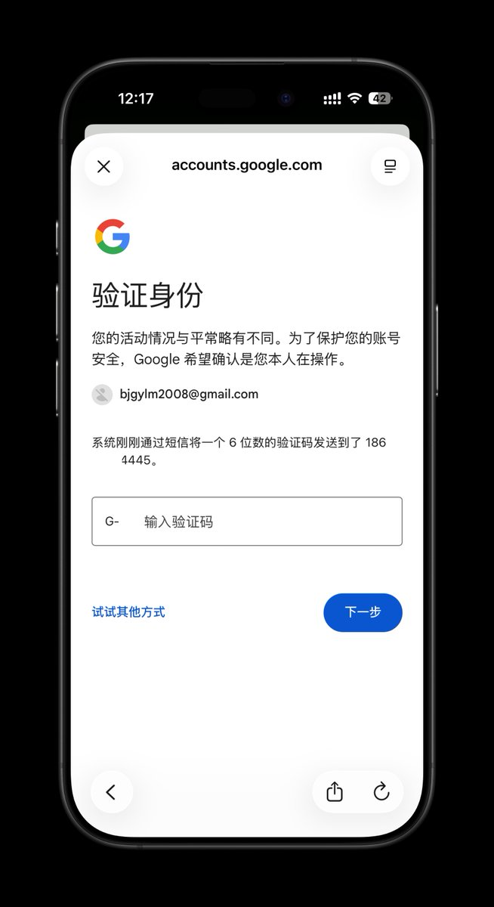

另外别注册完立刻嗨，先正常用几天(收发邮件、看看 YouTube)把号养起来，之后尽量固定用同一条干净线路登录,频繁切 IP 也会触发风控。

## 总结

2026 年免手机号注册 Google,真的可行。

关键就两点；第一,知道那个"跳过"按钮能点;第二,注册环境足够干净,让 Google 没理由卡你。按钮谁都会点,环境才是门槛。

---

Jason 海外手机号实验室：https://t.me/JasonSIMLab

Jason海外收款互助： https://t.me/Jason\_WiseX

Jason  VPS 交群群： https://t.me/JasonVPS

Jason 𝕏 运营增长群： https://t.me/jasonEvanWritesX

Jason数字生活指南：https://t.me/jason\_Telegramx

Jason AI 实验室：https://t.me/Jason\_Prompt

---

Jason  Wechat  ID：EvanCreates     

Telegram：[https://t.me/EvanCreates](https://t.co/2wytvRWjfN)

### 🖼️ Attached Media

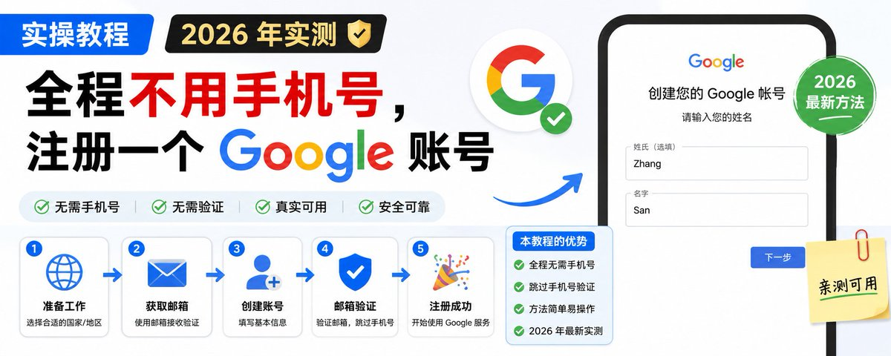

## 💬 Replies

### 1 @Innxnw (inwnn)

*Thu May 21 19:15:44 +0000 2026*

@EvanWritesX 其实毛用没有你注册好后很快就要让你绑定一个手机号就算你刚登陆就绑定一个也还是要你验证

### 2 @EvanWritesX (Jason) (Author)

*Thu May 21 20:24:39 +0000 2026*

@Innxnw 注册完的验证，就简单许多了，你看我直接绑定了86号码

### 3 @zyailive (张禹)

*Thu May 21 14:24:25 +0000 2026*

@EvanWritesX 我也是用这方法申请的，秒封，我申诉又回来咯

### 4 @EvanWritesX (Jason) (Author)

*Thu May 21 14:51:20 +0000 2026*

@zyailive 申诉回来就不再封了

### 5 @LErikYi (L Erik)

*Thu May 21 14:49:52 +0000 2026*

@EvanWritesX 我试了下真的可以跳过哈哈

### 6 @EvanWritesX (Jason) (Author)

*Thu May 21 14:50:43 +0000 2026*

@LErikYi 那必须

### 7 @BeardedPretty (Anonymous871026)

*Thu May 21 15:17:19 +0000 2026*

@EvanWritesX 怎么申诉，我有一个直接给我封了，备用邮箱都没法验证登录。

### 8 @EvanWritesX (Jason) (Author)

*Thu May 21 15:41:16 +0000 2026*

@BeardedPretty 那估计你也没有绑定辅助邮箱吧

### 9 @abcd191145 (.)

*Tue Jun 30 03:36:33 +0000 2026*

@EvanWritesX 现在不行了，必须扫码了

### 10 @EvanWritesX (Jason) (Author)

*Tue Jun 30 03:40:28 +0000 2026*

@abcd191145 梯子不行。

### 11 @Hp2ai (Hpp2)

*Fri May 22 06:51:22 +0000 2026*

@EvanWritesX 撸最多的应该只有我了吧，哈哈 

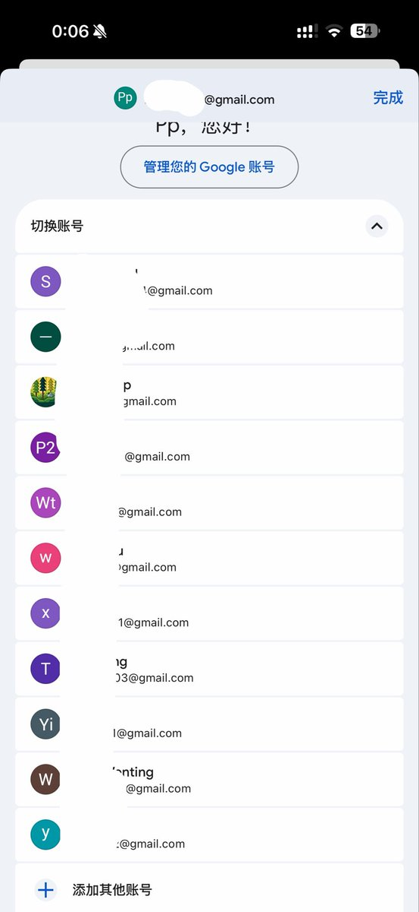

### 12 @Hp2ai (Hpp2)

*Thu May 21 14:48:43 +0000 2026*

@EvanWritesX 我这个ip随便撸，原生网络 

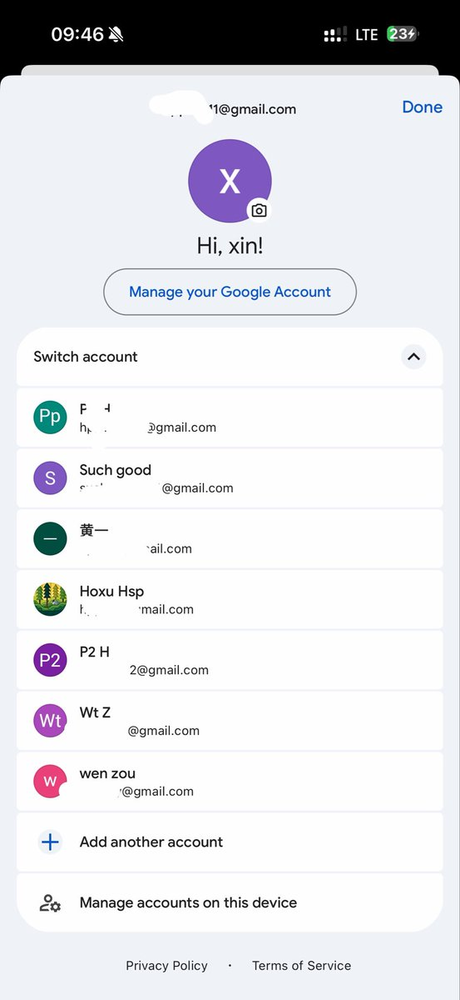

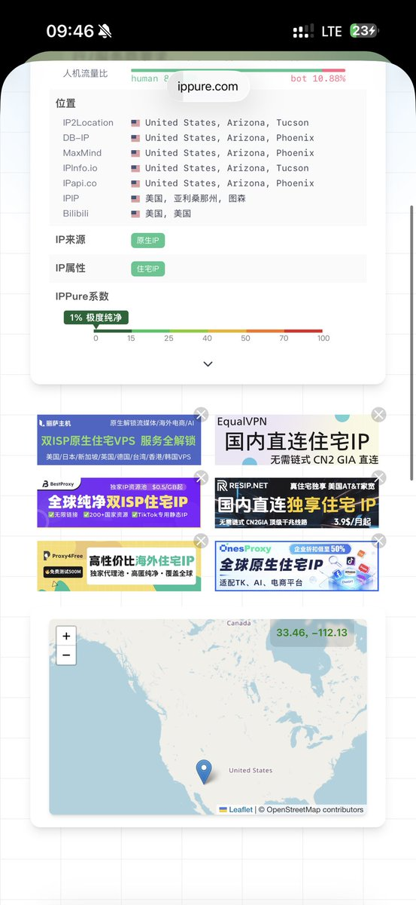

### 13 @is_kerwin (Kerwin)

*Thu May 21 15:08:51 +0000 2026*

@EvanWritesX 有用的建议：

注册好之后 尽量用 美国节点保持稳定，用个把月稳定后提交申请切换到美区才是满血版 Google Account
切换申请地址：[policies.google.com/country-associ…](https://policies.google.com/country-association-form?pli=1)

成功之后会有邮件通知，并且再次进去是显示美区地址的 

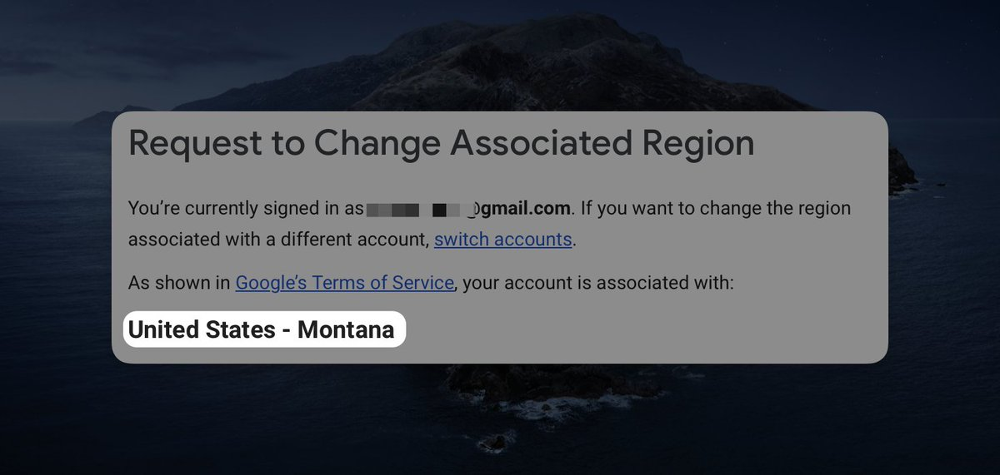

### 14 @looismes (vager)

*Thu May 21 14:25:45 +0000 2026*

@EvanWritesX 大佬，太厉害啦！成功注册2个，留着备用

### 15 @aWildWander (拾野｜WildWander)

*Fri May 22 12:08:21 +0000 2026*

@EvanWritesX 我前些天注册两个号，很快都被封了。按照Gemini教我的写申诉信，说我是真实个人用户，注册邮箱是为了给将要上线的网站作为联系方式，很快解封。感觉被封可能还是因为ip不够干净。文中的方法很实用，可以再多囤几个了👍有老号的可以用我这个方法免费领一年的Gemini Pro[x.com/i/status/20574…](https://x.com/i/status/2057414428149317917)R

### 16 @PierceZhang34 (omega.欧米茄.AI)

*Fri May 22 01:07:10 +0000 2026*

@EvanWritesX 干净IP不好搞

### 17 @Xyq1031153 (Ele11en)

*Fri May 22 10:13:56 +0000 2026*

@EvanWritesX 我就是这么帮同事们注册了3-4个账号了 用谷歌邮箱注册 手机号填国内手机号就可以了 用苹果里的gmail注册 其他手机好像不太好弄 特别华为

### 18 @Jakeryoyo (jaker yo)

*Fri May 22 06:33:36 +0000 2026*

@EvanWritesX 屯帐号有什么用啊？

### 19 @slgxmf (Archer Sun)

*Fri May 22 16:49:18 +0000 2026*

@EvanWritesX 注册谷歌

### 20 @swahz7788 (Swahz@7788)

*Fri May 22 06:26:04 +0000 2026*

@EvanWritesX 牛逼啊！我连跳过都没有，直接成功了！

### 21 @nori_tsukiji (Paul)

*Fri May 22 05:15:03 +0000 2026*

@EvanWritesX 秒封

### 22 @iluciddreaming (mousepotato)

*Fri May 22 07:05:24 +0000 2026*

@EvanWritesX 这个这么好，可以试一下

### 23 @Sec_211 (Ashu （有关必回）)

*Fri May 22 10:10:59 +0000 2026*

@EvanWritesX 注册1个以上就要验证了

### 24 @lusjuv (lusjuv)

*Fri May 22 08:44:01 +0000 2026*

@EvanWritesX 注册还不简单啊？关键是要保住啊，过一会就非要你输入手机号了，而且还非得是注册时候用的虚拟手机号

### 25 @shipaiagent (彭不予 Pengyu)

*Fri May 22 10:33:31 +0000 2026*

@EvanWritesX 确实，环境条件满足了，很容易注册

### 26 @Annecn037 (Anne)

*Sun May 24 14:45:39 +0000 2026*

@EvanWritesX 怎么抹掉重置设备？

### 27 @allinGoabroad (阿茗)

*Sat May 23 14:36:06 +0000 2026*

@EvanWritesX 现在不好用了

### 28 @kklm6210 (想想 think)

*Thu Jun 11 10:43:08 +0000 2026*

@EvanWritesX 有用的，十分感谢🙏

### 29 @trackboy1937 (trackboy)

*Fri May 22 07:24:20 +0000 2026*

@EvanWritesX 其实主要是纯净住宅IP以及设备得google email app没有登录过邮箱。如果大量注册IP，可以用电脑端纯住宅IP加指纹浏览器批量注册，不过不知道会不会不需要绑定手机号码就能注册。

### 30 @heshang777 (带镣铐的小沙弥)

*Sat May 23 12:26:09 +0000 2026*

@EvanWritesX 谷歌邮箱不是随便注册吗

### 31 @XJiyi53515 (Xmogka)

*Fri May 22 15:44:08 +0000 2026*

@EvanWritesX 我没有跳过按钮  只有我同意按钮  但是还是给我直接注册了🫪🫪这是什么情况呀

### 32 @shli326421 (松塔)

*Fri May 22 14:01:55 +0000 2026*

@EvanWritesX 根据我的经验，应该和设备有关系，之前杂粮一边过，换小欧后申一个封一个，试了几个之后登老号，刚登一天就封号弹验证。。。。也可能是谷歌审查收紧了

### 33 @XIAOTUICHE_ (SMLing)

*Thu Jun 25 05:49:43 +0000 2026*

@EvanWritesX 注册后，过几天也是秒封，大部分是系统风控封禁，反正只要危险，一刀切，不过你去申诉下，基本都过

### 34 @topvitamin1927 (PM_Vitamin)

*Sun Jun 21 02:09:13 +0000 2026*

@EvanWritesX 用手机端的Gmail App加一个干净的节点，应该都有这个跳过的入口

### 35 @ArknLky (LkyArkn)

*Sun May 24 04:12:58 +0000 2026*

@EvanWritesX 必须要 iPhone 吗？

